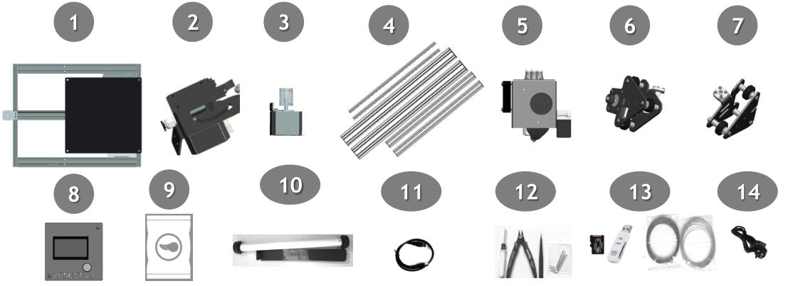

# Z8P Installation Guide
### :bangbang: ATTENTION :bangbang:
+ :warning: Please strictly follow the standard operation when installation.
+ :warning: Please put the printer away from the reach of kids.
+ :warning: Must be guided by adults when children are installed or used.
+ :zap: Take care when installation, to avoid electrical shock hazards.
+ :hotsprings: Hotend has high temperature even the printer stop working.
+ :hotsprings: Hotbed has high temperature even the printer stop working.
+ :dash: Keep well-ventilated condition! May produce toxic gases when printing.
+ :warning: Make sure the AC power select switch set correctly before power on.

## 1. Parts
### Parts list

>
1. Base Module.    
2. Extruders Module (3 sets for M3 and 4 sets for M4).    
3. 2x Z-axis Motor Modules.  
4. Lead screw & Profiles.  
5. Print head with bracket (M3 or M4 hotend assembly).
6. Z carrier left.
7. Z carrier right.
8. Contol Panel (128x64 for Z8PM3(4) and TFT-LCD for Z8PM3(4)-Pro).  
9. Accessories bag, include: Scews, lead screws fix blocks, ENDSTOPs, Fittings,
PTFE Tubes, belt, cable tie, etc.  
10. Filament roll bracket.  
11. USB cable.  
12. Tools.  
13. SD card, Card Reader, Gift filament.  
14. AC power cord.  

### Parts description

>
1. Please note when install Z-profiles that side with two holes should be at the bottom.  
2. Pay attention to distinguish between X profile and TOP profile. The one with many holes is the TOP profile.  
3. Pay attention to the installation direction of the X profile. The side with two large holes faces back (touched the sheet metal of the Z carriers).  
4. The z-axis lead screw are placed in the z-axis profiles.  
5. Please check the packaging in the accessories bag.    

## 2. Installation
### 2-1: Install Z axis parts

> 
1. The side with 2 holes of the Z profiles is downward.
2. Alignment the side  of Z axis profile and the side of bottom profile of base module.  
3. Before installing the z-axis motor module on the profile, loosen the two screws fixing the motor a little.  
4. The Z ENDSTOPs should be mounted on the outside, and the install heigth is about about 18mm.  

 