## <a id="choose-language">:globe_with_meridians: Choose language </a>

<!--  -->

-----
# Guide d'installation du Z8P-MK2
### [ :clapper: **Tutoriel vidéo d'installation du Z8P-MK2**](https://youtu.be/-oieO7U0LCc)

-----
### :warning: ATTENTION :warning:
#### :clipboard: Veuillez suivre strictement le fonctionnement standard lors de l'installation.
#### :baby_bottle: Veuillez ranger l'imprimante hors de portée des enfants.
#### :school: Doit être guidé par des adultes lorsque les enfants sont installés ou utilisés.
#### :wrench: Faites attention lors de l'installation, pour éviter les risques de choc électrique.
#### :fire: Hotend a une température élevée, même si l'imprimante cesse de fonctionner.
#### :fire: Le foyer a une température élevée, même si l'imprimante cesse de fonctionner.
#### :ghost: Veuillez garder un état bien ventilé ! Peut produire des gaz toxiques lorsque l'imprimante fonctionne.
#### :electric_plug: Veuillez vous assurer d'avoir réglé le commutateur de sélection d'alimentation CA sur la bonne position avant la mise sous tension.

-----
## Liste des pieces
### Liste des pièces pour Z8PM4-MK2A

| Non.| Nom | Non.| Nom | Non.| Nom | Non.| Nom |
|:--:|:--------------:|:--:|:------------------------:|:--:|:--------------:|:--:|:--------------:|
| 1 | Module de base | 2 | Autocollant de lit chauffant | 3 | Lit chauffant | 4 | Extrudeuses (4 jeux) |
| 5 | Moteurs d'entraînement Z (2 jeux) | 6 | Tête d'impression avec support X| 7 | Support Z (gauche) | 8 | Support Z (à droite) |
| 9 | Panneau de contrôle TFT-LCD | 10 | Accessoires | 11 | Carte SD(*) | 12 |Support de rouleau de filament |
| 13 | Outils | 14 | Câble USB | 15 | Cordon d'alimentation secteur | 16 | Vis-mère et profils |

\* **La carte SD est placée dans le package "Accessoires".**
### Liste des pièces pour Z8PM4-MK2
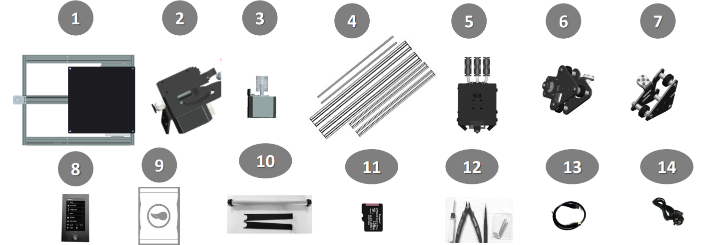
| Non.| Nom | Non.| Nom | Non.| Nom | Non.| Nom |
|:--:|:--------------:|:--:|:------------------------:|:--:|:--------------:|:--:|:--------------:|
| 1 | Module de base | 2 | Extrudeuses (4 jeux) | 3 | Moteurs d'entraînement Z (2 jeux) | 4 | Vis-mère et profils |
| 5 |Tête d'impression avec support X | 6 | Support Z (gauche) | 7 | Support Z (à droite) | 8 | Panneau de contrôle TFT-LCD |
| 9 | Accessoires | 10 | Support de rouleau de filament | 11 | Carte SD(*) | 12 | Outils |
| 13 | Câble USB | 14 | Cordon d'alimentation secteur | | | | |

\* **La carte SD est placée dans le package "Accessoires".**
### Description de "Vis mère et profils"

|Non.| Nom |
|:-:|:--------------------------------------------------------------------------------------------------:|
|1 | **Profilés Z :** 2* profilés en aluminium 2040 pour l'axe Z, la surface plane vers l'avant. |
|2 | Ces deux trous en bas lors de l'installation. |
|3 | **Profil supérieur :** 1* profilé en aluminium 2020 installé sur le dessus. |
|4 | **Profil X :** 1* profilé en aluminium 2020, il y a 4 trous à l'avant et 2 grands trous à l'arrière. |
|5 | **vis-mères :** 2* vis-mères T8-500mm ***(elles sont placées à l'intérieur des profilés en aluminium Z)***. |
### Description des "Accessoires"
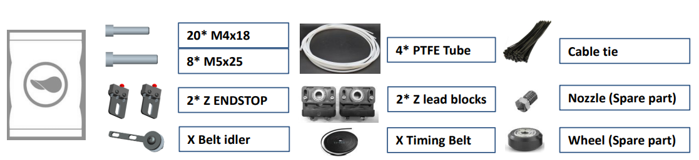
|Non.| Nom | Non.| Nom | Non.| Nom | Non.| Nom |
|:-:|:------------------------:|:--:|--------------------------|:--:|:--------------:|:--:|:----------------------------:|
|1 | 4 * tubes en PTFE | 2 | Attache-câble | 3 | 2* Z FIN DE BUTÉE | 4 | 2 * blocs de fixation à vis mère Z |
|5 | Buse (Pièce de rechange) | 6 | X Tendeur de courroie | 7 | X Courroie de distribution | 8 | Roue (Pièce de rechange) |

-----
##Installation
### 0. Installez le lit chauffant et l'autocollant du lit chauffant (pour MK2A uniquement)
[:clapper:**Tutoriel vidéo**](https://youtu.be/6-8cr9xVGlQ)
Le dernier Z8PM4Pro-MK2***(appelé MK2A)*** a amélioré l'emballage afin de protéger le lit chauffant pendant le transport. Ainsi, comme première étape de l'installation, vous devez installer la plaque en aluminium du lit chauffant sur le support du lit chauffant, puis coller le côté B de l'autocollant magnétique flexible du lit chauffant sur la plaque en aluminium du lit chauffant.
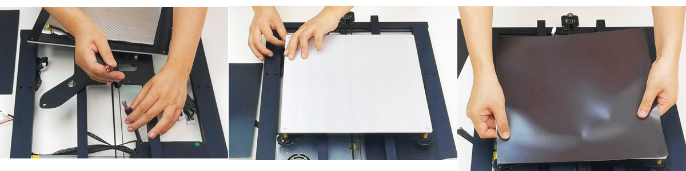
- Connectez le fil du lit chauffant (:attention : placez la sortie du fil du lit chaud sur le côté arrière gauche de la machine et faites passer le fil dans le grand trou au milieu du support).
- Installez le lit chauffant sur le support.
- Collé le sticker face B sur le lit chauffant (:attention : faites attention à son orientation lors du collage).
<!-- 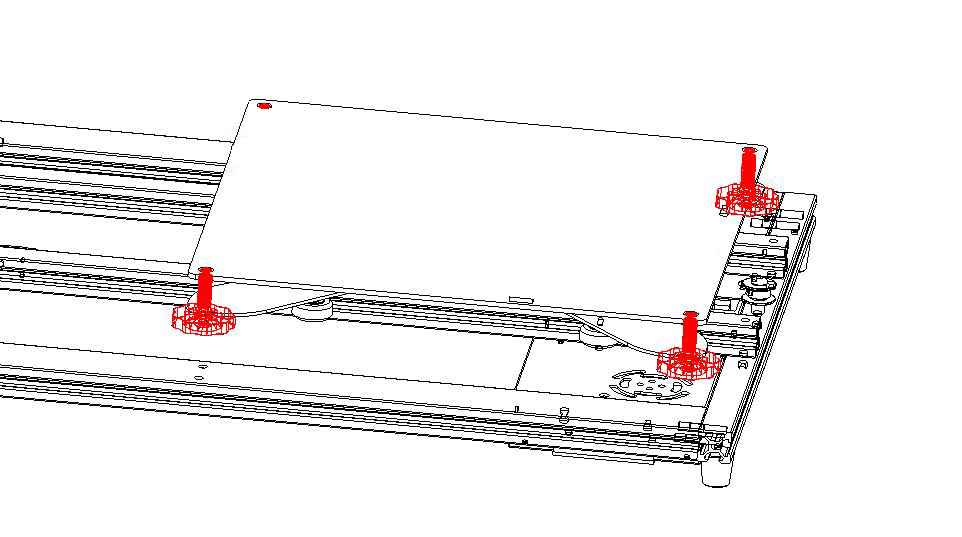 -->

### 1. Installer les pièces de l'axe Z
- Installez 2x profils Z sur les profils Y du "Module de Base".
- Installez 2x moteurs d'entraînement Z sur les profils Z.
- Installez 2x Z ENDSTOPs sur les profils Z.
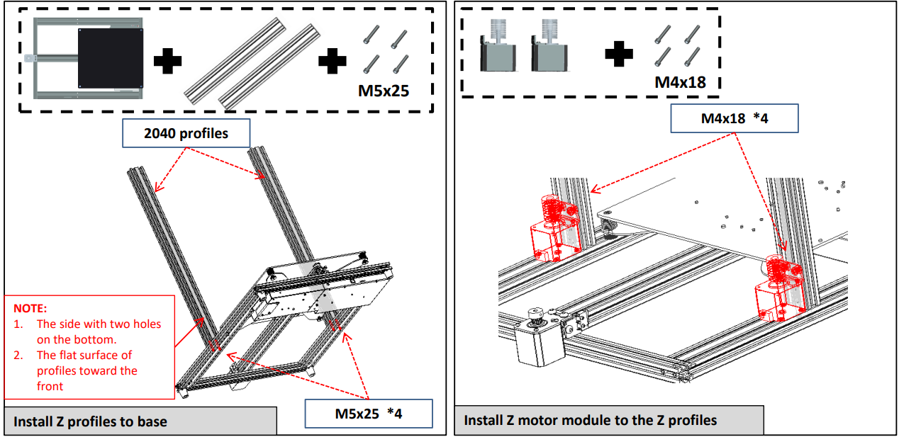
:warning:REMARQUE:warning:
- **L'extrémité du profil de l'axe Z avec 2 trous doit être tournée vers le bas.**
- **Le plan du profil de l'axe Z doit être tourné vers l'avant.**      
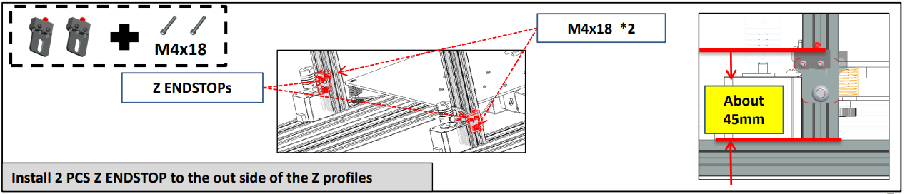       
Installez les Z ENDSTOPs sur le côté des profils Z.
#### Disposition du câble de l'extrudeuse     
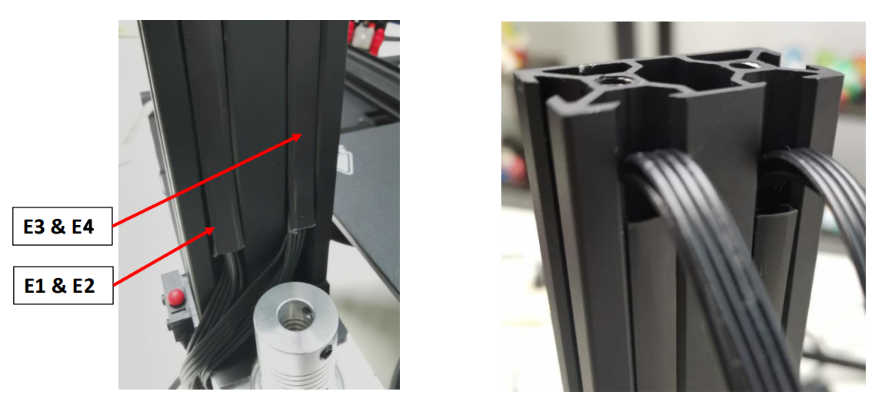      
Insérez les câbles de l'extrudeuse dans la rainure derrière le profilé Z droit et recouvrez-le de caches profilés en plastique. Notez qu'une distance de 10 mm doit être laissée en haut et que les câbles doivent être retirés.
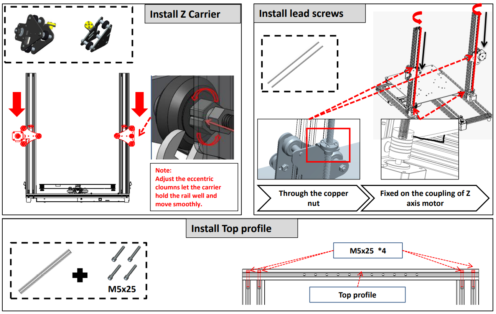
##### :warning: Remarque : veillez à ne pas endommager la couche de protection d'isolation extérieure du câblage. Si le fil du moteur entre en contact avec le cadre métallique, cela peut endommager le tableau de commande.
##### :warning: Remarque : Ajustez les boutons excentriques pour que le support tienne bien le rail et se déplace en douceur.

### 2. Installer les pièces de l'axe X
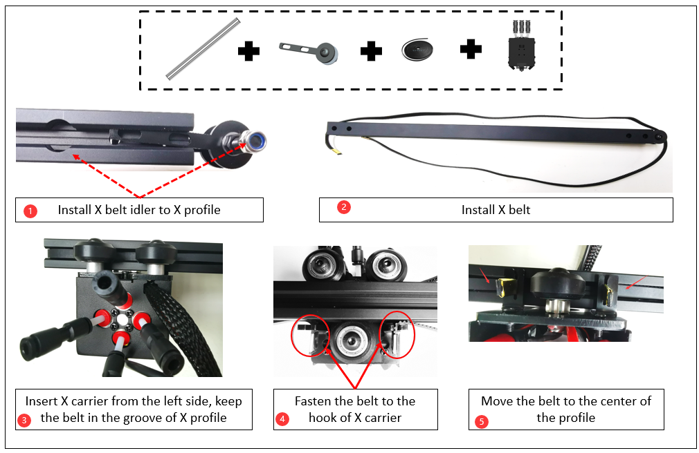     
- Étape 1. Installez la poulie de tension X sur le profil X.
- Étape 2. Installez la ceinture X.
- Étape 3. Insérez le support X par le côté gauche, maintenez la courroie dans la rainure du profil X.
- Étape 4. Fixez la ceinture au crochet du support X.
- Étape 5. Déplacez la ceinture au centre du profil.

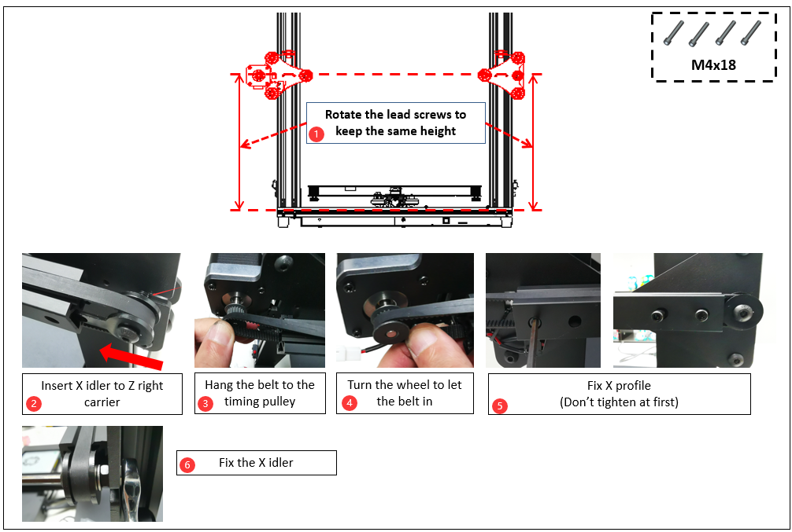     
- Étape 1. Faites pivoter les vis mères pour conserver la même hauteur.
- Étape 2. Insérez le rouleau X sur le support droit Z.
- Étape 3. Accrochez la courroie à la poulie de distribution.
- Étape 4. Tournez la roue pour laisser passer la courroie.
- Étape 5. Fixez le profil X (Ne serrez pas au début).
- Étape 6. Réparez le ralenti X.

### 3. Installez l'écran LCD
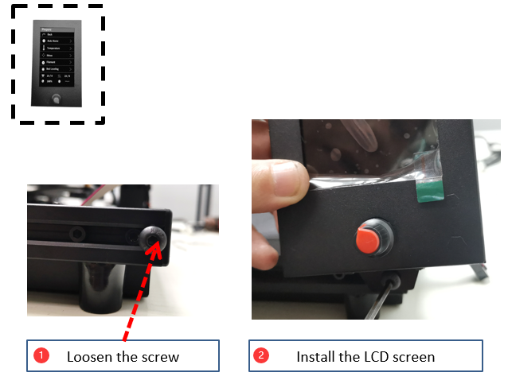      
Étape 1. Desserrez la vis.
Étape 2. Installez l'écran LCD.

### 4. Installer les extrudeuses
Installez les 4 extrudeuses sur le profil supérieur.

### 5. Installez le tube PTFE
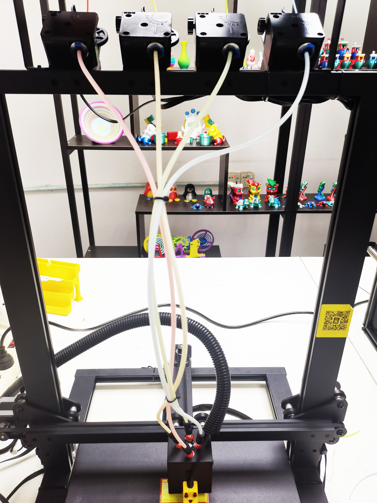      
Connectez le chargeur d'extrusion à la tête d'impression (extrémité chaude) par guide de filament (tube PTFE).       
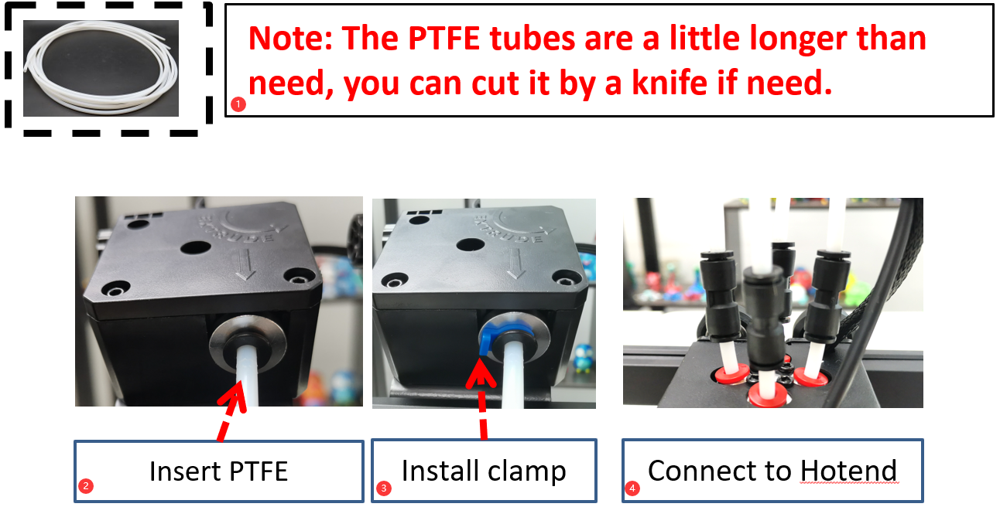
##### :warning: Remarque : Ces tubes en PTFE sont un peu plus longs que nécessaire, vous pouvez les couper avec un couteau si besoin.
- Étape 1. Insérez les tubes PTFE dans les extrudeuses.
- Étape 2. Installez les pinces.
- Étape 3. Connectez les tubes PTFE aux raccords de l'extrémité chaude.
**:warning: Ne retirez pas les tubes internes en PTFE :warning:**, si l'un des tubes internes en PTFE n'est pas inséré au bas de l'extrémité chaude, l'extrémité chaude est facile à bloquer pendant l'impression. **Les tubes intérieurs en PTFE** sont les 4 tubes PTFE plus courts branchés sur l'extrémité chaude.
À propos du guide d'utilisation du hotend M4V6, veuillez vous référer à : https://github.com/ZONESTAR3D/Upgrade-kit-guide/tree/main/HOTEND/M4/M4_V6

### 6. Déboguer le système Z Movement
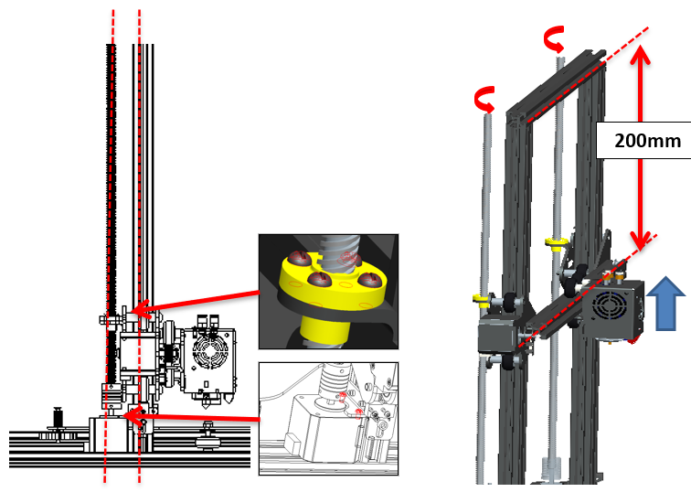      
Garder les vis mères parallèles aux profils de l'axe Z autant que possible aidera à obtenir une meilleure qualité d'impression, veuillez les déboguer en vous référant aux étapes suivantes:
- Étape 1. Desserrez un peu toutes les vis qui fixaient les moteurs Z et l'écrou en cuivre T8.
- Étape 2. Synchrone Faites pivoter les accouplements pour remonter l'axe X jusqu'à la moitié de la hauteur de l'imprimante.
- Étape 3. Gardez les vis mères parallèles aux profilés Z, puis serrez les vis qui fixent le moteur Z et les écrous en cuivre T8.

### 7. Installez le module fixe à vis Z
Installez les blocs de fixation des vis sans fin Z sur le profil supérieur.     
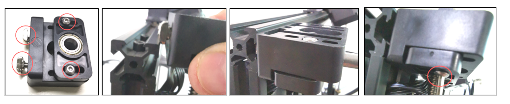

### 8. Ajustez les colonnes excentriques
Faites pivoter les colonnes excentriques sous le support du lit chauffant et le support X, pour garantir que le support puisse fonctionner en douceur sur la piste sans trembler.      
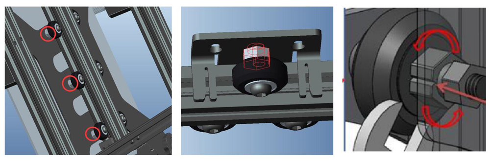     
:warning: Le dernier Z8PM4Pro-MK2 *** (appelé MK2A) *** a amélioré les profils Y d'un profil 20x40 à un profil 2 pièces 20x20, de sorte que les colonnes excentriques sur le support du lit chauffant ont également été modifiées.

### 9. Installer le support de filament
Installez le support de filament sur le profil supérieur.      
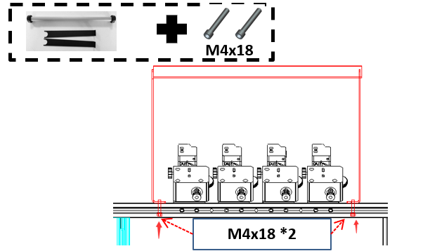

----
## Câblage
### Bloc de câblage
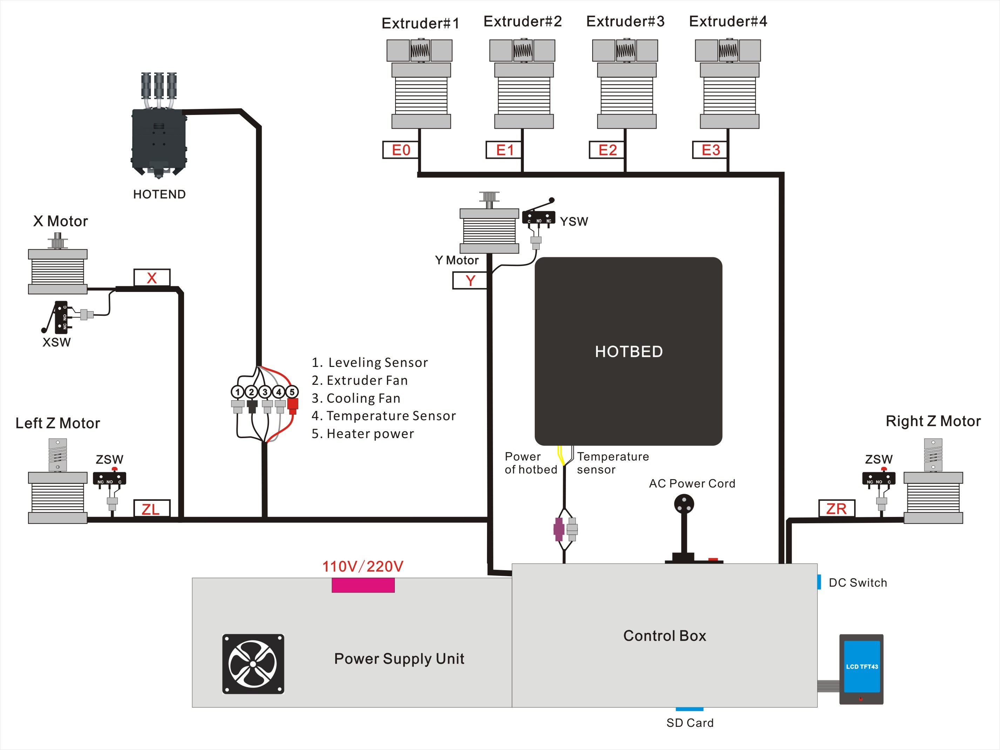
:warning: Le dernier Z8PM4Pro-MK2 a ajouté un emplacement pour carte SD sur le côté du boîtier de commande (près du bouton DC), vous pouvez insérer la carte SD dans cet emplacement, qui est plus facile d'accès que l'emplacement pour carte Micro SD sur l'avant du boîtier de commande.
### Étapes de câblage
Reportez-vous à l'image suivante pour connecter les connecteurs des fils gauche du boîtier de commande aux prises des composants Z8PM4pro, qui comprennent:
- **Moteur Z gauche / Butée finale**
- **Moteur Z droit / Butée finale**
- **Moteur X / Butée**
- **Fils de moteurs d'extrudeuse (4x)**
- **Fils chauds: 1. Capteur de nivellement du lit - 2. Ventilateur de l'extrudeuse - 3. Ventilateur de refroidissement - 4. Capteur de température - 5. Chauffage**
- **Câble LCD**
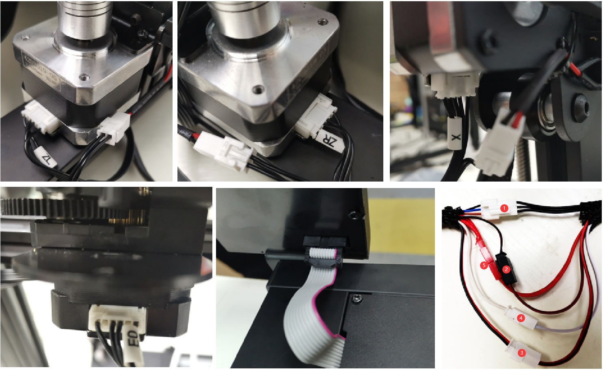
### Disposez le fil du hotend
1. Enroulez le fil chaud avec un tube ondulé plus fin et passez-le à travers l'espace entre la vis sur l'axe gauche de la machine et le profilé.
2. Enveloppez les bornes à l'extrémité chaude avec des tuyaux ondulés plus épais et attachez-les fermement avec des serre-câbles.      
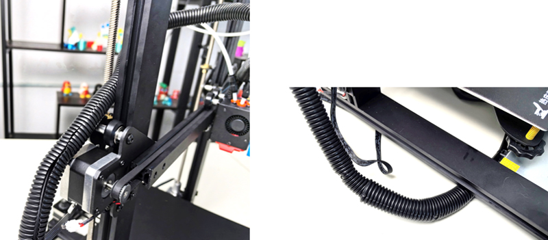

-----
## Vérifiez avant la mise sous tension
#### :warning: Il est très important de vérifier le câblage avant la mise sous tension, car cela peut éliminer certaines connexions matérielles et garantir que l'imprimante peut commencer à utiliser en douceur !
#### Liste de contrôle :
1. **Vérifiez si la poulie de distribution des axes X&Y est fixée sur l'arbre du moteur et si les accouplements sont fixés sur l'arbre des moteurs Z.**
2. **Vérifiez si les vis mères ont été fixées sur l'arbre de l'accouplement.**
3. **Déplacez l'extrémité chaude et le foyer vers leurs positions de fin de course respectives pour vérifier si le contact est bon et s'il y a un son clair. sinon, veuillez vérifier le fin de course et le remonter.**
4. **Déplacez manuellement l'extrémité chaude et le foyer pour voir si le mouvement est fluide, sinon ajustez l'écrou excentrique jusqu'à ce que le moteur bouge en douceur. Référez-vous à la procédure d'installation.**
5. **Vérifiez si la courroie d'entraînement des axes X et Y est fermement installée. S'il est trop lâche, essayez de le resserrer.**
6. **Vérifiez si la tige de vis est assemblée en place et si la vis est serrée.**
7. **Faites pivoter manuellement les accouplements du moteur de l'axe z pour vérifier si les contacts du fin de course de l'axe z sont fiables.**
8. **Vérifiez si le commutateur de sélection d'alimentation CA est réglé sur la bonne position. La tension CA de la ville est de 220 V, réglée sur [230]. La tension CA de la ville est de 110 V, réglée sur [110].**     
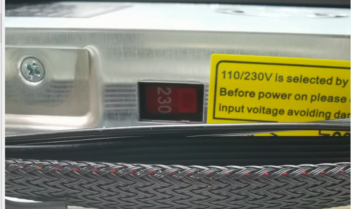

## :fireworks: Félicitations!
Après avoir terminé les étapes d'installation ci-dessus, l'installation de la machine est annoncée comme étant terminée. Vous pouvez disposer le câblage et le fixer au châssis de la machine avec un serre-câble.
Ensuite, effectuez simplement un débogage préliminaire et vous pourrez démarrer votre première impression. Veuillez vous référer au [**:point_right: quick user manual**](https://github.com/ZONESTAR3D/Z8P/blob/main/Z8P-MK2/2-Operation_Guide/readme.md) pour préparer et démarrer votre première impression.

----
### Annexe: Schéma de câblage de la carte de commande
Le diagramme schématique de câblage montre le schéma de connexion des bornes de la carte de commande et des composants utilisés à l'intérieur du boîtier de commande.
**Veuillez noter que les composants indiqués dans l'encadré rose sont des composants/fonctions en option** mais ne sont pas des équipements standard du Z8PM4Pro.      
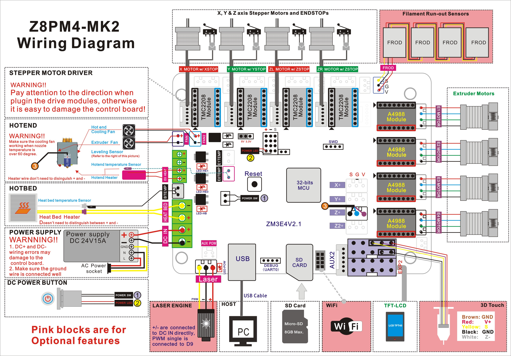
  
