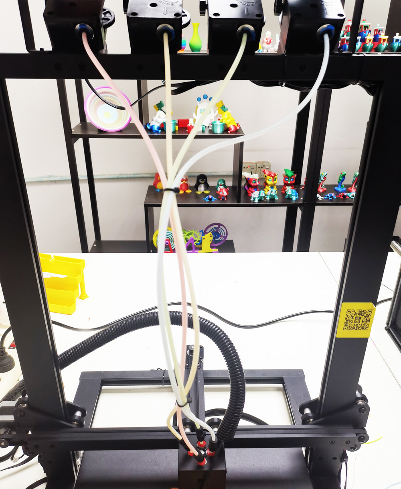

# Guía de instalación Z8P-MK2
### [ :clapper: **Videotutorial de instalación de Z8P-MK2**](https://youtu.be/-oieO7U0LCc)

-----
### :warning:ATENCIÓN:warning:
#### :clipboard: Siga estrictamente la operación estándar durante la instalación.
#### :baby_bottle: Guarde la impresora fuera del alcance de los niños.
#### :school: Debe ser guiado por adultos cuando los niños sean instalados o utilizados.
#### :wrench: Tenga cuidado durante la instalación para evitar riesgos de descarga eléctrica.
#### :fire: El hotend tiene alta temperatura incluso la impresora deja de funcionar.
#### :fire: El hotbed tiene una temperatura alta, incluso la impresora deja de funcionar.
#### :ghost: ¡Manténgase en buenas condiciones de ventilación! Puede producir gases tóxicos cuando la impresora está funcionando.
#### :electric_plug: Asegúrese de haber configurado el interruptor de selección de alimentación de CA en la posición correcta antes de encenderlo.

-----
## Lista de partes
### Lista de piezas para Z8PM4-MK2A

| No.|       Nombre             | No.|           Nombre         | No.|         Nombre           | No.|       Nombre             |
|:--:|:------------------------:|:--:|:------------------------:|:--:|:------------------------:|:--:|:------------------------:|
|  1 | Módulo básico            | 2  |Adhesivo para cama térmica| 3  |       Cama térmica       |  4 | Extrusoras (4 juegos)    |
|  5 | Motores de accionamiento Z (2 juegos) | 6 | Cabezal de impresión con soporte X| 7 | Portador Z (izquierda) | 8 | Portador Z (derecha) |
|  9 | Panel de control TFT-LCD | 10 | Accesorios               | 11 | Tarjeta SD(*)            | 12 |Soporte para rollo de filamento |
| 13 | Herramientas             | 14 | Cable USB                | 15 | Cable de alimentación de CA | 16 | Husillos y perfiles |

\* **La tarjeta SD se encuentra en el paquete "Accesorios".**
### Lista de piezas para Z8PM4-MK2

| No.| Nombre | No.| Nombre | No.| Nombre | No.| Nombre |
|:--:|:------------------------:|:--:|:------------------------:|:--:|:------------------------:|:--:|:------------------------:|
| 1 | Módulo básico | 2 | Extrusoras (4 juegos) | 3 | Motores de accionamiento Z (2 juegos) | 4 | Husillos y perfiles |
| 5 |Cabezal de impresión con soporte X | 6 | Portador Z (izquierda) | 7 | Portador Z (derecha) | 8 | Panel de control TFT-LCD |
| 9 | Accesorios | 10 | Soporte para rollo de filamento | 11 | Tarjeta SD(*) | 12 | Herramientas |
| 13 | Cable USB | 14 | Cable de alimentación de CA | | | | |

\* **La tarjeta SD se encuentra en el paquete "Accesorios".**
### Descripción de "Hornillos y perfiles"

|No.| Nombre |
|:-:|:----------------------------------------------------------------------------------------------------------:|
|1 | **Perfiles Z:** 2* perfiles de aluminio 2040 para el eje Z, la superficie plana hacia el frente. |
|2 | Estos dos agujeros en la parte inferior cuando se instalan. |
|3 | **Perfil superior:** 1* perfil de aluminio 2020 instalado en la parte superior. |
|4 | **Perfil X:** 1* perfil de aluminio 2020, hay 4 orificios en la parte delantera y 2 orificios grandes en la parte posterior. |
|5 | **tornillos de avance:** 2* tornillos de avance T8-500mm ***(Se colocan dentro de los perfiles de aluminio Z)***. |
### Descripción de "Accesorios"

|No.|      Nombre              | No.| Nombre                   | No.| Nombre                   | No.|          Nombre              |
|:-:|:------------------------:|:--:|--------------------------|:--:|:------------------------:|:--:|:----------------------------:|
|1 | 4 tubos de PTFE | 2 | Brida de cables | 3 | 2* TOPE FINAL Z | 4 | 2* bloques de fijación de tornillo de avance Z |
|5 | Boquilla (Repuesto) | 6 | X Rodillo tensor | 7 | X Correa de distribución | 8 | Rueda (Repuesto) |

-----
## Instalación
### 0. Instale la cama térmica y la etiqueta adhesiva de la cama térmica (solo para MK2A)
[:clapper:**Video tutorial**](https://youtu.be/6-8cr9xVGlQ)
El último Z8PM4Pro-MK2 ***(llamado MK2A)*** ha mejorado el embalaje para proteger la cama caliente durante el transporte. Entonces, como primer paso de la instalación, debe instalar la placa de aluminio de la cama térmica en el soporte de la cama térmica y luego pegar el lado B de la pegatina magnética flexible de la cama térmica en la placa de aluminio de la cama térmica.

- Conecte el cable de la cama caliente (:advertencia: coloque la salida del cable de la cama caliente en el lado trasero izquierdo de la máquina y pase el cable a través del orificio grande en el medio del soporte).
- Instale la cama térmica en el soporte.
- Pegué el lado B de la pegatina en la cama térmica (:advertencia:preste atención a su orientación al pegar).
<!--  -->

### 1. Instalar piezas del eje Z
- Instale 2 perfiles Z en los perfiles Y del "Módulo básico".
- Instale 2 motores de accionamiento Z en los perfiles Z.
- Instale 2x Z ENDSTOP en los perfiles Z.

:warning:NOTA:warning:
- **El extremo del perfil del eje Z con 2 orificios debe mirar hacia abajo.**
- **El plano del perfil del eje Z debe mirar hacia adelante.**

Instale los Z ENDSTOP al costado de los perfiles Z.
#### Disposición del cable del extrusor

Coloque los cables del extrusor en la ranura detrás del perfil Z derecho y cúbralo con cubiertas de plástico para perfiles. Tenga en cuenta que se debe dejar una distancia de 10 mm en la parte superior y se deben sacar los cables.

##### :warning: Nota: Tenga cuidado de no dañar la capa de protección de aislamiento exterior del cableado. Si el cable del motor entra en contacto con la estructura metálica, puede dañar el tablero de control.
##### :warning:Nota: Ajuste las columnas excéntricas para que el transportador sujete bien el riel y se mueva suavemente.

### 2. Instalar piezas del eje X

Paso 1. Instale la polea tensora de la correa X en el perfil X.
Paso 2. Instale la correa X.
Paso 3. Inserte el soporte X desde el lado izquierdo, mantenga el cinturón en la ranura del perfil X.
Paso 4. Sujete el cinturón al gancho del portaequipajes X.
Paso 5. Mueva el cinturón al centro del perfil.

Paso 1. Gire los tornillos guía para mantener la misma altura.
Paso 2. Inserte la rueda guía X en el transportador derecho Z.
Paso 3. Cuelga la correa en la polea de distribución.
Paso 4. Gire la rueda para dejar entrar el cinturón.
Paso 5. Fije el perfil X (no lo apriete al principio).
Paso 6. Arregle la rueda guía X.

### 3. Instale la pantalla LCD

Paso 1. Afloje el tornillo.
Paso 2. Instale la pantalla LCD.

### 4. Instalar extrusoras
Instale los 4 extrusores en el perfil superior.

### 5. Instale el tubo de PTFE

Conecte el alimentador de extrusión con el cabezal de impresión (extremo caliente) mediante la guía de filamento (tubo de PTFE)

##### :warning: Nota: Estos tubos de PTFE son un poco más largos de lo necesario, puedes cortarlos con un cuchillo si es necesario.
Paso 1. Inserte tubos de PTFE en los extrusores.
Paso 2. Instale las abrazaderas.
Paso 3. Conecte los tubos de PTFE a los accesorios del extremo caliente.
**:warning: No extraiga los tubos internos de PTFE:warning:**, si alguno de los tubos internos de PTFE no está insertado en la parte inferior del extremo caliente, es fácil que el extremo caliente se bloquee durante la impresión. **Los tubos internos de PTFE** son los 4 tubos de PTFE más cortos que se enchufan en el extremo caliente.
Acerca de la guía del usuario del hotend M4V6, consulte: https://github.com/ZONESTAR3D/Upgrade-kit-guide/tree/main/HOTEND/M4/M4_V6

### 6. Depurar el sistema de movimiento Z

Mantener los tornillos de avance paralelos a los perfiles del eje Z en la medida de lo posible ayudará a obtener una mejor calidad de impresión; depurarlos, consulte los siguientes pasos:
**Paso 1. Afloje un poco todos los tornillos que fijaban los motores Z y la tuerca de cobre T8.**
**Paso 2. Sincrónico Gire los acoplamientos para moverlos hacia arriba en el eje X hasta la mitad de la altura de la impresora.**
**Paso 3. Mantenga los tornillos guía paralelos a los perfiles Z, luego apriete los tornillos que fijaron el motor Z y las tuercas de cobre T8.**

### 7. Instale el módulo fijo de tornillos guía Z
Instale los bloques de fijación de tornillos guía Z en el perfil superior.

### 8. Afina las columnas excéntricas.
Gire las columnas excéntricas debajo del soporte de la cama caliente y el soporte X para asegurarse de que el soporte pueda funcionar suavemente sobre el riel sin temblar.    
    
:warning: El último Z8PM4Pro-MK2 ***(llamado MK2A)*** ha mejorado los perfiles Y de un perfil de 20x40 a un perfil de 2 piezas de 20x20, por lo que las columnas excéntricas en el soporte de la cama térmica también se han modificado.

### 9. Instale el soporte de filamento
Instale el soporte del filamento en el perfil superior.     
    

----
## Alambrado
### Bloque de cableado

:advertencia:El último Z8PM4Pro-MK2 agregó una ranura para tarjeta SD en el costado de la caja de control (cerca del botón DC), puede insertar la tarjeta SD en esta ranura, a la que es más fácil acceder que la ranura para tarjeta Micro SD en el frente de la caja de control.
### Pasos de cableado
Consulte la siguiente imagen para conectar los conectores de los cables que quedan de la caja de control a los zócalos de los componentes Z8PM4pro, que incluyen:
- **Motor Z izquierdo/Tope final**
- **Motor Z derecho/Tope final**
- **Motor X / Tope**
- **Cables de motores de extrusora (4x)**
- **Cables del extremo caliente: 1.Sensor de nivelación de la cama - 2.Ventilador del extrusor - 3.Ventilador de enfriamiento - 4.Sensor de temperatura - 5.Calentador**
- **Cable LCD**

### Disposición del cable del hotend
1. Envuelva el cable del extremo caliente con un tubo corrugado más delgado y páselo por el espacio entre el tornillo del eje izquierdo de la máquina y el perfil.
2. Envuelva los terminales del extremo caliente con tubos corrugados más gruesos y átelos firmemente con bridas.

-----
## Verificar antes de encender
#### :warning: Es muy importante verificar el cableado antes de encender, ya que puede eliminar algunas conexiones de hardware y garantizar que la impresora pueda comenzar a usarse sin problemas.
#### Lista de Verificación:
1. **Compruebe si la polea de sincronización de los ejes X e Y está fijada en el eje del motor y los acoplamientos están fijados en el eje de los motores Z.**
2. **Compruebe si los tornillos de avance se han fijado en el eje del acoplamiento.**
3. **Mueva el extremo caliente y el hotbed a sus respectivas posiciones de interruptor de límite para verificar si el contacto es bueno y hay un sonido claro. de lo contrario, verifique el interruptor de límite y vuelva a ensamblarlo.**
4. **Mueva manualmente el extremo caliente y la cama caliente para ver si el movimiento es suave; de lo contrario, ajuste la tuerca excéntrica hasta que el motor se mueva suavemente. Consulte el procedimiento de instalación.**
5. **Compruebe si la correa de transmisión de los ejes X e Y está firmemente instalada. Si está demasiado flojo, intente apretarlo.**
6. **Compruebe si la varilla roscada está montada en su lugar y si el tornillo está apretado.**
7. **Gire manualmente los acoplamientos del motor del eje z para verificar si el interruptor de límite del eje z hace contacto de manera confiable.**
8. **Compruebe si el interruptor de selección de alimentación de CA está en la posición correcta. El voltaje CA de la ciudad es 220 V, configurado en [230]. El voltaje CA de la ciudad es 110 V, configurado en [110].**

## :fireworks: ¡Felicitaciones!
Después de completar los pasos de instalación anteriores, se anuncia que se completó la instalación de la máquina. Puede disponer el cableado y fijarlo al bastidor de la máquina con bridas.
A continuación, simplemente haga una depuración preliminar y podrá comenzar su primera impresión. Consulte el [**:point_right: manual de usuario rápido**](https://github.com/ZONESTAR3D/Z8P/blob/main/Z8P-MK2/2-Operation_Guide/readme.md) para preparar e iniciar su primera impresión.