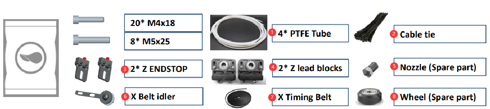
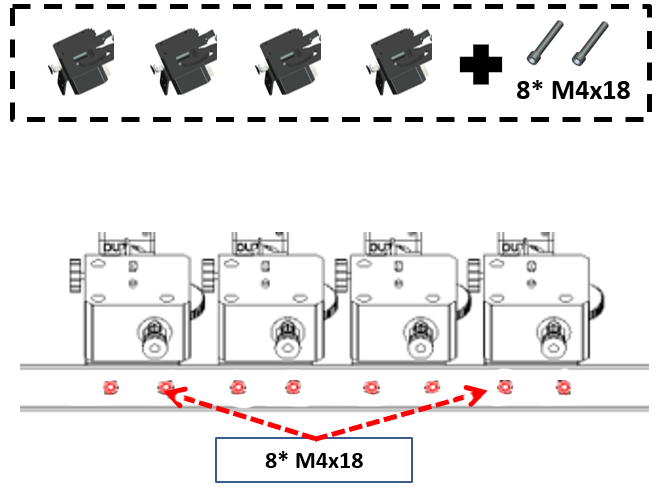
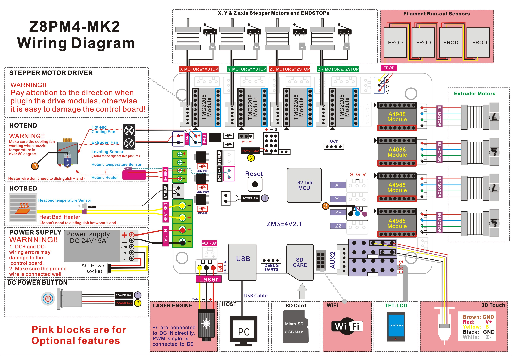

## <a id="choose-language">:globe_with_meridians: Choose language </a>

<!--  -->

-----
# Guida all'installazione Z8P-MK2
### [ :clapper: **Tutorial video di installazione Z8P-MK2**](https://youtu.be/-oieO7U0LCc)

-----
### :warning: ATTENZIONE :avviso:
#### :clipboard: Seguire rigorosamente le operazioni standard durante l'installazione.
#### :baby_bottle: Tieni la stampante lontano dalla portata dei bambini.
#### :school: deve essere guidata da adulti quando i bambini vengono installati o utilizzati.
#### :wrench: prestare attenzione durante l'installazione per evitare rischi di scosse elettriche.
#### :fire: L'hotend ha una temperatura elevata anche se la stampante smette di funzionare.
#### :fire: Il focolaio ha una temperatura elevata anche se la stampante smette di funzionare.
#### :ghost: Per favore, mantieni una zona ben ventilata! Può produrre gas tossici durante il funzionamento della stampante.
#### :electric_plug: Assicurati di aver impostato l'interruttore di selezione dell'alimentazione CA nella posizione corretta prima di accendere.

-----
## Elenco delle parti
### Elenco delle parti per Z8PM4-MK2A

| No.| Nome | No.| Nome | No.| Nome | No.| Nome |
|:--:|:---------------:|:--:|:------------------------:|:--:|:------------------------:|:--:|:------------------------:|
| 1| Modulo Base | 2| Adesivo per letto termico | 3| Letto termico | 4| Estrusori (4 set) |
| 5| Motori di azionamento Z (2 set) | 6| Testina di stampa con supporto X| 7| Portante Z(a sinistra) | 8| Portante Z(a destra) |
| 9| Pannello di controllo TFT-LCD | 10| Accessori | 11| Scheda SD(*) | 12 |Staffa per rotolo di filamento |
| 13| Strumenti | 14| Cavo USB | 15| Cavo di alimentazione CA | 16| Vite e profili |

\* **La scheda SD è inserita nel pacchetto "Accessori".**
### Elenco delle parti per Z8PM4-MK2

| No.| Nome | No.| Nome | No.| Nome | No.| Nome |
|:--:|:---------------:|:--:|:------------------------:|:--:|:------------------------:|:--:|:------------------------:|
| 1| Modulo Base | 2| Estrusori (4 set) | 3| Motori di azionamento Z (2 set) | 4| Vite e profili |
| 5 |Testina di stampa con supporto X | 6| Portante Z(a sinistra) | 7| Portante Z(a destra) | 8| Pannello di controllo TFT-LCD |
| 9| Accessori | 10| Staffa per rotolo di filamento | 11| Scheda SD(*) | 12| Strumenti |
| 13| Cavo USB | 14| Cavo di alimentazione CA | | | | |

\* **La scheda SD è inserita nel pacchetto "Accessori".**
### Descrizione di "Vite e profili"

|No.| Nome |
|:-:|:----------------------------------------------------------------------------------------------------------:|
|1 | **Profili Z:** 2* profili in alluminio 2040 per l'asse Z, la superficie piana verso la parte anteriore. |
|2 | Questi due fori sul fondo durante l'installazione. |
|3 | **Profilo superiore:** 1* profilo in alluminio 2020 installato sulla parte superiore. |
|4 | **Profilo X:** 1* profilo in alluminio 2020, ci sono 4 fori sulla parte anteriore e 2 fori grandi sul retro. |
|5 | **viti di comando:** 2* viti di comando T8-500mm ***(sono inserite all'interno dei profili in alluminio Z)***. |
### Descrizione degli "Accessori"

|No.| Nome | No.| Nome | No.| Nome | No.| Nome |
|:-:|:---------------:|:--:|--------------------------|:--:|:------------------------:|:--:|:----------------------:|
|1 | 4 * Tubo in PTFE | 2| Fascetta per cavi | 3| 2* FINE CORSA Z | 4| 2 * Blocchi fissi per vite Z |
|5 | Ugello (pezzo di ricambio) | 6| X Tendicinghia | 7| X cinghia dentata | 8| Ruota (Pezzo di ricambio) |

-----
## Installazione
### 0. Installare il letto riscaldato e l'adesivo del letto riscaldato (solo per MK2A)
[:clapper:**Video tutorial**](https://youtu.be/6-8cr9xVGlQ)
L'ultimo Z8PM4Pro-MK2 ***(chiamato MK2A)*** ha migliorato l'imballaggio per proteggere il letto caldo durante il trasporto. Pertanto, come primo passaggio dell'installazione, è necessario installare la piastra in alluminio del letto riscaldato sulla staffa del letto riscaldato e quindi attaccare il lato B dell'adesivo magnetico flessibile del letto riscaldato sulla piastra in alluminio del letto riscaldato.

- Collegare il filo del letto riscaldato (:attenzione: posizionare l'uscita del filo del letto caldo sul lato posteriore sinistro della macchina e infilare il filo attraverso il foro grande al centro della staffa).
- Installare il letto riscaldato sulla staffa.
- Incollare il lato adesivo B sul piano riscaldato (:attenzione:prestare attenzione al suo orientamento quando si incolla).
<!--  -->

### 1. Installare le parti dell'asse Z
- Installare 2 profili Z sui profili Y del "Modulo Base".
- Installare 2 motori di azionamento Z sui profili Z.
- Installare 2x ENDSTOP Z sui profili Z.

:warning: NOTA :warning:
- **L'estremità del profilo dell'asse Z con 2 fori deve essere rivolta verso il basso.**
- **Il piano del profilo dell'asse Z deve essere rivolto in avanti.**

Installare i ENDSTOP Z sul lato dei profili Z.
#### Layout Cavo dell'estrusore
      
Inserisci i cavi dell'estrusore nella scanalatura dietro il profilo Z destro e coprilo con coperture del profilo in plastica. Si noti che nella parte superiore deve essere lasciata una distanza di 10mm e i cavi devono essere estratti.      

##### :warning: Nota: fare attenzione a non danneggiare lo strato di protezione dell'isolamento esterno del cablaggio. Se il cavo del motore entra in contatto con il telaio metallico, potrebbe causare danni alla scheda di controllo.
##### :warning: Nota: regolare le colonne eccentriche in modo che il trasportatore mantenga bene il binario e si muova agevolmente.

### 2. Installare le parti dell'asse X

- Passaggio 1. Installare il tendicinghia X sul profilo X.
- Passaggio 2. Installare la cinghia X.
- Passaggio 3. Inserire il supporto X dal lato sinistro, mantenere la cinghia nella scanalatura del profilo X.
- Passaggio 4. Fissare la cintura al gancio del marsupio X.
- Passaggio 5. Spostare la cinghia al centro del profilo.

- Passaggio 1. Ruotare le viti di comando per mantenere la stessa altezza.
- Passaggio 2. Inserire il tenditore X nel supporto destro Z.
- Passaggio 3. Appendere la cinghia alla puleggia dentata.
- Passaggio 4. Girare la ruota per far entrare la cintura.
- Passaggio 5. Correggere il profilo X (non serrare inizialmente).
- Passaggio 6. Correggere il tenditore X.

### 3. Installare lo schermo LCD
     
- Passaggio 1. Allentare la vite. 
- Passaggio 2. Installare lo schermo LCD.

### 4. Installa gli estrusori
Installare i 4 estrusori sul profilo superiore.     

### 5. Installare il tubo in PTFE

Collegare l'alimentatore di estrusione con la testina di stampa (hot end) tramite la guida del filamento (tubo in PTFE)

##### :warning: Nota: questi tubi in PTFE sono un po' più lunghi del necessario, puoi tagliarli con un coltello se necessario.
- Passaggio 1. Inserire i tubi in PTFE negli estrusori.
- Passaggio 2. Installare i morsetti.
- Passaggio 3. Collegare i tubi in PTFE ai raccordi sull'hot end.
**:warning: non estrarre i tubi interni in PTFE :warning:**, se uno qualsiasi dei tubi interni in PTFE non è inserito nella parte inferiore dell'hot-end, è facile che l'hot-end venga bloccato durante la stampa. **I tubi interni in PTFE** sono i 4 tubi in PTFE più corti collegati all'hot-end.
Per quanto riguarda la guida per l'utente dell'hotend M4V6, fare riferimento a: https://github.com/ZONESTAR3D/Upgrade-kit-guide/tree/main/HOTEND/M4/M4_V6

### 6. Debug del sistema di movimento Z
     
Mantenere le viti di comando parallele ai profili dell'asse Z il più possibile aiuterà a ottenere una migliore qualità di stampa, eseguire il debug facendo riferimento ai seguenti passaggi:
- Passaggio 1. Allentare leggermente tutte le viti che fissavano i motori Z e il dado in rame T8.
- Passaggio 2. Sincrono Ruotare gli accoppiamenti per spostare l'asse X fino a 1/2 altezza della stampante.
- Passaggio 3. Mantenere le viti parallele ai profili Z, quindi serrare le viti che fissano il motore Z e i dadi in rame T8.

### 7. Installare il modulo fisso con viti Z
Installare i blocchi di fissaggio delle viti Z sul profilo superiore.     

### 8. Accorda le colonne eccentriche
Ruotare le colonne eccentriche sotto la staffa del letto caldo e il trasportatore X, per garantire che il trasportatore possa scorrere agevolmente sul binario senza oscillazioni.      
     
:warning: L'ultimo Z8PM4Pro-MK2 ***(chiamato MK2A)*** ha migliorato i profili Y da un profilo 20x40 a un profilo 20x20 in 2 pezzi, quindi anche le colonne eccentriche sulla staffa del letto riscaldato sono state modificate.    

### 9. Installare la staffa del filamento
Installare la staffa del filamento sul profilo superiore.

----
## Cablaggio
### Blocco cablaggio

:warning: L'ultimo Z8PM4Pro-MK2 ha aggiunto una presa per scheda SD sul lato della scatola di controllo (vicino al pulsante DC), è possibile inserire la scheda SD in questo slot, a cui è più facile accedere rispetto allo slot per scheda Micro SD su la parte anteriore della scatola di controllo.
### Passaggi di cablaggio
Fare riferimento all'immagine seguente per collegare i connettori dei fili rimasti dalla scatola di controllo alle prese dei componenti Z8PM4pro, che includono:
- **Motore Z sinistro/Finecorsa**
- **Motore Z destro/Finecorsa**
- **Motore X / Fine corsa**
- **Cavi motori estrusore (4x)**
- **Cavi dell'hot end: 1.Sensore di livellamento piano - 2.Ventola dell'estrusore - 3.Ventola di raffreddamento - 4.Sensore di temperatura - 5.Riscaldatore**
- **Cavo LCD**

### Disponi il cavo dell'hotend
1. Avvolgere il filo hot end con un tubo corrugato più sottile e farlo passare attraverso lo spazio tra la vite sull'asse sinistro della macchina e il profilo.
2. Avvolgere i terminali dell'estremità calda con tubi corrugati più spessi e fissarli saldamente con fascette per cavi.     

-----
## Controllare prima dell'accensione
#### :warning: è molto importante controllare il cablaggio prima dell'accensione, poiché può eliminare alcune connessioni hardware e garantire che la stampante possa iniziare a funzionare senza problemi!
#### Lista di controllo:
1. **Controllare se le pulegge dentate degli assi X e Y sono fissate sull'albero del motore e i giunti sono fissati sull'albero dei motori Z.**
2. **Controllare se le viti di comando sono state fissate sull'albero del giunto.**
3. **Spostare l'hot-end e il piano cottura nelle rispettive posizioni di finecorsa per verificare se il contatto è buono e si sente un suono chiaro. in caso contrario verificare il finecorsa e rimontarlo.**
4. **Spostare manualmente l'hot-end e il piano cottura per verificare se il movimento è fluido, altrimenti regolare il dado eccentrico finché il motore non si muove agevolmente. Fare riferimento alla procedura di installazione.**
5. **Controllare se la cinghia di trasmissione degli assi X e Y è installata saldamente. Se è troppo lento, prova a stringerlo.**
6. **Controllare se l'asta della vite è montata in posizione e se la vite è serrata.**
7. **Ruotare manualmente gli accoppiamenti del motore dell'asse Z per verificare se l'interruttore di finecorsa dell'asse Z entra in contatto in modo affidabile.**
8. **Controllare se l'interruttore di selezione dell'alimentazione CA è impostato sulla posizione corretta. La tensione CA cittadina è 220 V, impostata su [230]. La tensione CA cittadina è 110 V, impostata su [110].**   

## :fireworks: Congratulazioni!
Dopo aver completato i passaggi di installazione di cui sopra, l'installazione della macchina viene annunciata come completata. È possibile disporre i cavi e fissarli al telaio della macchina con una fascetta.
Successivamente, esegui semplicemente un debug preliminare e puoi avviare la tua prima stampa. Fare riferimento al [**:point_right: manuale utente rapido**](https://github.com/ZONESTAR3D/Z8P/blob/main/Z8P-MK2/2-Operation_Guide/readme.md) per preparare e avviare prima stampa.

----
### Appendice: Schema elettrico della scheda di controllo
Il diagramma dello schema elettrico mostra lo schema di collegamento dei terminali della scheda di controllo e dei componenti utilizzati all'interno della scatola di controllo.
**Si prega di notare che i componenti mostrati nel riquadro rosa sono componenti/funzioni opzionali** ma non equipaggiamento standard di Z8PM4Pro.      
