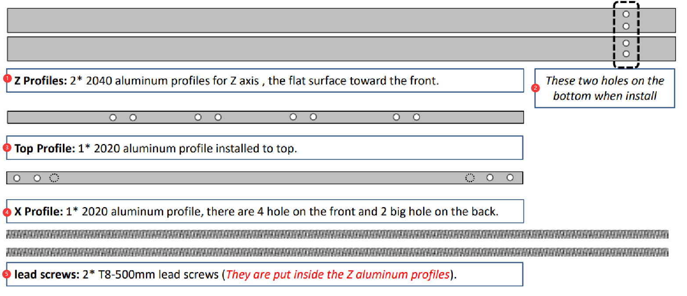
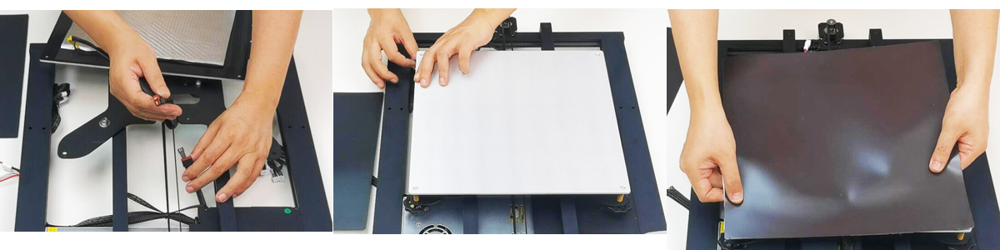
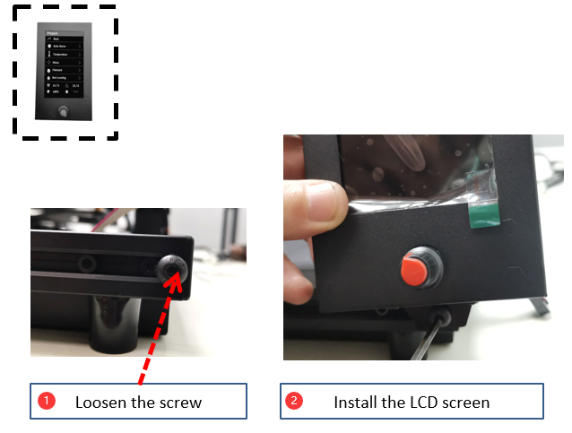
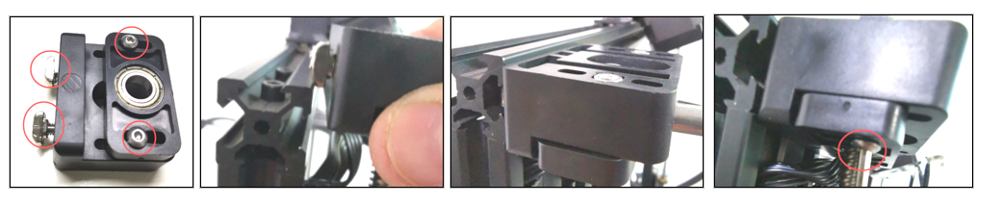
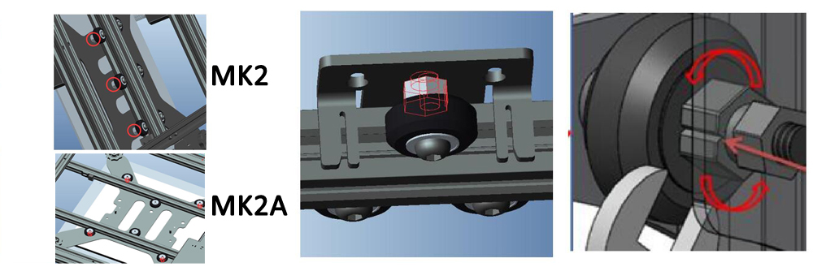
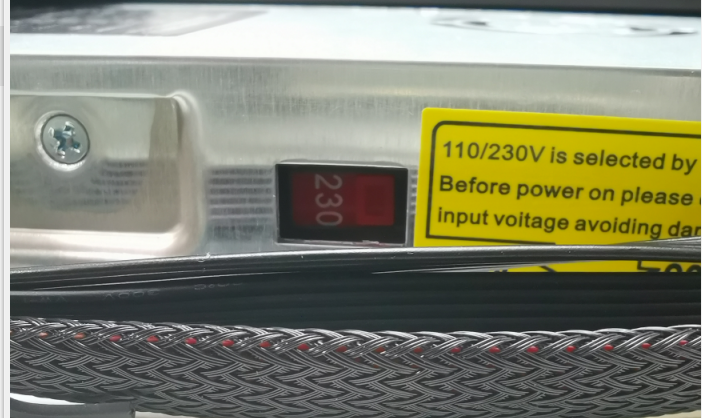

# Z8P-MK2 インストールガイド
### [ :clapper: **Z8P-MK2 取り付けビデオチュートリアル**](https://youtu.be/-oieO7U0LCc)

-----
### :warning: 注意 :warning: 
#### :clipboard: インストール時は標準の操作を厳守してください。
#### :baby_bottle: プリンターはお子様の手の届かないところに置いてください。
#### :school: お子様が設置または使用する場合は、大人の指導が必要です。
#### :wrench: 感電の危険を避けるため、設置の際は注意してください。
#### :fire: プリンターが停止してもホットエンドは高温になっています。
#### :fire: プリンターが停止してもホットベッドは高温になっています。
#### :ghost: 換気を良くしてください！ プリンターの動作中に有毒ガスが発生する可能性があります。
#### :electric_plug: 電源を入れる前に、AC 電源選択スイッチが正しい位置に設定されていることを確認してください。

-----
＃＃ パーツリスト
### Z8PM4-MK2Aのパーツリスト

| 番号| 名前 | 番号| 名前 | 番号| 名前 | 番号| 名前 |
|:--:|:----------------------:|:--:|:------------------------:|:--:|:-------------:|:--:|:-------------------------------------:|
| 1 | ベースモジュール | 2 | ヒートベッドステッカー | 3 | ヒートベッド | 4 | エクストルーダー (4 セット) |
| 5 | Zドライブモーター（2セット） | 6 | Xキャリア付きプリントヘッド| 7 | Zキャリア(左) | 8 | Zキャリア(右) |
| 9 | TFT-LCD コントロール パネル | 10 | アクセサリー | 11 | SDカード(*) | 12 |フィラメントロールブラケット |
| 13 | ツール | 14 | USBケーブル | 15 | AC 電源コード | 16 | 送りねじとプロファイル |

\* **SD カードは「アクセサリ」パッケージに含まれています。**
### Z8PM4-MK2のパーツリスト

| 番号| 名前 | 番号| 名前 | 番号| 名前 | 番号| 名前 |
|:--:|:----------------------:|:--:|:------------------------:|:--:|:-------------:|:--:|:-------------------------------------:|
| 1 | ベースモジュール | 2 | エクストルーダー (4 セット) | 3 | Zドライブモーター（2セット） | 4 | 送りねじとプロファイル |
| 5 |X キャリア付きプリントヘッド | 6 | Zキャリア(左) | 7 | Zキャリア(右) | 8 | TFT-LCD コントロール パネル |
| 9 | アクセサリー | 10 | フィラメントロールブラケット | 11 | SDカード(*) | 12 | ツール |
| 13 | USBケーブル | 14 | AC 電源コード | | | | |

\* **SD カードは「アクセサリ」パッケージに含まれています。**
### 「送りねじとプロファイル」の説明

|いいえ| 名前 |
|:-:|:------------------------------------------------------------------------------------------------:|
|1 | **Z プロファイル:** Z 軸用の 2* 2040 アルミニウム プロファイル、前面に向かう平らな面。 |
|2 | 取り付けるときは、この 2 つの穴が底部にあります。 |
|3 | **トッププロファイル:** 1* 2020 アルミニウムプロファイルが上部に取り付けられています。 |
|4 | **X プロファイル:** 1* 2020 アルミニウム プロファイル、前面に 4 つの穴、背面に 2 つの大きな穴があります。 |
|5 | **親ネジ:** T8-500mm 親ネジ 2 本 ***(Z アルミニウム プロファイルの内側にあります)***。 |
### 「付属品」の説明

|いいえ| 名前 | 番号| 名前 | 番号| 名前 | 番号| 名前 |
|:-:|:--------------------------:|:--:|----------------------------|:--:|:-------------:|:--:|:----------------------------:|
|1 | 4* PTFE チューブ | 2 | ケーブルタイ | 3 | 2* Z エンドストップ | 4 | 2* Z 親ねじ固定ブロック |
|5 | ノズル（スペアパーツ） | 6 | Xベルトアイドラー | 7 | Xタイミングベルト | 8 | ホイール(スペアパーツ) |

-----
## インストール
### 0. ヒートベッドとヒートベッドステッカーを取り付けます (MK2A のみ)
[:clapper:**ビデオチュートリアル**](https://youtu.be/6-8cr9xVGlQ)
最新の Z8PM4Pro-MK2 ***(MK2A と呼ばれます)*** は、輸送中にホットベッドを保護するためにパッケージを改良しました。 したがって、取り付けの最初のステップとして、ヒートベッドのアルミニウムプレートをヒートベッドブラケットに取り付けてから、磁気フレキシブルヒートベッドステッカーのB面をヒートベッドのアルミニウムプレートに貼り付ける必要があります。

- ヒート ベッド ワイヤーを接続します (:warning:  ホット ベッド ワイヤーの出口をマシンの左後部に配置し、ワイヤーをブラケットの中央にある大きな穴に通します)。
- ヒートベッドをブラケットに取り付けます。
- ステッカーの B 面をヒートベッドに貼り付けます (:warning: 貼り付けるときは向きに注意してください)。
<!--  -->

### 1. Z軸パーツの取り付け
- 2x Z プロファイルを「ベース モジュール」の Y プロファイルにインストールします。
- 2x Z ドライブ モーターを Z プロファイルに取り付けます。
- 2x Z ENDSTOP を Z プロファイルに取り付けます。    
      
:warning: 注 :warning: 
- **2 つの穴がある Z 軸プロファイルの端は下を向く必要があります。**
- **Z 軸プロファイルの平面は前方を向く必要があります。**

Z エンドストップを Z プロファイルの側面に取り付けます。
#### レイアウトエクストルーダーのケーブル

エクストルーダーケーブルを右側の Z プロファイルの後ろの溝に置き、プラスチックのプロファイル カバーで覆います。 上部に 10mm の距離を残してケーブルを引き出す必要があることに注意してください。

##### :warning: 注: 配線の外側の絶縁保護層を損傷しないように注意してください。 モーター線が金属フレームに接触すると、制御基板が破損する恐れがあります。
##### :warning: 注: 偏心コラムを調整すると、キャリアがレールをしっかりと保持し、スムーズに移動できるようになります。

### 2. X軸パーツの取り付け

- ステップ 1. X ベルトアイドラーを X プロファイルに取り付けます。
- ステップ 2. X ベルトを取り付けます。
- ステップ 3. X キャリアを左側から挿入し、ベルトを X プロファイルの溝に入れておきます。
- ステップ 4. X キャリアのフックにベルトを固定します。
- ステップ 5. ベルトをプロファイルの中心に移動します。

- ステップ 1. 親ネジを回転させて同じ高さを保ちます。
- ステップ 2. X アイドラーを Z 右キャリアに挿入します。
- ステップ 3. ベルトをタイミングプーリーに掛けます。
- ステップ 4. ホイールを回してベルトを入れます。
- ステップ 5. X プロファイルを固定します (最初はきつく締めないでください)。
- ステップ 6. X アイドラーを修正します。

### 3. LCD スクリーンを取り付ける
   
ステップ1. ネジを緩めます。
ステップ 2. LCD スクリーンを取り付けます。

### 4. エクストルーダーを設置する
4 つのエクストルーダーを上部プロファイルに取り付けます。     

### 5. PTFE チューブを取り付けます
    
エクストルージョンフィーダーとプリントヘッド（ホットエンド）をフィラメントガイド（PTFEチューブ）で接続します。    
    
##### :warning:  注: これらの PTFE チューブは必要より少し長いため、必要に応じてナイフで切断できます。
- ステップ 1. PTFE チューブを押出機に挿入します。
- ステップ 2. クランプを取り付けます。
- ステップ 3. PTFE チューブをホットエンドのフィッティングに接続します。
**:warning:  内側の PTFE チューブを引き抜かないでください:warning: **、内側の PTFE チューブのいずれかがホット エンドの底部に挿入されていないと、印刷中にホット エンドが詰まりやすくなります。 **内側の PTFE チューブ**は、ホットエンドに差し込まれた 4 本の短い PTFE チューブです。
M4V6ホットエンドのユーザーガイドについては、https://github.com/ZONESTAR3D/Upgrade-kit-guide/tree/main/HOTEND/M4/M4_V6を参照してください。

### 6. Z 移動システムをデバッグする
    
親ネジを Z 軸プロファイルとできるだけ平行に保つと、印刷品質が向上します。次の手順を参照してデバッグしてください。
- ステップ 1. Z モーターと T8 銅ナットを固定しているすべてのネジを少し緩めます。
- ステップ 2. 同期 カップリングを回転させて、X 軸をプリンタの 1/2 の高さまで上げます。
- ステップ 3. 親ネジを Z プロファイルと平行に保ち、Z モーターと T8 銅ナットを固定するネジを締めます。

### 7. Z 送りねじ固定モジュールを取り付けます
Z 送りねじ固定ブロックを上部プロファイルに取り付けます。

### 8. 偏心カラムを調整する
ホットベッドブラケットと X キャリアの下にある偏心コラムを回転させ、キャリアが揺れることなくトラック上でスムーズに走行できることを確認します。    
    
:warning:  最新の Z8PM4Pro-MK2 ***(MK2A と呼ばれる)*** では、Y プロファイルが 20x40 プロファイルから 2 つの 20x20 プロファイルに改良されているため、ヒート ベッド ブラケットの偏心柱も変更されています。

### 9. フィラメントブラケットの取り付け
フィラメント ブラケットを上部プロファイルに取り付けます。     

----
## 配線
### 配線ブロック

:warning: 最新の Z8PM4Pro-MK2 では、コントロール ボックスの側面 (DC ボタンの近く) に SD カード ソケットが追加されており、このスロットに SD カードを挿入できます。このスロットは、上の Micro SD カード スロットよりもアクセスしやすくなっています。 コントロールボックスの正面。
### 配線手順
次の図を参照して、コントロール ボックスから出たワイヤのコネクタを、次のような Z8PM4pro コンポーネントのソケットに接続します。
- **左 Z モーター / エンドストップ**
- **右 Z モーター / エンドストップ**
- **X モーター / エンドストップ**
- **押出機モーターワイヤー (4x)**
- **ホットエンドワイヤー: 1.ベッドレベリングセンサー - 2.押出機ファン - 3.冷却ファン - 4.温度センサー - 5.ヒーター**
- **LCD ケーブル**

### ホットエンドワイヤーをレイアウトする
1. ホットエンドワイヤーを細いコルゲートチューブで包み、機械の左軸のネジとプロファイルの間の隙間に通します。
2. ホットエンドの端子を厚い波形パイプで包み、ケーブルタイでしっかりと結びます。

-----
## 電源を入れる前に確認してください
#### :warning:  電源を入れる前に配線を確認することは非常に重要です。そうすることで一部のハードウェア接続が不要になり、プリンターがスムーズに使用を開始できるようになります。
#### チェックリスト:
1. **X 軸と Y 軸のタイミング プーリーがモーターのシャフトに固定されているか、カップリングが Z モーターのシャフトに固定されているかを確認します。**
2. **カップリングのシャフトにリードスクリューが固定されているか確認してください。**
3. **ホットエンドとホットベッドをそれぞれのリミットスイッチ位置に移動して、接触が良好かどうか、および明確な音が聞こえるかどうかを確認します。 それ以外の場合は、リミットスイッチを確認して再組み立てしてください。**
4. **ホットエンドとホットベッドを手動で動かして動きがスムーズかどうかを確認します。そうでない場合は、モーターがスムーズに動くまで偏心ナットを調整します。 インストール手順を参照してください。**
5. **X 軸と Y 軸の駆動ベルトがしっかりと取り付けられているかどうかを確認します。 緩すぎる場合は締め直してください。**
6. **ネジ棒が所定の位置に取り付けられているか、ネジが締まっているかを確認してください。**
7. **Z 軸モーター カップリングを手動で回転させ、Z 軸リミット スイッチが確実に接触しているかどうかを確認します。**
8. **AC 電源選択スイッチが正しい位置に設定されているかどうかを確認します。 市の AC 電圧は 220V で、[230] に設定されています。 市の AC 電圧は 110V で、[110] に設定されています。**

## :fireworks: おめでとうございます!
上記のインストール手順を完了すると、マシンのインストールが完了したことが通知されます。 配線を整理し、結束バンドで機械のフレームに固定できます。
次に、予備的なデバッグを行うだけで、最初の印刷を開始できます。 [**:point_right: クイック ユーザー マニュアル**](https://github.com/ZONESTAR3D/Z8P/blob/main/Z8P-MK2/2-Operation_Guide/readme.md) を参照して、準備して開始してください。 最初の印刷物。

----
### 付録: 制御基板の配線図
配線概略図は、制御盤の端子と制御ボックス内で使用される部品の接続概略図を示します。
**ピンク色のボックスに表示されているコンポーネントはオプションのコンポーネント/機能です**。Z8PM4Pro の標準装備ではありません。
