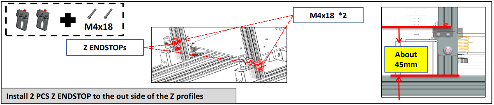

## <a id="choose-language">:globe_with_meridians: Choose language </a>

<!--  -->

-----
# Z8P-MK2 설치 가이드
### [ :clapper: **Z8P-MK2 설치 동영상 튜토리얼**](https://youtu.be/-oieO7U0LCc)

-----
### :warning:  주의 :warning: 
#### :clipboard: 설치 시 표준 작동을 엄격히 따르십시오.
#### :baby_bottle: 프린터를 아이들의 손이 닿지 않는 곳에 두세요.
#### :school: 어린이가 설치하거나 사용할 때는 어른의 지도를 받아야 합니다.
#### :wrench: 감전 위험을 방지하려면 설치 시 주의하십시오.
#### :fire: 프린터가 작동을 멈췄는데도 핫엔드의 온도가 높습니다.
#### :fire: 프린터가 작동을 멈췄는데도 온돌의 온도가 높습니다.
#### :ghost: 환기가 잘 되는 상태를 유지해주세요! 프린터 작동 시 독성 가스가 발생할 수 있습니다.
#### :electric_plug: 전원을 켜기 전에 AC 전원 선택 스위치를 올바른 위치로 설정했는지 확인하세요.

-----
## 부품 목록
### Z8PM4-MK2A 부품 목록

| 아니요| 이름 | 아니요| 이름 | 아니요| 이름 | 아니요| 이름 |
|:--:|:------------:|:--:|:-------------------------:|:--:|:------------:|:--:|:------------:|
| 1 | 기본 모듈 | 2 | 히트베드 스티커 | 3 | 히트베드 | 4 | 압출기(4세트) |
| 5 | Z 드라이브 모터(2세트) | 6 | X 캐리어가 포함된 프린트 헤드| 7 | Z캐리어(왼쪽) | 8 | Z캐리어(우) |
| 9 | TFT-LCD 제어판 | 10 | 액세서리 | 11 | SD 카드(*) | 12 |필라멘트 롤 브래킷 |
| 13 | 도구 | 14 | USB 케이블 | 15 | AC 전원 코드 | 16 | 리드 스크류 및 프로파일 |

\* **SD 카드는 "액세서리" 패키지에 들어 있습니다.**
### Z8PM4-MK2 부품 목록

| 아니요| 이름 | 아니요| 이름 | 아니요| 이름 | 아니요| 이름 |
|:--:|:------------:|:--:|:-------------------------:|:--:|:------------:|:--:|:------------:|
| 1 | 기본 모듈 | 2 | 압출기(4세트) | 3 | Z 드라이브 모터(2세트) | 4 | 리드 스크류 및 프로파일 |
| 5 |X 캐리어가 포함된 프린트 헤드 | 6 | Z캐리어(왼쪽) | 7 | Z캐리어(우) | 8 | TFT-LCD 제어판 |
| 9 | 액세서리 | 10 | 필라멘트 롤 브래킷 | 11 | SD 카드(*) | 12 | 도구 |
| 13 | USB 케이블 | 14 | AC 전원 코드 | | | | |

\* **SD 카드는 "액세서리" 패키지에 들어 있습니다.**
### "리드 스크류 및 프로파일"에 대한 설명

|아니요| 이름 |
|:-:|:------------------------------------------------------------------------:|
|1 | **Z 프로파일:** Z축용 2040 알루미늄 프로파일 2개, 전면을 향한 평평한 표면. |
|2 | 설치할 때 바닥에 있는 이 두 개의 구멍. |
|3 | **상단 프로파일:** 1* 2020 알루미늄 프로파일이 상단에 설치되었습니다. |
|4 | **X 프로파일:** 1* 2020 알루미늄 프로파일, 전면에 4개의 구멍이 있고 후면에 2개의 큰 구멍이 있습니다. |
|5 | **리드 나사:** 2* T8-500mm 리드 나사 ***(Z 알루미늄 프로파일 내부에 배치됩니다)***. |
### "액세서리"에 대한 설명

|아니요| 이름 | 아니요| 이름 | 아니요| 이름 | 아니요| 이름 |
|:-:|:------------:|:--:|--------------------------|:--:|:------------:|:--:|:---------------:|
|1 | 4* PTFE 튜브 | 2 | 케이블 타이 | 3 | 2* Z 엔드스톱 | 4 | 2* Z 리드 나사 고정 블록 |
|5 | 노즐(예비부품) | 6 | X 벨트 아이들러 | 7 | X 타이밍 벨트 | 8 | 휠(예비부품) |

-----
## 설치
### 0. 히트베드 및 히트베드 스티커 부착(MK2A 전용)
[:clapper:**동영상 튜토리얼**](https://youtu.be/6-8cr9xVGlQ)
최신 Z8PM4Pro-MK2***(MK2A라고 함)***는 운송 중 핫베드를 보호하기 위해 포장을 개선했습니다. 따라서 설치의 첫 번째 단계로 히트베드 알루미늄판을 히트베드 브래킷에 설치한 후 자성형 히트베드 스티커의 B면을 히트베드 알루미늄판에 붙여야 합니다.

- 히트베드 와이어를 연결하세요. (주의사항: 핫베드 와이어 출구를 기기 좌측 후면에 놓고, 브라켓 중앙의 큰 구멍을 통해 와이어를 통과시키세요.)
- 브라켓에 히트베드를 설치합니다.
- 스티커 B면을 히팅베드에 붙였습니다. (:warning: 붙일 때 방향에 주의하세요.)
<!--  -->

### 1. Z축 부품 설치
- "기본 모듈"의 Y 프로필에 2x Z 프로필을 설치합니다.
- Z 프로파일에 2개의 Z 드라이브 모터를 설치합니다.
- Z 프로파일에 2x Z ENDSTOP을 설치합니다.

:warning: 참고:warning: 
- **2개의 구멍이 있는 Z축 프로파일의 끝이 아래쪽을 향해야 합니다.**
- **Z축 프로파일의 평면이 앞쪽을 향해야 합니다.**

Z 프로파일 측면에 Z ENDSTOP을 설치합니다.
#### 레이아웃 압출기의 케이블
    
압출기 케이블을 오른쪽 Z 프로파일 뒤의 홈에 넣고 플라스틱 프로파일 커버로 덮습니다. 주의할 점은 상단에서 10mm 정도의 거리를 두고 케이블을 뽑아야 한다는 점입니다.   
   
##### :warning: 참고: 배선의 외부 절연 보호층이 손상되지 않도록 주의하십시오. 모터 와이어가 금속 프레임에 닿으면 제어 보드가 손상될 수 있습니다.
##### :warning: 참고: 편심 기둥을 조정하면 캐리어가 레일을 잘 잡고 부드럽게 움직일 수 있습니다.

### 2. X축 부품 설치

- 1단계. X 벨트 아이들러를 X 프로파일에 설치합니다.
- 2단계. X 벨트를 설치합니다.
- 3단계. X 캐리어를 왼쪽부터 삽입하고, 벨트를 X 프로파일의 홈에 고정시킵니다.
- 4단계. 벨트를 X캐리어의 후크에 고정시킵니다.
- 5단계. 벨트를 프로파일 중앙으로 이동합니다.

- 1단계. 리드스크류를 돌려 동일한 높이를 유지합니다.
- 2단계. X 아이들러를 Z 오른쪽 캐리어에 삽입합니다.
- 3단계. 벨트를 타이밍 풀리에 걸어줍니다.
- 4단계. 휠을 돌려 벨트를 넣습니다.
- 5단계. X 프로파일을 수정합니다(처음에는 조이지 마십시오).
- 6단계. X 아이들러를 고정하세요.

### 3. LCD 화면 설치
    
- 1단계. 나사를 푼다.
- 2단계. LCD 화면을 설치합니다.

### 4. 압출기 설치
상단 프로파일에 압출기 4개를 설치합니다.     

### 5. PTFE 튜브 설치
    
필라멘트 가이드(PTFE 튜브)로 압출 피더를 프린트 헤드(핫 엔드)와 연결합니다.    
   
##### :warning:  참고: 이 PTFE 튜브는 필요한 것보다 약간 길기 때문에 필요한 경우 칼로 잘라낼 수 있습니다.
- 1단계. PTFE 튜브를 압출기에 삽입합니다.
- 2단계. 클램프를 설치합니다.
- 3단계. PTFE 튜브를 Hot end의 피팅에 연결합니다.
**:warning:  내부 PTFE 튜브를 잡아당기지 마십시오. 경고:** 내부 PTFE 튜브 중 하나라도 핫 엔드 하단에 삽입되지 않으면 인쇄 중에 핫 엔드가 막히기 쉽습니다. **내부 PTFE 튜브**는 핫 엔드에 연결된 4개의 짧은 PTFE 튜브입니다.
M4V6 핫엔드 사용자 가이드는 다음을 참조하세요: https://github.com/ZONESTAR3D/Upgrade-kit-guide/tree/main/HOTEND/M4/M4_V6

### 6. Z 이동 시스템 디버그

리드 스크류를 Z축 프로파일과 최대한 평행하게 유지하면 더 나은 인쇄 품질을 얻는 데 도움이 됩니다. 다음 단계를 참조하여 디버깅하십시오.
- 1단계. Z 모터와 T8 구리 너트를 고정하고 있던 나사를 모두 조금 풀어줍니다.
- 2단계. 동기식 커플링을 회전시켜 X축을 프린터 높이의 1/2만큼 위로 이동시킵니다.
- 3단계. 리드 나사를 Z 프로파일과 평행하게 유지한 다음 Z 모터와 T8 구리 너트를 고정한 나사를 조입니다.

### 7. Z 리드 나사 고정 모듈을 설치합니다.
상단 프로파일에 Z 리드 나사 고정 블록을 설치합니다.    

### 8. 편심 기둥 조정
핫베드 브래킷과 X 캐리어 아래의 편심 기둥을 회전시켜 캐리어가 흔들리지 않고 트랙에서 원활하게 이동할 수 있도록 합니다.    
    
:warning:  최신 Z8PM4Pro-MK2 ***(MK2A라고 함)***는 Y 프로파일을 20x40 프로파일에서 2피스 20x20 프로파일로 개선했기 때문에 히트 베드 브래킷의 편심 기둥도 수정되었습니다.

### 9. 필라멘트 브라켓 설치
상단 프로파일에 필라멘트 브래킷을 설치합니다.     

----
## 배선
### 배선 블록

:warning: 최신 Z8PM4Pro-MK2는 컨트롤 박스 측면(DC 버튼 근처)에 SD 카드 소켓을 추가했습니다. 이 슬롯에 SD 카드를 삽입할 수 있습니다. 이 슬롯은 마이크로 SD 카드 슬롯보다 접근하기 쉽습니다. 컨트롤 박스의 전면입니다.
### 배선 단계
다음 이미지를 참조하여 컨트롤 박스에서 나온 전선의 커넥터를 Z8PM4pro 구성 요소의 소켓에 연결하십시오. 여기에는 다음이 포함됩니다.
- **왼쪽 Z 모터/엔드스톱**
- **오른쪽 Z 모터 / 엔드스톱**
- **X 모터 / 엔드스톱**
- **압출기 모터 와이어(4x)**
- **핫 엔드 와이어: 1.베드 레벨링 센서 - 2.압출기 팬 - 3.냉각 팬 - 4.온도 센서 - 5.히터**
- **LCD 케이블**

### 핫엔드 와이어 레이아웃
1. 핫 엔드 와이어를 더 얇은 주름진 튜브로 감싸고 기계 왼쪽 축의 나사와 프로파일 사이의 틈을 통과시킵니다.
2. 두꺼운 주름관으로 뜨거운 끝 부분의 단자를 감싸고 케이블 타이로 단단히 묶습니다.

-----
## 전원을 켜기 전 확인하세요
#### :warning:  전원을 켜기 전에 배선을 확인하는 것이 매우 중요합니다. 이렇게 하면 일부 하드웨어 연결을 제거하고 프린터가 원활하게 사용할 수 있는지 확인할 수 있습니다!
#### 체크리스트:
1. **X&Y축 타이밍 풀리가 모터 샤프트에 고정되어 있는지, 커플링이 Z 모터 샤프트에 고정되어 있는지 확인하세요.**
2. **리드 스크류가 커플링 샤프트에 고정되었는지 확인하세요.**
3. **핫엔드와 핫베드를 각각의 리미트 스위치 위치로 이동하여 접촉이 양호하고 소리가 선명한지 확인하십시오. 그렇지 않은 경우 리미트 스위치를 확인하고 다시 조립하십시오.**
4. **핫 엔드와 핫베드를 수동으로 움직여 움직임이 부드러운지 확인하고, 그렇지 않으면 모터가 부드럽게 움직일 때까지 편심 너트를 조정합니다. 설치 절차를 참조하세요.**
5. **X축 및 Y축 구동 벨트가 단단히 설치되어 있는지 확인하십시오. 너무 느슨하다면 조여보세요.**
6. **나사봉이 제자리에 조립되었는지, 나사가 조여졌는지 확인하세요.**
7. **z축 모터 커플링을 수동으로 회전시켜 z축 리미트 스위치가 안정적으로 접촉하는지 확인하십시오.**
8. **AC 전원 선택 스위치가 올바른 위치로 설정되었는지 확인하세요. 도시 AC 전압은 220V이며 [230]으로 설정되어 있습니다. 도시 AC 전압은 110V이며 [110]으로 설정됩니다.**

## :fireworks: 축하합니다!
위의 설치 단계를 완료하면 기기 설치가 완료되었다는 알림이 표시됩니다. 배선을 정리하고 케이블 타이를 사용하여 기계 프레임에 고정할 수 있습니다.
다음으로, 몇 가지 예비 디버깅을 수행하면 첫 번째 인쇄를 시작할 수 있습니다. [**:point_right: 빠른 사용자 매뉴얼**](https://github.com/ZONESTAR3D/Z8P/blob/main/Z8P-MK2/2-Operation_Guide/readme.md)을 참조하여 준비하고 시작하세요. 첫 번째 인쇄.

----
### 부록: 제어 보드 배선 다이어그램
배선도(Wiring Schematic Diagram)는 컨트롤 박스 내부에 사용되는 제어보드 단자와 구성품의 연결도를 보여줍니다.
**분홍색 상자에 표시된 구성 요소는 옵션 구성 요소/기능**이지만 Z8PM4Pro의 표준 장비는 아닙니다.
