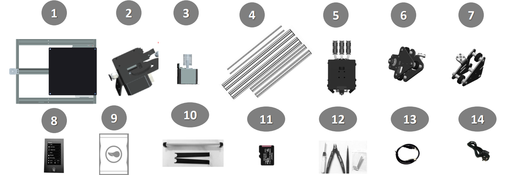
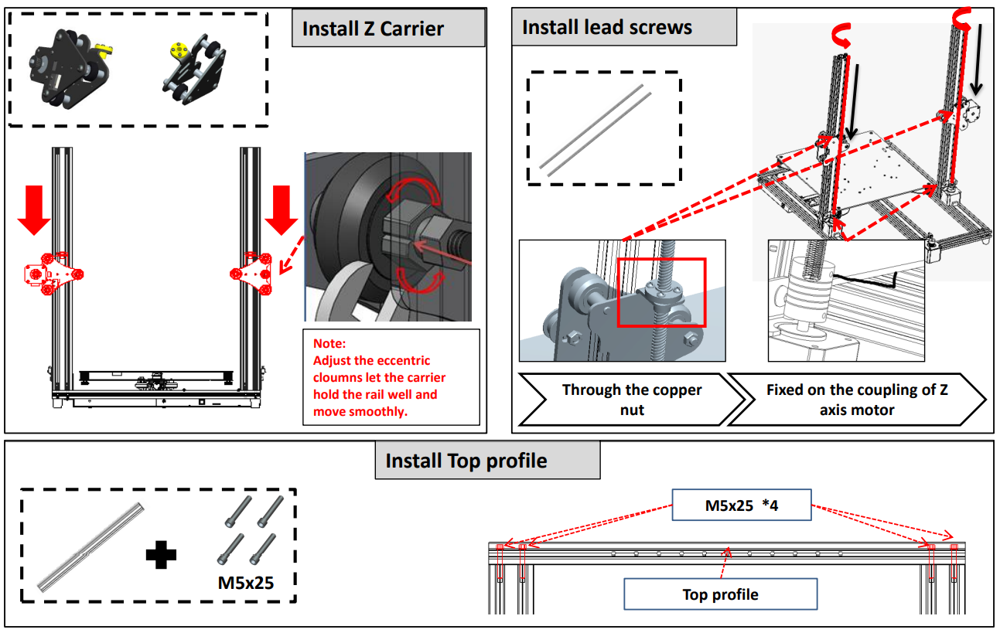
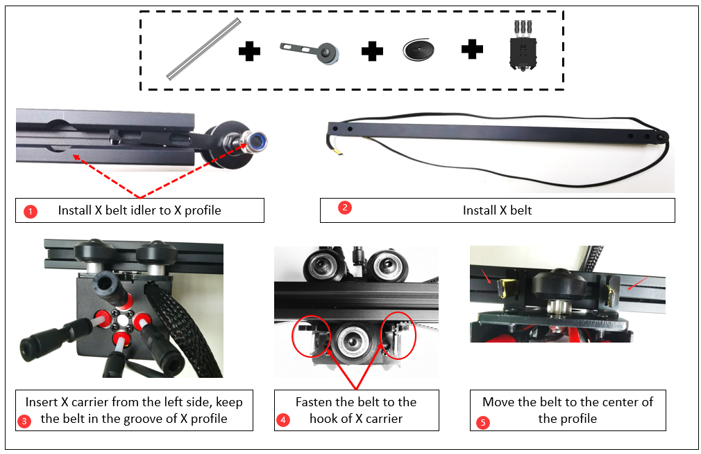

# Z8P-MK2 Руководство по установке
### [ :clapper: **Видеоруководство по установке Z8P-MK2**](https://youtu.be/-oieO7U0LCc)

-----
### :warning: ВНИМАНИЕ :warning:
#### :clipboard: При установке строго следуйте стандартным операциям.
#### :baby_bottle: Пожалуйста, поставьте принтер в недоступное для детей место.
#### :school: При установке или использовании детьми должны проводиться под руководством взрослых.
#### :wrench: Соблюдайте осторожность при установке, чтобы избежать поражения электрическим током.
#### :fire: У Hotend высокая температура, даже принтер перестает работать.
#### :fire: В теплице высокая температура, даже принтер перестает работать.
#### :ghost: Пожалуйста, следите за хорошей вентиляцией! При работе принтера могут выделяться токсичные газы.
#### :electric_plug: Перед включением питания убедитесь, что переключатель выбора мощности переменного тока установлен в правильное положение.

-----
## Список деталей
### Список деталей для Z8PM4-MK2A

| Нет.| Имя | Нет.| Имя | Нет.| Имя | Нет.| Имя |
|:--:|:------------------------:|:--:|:------------------------:|:--:|:------------------------:|:--:|:------------------------:|
| 1 | Базовый модуль | 2 | Наклейка с подогревом | 3 | Тепловая кровать | 4 | Экструдеры (4 комплекта) |
| 5 | Приводные двигатели Z (2 комплекта) | 6 | Печатающая головка с X-образным держателем | 7 | Z-носитель (слева) | 8 | Z-носитель (справа) |
| 9 | Панель управления TFT-LCD | 10 | Аксессуары | 11 | SD-карта(*) | 12 | Кронштейн рулона нити |
| 13 | Инструменты | 14 | USB-кабель | 15 | Шнур питания переменного тока | 16 | Ходовой винт и профили |

\* **SD-карта находится в упаковке «Аксессуары».**
### Список деталей для Z8PM4-MK2

| Нет.| Имя | Нет.| Имя | Нет.| Имя | Нет.| Имя |
|:--:|:------------------------:|:--:|:------------------------:|:--:|:------------------------:|:--:|:------------------------:|
| 1 | Базовый модуль | 2 | Экструдеры (4 комплекта) | 3 | Приводные двигатели Z (2 комплекта) | 4 | Ходовой винт и профили |
| 5 |Печатающая головка с держателем X | 6 | Z-носитель (слева) | 7 | Z-носитель (справа) | 8 | Панель управления TFT-LCD |
| 9 | Аксессуары | 10 | Кронштейн для рулона нити | 11 | SD-карта(*) | 12 | Инструменты |
| 13 | USB-кабель | 14 | Шнур питания переменного тока | | | | |

\* **SD-карта находится в упаковке «Аксессуары».**
### Описание «Ходовой винт и профили»

|Нет.| Имя |
|:-:|:--------------------------------------------------------------------------------------------------:|
|1 | **Z-профили:** 2* алюминиевых профиля 2040 для оси Z, плоской поверхностью вперед. |
|2 | Эти два отверстия внизу при установке. |
|3 | **Верхний профиль:** 1* алюминиевый профиль 2020 года, установленный сверху. |
|4 | **Профиль X:** 1* Алюминиевый профиль 2020 года, с 4 отверстиями спереди и 2 большими отверстиями сзади. |
|5 | **ходовые винты:** 2* ходовые винты T8-500 мм ***(они вставляются внутрь алюминиевых профилей Z)***. |
### Описание «Аксессуары»

|Нет.| Имя | Нет.| Имя | Нет.| Имя | Нет.| Имя |
|:-:|:------------------------:|:--:|--------------------------|:--:|:------------------------:|:--:|:----------------------------:|
|1 | 4* трубка из ПТФЭ | 2 | Кабельная стяжка | 3 | 2* Z КОНЦЕВОЙ СТОП | 4 | 2 * крепежные блоки ходового винта Z |
|5 | Форсунка (Запчасть) | 6 | X Ремень натяжной ролик | 7 | X Ремень ГРМ | 8 | Колесо (Запчасть) |

-----
## Монтаж
### 0. Установите нагревательный слой и наклейку нагревательного стола (только для MK2A)
[:clapper:**Видеоурок**](https://youtu.be/6-8cr9xVGlQ)
В последней версии Z8PM4Pro-MK2 *** (названной MK2A)*** улучшена упаковка, чтобы защитить горячую кровать во время транспортировки. Итак, в качестве первого шага установки вам необходимо установить алюминиевую пластину нагревательного стола на кронштейн нагревательного стола, а затем наклеить сторону B магнитной гибкой наклейки нагревательного стола на алюминиевую пластину нагревательного стола.    
     
- Подсоедините провод нагревательного стола (:warning: поместите выход провода нагревательного стола на левой задней стороне машины и пропустите провод через большое отверстие в середине кронштейна).
- Установите нагревательный слой на кронштейн.
- Наклеил наклейку стороной B на нагревательный стол (:warning: обратите внимание на ее ориентацию при наклеивании).
<!--  -->

### 1. Установите детали оси Z
- Установите 2 профиля Z на профили Y «Базового модуля».
- Установите 2 приводных двигателя Z на профили Z.
- Установите 2x Z ENDSTOP на Z-профили.

:warning: ПРИМЕЧАНИЕ :warning: 
- **Конец профиля оси Z с двумя отверстиями должен быть обращен вниз.**
- **Плоскость профиля оси Z должна быть направлена вперед.**

Установите Z ENDSTOP сбоку от Z-профилей.    
#### Схема кабеля экструдера
     
Поместите кабели экструдера в паз за правым Z-профилем и накройте его пластиковыми крышками профиля. Обратите внимание, что вверху следует оставить расстояние 10 мм и вытащить кабели.     

##### :warning: Примечание: будьте осторожны, чтобы не повредить внешний изоляционный слой проводки. Если провод двигателя соприкоснется с металлическим каркасом, это может привести к повреждению платы управления.
##### :warning: Примечание: Отрегулируйте эксцентрики, чтобы перевозчик хорошо держался за рельс и плавно двигался.

### 2. Установите детали оси X

- Шаг 1. Установите натяжной ролик ремня X на профиль X.
- Шаг 2. Установите X-ремень.
- Шаг 3. Вставьте X-держатель с левой стороны, удерживая ремень в канавке X-профиля.
- Шаг 4. Прикрепите ремень к крючку X-держателя.
- Шаг 5. Переместите ремень в центр профиля.

- Шаг 1. Поверните ходовые винты, чтобы сохранить одинаковую высоту.
- Шаг 2. Вставьте направляющую X в правую водилу Z.
- Шаг 3. Подвесьте ремень к шкиву ГРМ.
- Шаг 4. Поверните колесо, чтобы впустить ремень.
- Шаг 5. Зафиксируйте профиль X (сначала не затягивайте).
- Шаг 6. Закрепите направляющую X.

### 3. Установите ЖК-экран
     
Шаг 1. Ослабьте винт.
Шаг 2. Установите ЖК-экран.

### 4. Установите экструдеры
Установите 4 экструдера на верхний профиль.     

### 5. Установите трубку из ПТФЭ.
    
Подсоедините экструзионное устройство подачи к печатающей головке (горячий конец) с помощью направляющей для нити (трубка из ПТФЭ).     
     
##### :warning:  Примечание. Эти трубки из ПТФЭ немного длиннее, чем нужно, при необходимости их можно разрезать ножом.
- Шаг 1. Вставьте трубки из ПТФЭ в экструдеры.    
- Шаг 2. Установите хомуты.
- Шаг 3. Подсоедините трубки из ПТФЭ к фитингам на горячем конце.
**: предупреждение: Не вытягивайте внутренние трубки из ПТФЭ: предупреждение: **, если какая-либо из внутренних трубок из ПТФЭ не вставлена в нижнюю часть горячего конца, горячий конец может легко заблокироваться во время печати. **Внутренние трубки из ПТФЭ** — это четыре более короткие трубки из ПТФЭ, которые подключаются к горячему концу.
О руководстве пользователя хотэнда M4V6 можно узнать по адресу: https://github.com/ZONESTAR3D/Upgrade-kit-guide/tree/main/HOTEND/M4/M4_V6.

### 6. Отладка системы Z Movement
    
Держите ходовые винты параллельно профилям оси Z, насколько это возможно. Это поможет добиться лучшего качества печати. Для их устранения выполните следующие действия:
- Шаг 1. Немного ослабьте все винты, крепящие моторы Z и медную гайку Т8.
- Шаг 2. Синхронизация. Поверните муфты, чтобы переместить ось X вверх на 1/2 высоты принтера.
- Шаг 3. Держите ходовые винты параллельно Z-профилям, затем затяните винты, фиксирующие двигатель Z, и медные гайки T8.

### 7. Установите фиксированный модуль с ходовыми винтами Z.
Установите фиксирующие блоки ходовых винтов Z на верхний профиль.

### 8. Настройка эксцентриковых колонн
Поверните эксцентриковые стойки под кронштейном горячей платформы и X-образным держателем, чтобы обеспечить плавное движение держателя по гусенице без тряски.     
    
:warning: В последней версии Z8PM4Pro-MK2 ***(называемой MK2A)*** Y-профили улучшены с профиля 20x40 на профиль 20x20, состоящий из двух частей, поэтому эксцентрические стойки на кронштейне нагревательного стола также были изменены.

### 9. Установите кронштейн нити.
Установите кронштейн нити на верхний профиль.   

----
## Проводка
### Блок проводки

:warning: В последней версии Z8PM4Pro-MK2 добавлен разъем для SD-карты сбоку блока управления (рядом с кнопкой постоянного тока). Вы можете вставить SD-карту в этот слот, доступ к которому проще, чем к слоту для карты Micro SD на передняя часть блока управления.
### Этапы подключения
Обратитесь к следующему изображению, чтобы подключить разъемы проводов, оставленных от блока управления, к разъемам компонентов Z8PM4pro, в том числе:
- **Левый двигатель Z/концевой упор**
- **Правый двигатель Z/концевой упор**
- **Двигатель X/Концевой стопор**
- **Провода двигателей экструдера (4 шт.)**
- **Провода горячего конца: 1.Датчик выравнивания стола - 2.Вентилятор экструдера - 3.Охлаждающий вентилятор - 4.Датчик температуры - 5.Нагреватель**
- **Кабель ЖК-дисплея**

### Размещение провода хотэнда
1. Оберните проволоку горячего конца более тонкой гофрированной трубкой и пропустите ее через зазор между винтом на левой оси станка и профилем.
2. Оберните клеммы на горячем конце более толстыми гофрированными трубками и плотно завяжите их кабельными стяжками.    

-----
## Проверьте перед включением питания
#### :warning:  Очень важно проверить проводку перед включением питания, поскольку это может устранить некоторые аппаратные соединения и обеспечить бесперебойную работу принтера!
#### Контрольный список:
1. **Проверьте, закреплен ли синхронизирующий шкив осей X и Y на валу двигателя, а муфты зафиксированы на валу двигателей Z.**
2. **Проверьте, закреплены ли ходовые винты на валу муфты.**
3. **Переместите горячий конец и тепловую платформу в соответствующие положения концевого выключателя, чтобы проверить, хороший ли контакт и слышен ли чистый звук. в противном случае проверьте концевой выключатель и соберите его заново.**
4. **Вручную перемещайте горячий конец и тепловую платформу, чтобы убедиться, что движение плавное, в противном случае регулируйте эксцентриковую гайку до тех пор, пока двигатель не начнет двигаться плавно. См. процедуру установки.**
5. **Проверьте, надежно ли установлен приводной ремень осей X и Y. Если он слишком свободен, попробуйте затянуть его.**
6. **Проверьте, установлен ли на месте стержень винта и затянут ли винт.**
7. **Вручную поверните муфты двигателя оси Z, чтобы проверить надежность контакта концевого выключателя оси Z.**
8. **Проверьте, установлен ли переключатель мощности переменного тока в правильное положение. Городское переменное напряжение составляет 220 В, установлено значение [230]. Городское переменное напряжение составляет 110 В, установлено значение [110].**

## :fireworks: Поздравляем!
После выполнения вышеуказанных шагов установки будет объявлено, что установка машины завершена. Вы можете расположить проводку и закрепить ее на раме машины с помощью кабельной стяжки.
Далее просто выполните предварительную отладку, и вы сможете приступить к первой печати. Пожалуйста, обратитесь к [**:point_right: краткому руководству пользователя**](https://github.com/ZONESTAR3D/Z8P/blob/main/Z8P-MK2/2-Operation_Guide/readme.md), чтобы подготовить и запустить первая печать.

----
### Приложение: Схема подключения платы управления
Принципиальная схема подключения показывает принципиальную схему подключения клемм платы управления и компонентов, используемых внутри блока управления.
**Обратите внимание, что компоненты, показанные в розовой рамке, являются дополнительными компонентами/функциями**, а не стандартным оборудованием Z8PM4Pro.     
