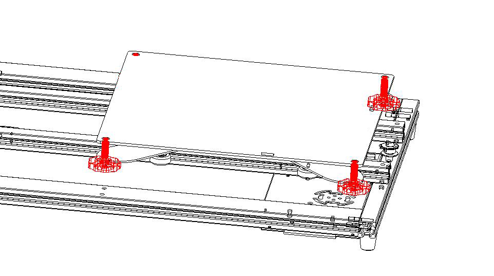
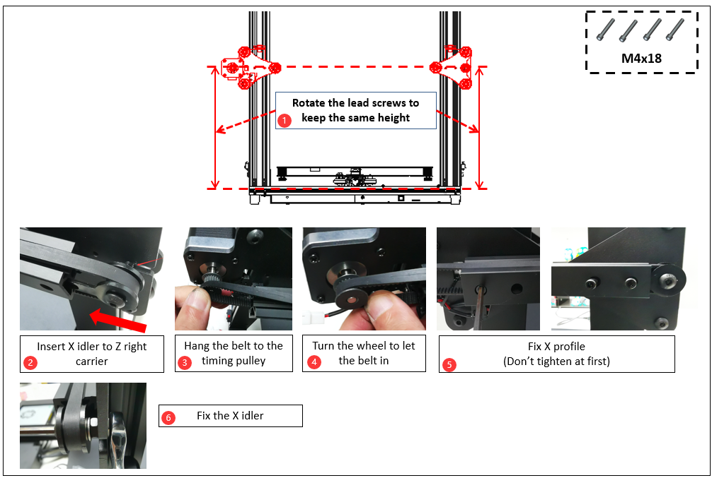
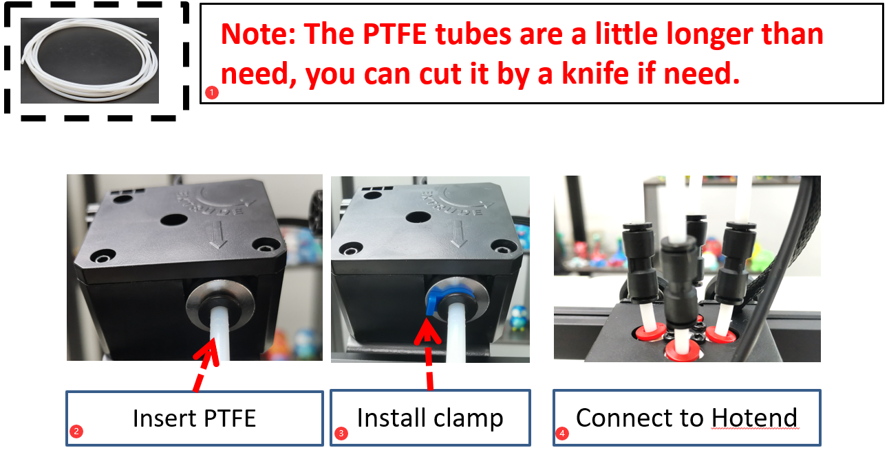
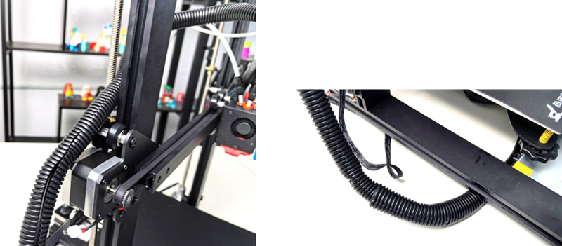

## <a id="choose-language">:globe_with_meridians: Choose language </a>

<!--  -->

-----

# Z8P-MK2 Installation Guide
### [ :clapper: **Z8P-MK2 Installation Video Tutorial**](https://youtu.be/-oieO7U0LCc)

-----
### :warning: ATTENTION :warning:
#### :clipboard: Please strictly follow the standard operation when installation.
#### :baby_bottle: Please put the printer away from the reach of kids.
#### :school: Must be guided by adults when children are installed or used.
#### :wrench: Take care when installation, to avoid electrical shock hazards.
#### :fire: Hotend has high temperature even the printer stop working.
#### :fire: Hotbed has high temperature even the printer stop working.
#### :ghost: Please keep well-ventilated condition! May produce toxic gases when printer working.
#### :electric_plug: Please make sure you have set the AC power select switch to the correct position before power on.

-----
## Parts List
### Parts List for Z8PM4-MK2A
  
| No.|         Name             | No.|              Name        | No.|              Name        | No.|              Name        |
|:--:|:------------------------:|:--:|:------------------------:|:--:|:------------------------:|:--:|:------------------------:|
| 1  | Base Module              | 2  |  Heat bed sticker        | 3  |       Heat bed           | 4  |  Extruders (4 sets)      |  
| 5  |  Z drive motors (2 sets) | 6  | Print head with X carrier| 7  |   Z carrier(left)        | 8  |  Z carrier(right)        |
| 9  |  TFT-LCD Contol Panel    | 10 |  Accessories             | 11 |  SD card(*)              | 12 |Filament Roll Bracket     |
| 13 |  Tools                   | 14 |  USB cable               | 15 |    AC Power cord         | 16 | Lead screw & Profiles    | 

\* **SD Card is placed in the "Accessries" package.**    
### Parts List for Z8PM4-MK2
    
| No.|         Name             | No.|              Name        | No.|              Name        | No.|              Name        |
|:--:|:------------------------:|:--:|:------------------------:|:--:|:------------------------:|:--:|:------------------------:|
| 1  | Base Module              | 2  |  Extruders (4 sets)      | 3  |  Z drive motors (2 sets) | 4  |  Lead screw & Profiles   |  
| 5  |Print head with X carrier | 6  |  Z carrier(left)         | 7  |   Z carrier(right)       | 8  |  TFT-LCD Contol Panel    |
| 9  | Accessories              | 10 |  Filament Roll Bracket   | 11 |  SD card(*)              | 12 |   Tools                  |
| 13 | USB cable                | 14 |  AC Power cord           |    |                          |    |                          | 

\* **SD Card is placed in the "Accessries" package.**    
### Description of "Lead screw & Profiles" 
   
|No.|                                                 Name                                               |
|:-:|:--------------------------------------------------------------------------------------------------:|
|1  | **Z Profiles:** 2* 2040 aluminum profiles for Z axis, the flat surface toward the front.           |
|2  | These two holes on the bottom when install.                                                        |
|3  | **Top Profile:** 1* 2020 aluminum profile installed to top.                                        |
|4  | **X Profile:** 1* 2020 aluminum profile, there are 4 hole on the front and 2 big hole on the back. |
|5  | **lead screws:** 2* T8-500mm lead screws ***(They are put inside the Z aluminum profiles)***.      |
### Description of "Accessries" 
     
|No.|         Name             | No.|              Name        | No.|              Name        | No.|              Name            |
|:-:|:------------------------:|:--:|--------------------------|:--:|:------------------------:|:--:|:----------------------------:|
|1  |        4* PTFE Tube      | 2  |  Cable tie               | 3  |     2* Z ENDSTOP         | 4  |  2* Z lead screw fix blocks  |  
|5  |   Nozzle (Spare part)    | 6  |  X Belt idler            | 7  |   X Timing Belt          | 8  |  Wheel (Spare part)          |

-----
## Installation
### 0. Install heat bed and heat bed sticker (for MK2A only)
[:clapper:**Video tutorial**](https://youtu.be/6-8cr9xVGlQ)     
The latest Z8PM4Pro-MK2 ***(called MK2A)*** has improved the packaging in order to protect the hot bed during transportation. So as the first step of installation, you need to install the heat bed aluminum plate onto the heat bed bracket and then stick the B side of the magnetic flexible heat bed sticker onto the heat bed aluminum plate. 

- Connect heat bed wire (:warning:Place the outlet of the hot bed wire on the left rear side of the machine and thread the wire through the large hole in the middle of the bracket).
- Install heat bed to the bracket.
- Pasted the sticker side B on the heat bed (:warning:pay attention to its orientation when pasting).
<!--  -->

### 1. Install Z axis Parts
- Install 2x Z profiles onto the Y profiles of the "Base Module".
- Install 2x Z drive motors onto the Z profiles.
- Install 2x Z ENDSTOPs onto the Z profiles.
    
:warning:NOTE:warning:
- **The end of the Z-axis profile with 2 holes should face downwards.**      
- **The plane of the Z-axis profile should face forward.**   
   
Install the Z ENDSTOPs to the side of Z profiles.
#### Layout Extruder’s Cable
   
Put the extruder cables into the groove behind the right Z profile and cover it with plastic profile covers. Note that a distance of 10mm should be left at the top and the cables should be pulled out.    
     
##### :warning:Note: Please be careful not to damage the outer insulation protection layer of the wiring. If the motor wire comes into contact with the metal frame, it may cause damage to the control board.    
##### :warning:Note: Adjust the eccentric cloumns let the carrier hold the rail well and move smoothly.     

### 2. Install X axis Parts
  
- Step 1. Install X belt idler to X profile.   
- Step 2. Install X belt.    
- Step 3. Insert X carrier from the left side, keep the belt in the groove of X profile.   
- Step 4. Fasten the belt to the hook of X carrier.     
- Step 5. Move the belt to the center of the profile.      

  
- Step 1. Rotate the lead screws to keep the same height.    
- Step 2. Insert X idler to Z right carrier.     
- Step 3. Hang the belt to the timing pulley.     
- Step 4. Turn the wheel to let the belt in.     
- Step 5. Fix X profile (Don’t tighten at first).     
- Step 6. Fix the X idler.     

### 3. Install LCD screen
  
Step 1. Loosen the screw.     
Step 2. Install the LCD screen.    

### 4. Install Extruders
Install the 4 extruders on the top profile.    
  

### 5. Install PTFE tube
  
Connect the extrusion feeder with the print head (hot end) by filament guide (PTFE tube)   
  
##### :warning: Note: These PTFE tubes are a little longer than need, you can cut it by a knife if need.      
- Step 1. Insert PTFE tubes to the extruders.    
- Step 2. Install clamps.    
- Step 3. Connect PTFE tubes to the fittings on the Hot end.     
**:warning: Don't pull out the inner PTFE tubes:warning:**, if any one of the inner PTFE tubes is not inserted at the bottom of the hot end, the hot end is easy to be blocked during printing. **The inner PTFE tubes** are the 4 shorter PTFE tubes which plugged into the hot end.
About user guide of M4V6 hotend, please refer to:  https://github.com/ZONESTAR3D/Upgrade-kit-guide/tree/main/HOTEND/M4/M4_V6

### 6. Debug the Z Movement system
  
Keep the lead screws parallel to the Z axis profiles as far as possible will help to obtain better printing quality, please debug them refer to the following steps:   
- Step 1. Loosen all the screws a little that fixed the Z motors and T8 copper nut.  
- Step 2. Synchronous Rotate the couplings to move up the X axis to 1/2 height of the printer.  
- Step 3. Keep the lead screws parallel to the Z profiles, then tighten the screws that fixed the Z motor and T8 copper nuts.   

### 7. Install Z lead screws fixed module
Install the Z lead screws fix blocks on the top profile.     

### 8. Tune the eccentric columns    
Rotate the eccentric columns under the hot bed bracket and X carrier, to ensure that the carrier can run smoothly on the track without shaking.     
      
:warning: The latest Z8PM4Pro-MK2 ***(called MK2A)*** has improved the Y profiles from a 20x40 profile into 2 peieces 20x20 profile, so the eccentric columns on heat bed bracket has also modified.

### 9. Install Filament Bracket
Install filament bracket on the top profile.    
  

----
## Wiring
### Wiring Block 
       
:warning:The latest Z8PM4Pro-MK2 added a SD card sokect on the side of the control box (near the DC button), you can insert the SD card into this slot, which is easier to be accessed than the Micro SD card slot on the front of the control box.
### Wiring Steps
Refer to the following image to connect the connectors of the wires left from the control box to the sockets of the Z8PM4pro components, which include:
- **Left Z Motor / Endstop**    
- **Right Z Motor / Endstop**    
- **X motor / Endstop**    
- **Extruder motors wires (4x)** 
- **Hot end wires: 1.Bed Leveling sensor - 2.Extruder Fan - 3.Cooling Fan - 4.Temperature sensor - 5.Heater**    
- **LCD cable** 
   
### Layout the hotend wire
1. Wrap the hot end wire with a thinner corrugated tube and pass it through the gap between the screw on the left axis of the machine and the profile.     
2. Wrap the terminals at the hot end with thicker corrugated pipes and tie them tightly with cable ties.   

-----
## Check before power on
#### :warning: It is very important to check the wiring before power on, as it can eliminate some hardware connections and ensure that the printer can start using smoothly!
#### Check list:
1. **Check if the X&Y axis timing pulley are fixed on the shaft of motor, and the couplings are fixed on the shaft of the Z motors.**
2. **Check if the lead screws have been fixed on the shaft of coupling.**
3. **Move the hot end and hotbed to their respective limit switch positions to check whether the contact is good and there is a clear sound. otherwise, please check the limit switch and reassemble it.**
4. **Manually move the hot end and hotbed to see if the movement is smooth, otherwise, adjust the eccentric nut until the motor moves smoothly. Refer to the installation procedure.**
5. **Check whether the X and Y-axis drive belt is firmly installed. If it is too loose, please try to tighten it.**
6. **Check whether the screw rod is assembled in place and whether the screw is tightened.**
7. **Manually rotate the z-axis motor couplings to check whether the z-axis limit switch contacts reliably.**
8. **Check if the AC power select switch to set to the correct position. City AC Voltage is 220V, set to [230]. City AC Voltage is 110V, set to [110].**   

## :fireworks: Congratulate! 
After completing the above installation steps, the machine installation is announced to be completed. You can arrange the wiring and fasten them to the frame of the machine with cable tie.
Next, just do some preliminary debugging, and you can start your first print. Please refer to the [**:point_right: quick user manual**](https://github.com/ZONESTAR3D/Z8P/blob/main/Z8P-MK2/2-Operation_Guide/readme.md) to prepare and start your first print.

----
### Appendix: Control Board Wiring Diagram
Wiring Schematic Diagram shows the connection schematic diagram of the control board terminals and components used inside the control box.
**Please note that the components shown in the pink box are optional components/functions** but not standard equipment of Z8PM4Pro.

