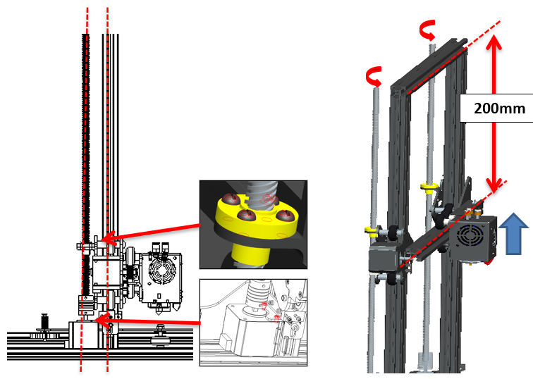
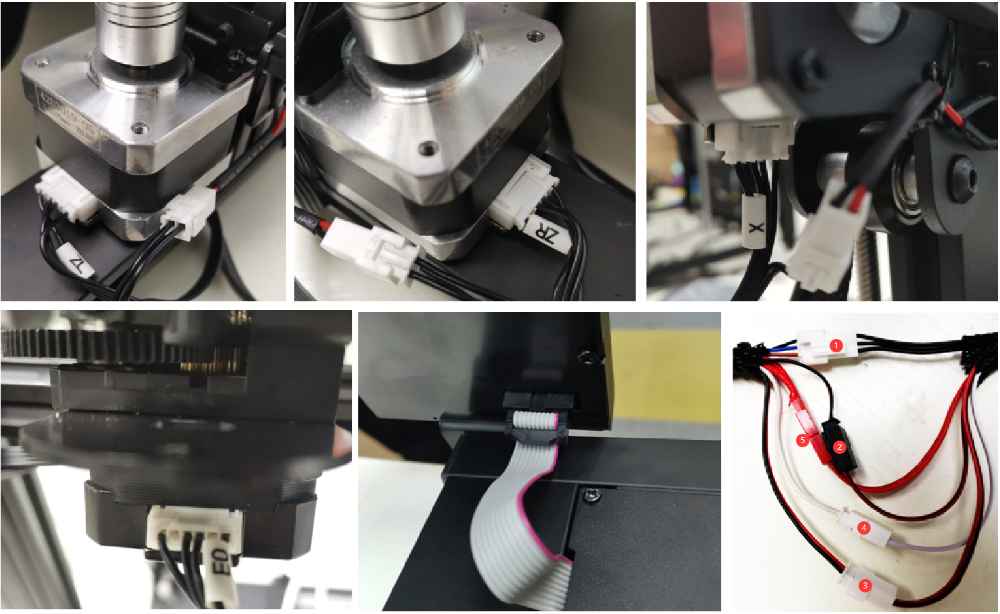

### :globe_with_meridians: Choose Language (Translated by google)

-----
# Z8P-MK2 Installation Guide
### [ :movie_camera: **Installation Video Tutorial**](https://youtu.be/-oieO7U0LCc)

-----
### :warning:ATTENTION:warning:
#### :clipboard:Please strictly follow the standard operation when installation.
#### :baby_bottle: Please put the printer away from the reach of kids.
#### :school: Must be guided by adults when children are installed or used.
#### :wrench: Take care when installation, to avoid electrical shock hazards.
#### :fire: Hotend has high temperature even the printer stop working.
#### :fire: Hotbed has high temperature even the printer stop working.
#### :ghost: Please keep well-ventilated condition! May produce toxic gases when printer working.
#### :electric_plug: Please make sure you have set the AC power select switch to the correct position before power on.

## Parts List
    
No.|         Name             | No.|              Name        | No.|              Name        | No.|              Name        |
---|--------------------------|----|--------------------------|----|--------------------------|----|--------------------------|
1  |        Base Module       | 2  |  Extruders (4x)          | 3  |Z-axis Motor Modules (x2) | 4  |  Lead screw & Profiles   |  
5  |Print head with X carrier | 6  |  Z carrier(left)         | 7  |   Z carrier(right)       | 8  |  TFT-LCD Contol Panel    |
9  | Accessories              | 10 |  Filament Roll Bracket   | 11 |  SD card(*)   | 12 |   Tools                  |
13 | USB cable                | 14 |  Power cord              |    |                          |    |                          | 

***SD Card is placed in the accessries(9) package.**

## Description of Item No.4 & No.9 
   

No.|                                                 Name                                               |
---|----------------------------------------------------------------------------------------------------|
1  | **Z Profiles:** 2* 2040 aluminum profiles for Z axis, the flat surface toward the front.           |
2  | These two holes on the bottom when install.                                                        |
3  | **Top Profile:** 1* 2020 aluminum profile installed to top.                                        |
4  | **X Profile:** 1* 2020 aluminum profile, there are 4 hole on the front and 2 big hole on the back. |
5  | **lead screws:** 2* T8-500mm lead screws ***(They are put inside the Z aluminum profiles)***.      |
    
     

No.|         Name             | No.|              Name        | No.|              Name        | No.|              Name        |
---|--------------------------|----|--------------------------|----|--------------------------|----|--------------------------|
1  |        4* PTFE Tube      | 2  |  Cable tie               | 3  |     2* Z ENDSTOP         | 4  |  2* Z lead blocks        |  
5  |   Nozzle (Spare part)    | 6  |  X Belt idler            | 7  |   X Timing Belt          | 8  |  Wheel (Spare part)    |

## Installation
### 1. Install Z axis Parts
    
:warning:NOTE:warning:
1. **The side with two holes on the bottom.**      
2. **The flat surface of profiles toward the front.**   
   
Install the Z ENDSTOPs to the side of Z profiles.
#### Layout Extruder’s Cable
   
Put the extruder cables into the groove behind the right Z profile and cover it with plastic profile covers. Note that a distance of 10mm should be left at the top and the cables should be pulled out.    
     
:warning:Note: **Adjust the eccentric cloumns let the carrier hold the rail well and move smoothly.**

### 2. Install X axis Parts
  
1. Install X belt idler to X profile 
2. Install X belt
3. Insert X carrier from the left side, keep the belt in the groove of X profile.
4. Fasten the belt to the hook of X carrier 
5. Move the belt to the center of the profile.   

  
1. Rotate the lead screws to keep the same height
2. Insert X idler to Z right carrier.
3. Hang the belt to the timing pulley.
4. Turn the wheel to let the belt in.
5. Fix X profile (Don’t tighten at first).
6. Fix the X idler.

### 3. Install LCD screen
  
1. Loosen the screw
2. Install the LCD screen

### 4. Install Extruders
Install the 4 extruders on the top profile.    
  

### 5. Install Filament Bracket
Install filament bracket on the top profile.    
  

### 6. Install PTFE tube
Connect the extrusion feeder with the print head (hot end) by filament guide (PTFE tube)   
  
1. Note: The PTFE tubes are a little longer than need, you can cut it by a knife if need.
2. Insert PTFE
3. Install clamp
4. Connect to Hotend

### 7. Debug the Z Movement system
  
Keep the lead screws parallel to the Z axis profiles as far as possible will help to obtain better printing quality, please debug them refer to the following steps:   
**Step 1. Loosen all the screws a little that fixed the Z motors and T8 copper nut.**   
**Step 2. Synchronous Rotate the couplings to move up the X axis to 1/2 height of the printer.**   
**Step 3. Keep the lead screws parallel to the Z profiles, then tighten the screws that fixed the Z motor and T8 copper nuts.**   

### 8. Install Z lead screws fixed module
Install the Z lead screws fix blocks on the top profile.

## Wiring
### Wiring Block
     
#### Rerfer to the below pictures to connect the wire/cables to the connector of printer, they are: 
- **left Z Motors/Endstops and right Z Motors/Endstops.**    
- **X motor/Endstop.**    
- **Extruder motors wires (E0-E1-E2-E3).** 
- **Hotend wires.**    
- **LCD cable**    
   

### Wiring Diagram

## Check before power on
#### :warning: It is very important to check the machine before power on. It can eliminate the trouble brought by some hardware to ensure the smooth printing!
#### Check list:
1. **Check if the X&Y axis timing pulley are fixed on the shaft of motor, and the couplings are fixed on the shaft of the Z motors.**
2. **Check if the lead screws have been fixed on the shaft of coupling.**
3. **Move the hot end and hotbed to their respective limit switch positions to check whether the contact is good and there is a clear sound. otherwise, please check the limit switch and reassemble it.**
4. **Manually move the hot end and hotbed to see if the movement is smooth, otherwise, adjust the eccentric nut until the motor moves smoothly. Refer to the installation procedure.**
5. **Check whether the X and Y-axis drive belt is firmly installed. If it is too loose, please try to tighten it.**
6. **Check whether the screw rod is assembled in place and whether the screw is tightened.**
7. **Manually rotate the z-axis motor couplings to check whether the z-axis limit switch contacts reliably.**
8. **Check if the AC power select switch to set to the correct position. City AC Voltage is 220V, set to [230]. City AC Voltage is 110V, set to [115].**   

## :fireworks: Congratulate! 
After completing the above installation steps, the machine installation is announced to be completed. You can arrange the wiring and fasten them to the frame of the machine with cable tie.
Next, just do some preliminary debugging, and you can start your first print. Please refer to the [**:point_right: quick user manual**](https://github.com/ZONESTAR3D/Z8P/blob/main/Z8P-MK2/2-Operation_Guide/readme.md) to prepare and start your first print.
