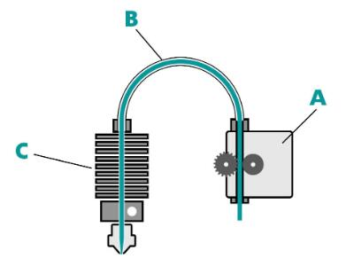
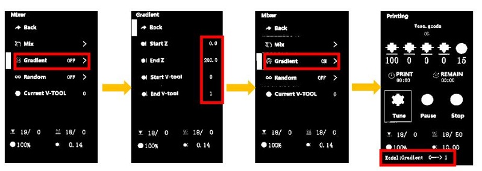
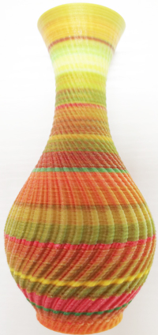

### Choose Language (Translated by google)

----
# Color Mixing Feature User Guide
The color mixing function is the characteristic of mixing different colored filaments and extruding them through the same nozzle to get a new color filament.By adjusting the extrude rate of each extruder, it can get different color filament.
The machine can achieve the following color mixing functions:
1. [**Manual color mixing function:**](#change-printing-color-by-adjust-mixing-rate) When printing from SD card, manually adjust the extrusion ratio of each extruder (it called [mixing ratio](#mixing-ratio)) through the LCD control panel during the printing process to change the printing color.
2. [**Gradient color mixing function:**](#gradient-mixing-printing) When printing from SD card, the gradient function is activated through the LCD control panel, allowing the machine to automatically change the [mixing ratio](#mixing-ratio) according to changes in printing height.
3. [**Random color mixing function:**](#random-mixing-printing) When printing from SD card, activate the random mix function through the LCD control panel, allowing the machine to randomly change the [mixing ratio](#mixing-ratio) when changing in printing height.
4. [**Multi color mixed printing function:**](#) Define a preset [mixing ratio](#mixing-ratio) as a ***virtual extruder*** to print 3D models that exceed the actual color of consumables used. For example, printing 8 color models using Z8PM4. At present, the machine can set up to 16 colors simultaneously.

-----
## Term explanation
#### Bowden extruder
A Bowden extruder is a type of extruder that pushes filament through a long and flexible PTFE tube (Bowden tube) to the hot end. ZONESTAR multi color 3d printers are used Bowden extruder. [:page_with_curl:wiki page](https://en.wikipedia.org/wiki/3D_printer_extruder)        
      
>
		A. Filament feeder mechanism   B. PTFE tube    C. Hot end
#### Extruder / Tool Chain
The extruder can refer to all the the extruder motor and hot end, or it can refer to the filament feeder mechanism. Whe we said extrusion feeder, it means the filament feeder mechanism.
In some slicing software, the extruer also be called "Tool Chain", "Tool head" or "Tool".For singel color or general multicolor printer, each extrusion feeder corresponds to one hot end / nozzle, so the number of tool chain is equal to the extrusion 
#### Mixing ratio
Distribute the length of the extruded filaments to different extruders to achieve color change during nozzle extrusion, and this ratio is called the extrusion mixing ratio. The value of mixing ratio should be between 0 and 100, and the sum of the ratios of each extruder cannot be less than 1 (>= 1).     
The ZONESTAR 3D printer supports setting the mixing ratio based on percentage or extruder ratio relationships. For example: "E1:E2:E3:E4 = 10:20:30:40" and "E1:E2:E3:E4 = 1:2:3:4" and "E1:E2:E3:E4 = 0.2:0.4:0.6:0.8" are equivalent. But when the mix ratio showed on LCD menus, they are always displayed at a percentage rate (sum = 100).
#### Virtual extruder / Virtual Tool / VTool
We can store a fixed mixing ratio of the actual extruders (to produce a new filament color) to a "new extruder", it called "virtual extruder", "Virtual Tool" or simply as "VTOOL". Now ZONESTAR mix color 3D printer support 16 "virtual extruders".
The machine has already setted the mixing ratios of the 16 virtual extruders when the machine left factory - default settings. you can change these mixing ratio any time, but after powering on, resetting the machine, or completing a normal printing, the machine will automatically reset to default.    
:warning: The default settings may different in the different firmware versions, please refer to the following instructions for details.

-----
## Change printing color by adjust mixing rate    
When printing from SD card, you can change the color mixing ratio of the extruders at any time, to change the filament color flowing out of the nozzle. The steps are as follows:     
- Start to print a singel color gcode file from SD card.
- Wait until the print start to print the first layer, and then set on the LCD menu. 
- **Tune>>Mixer>>Mix>>VTOOL: 0** set the Vtool to 0
- **Tune>>Mixer>>Mix>>Extruder1~4:** Adjust the percentage of extruder #1 to extruder #4, the range is 0 ~ 100.  
- **Tune>>Mixer>>Mix>>Comit:** Redistribute the percentage of all extruders in proportion and send it to the current vtool. 
After setting up, on the ideal menu shows Current **VTOOL = 0**

-----
## Gradient mixing printing
When printing from SD card, you can start a gradient mixing feature, to let the printer auto change the mixing ratio when printing height changed. The steps are as follows:    
[:clapper:Video tutorial](https://youtu.be/VOlXvy38aFs)    

- Start to print a one color gcode file from SD card.  
- Set the paremeters for auto gradient mix printing on the LCD menu when the printer start to to print the first layer.
- **Tune>>Mixer>>Gradient:OFF>>**
  - **Start Z:** set the start Z heigth(such as:0mm)      
  - **End Z:** set the END Z heigth(such as:200mm)     
  - **Start V-tool:** set the start V-tool(such as:0)        
  - **End V-tool:** set the end V-tool(such as:1)  
After set **Start Z** isn’t equal to **End Z**, and **Start V-tool** isn’t equal to **End V-tool**, the LCD will shows **Gradient : ON**.      
    
:warning:You can set this parameter multiple times when printing to different heights.
### Realize gradient mixing by modifing gcode file
You can also add a M166 command into the "start G-code" of slicing software, so it can automatically work when print from SD card.   
> 
	Descitpion of M166 command
	M166: Start a gradient mix  
	S[bool] - Enable / disable gradients
	A[float] - Starting Z for the gradient
	Z[float] - Ending Z for the gradient.
	I[index] - V-Tool to use as the starting mix.
	J[index] - V-Tool to use as the ending mix.
	
	For example: M166 S1 A0 Z200 I0 J1
	S1->Enable gradient mix 
	A0->startZ is 0mm 
	Z200-> EndZ is 200mm 
	I0 -> Start V-tool is 0 
	J1 -> End Vtool is 1
:warning:You can set this parameter multiple times when printing to different heights.

-----
## Random mixing printing

+ Start to print a singel color gcode file from SD card.  
+ Wait until the print start to print, set on the LCD menu. 
+ **Tune>>Mixer>>Random Mix: OFF>>**
	+ **Start Z:** Set the start Z heigth(such as:0mm) 
	+ **End Z:** Set the end Z heigth(such as:200mm)    
	+ **Height:** Set interval distance(such as:10mm), when printing heigth changed beyond this value, the mixing ratio be changed once.    
	+ **Extruders:** Set the number of extruders participating in printing(1~4). :warning: In particular, when the parameter is set to 1, all four extruders will participate in printing, but color mixing will not occur during printing. Instead, one of the extruders is randomly selected each time to print. 

After set Start Z isn’t equal to the End Z, the LCD will shows **Random : ON**.

### :star2: Realize Random mixing by modifing gcode file
You can also add a M167 command into the "start G-code" of the machine setting when slicing, so it can automatically work when print from SD card.  
> 
	Descitpion of M167 command.
	M167: Start a random mix.
	S[bool] - Enable / disable random mix.
	A[float] - Starting Z for the random.
	Z[float] - Ending Z for the random.
	H[float] - Minimum height of changing mixing rate.
	E[int] - how many extruders used on random mixing.

	For example: M167 S1 A0 Z100 H0.2 E3
	S1->Enable Random mix 
	A0->start Z heigth is 0mm 
	Z100->End Z heigth is 100mm 
	H0.2->change color every 0.2mm
	E3->3 extruders (Extruder#1 to Extruder#3) will be used