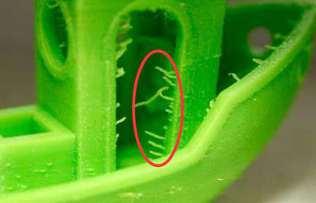
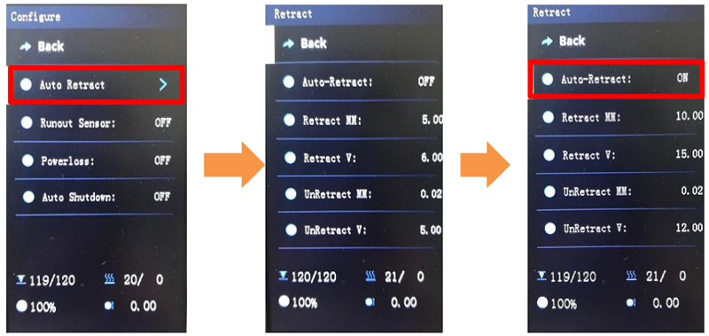
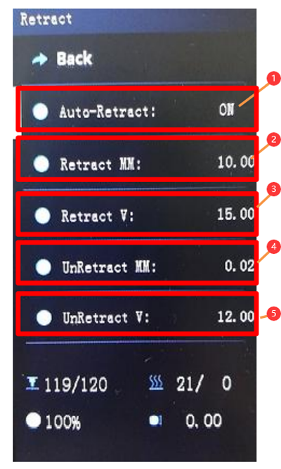

## <a id="choose-language">:globe_with_meridians: Choose language </a>

----
## <a id="en">Auto Retraction Feature Use Guide</a>
Due to the large mixing chamber of the 4-IN-1-OUT color mixing hot end - M4V6- used in Z8PM4Pro-MK2, it may cause more severe **String Issues** than the monochromatic hot end (fine threads will still flow out when the nozzle is empty). You can activate the Auto Retraction function to set better extraction parameters to improve this situation.    
:warning: NOTE: When you activate the Auto Retraction function, the pullback parameters you set during slicing will be replaced by the pullback parameters set on the LCD menu.    

#### What is strings issue?
 

### 1. Enable "Auto Retract" feature
Menu: Control>>Configre
##### 
### 2. Setting parameters if need
##### 
1. Turn ON / OFF auto retraction feature.      
2. Set retraction length (mm). 
3. Set retract speed (mm/s).
4. Set the overload filament length (mm) after retraction.
5. Set reload speed (mm/s).

----
## <a id="es">Guía de uso de la función de retracción automática</a> [:arrow_heading_up:](#choose-language)
Debido a la gran cámara de mezcla del extremo caliente de mezcla de colores 4 EN 1 SALIDA (M4V6) utilizado en Z8PM4Pro-MK2, puede causar **problemas de cuerdas** más graves que el extremo caliente monocromático (los hilos finos aún fluirán). cuando la boquilla está vacía). Puede activar la función de Retracción Automática para establecer mejores parámetros de extracción para mejorar esta situación.
:warning: NOTA: Cuando activa la función de retracción automática, los parámetros de retroceso que estableció durante el corte serán reemplazados por los parámetros de retroceso establecidos en el menú LCD.

#### ¿Qué es el problema de las cadenas?
 

### 1. Habilite la función "Retracción automática"
Menú: Control>>Configurar
##### 
### 2. Configuración de parámetros si es necesario
##### 
1. Active o desactive la función de retracción automática.
2. Establezca la longitud de retracción (mm).
3. Establezca la velocidad de retracción (mm/s).
4. Establezca la longitud del filamento de sobrecarga (mm) después de la retracción.
5. Establezca la velocidad de recarga (mm/s).

----
## <a id="pt">Guia de uso do recurso de retração automática</a> [:arrow_heading_up:](#choose-language)
Devido à grande câmara de mistura do hot end de mistura de cores 4-IN-1-OUT - M4V6 - usado no Z8PM4Pro-MK2, pode causar **Problemas de cordas** mais graves do que o hot end monocromático (fios finos ainda fluirão quando o bocal estiver vazio). Você pode ativar a função Auto Retração para definir melhores parâmetros de extração para melhorar esta situação.
:warning: NOTA: Quando você ativa a função de retração automática, os parâmetros de retrocesso definidos durante o corte serão substituídos pelos parâmetros de retrocesso definidos no menu LCD.

#### Qual é o problema das strings?
 

### 1. Ative o recurso "Retração automática"
Menu: Controle>>Configurar
##### 
### 2. Definir parâmetros se necessário
##### 
1. Ative/desative o recurso de retração automática.
2. Defina o comprimento de retração (mm).
3. Defina a velocidade de retração (mm/s).
4. Defina o comprimento do filamento de sobrecarga (mm) após a retração.
5. Defina a velocidade de recarga (mm/s).

----
## <a id="fr">Guide d'utilisation de la fonction de rétraction automatique</a> [:arrow_heading_up:](#choose-language)
En raison de la grande chambre de mélange de la partie chaude de mélange de couleurs 4-IN-1-OUT - M4V6- utilisée dans le Z8PM4Pro-MK2, cela peut causer des **problèmes de cordes** plus graves que la partie chaude monochromatique (les fils fins couleront toujours lorsque la buse est vide). Vous pouvez activer la fonction de rétraction automatique pour définir de meilleurs paramètres d'extraction afin d'améliorer cette situation.
:warning: REMARQUE : Lorsque vous activez la fonction de rétraction automatique, les paramètres de retrait que vous avez définis lors du tranchage seront remplacés par les paramètres de retrait définis dans le menu LCD.

#### Quel est le problème des chaînes ?
 

### 1. Activer la fonction "Rétraction automatique"
Menu : Contrôle>>Configurer
##### 
### 2. Paramétrage des paramètres si besoin
##### 
1. Activez/désactivez la fonction de rétraction automatique.
2. Réglez la longueur de rétraction (mm).
3. Réglez la vitesse de rétraction (mm/s).
4. Réglez la longueur du filament de surcharge (mm) après rétraction.
5. Réglez la vitesse de rechargement (mm/s).

----
## <a id="de">Gebrauchsanleitung für die automatische Rückzugsfunktion</a> [:arrow_heading_up:](#choose-language)
Aufgrund der großen Mischkammer des 4-IN-1-OUT-Farbmisch-Hot-Ends (M4V6), das im Z8PM4Pro-MK2 verwendet wird, kann es zu schwerwiegenderen **Saitenproblemen** kommen als beim monochromatischen Hot-End (feine Fäden fließen immer noch). aus, wenn die Düse leer ist). Sie können die Funktion „Auto Retraction“ aktivieren, um bessere Extraktionsparameter festzulegen und diese Situation zu verbessern.
:warning: HINWEIS: Wenn Sie die automatische Rückzugsfunktion aktivieren, werden die Rückzugsparameter, die Sie während des Schneidens eingestellt haben, durch die Rückzugsparameter ersetzt, die im LCD-Menü eingestellt sind.

#### Was ist ein String-Problem?
 

### 1. Aktivieren Sie die Funktion „Auto Retract“.
Menü: Steuerung>>Konfigurieren
##### 
### 2. Parameter bei Bedarf einstellen
##### 
1. Schalten Sie die Funktion zum automatischen Einfahren ein bzw. aus.
2. Rückzugslänge (mm) einstellen.
3. Rückzugsgeschwindigkeit einstellen (mm/s).
4. Stellen Sie die Länge des Überlastfadens (mm) nach dem Zurückziehen ein.
5. Nachladegeschwindigkeit einstellen (mm/s).

----
## <a id="it">Guida all'uso della funzione di ritrazione automatica</a> [:arrow_heading_up:](#choose-language)
A causa dell'ampia camera di miscelazione dell'hot end di miscelazione dei colori 4-IN-1-OUT - M4V6- utilizzato in Z8PM4Pro-MK2, potrebbe causare **problemi alle corde** più gravi rispetto all'hotend monocromatico (i fili sottili continueranno a scorrere fuori quando l'ugello è vuoto). È possibile attivare la funzione di ritrazione automatica per impostare parametri di estrazione migliori per migliorare questa situazione.
:warning: NOTA: quando si attiva la funzione di ritrazione automatica, i parametri di pullback impostati durante lo slicing verranno sostituiti dai parametri di pullback impostati nel menu LCD.

#### Qual è il problema delle stringhe?
 

### 1. Abilita la funzione "Ritiro automatico".
Menu: Controllo >>Configura
##### 
### 2. Impostazione dei parametri, se necessario
##### 
1. Attiva/disattiva la funzione di ritrazione automatica.
2. Impostare la lunghezza di retrazione (mm).
3. Impostare la velocità di ritrazione (mm/s).
4. Impostare la lunghezza del filamento di sovraccarico (mm) dopo la retrazione.
5. Impostare la velocità di ricarica (mm/s).

----
## <a id="ru">Руководство по использованию функции автоматического возврата</a> [:arrow_heading_up:](#choose-language)
Из-за большой смесительной камеры горячего конца смешивания цветов 4-В-1-OUT (M4V6), используемого в Z8PM4Pro-MK2, это может вызвать более серьезные **проблемы со струнами**, чем монохроматический горячий конец (тонкая резьба по-прежнему будет течь). выходит, когда сопло пусто). Вы можете активировать функцию автоматического втягивания, чтобы установить лучшие параметры извлечения и улучшить эту ситуацию.
:warning: ПРИМЕЧАНИЕ. Когда вы активируете функцию автоматического отвода, параметры отвода, установленные вами во время нарезки, будут заменены параметрами отвода, установленными в меню ЖК-дисплея.

#### Что такое проблема со строками?
 

### 1. Включите функцию «Автоматическое втягивание».
Меню: Управление>>Настроить
##### 
### 2. Настройка параметров при необходимости
##### 
1. Включите/выключите функцию автоматического втягивания.
2. Установите длину втягивания (мм).
3. Установите скорость втягивания (мм/с).
4. Установите длину нити перегрузки (мм) после втягивания.
5. Установите скорость перезарядки (мм/с).

----
## <a id="jp">自動格納機能使用ガイド</a> [:arrow_heading_up:](#choose-language)
Z8PM4Pro-MK2 で使用されている 4-IN-1-OUT カラーミキシングホットエンド - M4V6- のミキシングチャンバーが大きいため、単色ホットエンドよりも深刻な **ストリングの問題** が発生する可能性があります (細い糸が流れ続けます) ノズルが空になると出ます）。 この状況を改善するには、自動撤回機能を有効にして、より適切な抽出パラメータを設定します。
:warning: 注: 自動リトラクト機能を有効にすると、スライス中に設定したプルバック パラメータは、LCD メニューで設定したプルバック パラメータに置き換えられます。

#### 文字列の問題とは何ですか?
 

### 1.「自動撤回」機能を有効にする
メニュー: コントロール>>設定
##### 
### 2. 必要に応じてパラメータを設定する
##### 
1. 自動格納機能をON/OFFします。
2. 後退長さ (mm) を設定します。
3. 後退速度 (mm/s) を設定します。
4. 引込み後の過負荷フィラメント長さ (mm) を設定します。
5. リロード速度 (mm/s) を設定します。

----
## <a id="kr">자동 철회 기능 사용 안내</a> [:arrow_heading_up:](#choose-language)
Z8PM4Pro-MK2에 사용되는 4-IN-1-OUT 컬러 믹싱 핫엔드(M4V6)의 대형 믹싱 챔버로 인해 단색 핫엔드보다 더 심각한 **스트링 문제**를 일으킬 수 있습니다(미세한 실이 계속 흐릅니다) 노즐이 비어 있으면 꺼집니다). 이 상황을 개선하기 위해 더 나은 추출 매개변수를 설정하려면 자동 후퇴 기능을 활성화할 수 있습니다.
:warning: 참고: 자동 후퇴 기능을 활성화하면 슬라이싱 중에 설정한 풀백 매개변수가 LCD 메뉴에서 설정한 풀백 매개변수로 대체됩니다.

#### 문자열 이슈란 무엇인가요?
 

### 1. "자동 철회" 기능을 활성화합니다.
메뉴: 제어>>구성
##### 
### 2. 필요한 경우 매개변수 설정
##### 
1. 자동 철회 기능을 ON/OFF 하세요.
2. 수축 길이(mm)를 설정합니다.
3. 후퇴 속도(mm/s)를 설정합니다.
4. 후퇴 후 과부하 필라멘트 길이(mm)를 설정합니다.
5. 재장전 속도(mm/s)를 설정합니다.

----
## <a id="ar">دليل استخدام ميزة السحب التلقائي</a> [:arrow_heading_up:](#choose-language)
نظرًا لغرفة الخلط الكبيرة للطرف الساخن لخلط الألوان 4-IN-1-OUT - M4V6- المستخدم في Z8PM4Pro-MK2، فقد يتسبب ذلك في **مشكلات في السلسلة** أكثر خطورة من الطرف الساخن أحادي اللون (ستستمر الخيوط الدقيقة في التدفق عندما تكون الفوهة فارغة). يمكنك تفعيل وظيفة التراجع التلقائي لتعيين معلمات استخراج أفضل لتحسين هذا الوضع.
:warn: ملاحظة: عند تنشيط وظيفة التراجع التلقائي، سيتم استبدال معلمات السحب التي قمت بتعيينها أثناء التقطيع بمعلمات السحب المحددة في قائمة LCD.

#### ما هي مشكلة السلاسل؟
 

### 1. تمكين ميزة "السحب التلقائي".
القائمة: التحكم >> التكوين
##### 
### 2. تحديد المعلمات إذا لزم الأمر
##### 
1. تشغيل/إيقاف ميزة التراجع التلقائي.
2. اضبط طول التراجع (مم).
3. اضبط سرعة التراجع (مم/ثانية).
4. اضبط طول فتيل التحميل الزائد (مم) بعد التراجع.
5. اضبط سرعة إعادة التحميل (مم/ثانية).