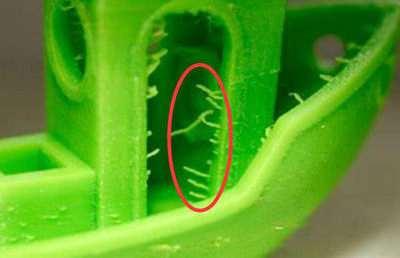
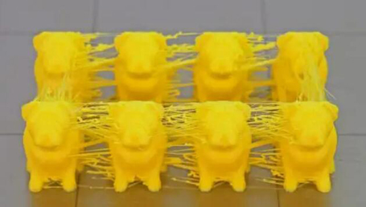

## Auto Retraction Feature Use Guide
Due to the large mixing chamber of the 4-IN-1-OUT color mixing hot end - M4V6- used in Z8PM4Pro-MK2, it may cause more severe **String Issues** than the monochromatic hot end (fine threads will still flow out when the nozzle is empty). You can activate the Auto Retraction function to set better extraction parameters to improve this situation.    
:warning:NOTE: When you activate the Auto Retraction function, the pullback parameters you set during slicing will be replaced by the pullback parameters set on the LCD menu.    

#### What is strings issue?
 

### 1. Enable "Auto Retract" feature
Menu: Control>>Configre

### 2. Setting parameters if need

1. Turn ON / OFF auto retraction feature.      
2. Set retraction length (mm). 
3. Set retract speed (mm/s).
4. Set the overload filament length (mm) after retraction.
5. Set reload speed (mm/s).
