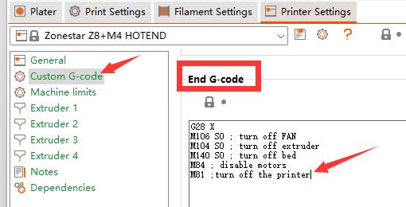

## <a id="choose-language">:globe_with_meridians: Choose language </a>

----
## <a id="en">Automatic shutdown after printing completion Feature User Guide</a>
### Enable the feature on LCD screen 
You can turn on the auto shut down feature on LCD sceen, after turned on it, the machine will shut down automatically:
1. In a non printing state, you did not perform any operations through the display knob within 15 minutes.
2. After the SD card printing is completed, the hot bed and hot end issues cool down to below the safe temperature for 15 minutes.      
##### 
### Turn on the printer after print finish by adding command
You can add a "M81" gcode command in the End G-code of the slicing software, it can turn off the printer after print finished.      
##### 

----
## <a id="es">Guía del usuario para la función de apagado automático después de completar la impresión</a> [:arrow_heading_up:](#choose-language)
### Activar esta función en la pantalla LCD
Puede activar la función de apagado automático en la pantalla LCD; después de activarla, la máquina se apagará automáticamente:
1. En un estado sin impresión, no realizó ninguna operación a través de la perilla de pantalla en 15 minutos.
2. Una vez completada la impresión de la tarjeta SD, la base caliente y el extremo caliente se enfrían por debajo de la temperatura segura durante 15 minutos.
##### 
### Encienda la impresora después de finalizar la impresión agregando el comando
Puede agregar un comando gcode "M81" en el código G final del software de corte; puede apagar la impresora una vez finalizada la impresión.
##### 

----
## <a id="pt">Desligamento automático após conclusão de impressão Característica Guia do usuário</a> [:arrow_heading_up:](#choose-language)
### Activar a funcionalidade no ecrã LCD
Você pode ativar o recurso de desligamento automático na tela LCD, depois de ligá-lo, a máquina desligará automaticamente:
1. Sem impressão, você não executou nenhuma operação no botão do display em 15 minutos.
2. Depois que a impressão do cartão SD for concluída, a base quente e a extremidade quente esfriam abaixo da temperatura segura por 15 minutos.
##### 
### Ligue a impressora após o término da impressão adicionando o comando
Você pode adicionar um comando gcode "M81" no código G final do software de fatiamento, ele pode desligar a impressora após o término da impressão.
##### 

----
## <a id="fr">Guide de l'utilisateur de la fonction d'arrêt automatique une fois l'impression terminée</a> [:arrow_heading_up:](#choose-language)
### Activer la fonction sur l'écran LCD
Vous pouvez activer la fonction d'arrêt automatique sur l'écran LCD, après l'avoir allumée, la machine s'éteindra automatiquement :
1. En état de non-impression, vous n’avez effectué aucune opération via le bouton d’affichage dans les 15 minutes.
2. Une fois l'impression de la carte SD terminée, les problèmes du lit chaud et de l'extrémité chaude refroidissent en dessous de la température de sécurité pendant 15 minutes.
##### 
### Allumez l'imprimante une fois l'impression terminée en ajoutant une commande
Vous pouvez ajouter une commande gcode "M81" dans le code G de fin du logiciel de découpage, cela peut éteindre l'imprimante une fois l'impression terminée.
##### 

----
## <a id="de">Automatisches Herunterfahren nach Abschluss des Druckvorgangs Benutzerhandbuch</a> [:arrow_heading_up:](#choose-language)
### Aktivieren Sie die Funktion auf dem LCD-Bildschirm
Sie können die automatische Abschaltfunktion auf dem LCD-Bildschirm aktivieren. Nach dem Einschalten schaltet sich das Gerät automatisch ab:
1. Sie haben in einem nicht druckenden Zustand innerhalb von 15 Minuten keine Bedienung über den Anzeigeknopf vorgenommen.
2. Nachdem der SD-Kartendruck abgeschlossen ist, kühlen das heiße Bett und die Hot-End-Ausgaben 15 Minuten lang auf unter die sichere Temperatur ab.
##### 
### Schalten Sie den Drucker nach Abschluss des Druckvorgangs ein, indem Sie einen Befehl hinzufügen
Sie können im End-G-Code der Slicing-Software einen „M81“-Gcode-Befehl hinzufügen, der den Drucker nach Abschluss des Drucks ausschalten kann.
##### 

----
## <a id="it">Interruzione automatica dopo la funzionalità di completamento della stampa</a> [:arrow_heading_up:](#choose-language)
### Abilita la funzione sullo schermo LCD
È possibile attivare la funzione di spegnimento automatico sullo schermo LCD, dopo averla accesa, la macchina si spegnerà automaticamente:
1. In stato di non stampa, non è stata eseguita alcuna operazione tramite la manopola del display entro 15 minuti.
2. Una volta completata la stampa della scheda SD, il letto caldo e l'estremità calda si raffreddano al di sotto della temperatura sicura per 15 minuti.
##### 
### Accendere la stampante al termine della stampa aggiungendo il comando
È possibile aggiungere un comando gcode "M81" nel codice G finale del software di slicing, può spegnere la stampante al termine della stampa.
##### 

----
## <a id="ru">Автоматическое выключение после печати Руководство пользователя</a> [:arrow_heading_up:](#choose-language)
### Включить эту функцию на экране LCD
Вы можете включить функцию автоматического выключения на ЖК-экране. После ее включения машина автоматически выключится:
1. В непечатающем состоянии вы не выполняли никаких операций с помощью ручки дисплея в течение 15 минут.
2. После завершения печати SD-карты горячий стол и горячий конец охлаждаются до температуры ниже безопасной в течение 15 минут.
##### 
### Включите принтер после завершения печати, добавив команду
Вы можете добавить команду gcode «M81» в конец G-кода программного обеспечения для нарезки, она может отключить принтер после завершения печати.
##### 

----
## <a id="jp">印刷完了後の自動シャットダウン機能のユーザーガイド</a> [:arrow_heading_up:](#choose-language)
### LCD画面でこの機能を有効にする
LCD 画面の自動シャットダウン機能をオンにすることができます。オンにすると、マシンは自動的にシャットダウンします。
1. 非印刷状態で、15 分間表示ノブを操作しなかった場合。
2. SD カードの印刷が完了した後、ホット ベッドとホット エンドは 15 分間安全温度未満に冷却されます。
##### 
### コマンドを追加して印刷終了後にプリンターの電源をオンにします
スライシング ソフトウェアの終了 G コードに「M81」 gcode コマンドを追加すると、印刷終了後にプリンターの電源をオフにすることができます。
##### 

----
## <a id="kr">인쇄 완료 후 자동 종료 기능 사용 설명서</a>  [:arrow_heading_up:](#choose-language)
### LCD 화면에서 이 기능 활성화
LCD 화면에서 자동 종료 기능을 켤 수 있습니다. 기능을 켠 후 기기가 자동으로 종료됩니다.
1. 인쇄되지 않은 상태에서 15분 이내에 디스플레이 손잡이를 통한 어떠한 조작도 수행하지 않았습니다.
2. SD 카드 프린팅이 완료되면 핫베드와 핫엔드 이슈가 15분 동안 안전 온도 이하로 냉각됩니다.
##### 
### 명령을 추가하여 인쇄가 끝난 후 프린터를 켭니다.
슬라이싱 소프트웨어의 최종 G 코드에 "M81" gcode 명령을 추가하면 인쇄가 완료된 후 프린터를 끌 수 있습니다.
##### 

----
## <a id="ar">دليل المستخدم التلقائي إيقاف وظيفة بعد الانتهاء من الطباعة</a> [:arrow_heading_up:](#choose-language)
### تمكين هذه الميزة على شاشات الكريستال السائل
يمكنك تشغيل ميزة إيقاف التشغيل التلقائي على شاشة LCD، وبعد تشغيلها سيتم إيقاف تشغيل الجهاز تلقائيًا:
1. في حالة عدم الطباعة، لم تقم بإجراء أي عمليات من خلال مقبض الشاشة خلال 15 دقيقة.
2. بعد الانتهاء من طباعة بطاقة SD، يتم تبريد الطبقة الساخنة والطرف الساخن إلى أقل من درجة الحرارة الآمنة لمدة 15 دقيقة.
##### 
### قم بتشغيل الطابعة بعد انتهاء الطباعة عن طريق إضافة أمر
يمكنك إضافة أمر gcode "M81" في رمز End G لبرنامج التقطيع، ويمكنه إيقاف تشغيل الطابعة بعد انتهاء الطباعة.
##### 

