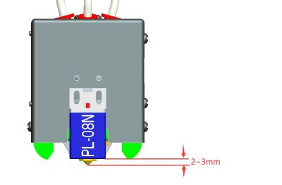
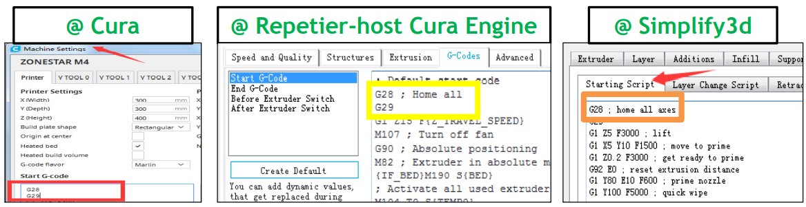

## <a id="choose-language">:globe_with_meridians: Choose language </a>

<!--  -->

----
## Benutzerhandbuch zur automatischen Bettnivellierung
#### :warning: Bitte beachten Sie:
1. Bitte überprüfen Sie, ob Sie die Exzentersäule an der Maschine wie in der Installationsanleitung beschrieben eingestellt haben. Um sicherzustellen, dass das Produkt beim Transport nicht beschädigt wird, stellen wir die Exzentersäule werkseitig auf eine relativ lockere Position ein. Sie müssen sie anpassen, insbesondere die exzentrische Säule der Heißbetthalterung, um sicherzustellen, dass das Heißbett keine nennenswerten Erschütterungen erfährt. Einzelheiten finden Sie auf [dieser Seite][EXZENTRISCH].
2. Bitte achten Sie auf die Überprüfung der Einbaulage des Nivelliergeräts. Die Unterseite des Sensors sollte **2 ~ 3 mm** höher sein als die Düse. PS: Wenn Sie **einen PEI-Federaufkleber aufgerüstet** haben, sollte dieser **4~5 mm** höher sein als die Düse.

3. Befolgen Sie bei der automatischen Bettnivellierung bitte die folgenden Schritte Schritt für Schritt: **[Ecken nivellieren](#step1)>>[Z-Versatz der Fangsonde](#step2)>>[Bettnivellierung](#step3)** .
4. Beim Drucken des ersten Objekts nach der automatischen Bettnivellierung müssen Sie den Z-Versatz beim Drucken der ersten Ebene anpassen * (Der Cursor zeigt auf das Menü „Tune“ und drücken Sie dann zweimal den Knopf, um ein **Babystep**-Menü aufzurufen , beobachten Sie die Höhe zwischen der Düse und dem heißen Bett und drehen Sie den Knopf, um die entsprechende Position einzustellen)*. Sobald die Anpassung abgeschlossen ist, müssen Sie beim nächsten Druck keine weiteren Anpassungen vornehmen.
5. Sobald Sie die Schrauben, mit denen das Heizbett befestigt ist, manuell anpassen, ein heißes Ende ersetzen, den Nivellierungssensor neu installieren oder andere Aktionen ausführen, die zu Änderungen des Werts von **Z Probe Offset** führen können, müssen Sie alle Schritte zur Bettnivellierung wiederholen wieder.

-----
### <a id="step1"> :one: Ecken nivellieren</a>
:loudspeaker: Die automatische Bettnivellierungsfunktion wird verwendet, um den relativen Versatz verschiedener Positionen auf dem heißen Bett auf der Höhe der Z-Achse zu korrigieren, nicht den absoluten Wert. Bevor Sie die automatische Bettnivellierung ausführen, müssen Sie **Ecken nivellieren** durchführen, damit die Maschine einen korrekten Absolutwert des Startpunkts der Z-Achse erhält (dies ist der sogenannte **absolute Nullpunkt der Z-Achse** der Maschine). Schritte wie folgt:
##### Schritt 1: Schalten Sie den 3D-Drucker ein und führen Sie dann „Vorbereiten>>Auto Home>>Home All“ im LCD-MENÜ aus. Warten Sie, bis sich das Hotend in der HOME-Position befindet.
##### Schritt 2: Ziehen Sie die Handmuttern unter dem Bett fest, um das Bett in die unterste Position zu bewegen (Abb. 1).
##### Schritt 3: Führen Sie „Vorbereiten >> Bettnivellierung >> Punkt 1“ auf dem Bedienfeld aus (Abb. 2). Die Düse geht zu den Ecken des Betts. Lösen Sie die Handmuttern unter dem Brutbett (Abb. 3). und lassen Sie die Düse fast das Brutbett berühren (Abb. 4). Fahren Sie mit „Punkt 2/3/4“ fort, bis alle vier Ecken geebnet sind.
##### Schritt 4: Wiederholen Sie Schritt 3 und machen Sie 2–3 Runden, bis alle vier Ecken auf der gleichen Höhe sind.

### <a id="step2"> :two: Catch Probe Z-Offset</a>
Führen Sie **Prepare>> Bed Leveling>>Catch Z-Offsetn** durch, um den **Probe Z Offset** zu erhalten, bevor Sie die automatische Bettnivellierung durchführen.
###### 
:warning: Führen Sie ***Control>> Configure>> Auto Leveling*** aus, um die **bed auto leveling feature** zu aktivieren, wenn Sie dieses Menü nicht gesehen haben.
###### 
:warning: Wenn der Bettnivellierungssensor das Hotbed nicht prüfen kann, bevor Z ENDSTOP ausgelöst wird, wird auf dem LCD-Bildschirm „Probing Fail“ angezeigt. Der Grund könnte sein, dass: 1: Die Installationsposition des Bettnivellierungssensors zu hoch ist, ②Bettnivellierungssensor nicht richtig mit der Steuerplatine verbunden ist oder sogar ③Bettnivellierungssensor durchgebrannt ist.
##### :pushpin: Was ist Probe Z Offset?
**"Probe Z Offset"** gibt an, dass der Abstand zwischen der Düse und dem absoluten Nullpunkt der Z-Achse der Abstand zwischen der Düse und dem absoluten Nullpunkt ist, als der Sensor das heiße Bett erkannte.
Wenn der Sensor richtig installiert ist, befindet sich die Düse immer über dem heißen Bett, wenn der Sensor das heiße Bett erkannt hat, sodass **Probe Z Offset** immer ein negativer Wert ist. Da der Erfassungsabstand jedes PL-08N-Sensors unterschiedlich ist und auch die tatsächliche Installationshöhe des PL-08N unterschiedlich ist, ist auch der **Probe Z Offset** jeder Maschine unterschiedlich.

### <a id="step3"> :three: Bettnivellierung </a>
Nach Abschluss der oben genannten Schritte verfügen wir über einen zuverlässigen Sensor zur Messung der Brutfläche und können bereits alle Parameter einstellen. Jetzt muss die Maschine eine umfassende Messung der Oberfläche des Heißbetts durchführen, um ein Datenblatt über die Höhe des Heißbetts auf der Oberfläche zu erhalten.
**Prepare>> Bed Leveling>>Auto Leveling**
###### 
Nachdem die Messung abgeschlossen ist, ändert sich der Status der automatischen Nivellierung im Nivellierungsmenü von **-NA-** zu **Actived**.

### :four: Verifizierung
Jetzt können Sie versuchen, eine Testdatei auszudrucken, um das Ergebnis der automatischen Bettnivellierung zu überprüfen. Schritte wie folgt:
1. Kopieren Sie **[level_test_310.gcode :arrow_down:](./level_test_310.zip)** auf die SD-Karte und drucken Sie es von der SD-Karte aus (Abb. 1).
2. Wenn der Druckvorgang gestartet ist, doppelklicken Sie (klicken Sie zweimal pro Sekunde) auf den Knopf, um das Baby-Z-Offset-Menü zu öffnen (Abb. 2).
3. Drehen Sie den Knopf, um die Düsenhöhe fein einzustellen, und lassen Sie das Filament gut auf dem Heizbett kleben (Abb. 3).
4. Beobachten Sie das Druckergebnis (Abb. 4).
###### 

-----
### Aktive automatische Nivellierung nach dem Zurücksetzen des Druckers
Die automatische Nivellierungsfunktion wird beim Zurücksetzen des Druckers automatisch deaktiviert. Sie können sie manuell über den LCD-Bildschirm aktivieren.
- **Schritt 1. Menu>>Prepare>>Auto Home**
- **Schritt 2. Motion>> Control>>Configure>>Active autolevel: ON**
HINWEIS: Nachdem Sie diese beiden Schritte ausgeführt haben, wendet der Drucker gespeicherte Nivellierungskorrekturparameter auf die letzte „Bettebene“ an.
###### 

### Automatische Nivellierung des Bettes vor jedem Druck
Wenn Sie möchten, dass der Drucker bei jedem Druck eine automatische Bettnivellierung durchführt, müssen Sie einen „G29“-Befehl im „Start Gcode“ der Druckereinstellungen der Slicing-Software hinzufügen.
###### 
##### :pushpin: Bitte beachten
1. Die Verwendung von G29 ersetzt nur die Funktionalität in Schritt 3, daher müssen Sie auch die Schritte 1 und 2 manuell ausführen.
2. Sobald Sie die Schrauben, mit denen das Heizbett befestigt ist, manuell anpassen, ein Hotend ersetzen, die Höhe des Nivellierungssensors anpassen und andere Aktionen ausführen, die zu Änderungen des Werts von „Z Probe Offset“ führen können, müssen Sie auch die Schritte 1 und wiederholen Schritte 2 manuell.

[ECCENTRIC]: https://github.com/ZONESTAR3D/Z8P/tree/main/Z8P-MK2/1-Installation_Guide#8-tune-the-eccentric-columns