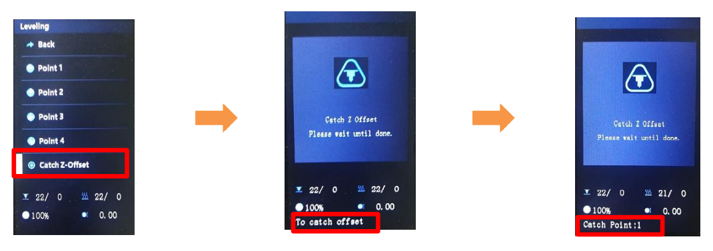
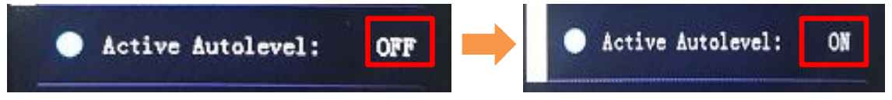

## <a id="choose-language">:globe_with_meridians: Choose language </a>

<!--  -->

----
## Guía del usuario de nivelación automática de la cama
#### :warning: Tenga en cuenta:
1. Compruebe si ha ajustado la columna excéntrica de la máquina como se menciona en el manual de instalación. Para garantizar que el producto no se dañe durante el transporte, ajustamos la columna excéntrica a una posición relativamente suelta en la fábrica. Es necesario ajustarlos, especialmente la columna excéntrica del soporte de la cama caliente, para garantizar que la cama caliente no tenga sacudidas significativas. Para obtener más información, consulte [esta página][ECCENTRIC].
2. Preste atención a verificar la posición de instalación del dispositivo nivelador. La parte inferior del sensor debe estar **2 ~ 3 mm** más alta que la boquilla. PD: Si **actualizó una etiqueta de resortes PEI**, debe ser **4~5 mm** más alta que la boquilla.

3. Cuando realice la nivelación automática de la cama, siga estos pasos paso a paso: **[Nivel de esquinas](#step1)>>[Desplazamiento Z de la sonda de captura](#step2)>>[Nivelación de la cama](#step3)** .
4. Al imprimir el primer objeto después de realizar la nivelación automática de la cama, debe ajustar el desplazamiento Z al imprimir la primera capa *(el cursor apunta al menú Tune, luego presione la perilla dos veces para que aparezca un menú **Babystep** , observe la altura entre la boquilla y la cama caliente, y gire la perilla para ajustarla a la posición adecuada)*. Una vez completado el ajuste, no es necesario realizar más ajustes durante la siguiente impresión.
5. Una vez que ajuste manualmente los tornillos que fijaron la cama térmica, reemplace un extremo caliente, reinstaló el sensor de nivelación u otras acciones que puedan causar cambios en el valor de **"Z Probe Offset"**, debe repetir todos los pasos de nivelación de la cama. de nuevo.

-----
### <a id="step1"> :one: Esquinas niveladas</a>
:loudspeaker: La función de nivelación automática de la cama se utiliza para corregir el desplazamiento relativo de diferentes posiciones en la cama caliente a la altura del eje Z, no el valor absoluto. Antes de ejecutar la nivelación automática de la cama, debe realizar **Nivel de esquinas** para que la máquina obtenga un valor absoluto correcto del punto inicial del eje Z (se denomina **punto cero absoluto del eje Z** de la máquina). Pasos como se muestra a continuación:
##### Paso 1: Encienda la impresora 3D y luego haga "Preparar>>Inicio automático>>Inicio todo" en el MENÚ LCD, espere que el hotend vaya a la posición INICIO.
##### Paso 2: Apriete las tuercas manuales debajo de la cama para bajar la cama a la posición más baja (Fig. 1).
##### Paso 3: Haga “Preparar>> Nivelación de la cama>> Punto 1” en el panel de control (Fig. 2), la boquilla irá a las esquinas de la cama, afloje las tuercas manuales debajo de la cama caliente (Fig. 3) y deje que la boquilla casi toque el foco (Fig. 4). Continúe haciendo el “Punto 2/3/4” hasta que se hayan nivelado las 4 esquinas.
##### Paso 4: Repita el paso 3 y haga 2 ~ 3 rondas, hasta que las cuatro esquinas estén a la misma altura.

### <a id="step2"> :two: Desplazamiento Z de la sonda de captura</a>
Haga **Preparar>> Nivelación de la cama>>Capturar compensación Z** para obtener la **Compensación Z de la sonda** antes de realizar la nivelación automática de la cama.
###### 
:warning: Haga ***Control>> Configurar>> Nivelación automática*** para activar la **función de nivelación automática de la cama** si no vio este menú.
###### 
:warning: Si el sensor de nivelación de la cama no puede sondear la cama caliente antes de que se active Z ENDSTOP, mostrará "fallo de sonda" en la pantalla LCD. La razón tal vez sea porque: uno: La posición de instalación del sensor de nivelación de la cama es demasiado alta, ②el sensor de nivelación de la cama no se conecta bien con el tablero de control o incluso ③el sensor de nivelación de la cama está quemado.
##### :pushpin: ¿Qué es el "Desplazamiento Z de la sonda"?
**"Compensación Z de la sonda"** indica que cuando el sensor detectó la cama caliente, la distancia entre la boquilla y el punto cero absoluto del eje Z.
Si el sensor está instalado correctamente, la boquilla siempre está encima de la cama caliente cuando el sensor detecta la cama caliente, por lo que **Compensación Z de la sonda** es siempre un valor negativo. Dado que la distancia de detección de cada sensor PL-08N es diferente y la altura de instalación real del PL-08N también es diferente, el **Desplazamiento Z de la sonda** de cada máquina también es diferente.

### <a id="step3"> :three: Nivelación de la cama </a>
Después de completar los pasos anteriores, tenemos un sensor confiable para medir la superficie del foco y ya configuramos todos sus parámetros. Ahora necesitamos que la máquina realice una medición exhaustiva de la superficie de la cama caliente, para obtener una hoja de datos de la altura de la cama caliente en la superficie.
Haga **Preparar>>Nivelación de cama>>Nivelación automática**
###### 
Una vez realizada la medición, el estado de nivelación automática en el menú Nivelación cambiará de **--NA---** a **Activado**.

### :four: Verificación
Ahora puede intentar imprimir un archivo de prueba para verificar el resultado de la nivelación automática de la cama. Pasos como se muestra a continuación:
1. Copie **[level_test_310.gcode:arrow_down:](./level_test_310.zip)** a la tarjeta SD e imprímalo desde la tarjeta SD (Fig. 1).
2. Cuando comience la impresión, haga doble clic (haga clic dos veces en un segundo) en la perilla para abrir el menú de compensación Baby Z (Fig. 2).
3. Gire la perilla para ajustar con precisión la altura de la boquilla, deje que el filamento se pegue muy bien al calentador (Fig. 3).
4. Observe el resultado de la impresión (Fig. 4).
###### 

-----
### Nivelación automática activa después del reinicio de la impresora
La función de nivelación automática se desactivará automáticamente cuando se reinicie la impresora; puede activarla manualmente desde la pantalla LCD.
- **Paso 1. Menú>>Preparar>> Inicio automático**
- **Paso 2. Movimiento>> Control>> Configurar>>Nivel automático activo: ON**
NOTA: Después de realizar estos 2 pasos, la impresora aplicará los parámetros de corrección de nivelación almacenados en el último "nivel de la cama".
###### 

### Nivelación automática de la cama antes de cada impresión
Si desea que la impresora realice la nivelación automática de la cama para cada impresión, debe agregar un comando "G29" en el "Iniciar Gcode" de la configuración de la impresora del software de corte.
###### 
##### :pushpin: tenga en cuenta
1. El uso de G29 solo reemplaza la funcionalidad del paso 3, por lo que también deberá completar manualmente los pasos 1 y 2.
2. Una vez que ajuste manualmente los tornillos que fijaron la base térmica, reemplace un extremo caliente, ajuste la altura del sensor de nivelación y otras acciones que puedan causar cambios en el valor de "Compensación de la sonda Z", también deberá repetir los pasos 1 y pasos 2 manualmente.

[ECCENTRIC]: https://github.com/ZONESTAR3D/Z8P/tree/main/Z8P-MK2/1-Installation_Guide#8-tune-the-eccentric-columns