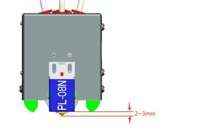
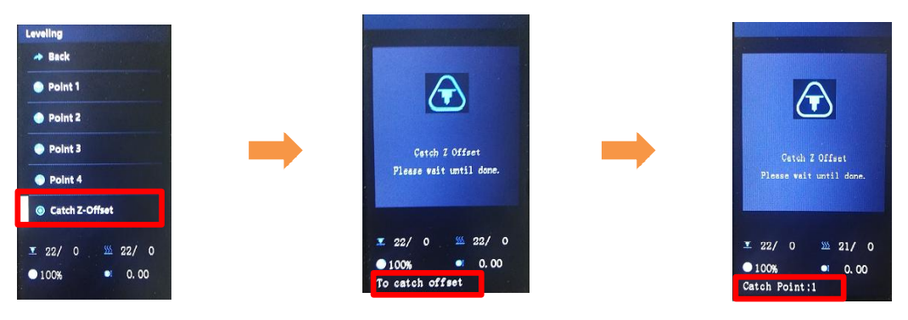
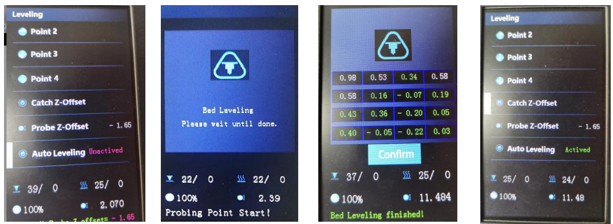
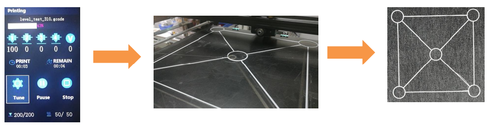
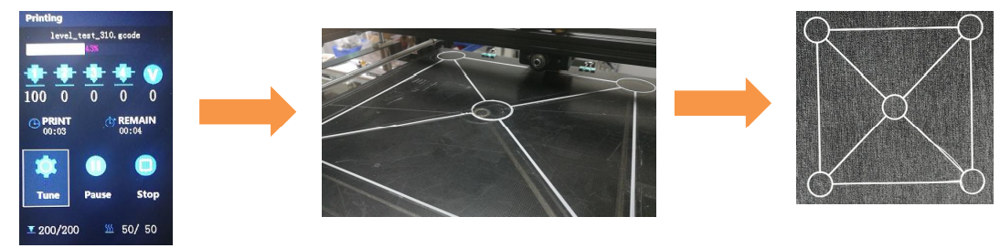
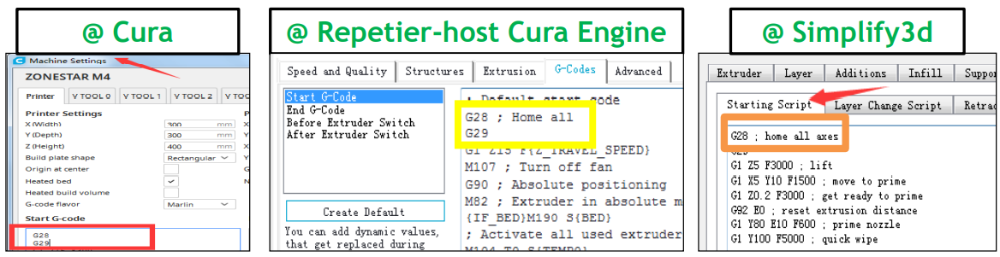

## <a id="choose-language">:globe_with_meridians: Choose language </a>

<!--  -->

----
## ベッド自動レベリング ユーザーガイド
#### :warning: 注意
1. 設置マニュアルに記載されているように、機械の偏心コラムが調整されているかどうかを確認してください。 輸送中に製品が破損しないように、工場では偏心柱を比較的緩めの位置に調整しています。 ホットベッドに大きな揺れが生じないように、特にホットベッドブラケットの偏心柱を調整する必要があります。 詳細は[こちらのページ][ECCENTRIC]をご参照ください。
2. レベリング装置の取り付け位置の確認には十分ご注意ください。 センサーの底面はノズルより **2 ～ 3mm** 高くする必要があります。 PS: **PEI スプリング ステッカー**をアップグレードした場合は、ノズルより **4 ～ 5mm** 高くする必要があります。

3. ベッドの自動レベリングを行う場合は、次の手順を段階的に実行してください: **[レベルコーナー](#step1)>>[キャッチプローブ Z オフセット](#step2)>>[ベッドレベリング](#step3)** 。
4. ベッドの自動レベリングを行った後に最初のオブジェクトを印刷する場合、最初のレイヤーを印刷するときに Z オフセットを調整する必要があります (*カーソルは **Tune** メニューを指し、ノブを 2 回押して をポップアップ表示します **Babystep** メニューでは、ノズルとホットベッドの間の高さを観察し、ノブを回して適切な位置に調整します*)。 一度調整が完了すると、次回印刷時はそれ以上の調整は必要ありません。
5. ヒート ベッドを固定したネジを手動で調整したり、ホット エンドを交換したり、レベリング センサーを再取り付けしたり、**Z Probe Offset(Z プローブ オフセット)** の値を変更する可能性のあるその他の操作を行ったりした場合は、すべてのベッド レベリング手順を再度繰り返す必要があります。

-----
### <a id="step1"> :one: レベル コーナー</a>
:loudspeaker: 自動ベッド レベリング機能は、絶対値ではなく、Z 軸高さにおけるホット ベッド上のさまざまな位置の相対オフセットを修正するために使用されます。 ベッドオートレベリングを実行する前に、**レベルコーナー**を実行して、機械に Z 軸の開始点の正しい絶対値 (いわゆる機械の **Z 軸絶対零点**) を取得させる必要があります。 以下の手順:
##### ステップ 1: 3D プリンターの電源をオンにして、LCD メニューで「Prepare>>Auto Home>>Home All」を実行し、ホットエンドがホーム位置に移動するのを待ちます。
##### ステップ 2: ベッドの下のハンド ナットを締めて、ベッドを最も低い位置まで下げます (図 1)。
##### ステップ 3: コントロール パネルで「Prepare>> Bed leveling>> Point 1」を実行します (図 2)。ノズルがベッドの隅に移動し、ホットベッドの下にあるハンド ナットを緩めます (図 3)。 ノズルがホットベッドにほぼ接触するようにします (図 4)。 4つの角がすべて水平になるまで「ポイント2/3/4」を続けます。
##### ステップ 4: ステップ 3 を繰り返し、四隅がすべて同じ高さになるまで 2 ～ 3 回繰り返します。

### <a id="step2"> :two: キャッチ プローブの Z オフセット</a>
ベッドの自動レベリングを実行する前に、**Prepare>>Bed Leveling>>Catch Z-Offset**を実行して **Probe Z Offset**を取得します。
###### 
:warning: このメニューが表示されない場合は、**Control>>Configure>>Auto Leveling***を実行して**ベッドの自動レベリング機能**をオンにしてください。
###### 
:warning: Z ENDSTOP がトリガーされる前にベッド レベリング センサーがホットベッドをプローブできない場合、LCD 画面に「probing fail」と表示されます。 原因としては、1. ベッドレベリングセンサーの取り付け位置が高すぎる、2. ベッドレベリングセンサーが制御基板とうまく接続されていない、あるいは. 3. ベッドレベリングセンサーが切れている、などが考えられます。
##### :pushpin: 「プローブ Z オフセット」とは何ですか?
**Probe Z Offset** は、センサーがホット ベッドを感知したときの、ノズルと Z 軸の絶対ゼロ点の間の距離を示します。
センサーが正しく取り付けられている場合、センサーがホット ベッドを感知したとき、ノズルは常にホット ベッドの上にあるため、**Probe Z Offset** は常に負の値になります。 各PL-08Nセンサーの検出距離が異なり、PL-08Nの実際の設置高さも異なるため、各機械の**Probe Z Offset**も異なります。

### <a id="step3"> :three: ベッドのレベリング </a>
上記の手順を完了すると、ホットベッドの表面を測定する信頼性の高いセンサーが得られ、そのすべてのパラメーターがすでに設定されています。 ここで、表面上のホット ベッドの高さのデータ シートを取得するために、マシンでホット ベッドの表面を包括的に測定する必要があります。
**Prepare>>Bed Leveling>>Auto Leveling**を実行してください
###### 
測定が完了すると、レベリングメニューの自動レベリングの状態が **-NA-** から **アクティブ** に変わります。

### :four: 検証
ここで、テスト ファイルを印刷して、ベッドの自動レベリングの結果を確認してみることができます。 以下の手順:
1. **[level_test_310.gcode :arrow_down:](./level_test_310.zip)** を SD カードにコピーし、SD カードから印刷します (図 1)。
2. 印刷が開始されたら、ノブをダブルクリック（1 秒間に 2 回クリック）して、Baby Z オフセット メニューを開きます（図 2）。
3. ノブを回してノズルの高さを微調整し、フィラメントをホットベッドによく貼り付けます (図 3)。
4. 印刷結果を確認します (図 4)。
###### 

-----
### プリンターのリセット後のアクティブな自動レベリング
自動レベリング機能は、プリンターがリセットされると自動的に無効になります。LCD 画面から手動でオンにすることができます。
- **Step 1. Menu>>Prepare>>Auto Home**
- **Step 2. Motion>>Control>>Configure>>Active autolevel: ON**
注: これら 2 つの手順を実行すると、プリンタは保存されているレベリング補正パラメータを最後の「ベッド レベル」に適用します。
###### 

### 各印刷前のベッドの自動水平調整
印刷ごとにプリンターに自動レベリングを行わせたい場合は、スライスソフトウェアのプリンター設定の「Start Gcode」に「G29」コマンドを追加する必要があります。
###### 
##### :pushpin: 注意してください
1. G29 を使用すると、ステップ 3 の機能が置き換えられるだけなので、ステップ 1 とステップ 2 も手動で完了する必要があります。
2. ヒートベッドを固定しているネジを手動で調整し、ホットエンドを交換し、レベリングセンサーの高さを調整し、「Z プローブオフセット」の値を変更する可能性のあるその他の操作を行ったら、ステップ 1 と 2 を繰り返す必要もあります。 手順2を手動で行います。

----

[ECCENTRIC]: https://github.com/ZONESTAR3D/Z8P/tree/main/Z8P-MK2/1-Installation_Guide#8-tune-the-eccentric-columns