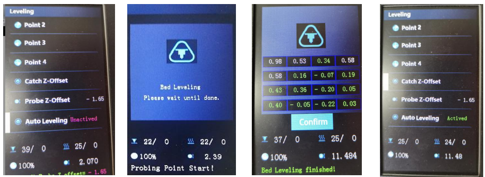

## <a id="choose-language">:globe_with_meridians: Choose language </a>

<!--  -->

----
## Guia do usuário de nivelamento automático da cama
#### :warning: Atenção:
1. Verifique se você ajustou a coluna excêntrica da máquina conforme mencionado no manual de instalação. Para garantir que o produto não será danificado durante o transporte, ajustamos a coluna excêntrica para uma posição relativamente solta na fábrica. É necessário ajustá-los, principalmente a coluna excêntrica do suporte da cama quente, para garantir que a cama quente não sofra oscilações significativas. Para obter detalhes, consulte [esta página][ECCENTRIC].
2. Preste atenção ao verificar a posição de instalação do dispositivo de nivelamento. A parte inferior do sensor deve ser **2 ~ 3 mm** mais alta que o bico. PS: Se você **atualizou um adesivo de molas PEI**, ele deve ser **4~5mm** mais alto que o bico.

3. Ao fazer o nivelamento automático da cama, siga estas etapas passo a passo: **[Cantos de nível](#step1)>>[Deslocamento Z da sonda de captura](#step2)>>[Nivelamento da cama](#step3)** .
4. Ao imprimir o primeiro objeto após o nivelamento automático da cama, você precisa ajustar o deslocamento Z ao imprimir a primeira camada *(o cursor aponta para o menu Tune e, em seguida, pressione o botão duas vezes para abrir um menu **Babystep** , observe a altura entre o bico e a cama quente e gire o botão para ajustar na posição apropriada)*. Uma vez concluído o ajuste, não será necessário fazer mais ajustes durante a próxima impressão.
5. Depois de ajustar manualmente os parafusos que fixam a cama térmica, substituir um hot end, reinstalar o sensor de nivelamento ou outras ações que possam causar alterações no valor de **"Z Probe Offset"**, você deve repetir todas as etapas de nivelamento da cama de novo.

-----
### <a id="step1"> :one: Cantos de nível</a>
:loudspeaker: A função de nivelamento automático da cama é usada para corrigir o deslocamento relativo de diferentes posições na cama quente na altura do eixo Z, não o valor absoluto. Antes de executar o Nivelamento Automático da Cama, você deve executar **Nivelar Cantos** para fazer com que a máquina obtenha um valor absoluto correto do ponto inicial do eixo Z (é chamado de **ponto zero absoluto do eixo Z** da máquina). Etapas abaixo:
##### Passo 1: Ligue a impressora 3D e depois faça “Prepare>>Auto Home>>Home All” no LCD MENU, espere o hotend ir para a posição HOME.
##### Etapa 2: Aperte as porcas manuais sob a cama para descer a cama até a posição mais baixa (Fig 1).
##### Passo 3: Faça “Preparar>> Nivelamento da cama>> Ponto 1” no painel de controle (Fig 2), o bico irá para os cantos da cama, afrouxe as porcas manuais sob o viveiro (Fig 3) e deixe o bico quase tocar no viveiro (Fig 4). Continue fazendo o “Ponto 2/3/4” até que todos os 4 cantos estejam nivelados.
##### Passo 4: Repita o Passo 3 e faça 2 ~ 3 voltas, até que todos os quatro cantos estejam na mesma altura.

### <a id="step2"> :two: captura o deslocamento Z da sonda</a>
Faça **Prepare>> Nivelamento da Cama>>Captura Z-Offset** para obter o **Deslocamento Z da Sonda** antes de fazer o nivelamento automático da cama.

:warning: Faça ***Controle>> Configurar>> Nivelamento automático*** para ativar o **recurso de nivelamento automático da cama** se você não viu este menu.

:warning: Se o sensor de nivelamento da cama não conseguir sondar a estufa antes que Z ENDSTOP seja acionado, ele mostrará "falha na sondagem" na tela LCD. A razão talvez seja porque: :1: A posição de instalação do sensor de nivelamento da cama é muito alta, o sensor de nivelamento da cama não se conecta bem com a placa de controle ou até mesmo o sensor de nivelamento da cama está queimado.
##### :pushpin: O que é "Deslocamento Z da Sonda"?
**"Probe Z Offset"** indica que quando o sensor detectou o leito quente, a distância entre o bico e o ponto zero absoluto do eixo Z.
Se o sensor estiver instalado corretamente, o bocal estará sempre acima da cama quente quando o sensor detectou a cama quente, portanto **Desvio Z da sonda** é sempre um valor negativo. Como a distância de detecção de cada sensor PL-08N é diferente e a altura real de instalação do PL-08N também é diferente, o **Deslocamento Z da sonda** de cada máquina também é diferente.

### <a id="step3"> :three: Nivelamento da cama </a>
Após concluir as etapas acima, temos um sensor confiável para medir a superfície do viveiro e já definir todos os seus parâmetros. Agora precisamos que a máquina faça uma medição abrangente da superfície da cama quente, de modo a obter uma folha de dados da altura da cama quente na superfície.
Faça **Preparar>> Nivelamento da Cama>>Nivelamento Automático**

Após a medição ser realizada, o estado do nivelamento automático no menu Nivelamento mudará de **--NA---** para **Ativado**.

### :four: Verificação
Agora você pode tentar imprimir um arquivo de teste para verificar o resultado do nivelamento automático da cama. Etapas abaixo:
1. Copie **[level_test_310.gcode :arrow_down:](./level_test_310.zip)** para o cartão SD e imprima-o a partir do cartão SD (Fig 1).
2. Ao iniciar a impressão, clique duas vezes (clique duas vezes em um segundo) no botão para abrir o menu Baby Z offset (Fig 2).
3. Gire o botão para ajustar a altura do bico, deixe o filamento colado muito bem no viveiro (Fig 3).
4. Observe o resultado da impressão(Fig 4).

-----
### Nivelamento automático ativo após a reinicialização da impressora
### <a id="step1"> :one: Cantos de nível</a>
:loudspeaker: A função de nivelamento automático da cama é usada para corrigir o deslocamento relativo de diferentes posições na cama quente na altura do eixo Z, não o valor absoluto. Antes de executar o Nivelamento Automático da Cama, você deve executar **Nivelar Cantos** para fazer com que a máquina obtenha um valor absoluto correto do ponto inicial do eixo Z (é chamado de **ponto zero absoluto do eixo Z** da máquina). Etapas abaixo:
##### Passo 1: Ligue a impressora 3D e depois faça “Prepare>>Auto Home>>Home All” no LCD MENU, espere o hotend ir para a posição HOME.
##### Etapa 2: Aperte as porcas manuais sob a cama para descer a cama até a posição mais baixa (Fig 1).
##### Passo 3: Faça “Preparar>> Nivelamento da cama>> Ponto 1” no painel de controle (Fig 2), o bico irá para os cantos da cama, afrouxe as porcas manuais sob o viveiro (Fig 3) e deixe o bico quase tocar no viveiro (Fig 4). Continue fazendo o “Ponto 2/3/4” até que todos os 4 cantos estejam nivelados.
##### Passo 4: Repita o Passo 3 e faça 2 ~ 3 voltas, até que todos os quatro cantos estejam na mesma altura.

### <a id="step2"> :two: captura o deslocamento Z da sonda</a>
Faça **Prepare>> Nivelamento da Cama>>Captura Z-Offset** para obter o **Deslocamento Z da Sonda** antes de fazer o nivelamento automático da cama.
###### 
:warning: Faça ***Controle>>Configurar>>Nivelamento automático*** para ativar o **recurso de nivelamento automático da cama** se você não viu este menu.
###### 
:warning: Se o sensor de nivelamento da cama não conseguir sondar a estufa antes que Z ENDSTOP seja acionado, ele mostrará "falha na sondagem" na tela LCD. A razão talvez seja porque: :1: A posição de instalação do sensor de nivelamento da cama é muito alta, o sensor de nivelamento da cama não se conecta bem com a placa de controle ou até mesmo o sensor de nivelamento da cama está queimado.
##### :pushpin: O que é "Deslocamento Z da Sonda"?
**"Probe Z Offset"** indica que quando o sensor detectou o leito quente, a distância entre o bico e o ponto zero absoluto do eixo Z.
Se o sensor estiver instalado corretamente, o bocal estará sempre acima da cama quente quando o sensor detectou a cama quente, portanto **Desvio Z da sonda** é sempre um valor negativo. Como a distância de detecção de cada sensor PL-08N é diferente e a altura real de instalação do PL-08N também é diferente, o **Deslocamento Z da sonda** de cada máquina também é diferente.

### <a id="step3"> :three: Nivelamento da cama </a>
Após concluir as etapas acima, temos um sensor confiável para medir a superfície do viveiro e já definir todos os seus parâmetros. Agora precisamos que a máquina faça uma medição abrangente da superfície da cama quente, de modo a obter uma folha de dados da altura da cama quente na superfície.
Faça **Preparar>> Nivelamento da Cama>>Nivelamento Automático**
###### 
Após a medição ser realizada, o estado do nivelamento automático no menu Nivelamento mudará de **--NA---** para **Ativado**.

### :four: Verificação
Agora você pode tentar imprimir um arquivo de teste para verificar o resultado do nivelamento automático da cama. Etapas abaixo:
1. Copie **[level_test_310.gcode :arrow_down:](./level_test_310.zip)** para o cartão SD e imprima-o a partir do cartão SD (Fig 1).
2. Ao iniciar a impressão, clique duas vezes (clique duas vezes em um segundo) no botão para abrir o menu Baby Z offset (Fig 2).
3. Gire o botão para ajustar a altura do bico, deixe o filamento colado muito bem no viveiro (Fig 3).
4. Observe o resultado da impressão(Fig 4).
###### 

-----
### Nivelamento automático ativo após a reinicialização da impressora
O recurso de nivelamento automático será desativado automaticamente quando a impressora for reiniciada. Você pode ativá-lo manualmente na tela LCD.
- **Etapa 1. Menu>>Preparar>> Auto Home**
- **Etapa 2. Movimento>> Controle>>Configurar>>Active autolevel: ON**
NOTA: Após realizar estas 2 etapas, a impressora aplicará os parâmetros de correção de nivelamento armazenados no último “nível da cama”.
###### 

### Nivelamento automático da cama antes de cada impressão
Se você deseja que a impressora faça o nivelamento automático para cada impressão, você precisa adicionar um comando "G29" no "Iniciar Gcode" das configurações da impressora do software de fatiamento.
###### 
##### :pushpin: Por favor, note
1. O uso do G29 substitui apenas a funcionalidade da etapa 3, portanto, você também precisa concluir manualmente as etapas 1 e 2.
2. Depois de ajustar manualmente os parafusos que fixam a cama térmica, substituir um hot end, ajustar a altura do sensor de nivelamento e outras ações que podem causar alterações no valor de "Z Probe Offset", você também precisa repetir as etapas 1 e passos 2 manualmente.

[ECCENTRIC]: https://github.com/ZONESTAR3D/Z8P/tree/main/Z8P-MK2/1-Installation_Guide#8-tune-the-eccentric-columns