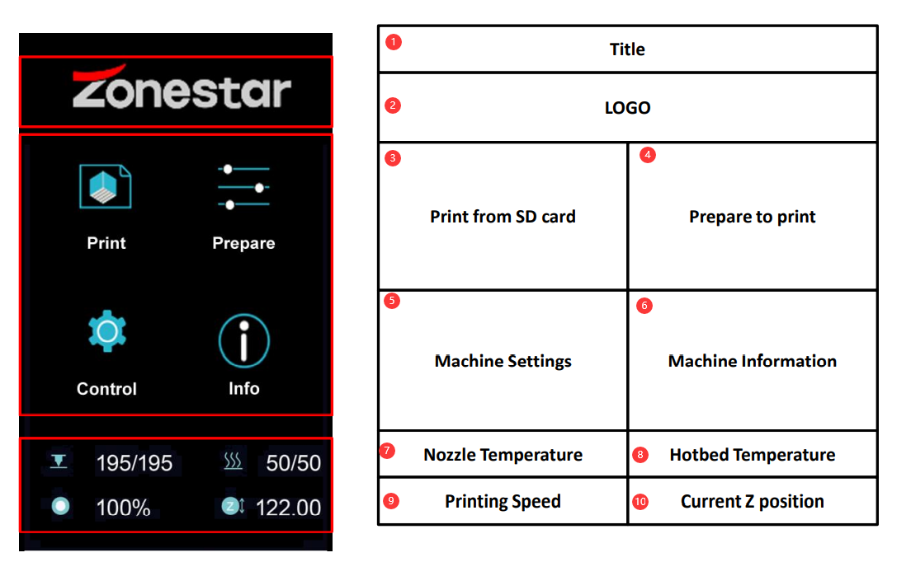
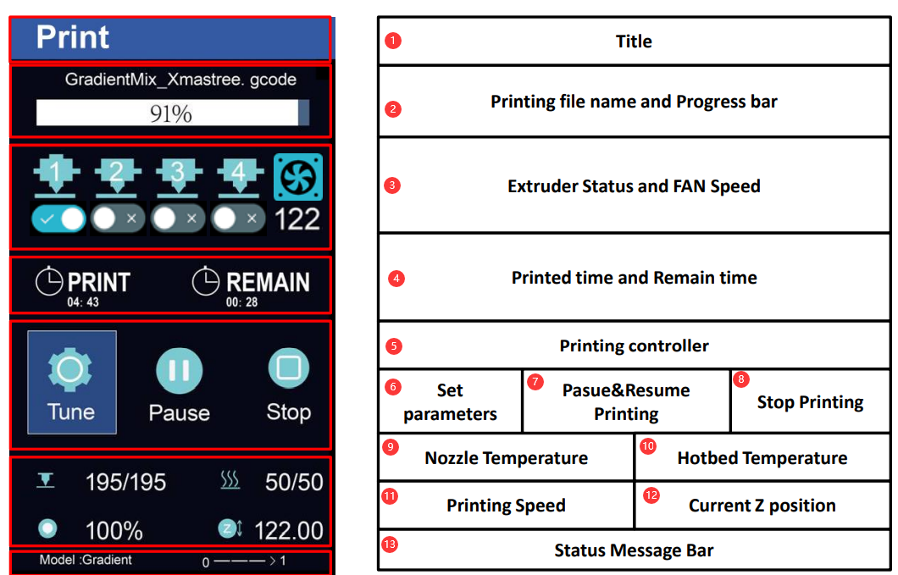
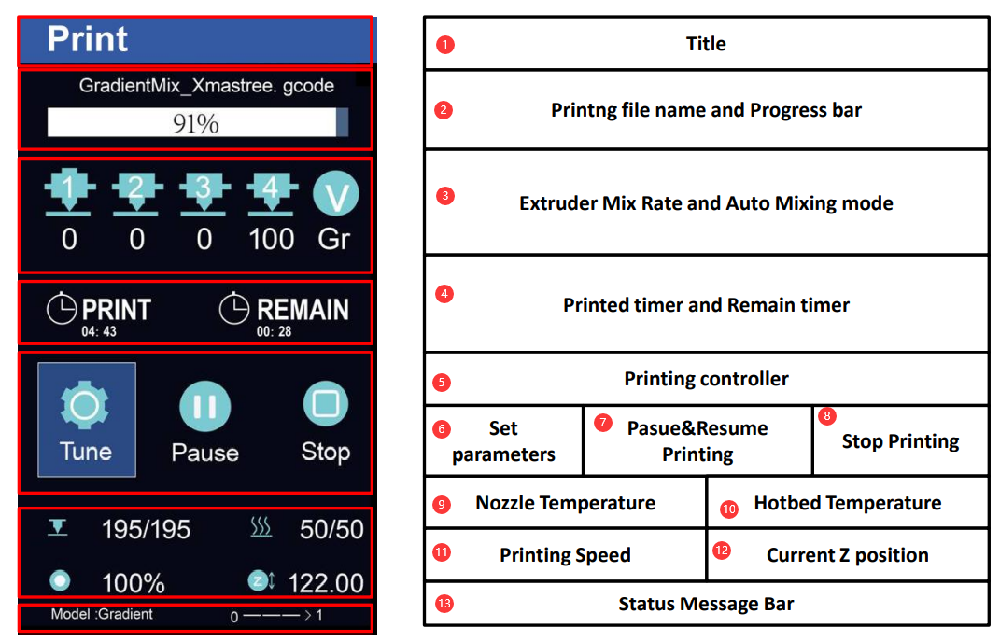

## Language (Translated by googel)

-----
# DWIN LCD Menu Description (MENU V3)
## Main Menu

>
    1. Title              2. LOGO                 3.Print from SD card          4.Prepare to print         5.Machine Settings    
    6.Machine Information 7. Nozzle Temperature   8.Hotbed Temperature          9.Printing Speed          10.Current Z position

## Printing status Menu 
### When Hotend Type is “Non-mixing”

>
    1.Title                2.Printing file name and Progress bar    3.Extruder Status and FAN Speed   4.Printed time and Remain time
    5.Printing controller  6.Set parameters                         7. Pasue&Resume Printing          8.Stop Printing
    9.Nozzle Temperature  10.Hotbed Temperature                    11.Printing Speed                 12.Current Z position
    13.Status Message Bar 

### When Hotend Type is “Mixing”

>
    1.Title                2.Printing file name and Progress bar    3.Extruder Mix Rate and Auto Mixing mode  4.Printed time and Remain time
    5.Printing controller  6.Set parameters                         7. Pasue&Resume Printing                  8.Stop Printing
    9.Nozzle Temperature  10.Hotbed Temperature                    11.Printing Speed                         12.Current Z position
    13.Status Message Bar 

## Menu Tree
### Prepare Menu
~~~
Prepare
  |
  |--Auto Home--------|--HOME ALL                   HOME all axis at once
  |                   |--HOME X                     HOME X axis
  |                   |--HOME Y                     HOME Y axis
  |                   |--HOME Z                     HOME Z axis
  |
  |--Temperature------|--Nozzle Temp                Set hotend(Nozzle) Temperature
  |                   |--Bed Temp                   Set Hotbed Temperature
  |                   |--Fan Speed                  Set Extuder FAN speed
  |                   |--PreHeat PLA                Set Nozzle/Hotbed temperature for PLA filament(See “control >>Preheat PLA”)
  |                   |--PreHeat ABS                Set Nozzle/Hotbed temperature for ABS filament(See “control >>Preheat ABS”)
  |                   |--Cooldown                   Turn off Power of Hotend and Hotbed at once
  |
  |--Move-------------|--Move X                     Move X axis
  |                   |--Move Y                     Move Y axis
  |                   |--Move Z                     Move Z axis
  |                   |--Extruder1                  Move Extruder#1
  |                   |--Extruder2                  Move Extruder#2
  |                   |--Extruder3                  Move Extruder#3
  |                   |--Extruder4                  Move Extruder#4
  |                   |--Extruder All               Move all extruder motors at the same time
  |
  |--Filament---------|--Preheat nozzle             Preheat the nozzle to the setting temperature
  |                   |--Extruder                   Choose which extruder you need to operative
  |                   |--Slowly length              How long filament be load/unload while do “Slowly Load“ & “lowly Unload”
  |                   |--Quickly length             How long filament be load/unload while do “Quickly Load “ & “ Quickly Unload“
  |                   |--Slowly Load                Load filament slowly
  |                   |--Slowly Unload              Unload filament slowly
  |                   |--Quickly Load               Load filament quickly
  |                   |--Quickly Unload             Unload filament quickly
  |
  |--Bed Leveling-----|--Point1                     Move nozzle to the bed corner 1 (left-front)
  |                   |--Point2                     Move nozzle to the bed corner 2 (right-front)
  |                   |--Point3                     Move nozzle to the bed corner 3 (right-back)
  |                   |--Point4                     Move nozzle to the bed corner 4 (left-back)
  |                   |--HOME All                   HOME all axis at once
  |                   |--Catch Probe Z-offset       Auto catch the probe Z offset
  |                   |--Probe Z-Offset             Adjust the probe Z offset
  |                   |--Auto leveling              Do auto leveling measure
  |
  |--Language---------|--English                    Set menu language to English
  |                   |--Spainish                   Set menu language to Spainish
  |                   |--Russian                    Set menu language to Russian
  |                   |--French                     Set menu language to French
  |                   |--Portuguese                 Set menu language to Portuguese
  |
  |--Disable Steppers                               Turn off the motors power
  |--Power off                                      Turn off the machine

~~~

### Control Menu
~~~
Control
  |
  |--Mixer*-----------|--Mix                          Set mix rates of each extruder and commit to V-TOOL
  |                   |--Gradient(ON/OFF)             Start a Gradient mix printing and set paremeters
  |                   |--Random (ON/OFF)              Start a Random mix printing and set paremeters
  |                   |--Current V-TOOL               Set current(working) V-TOOL
  |  
  | *Display only when “Control>> Configure >>Hotend type: mixing”, see “Control>>Configure
  |
  |--Configre---------|--Auto Retract                 Set Auto Retraction parameters
  |                   |--Runout Sensor                Turn ON/OFF filament run out detection feature
  |                   |--PowerLoss Recovery           Turn ON/OFF Power lost Recovery feature
  |                   |--Auto Shutdown                Turn ON/OFF idel auto shut down feature
  |                   |--WiFi                         Turn ON/OFF WiFi feature
  |                   |--WiFi BaudRate                Set WiFi BaudRate (Need restart printer and change the WiFi module BaudRate)
  |                   |--Hotend Type                  Set Hot end types (according to your hot end type)
  |                   |--Extr. Sequence               Change Extruder Sequence (only work on Non-Mixing Color hotend)
  |                   |--Home Z offset                Set the Z HOME offset
  |                   |--Auto Leveling                Turn ON/OFF bed auto leveling feature
  |                   |--Active Auto Level            Active bed auto leveling correct when printing
  |                   |--Hotend PID                   Set the hotend PID parameters
  |
  |--Motion-----------|--Feedrate                     Set printing speed limiting parameters
  |                   |--Acceleration                 Set acceleration limiting parameters
  |                   |--Jerk                         Set Jerk parameters
  |                   |--Step/mm                      Set Steps/mm parameters of stepping motors
  |
  |--Preheat PLA------|--Nozzle Temp                  Set nozzle temperaturewhen do “Preheat PLA” on Prepare menu
  |                   |--Bed Temp                     Set Bed temperature when do “Preheat PLA” on Prepare menu
  |                   |--Fan Speed                    Set FAN speed when do “Preheat PLA” on Prepare menu
  |                   |--Store Settings               Store above settings
  |
  |--Preheat ABS------|--Nozzle Temp                  Set nozzle temperaturewhen do “Preheat ABS” on Prepare menu
  |                   |--Bed Temp                     Set Bed temperature when do “Preheat ABS” on Prepare menu
  |                   |--Fan Speed                    Set FAN speed when do “Preheat ABS” on Prepare menu
  |                   |--Store Settings               Store above settings
  |
  |--Store Settings                                   Save the settings
  |--Load Settings                                    Load the settings from NVRAM (maybe it has been changed by Gcode command)
  |--Restore Default                                  Reset NVRAM settings to the factory status

~~~

### Tune Menu
Tune menu only display when the machine is printing
~~~
Tune
  |
  |--Speed                                            Set the ratio of printing speed
  |--Flow Rate                                        Set the flow rate of extruder
  |--Nozzle Temp                                      Set Nozzle temperature
  |--Bed Temp                                         Set Bed temperature
  |--Fan Speed                                        Set Extruder FAN Speed
  |--Z Offset                                         Tune Z offset
  |--Mixer                                            Set mixer,refer to “Control>> Mixer” Menu (only display while “Hotend type is Mixing”)
  |--Configure                                        Tune ON/OFF parts of configurations features, refer to “Control>> Configure” Menu

~~~
  
