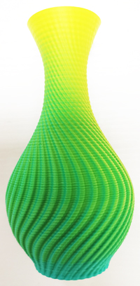
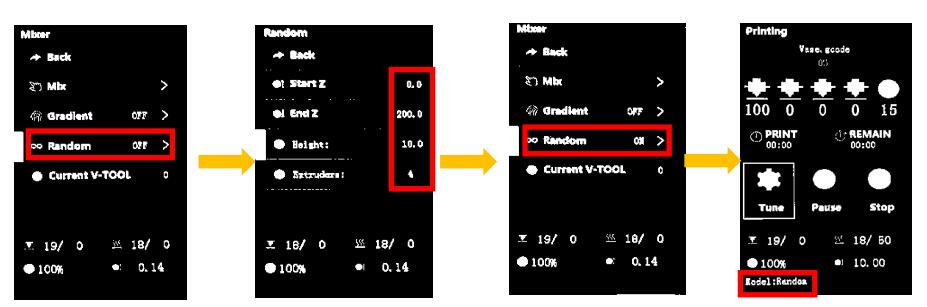
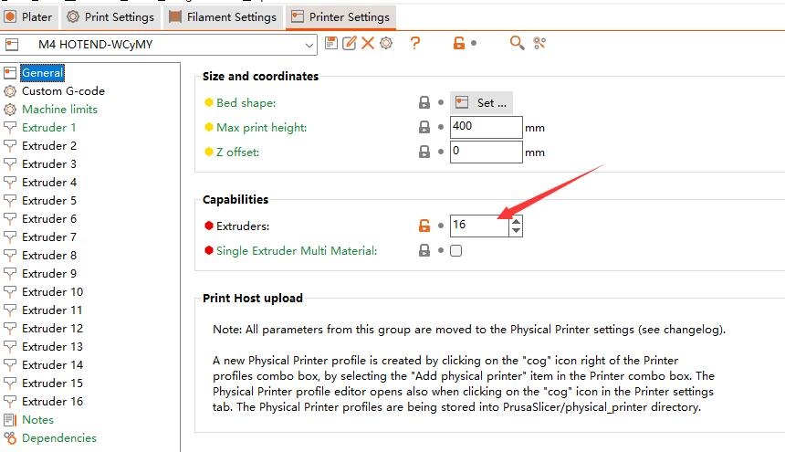
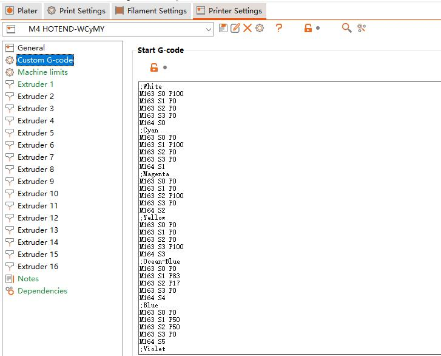
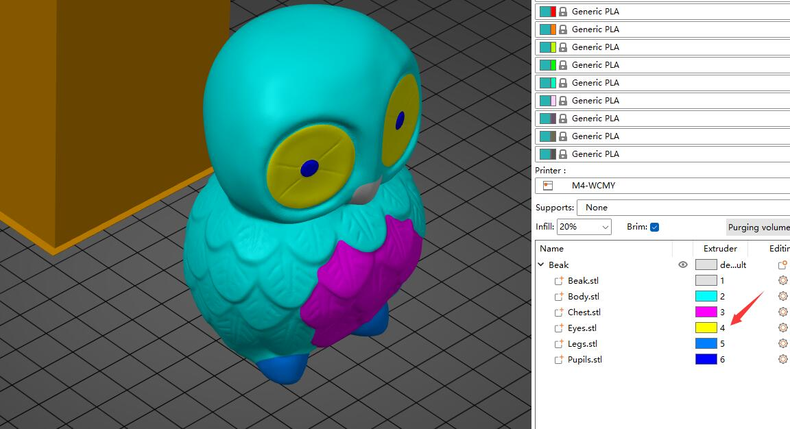

### Choose Language (Translated by google)

----
# Color Mixing Feature User Guide
The color mixing function is the characteristic that to mix different color filaments and extruded out from one nozzle to get a new color filament.By adjusting the extrude ratio of each extruder, it can get different color filament.
The machine can achieve the following color mixing functions:
1. [**Manual color mixing function:**](#change-printing-color-by-adjust-mixing-rate) Mmanually adjust the extrusion ratio of each extruder (it called [mixing ratio](#mixing-ratio)) through the LCD control panel during the printing process to change the printing color.
2. [**Gradient color mixing function:**](#gradient-mixing-printing) The gradient mix function is a feature of changing the [mixing ratio](#mixing-ratio) according to printing height automatically. It can be activated from the LCD control panel or adding gcode to "Start G-code" when slicing.
3. [**Random color mixing function:**](#random-mixing-printing) The random mix function is a feature of changing the [mixing ratio](#mixing-ratio) according to printing height randomly. It can be activated from the LCD control panel or adding gcode to "Start G-code" when slicing.
4. [**Mixed multi-color printing function**](#mixed-multi-color-printing) To define a preset [mixing ratio](#mixing-ratio) as a ***virtual extruder*** and then using this virtual extruder in slicing software. The printer can print more colors 3d model than the actual extruders. For example, printing 8 color 3d models by using a 4 extruders 3d printer. Now our mix color 3d printer can set up to 16 ***virtual extruders***.

-----
## Term explanation
#### Bowden extruder
A Bowden extruder is a type of extruder that pushes filament through a long and flexible PTFE tube (Bowden tube) to the hot end. ZONESTAR multi color 3d printers are used Bowden extruder. [:page_with_curl:wiki page](https://en.wikipedia.org/wiki/3D_printer_extruder)        
      
>
		A. Filament feeder mechanism   B. PTFE tube    C. Hot end
#### Extruder / Tool Chain
The extruder can refer to all the the extruder motor and hot end, or it can refer to the filament feeder mechanism. Whe we said extrusion feeder, it means the filament feeder mechanism.
In some slicing software, the extruer also be called "Tool Chain", "Tool head" or "Tool".For singel color or general multicolor printer, each extrusion feeder corresponds to one hot end / nozzle, so the number of tool chain is equal to the extrusion 
#### Mixing ratio
Distribute the length of the extruded filaments to different extruders to achieve color change during nozzle extrusion, and this ratio is called the extrusion mixing ratio. The value of mixing ratio should be between 0 and 100, and the sum of the ratios of each extruder cannot be less than 1 (>= 1).     
The ZONESTAR 3D printer supports setting the mixing ratio based on percentage or extruder ratio relationships. For example: "E1:E2:E3:E4 = 10:20:30:40" and "E1:E2:E3:E4 = 1:2:3:4" and "E1:E2:E3:E4 = 0.2:0.4:0.6:0.8" are equivalent. But when the mix ratio showed on LCD menus, they are always displayed at a percentage rate (sum = 100).
#### Virtual extruder / Virtual Tool / VTool
Since in slicing software, each extruder corresponds to a colored filament, in order to use the new colored filament obtained by mixing with the solid extruder, we can make the slicing software think that this is a new extruder. And in order to distinguish it from the actual extruder, we call it a "virtual extruder". In different slicing software, "Virtual extruder" also be called "Virtual Tool" or simply as "VTOOL".   
We can obtain many colored filaments by setting different mixing ratios, so we can define many virtual extruders. Default the machine has already set 16 virtual extruders when it left factory. You can change these mixing ratio any time, but after the machine restart, a printing (from SD card) is finished or abort, the machine will automatically reset the mixing ratio of all virtual extruders to default.     
##### :warning: Note 
1. To distinguish between a actual extruder and a virtual extruder, the actual extruder will be written as "Extruder #n" or "En" (n is from 1 to 4) in subsequent documents, such as "Extruder #1" or "E1". And write the virtual extruder as "VTOOLm" (m is from 0 to 15), such as "VTOOL4".
2. The default settings may different in the different firmware versions, please read the release note of the firmware.          
3. Once set the hot end type to "mixing" on LCD menu, the printer always use the "Virtual extruder" instead of the actual extruders. Because default the mix ratio of "VTOOL 0" is "E1:E2:E3:E4 = 100: 0: 0: 0", so it is completely equivalent to actual extruder #1; The mix ratio of "VTOOL 1" is "0: 100: 0: 0", so it is equivalent to actual extruder #2; The mix ratio of "VTOOL 2" is "0: 0: 100: 0", so its result is equivalent to actual extruder #3; The mix ratio of "VTOOL 2" is "0: 0: 0: 100", so its result is equivalent to actual extruder #4.

-----
## Change printing color by adjust mixing rate    
When printing from SD card, you can change the color mixing ratio of the extruders at any time to change the filament color. The steps are as follows:     
- Start to print a singel color gcode file from SD card.
- Wait until the print start to print the first layer, and then set on the LCD menu. 
- **Tune>>Mixer>>Mix>>VTOOL: 0** set the Vtool to 0
- **Tune>>Mixer>>Mix>>Extruder1~4:** Adjust the percentage of extruder #1 to extruder #4, the range is 0 ~ 100.  
- **Tune>>Mixer>>Mix>>Comit:** Redistribute the percentage of all extruders in proportion and send it to the current vtool. 
After setting up, on the ideal menu shows Current **VTOOL = 0**

-----
## Gradient mixing printing
When printing from SD card, you can start a gradient mixing feature, to let the printer auto change the mixing ratio when printing height changed. The steps are as follows:       
[:clapper:Video tutorial](https://youtu.be/VOlXvy38aFs)    

- Start to print a one color gcode file from SD card.  
- Set the paremeters for auto gradient mix printing on the LCD menu when the printer start to to print the first layer.
- **Tune>>Mixer>>Gradient:OFF>>**
  - **Start Z:** set the start Z heigth(such as:0mm)      
  - **End Z:** set the END Z heigth(such as:200mm)     
  - **Start V-tool:** set the start VTOOL(such as:0)        
  - **End V-tool:** set the end VTOOL(such as:1)  
After set **Start Z** isn’t equal to **End Z**, and **Start V-tool** isn’t equal to **End V-tool**, the LCD will shows **Gradient : ON**.      
:page_with_curl: About how to set the mixing ratio of VTOOL, please refer to [**here**](#how-to-set-mixing-ratio-of-virtual-extruder).     
    
### Realize gradient mixing by modifing gcode file
By adding a M166 command into the "Start G-code" of slicing software, and sliced the 3d model as single color, it can realize gradient mixing automatically when printing from SD card.   
> 
	Descitpion of M166 command
	M166: Start a gradient mix  
	S[bool] - Enable / disable gradients
	A[float] - Starting Z for the gradient
	Z[float] - Ending Z for the gradient.
	I[index] - VTool to use as the starting mix.
	J[index] - VTool to use as the ending mix.
	
	For example: M166 S1 A0 Z200 I0 J1
	S1->Enable gradient mix 
	A0->startZ is 0mm 
	Z200-> EndZ is 200mm 
	I0 -> Start VTool is 0 
	J1 -> End VTool is 1

-----
## Random mixing printing
When printing from SD card, you can start a gradient mixing feature, to let the printer auto change the mixing ratio when printing height changed. The steps are as follows:      
[:clapper:Video tutorial](https://youtu.be/-mQ4bCnrIaw)    
    
- Start to print a singel color gcode file from SD card.  
- Wait until the print start to print, set on the LCD menu. 
- **Tune>>Mixer>>Random Mix:>>**
	- **Start Z:** Set the start Z heigth(such as:0mm) 
	- **End Z:** Set the end Z heigth(such as:200mm)    
	- **Height:** Set interval distance(such as:10mm), when printing heigth changed beyond this value, the mixing ratio be changed once.    
	- **Extruders:** Set the number of extruders participating in printing(1~4). :warning: When the "Extruders" is set to 1, all four extruders will participate in printing, but they doesn't mixing instead of the extruders is randomly selected one by one each time to print.     
After set Start Z isn’t equal to the End Z, the LCD will shows **Random : ON**.
     
### Realize random mixing by modifing gcode file
By adding a M167 command into the "Start G-code" of slicing software, and sliced the 3d model as single color, it can realize random mixing automatically when printing from SD card.
> 
	Descitpion of M167 command.
	M167: Start a random mix.
	S[bool] - Enable / disable random mix.
	A[float] - Starting Z for the random.
	Z[float] - Ending Z for the random.
	H[float] - Minimum height of changing mixing rate.
	E[int] - how many extruders used on random mixing.

	For example: M167 S1 A0 Z100 H0.2 E3
	S1->Enable Random mix 
	A0->start Z heigth is 0mm 
	Z100->End Z heigth is 100mm 
	H0.2->change color every 0.2mm
	E3->3 extruders (Extruder #1 to Extruder #3) will be used to mix

-----
## Mixed multi-color printing
This section will introduce how to print a 3D model with more colors than the actual extruders by using the virtual extruders.
### Slicing steps
#### Step 1: Set the number of extruders

#### Step 2: Set the mixing ratios of VTOOLs
Add mixing ratios of VTOOLs setting into the "Start G-code". [:page_with_curl: How to set mixing ratio of Virtual extruder](#how-to-set-mixing-ratio-of-virtual-extruder)

#### :pushpin:Note
You can download the setting from the bewlow link and unzip it, and then import the setting to your slicing software (PrusaSlicer).
- [:arrow_down: Download config file](./config_WCMY.zip)    
- [:clapper: Video tutorial](https://user-images.githubusercontent.com/29502731/232972117-387a9e15-f3c7-417b-aff6-d876e119b70d.mp4)
#### Step 3: Assign an extruder to the components

#### Step 4: Slicing and get gcode

### Examples
#### 6 color OWL
- **[:clapper:Video tutorial](https://user-images.githubusercontent.com/29502731/232977232-4e8031b2-9142-4db2-9cef-12b85759fa17.mp4)**
- **[:arrow_down:Download stl file](https://www.thingiverse.com/thing:2373415)**
- **[:arrow_down:Download 3mf & gcode file](https://github.com/ZONESTAR3D/Z8P/tree/main/Z8P-MK2/2-Operation_Guide/Mixing_Color/M4_6c_owl.zip)**
#### 10 color Noahs
- **[Video tutorial::clapper:Part1](https://user-images.githubusercontent.com/29502731/233287512-25575666-60ff-4b08-88a2-e3ff8149599f.mp4) [:clapper:Part2](https://user-images.githubusercontent.com/29502731/233287715-8dd8517e-8260-41ec-888b-8ba28b692c27.mp4)  [:clapper:Part3](https://user-images.githubusercontent.com/29502731/233287893-a31ec2ab-e4e6-4080-8a97-6ccf92502fa4.mp4)**
- **[:arrow_down:Download stl file](https://github.com/ZONESTAR3D/Z8P/tree/main/Z8P-MK2/2-Operation_Guide/Mixing_Color/noahs.zip)**
- **[:arrow_down:Download 3mf & gcode file](https://github.com/ZONESTAR3D/Z8P/tree/main/Z8P-MK2/2-Operation_Guide/Mixing_Color/M4_10c_noahs.zip)**
#### 16 color 
- **[:clapper:Video tutorial]()**
- **[:arrow_down:Download stl file]()**
- **[:arrow_down:Download 3mf & gcode file]()**

-----
## How to set mixing ratio of Virtual extruder
We can set the mixing ratio of each virtual extruder by LCD control panel or adding command in the "start G-code" of slicing software.
:warning:If a printing from SD card is finished or abort, the machine will automatically reset mixing ratio of all virtual extruders to default.
### Set mixing ratio by LCD control panel
Steps:
- **Control>>Mixer>>Mix>>VTOOL: x** Choose the virtual extruder number which you need to set(x is from 0 to 15)
- **Control>>Mixer>>Mix>>Extruder1~4:** Adjust the percentage of extruder #1 to extruder #4, the range is 0 ~ 100.  
- **Control>>Mixer>>Mix>>Comit:** Redistribute the percentage of all extruders in proportion and save it to the virtual extruder x. 
### Set mixing ratio by adding command
We can also add M163 and M164 command into the "Start G-code" of slicing software, to set the mixing ratio of the virtual extruder.
Commands list as below:
>
	M163 S0 Px		; set the mix ratio of actual extruder #1, "x" is from 0 to 100
	M163 S1 Py		; set the mix ratio of actual extruder #2, "y" is from 0 to 100
	M163 S2 Pz		; set the mix ratio of actual extruder #3, "z" is from 0 to 100
	M163 S3 Pn		; set the mix ratio of actual extruder #4, "n" is from 0 to 100
	M164 Sm   		; save the mix ratio of extruders to the "VTOOLm", "m" is from 0 to 16
	
	For example, you added the below commands into the "Start G-code" of slicing software
	M163 S0 P10		
	M163 S1 P20		
	M163 S2 P30		
	M163 S3 P40		
	M164 S4
	
	After that, the VTOOL4 has been set mix ratio "E1:E2:E3:E4 = 10:20:30:40". When using VTOOL4, 4 actual extruders will feed 
	filaments in a ratio of 10:20:30:40.

-----
#### Color mixing ratio reference settings using White/Cyan/Magenta/Yellow color filaments
>
		;White
		M163 S0 P100
		M163 S1 P0
		M163 S2 P0
		M163 S3 P0
		M164 S0
		;Cyan
		M163 S0 P0
		M163 S1 P100
		M163 S2 P0
		M163 S3 P0
		M164 S1
		;Magenta
		M163 S0 P0
		M163 S1 P0
		M163 S2 P100
		M163 S3 P0
		M164 S2
		;Yellow
		M163 S0 P0
		M163 S1 P0
		M163 S2 P0
		M163 S3 P100
		M164 S3
		;Ocean-Blue
		M163 S0 P0
		M163 S1 P83
		M163 S2 P17
		M163 S3 P0
		M164 S4
		;Blue
		M163 S0 P0
		M163 S1 P50
		M163 S2 P50
		M163 S3 P0
		M164 S5
		;Violet
		M163 S0 P0
		M163 S1 P17
		M163 S2 P83
		M163 S3 P0
		M164 S6
		;Red
		M163 S0 P0
		M163 S1 P0
		M163 S2 P83
		M163 S3 P17
		M164 S7
		;Orange
		M163 S0 P0
		M163 S1 P0
		M163 S2 P50
		M163 S3 P50
		M164 S8
		;Spring-Green
		M163 S0 P0
		M163 S1 P17
		M163 S2 P0
		M163 S3 P83
		M164 S9
		;Green
		M163 S0 P0
		M163 S1 P50
		M163 S2 P0
		M163 S3 P50
		M164 S10
		;Turquoise
		M163 S0 P0
		M163 S1 P83
		M163 S2 P0
		M163 S3 P17
		M164 S11
		;skin
		M163 S0 P18
		M163 S1 P0
		M163 S2 P5
		M163 S3 P1
		M164 S12
		;Magenta-Brown
		M163 S0 P0
		M163 S1 P25
		M163 S2 P50
		M163 S3 P25
		M164 S13
		;Yellow-Brown
		M163 S0 P0
		M163 S1 P25
		M163 S2 P25
		M163 S3 P50
		M164 S14
		;Brown
		M163 S0 P0
		M163 S0 P33
		M163 S1 P33
		M163 S2 P34
		M164 S15