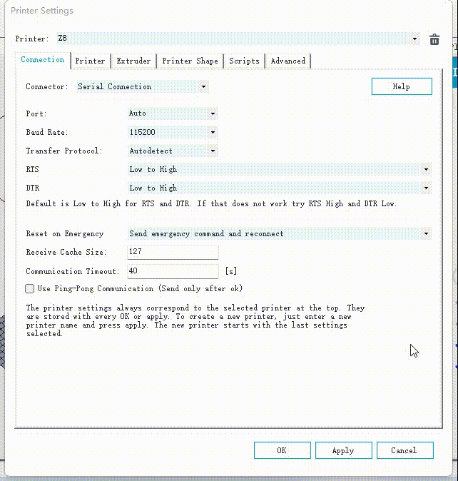
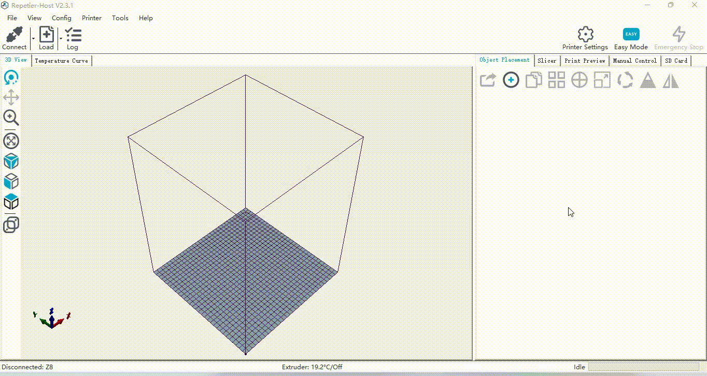

## <a id="choose-language">:globe_with_meridians: Choose language </a>

----
## <a id="en">Brief user guide of Repetier-Host</a>
:warning: Repetier-host is a free software for 3d printer control and silcinig, you can download it for free. If you are satisfied with the this software, you can donations to the developers. Please note that ZONESTAR have no interest relationship with developers.   
### :one: Download repetier-host software and then install to your PC.    
- **[:arrow_down: Download repetier-host][LINK_REPETIERHOST_DOWN]**     
:warning:Don't choose the "Repetier-Server" when installing the software.    
######      

### :two: Set printer settings
- Set a printer name, choose "connector" to "Serial connection" and set the Baud rate to "115200". You don't need to set the com Port in this step.     
###### 
- Set other settings, extruder, shape, etc.     
###### 

### :three: Power on the printer first and then connect 3d printer with PC by a USB cable
######      
Open the "connection" page of "printer setting", when pluging the USB cable to PC, a new port will be showed out in the "Port" item, this new port is the com port of your 3d printer.   
######      
:warning: Note: If the port doesn't show out, you many need to install the USB driver. please download the USB driver (Click [here :arrow_down:](./USBDriver.zip) to download) and then install to your PC.     
PS: Usually you don't need to install the USB driver in Windows10, Windows11, and newer version MacOs, Linux.    
:blue_book:[Manually updating drivers in Windows][LINK_DRIVE]

### :four: Connect the printer with PC and then control it, or load gcode file to start print
######      
:blue_book: About more detail user guide, please refer to the [manual of Repetier-host][LINK_REPETIERHOST]

----
## <a id="es">Breve guía de usuario de Repetier-Host</a> [:arrow_heading_up:](#choose-language)
:warning: Repetier-host es un software gratuito para el control y modelado de impresoras 3D, puedes descargarlo gratis. Si está satisfecho con este software, puede realizar donaciones a los desarrolladores. Tenga en cuenta que ZONESTAR no tiene ninguna relación de interés con los desarrolladores.
### :one: Descargue el software repetidor-host y luego instálelo en su PC.
- **[:arrow_down: Descargar repetier-host][LINK_REPETIERHOST_DOWN]**
:warning:No elija el "Servidor repetidor" al instalar el software.
###### 

### :two: Establecer la configuración de la impresora
- Establezca un nombre de impresora, elija "conector" en "Conexión serie" y establezca la velocidad en baudios en "115200". No es necesario configurar el puerto de comunicación en este paso.
###### 
- Establecer otras configuraciones, extrusora, forma, etc.
###### 

### :three: Primero encienda la impresora y luego conecte la impresora 3D a la PC mediante un cable USB
###### 
Abra la página "conexión" de "configuración de la impresora", al conectar el cable USB a la PC, se mostrará un nuevo puerto en el elemento "Puerto", este nuevo puerto es el puerto com de su impresora 3D.
###### 
:warning: Nota: Si el puerto no aparece, es posible que necesite instalar el controlador USB. descargue el controlador USB (haga clic [aquí:arrow_down:](./USBDriver.zip) para descargar) y luego instálelo en su PC.
PD: normalmente no es necesario instalar el controlador USB en Windows10, Windows11 y versiones más recientes de MacOs y Linux.
:blue_book:[Actualización manual de controladores en Windows][LINK_DRIVE]
### :four: Conecte la impresora a la PC y luego contrólela, o cargue el archivo gcode para comenzar a imprimir
###### 
:blue_book:Para obtener más información sobre la guía del usuario, consulte el [manual de Repetier-host][LINK_REPETIERHOST]

----
## <a id="pt">Breve guia do usuário do Repetier-Host</a> [:arrow_heading_up:](#choose-language)
:warning: Repetier-host é um software gratuito para controle de impressora 3D e silcinig, você pode baixá-lo gratuitamente. Se você estiver satisfeito com este software, poderá fazer doações aos desenvolvedores. Observe que ZONESTAR não tem relacionamento de interesse com desenvolvedores.
### :one: Baixe o software repetier-host e instale no seu PC.
- **[:arrow_down: Baixar repetidor-host][LINK_REPETIERHOST_DOWN]**
:warning: Não escolha o "Repetier-Server" ao instalar o software.
###### 

### :two: Definir configurações da impressora
- Defina um nome de impressora, escolha "conector" para "Conexão serial" e defina a taxa de transmissão para "115200". Você não precisa definir a porta COM nesta etapa.
###### 
- Defina outras configurações, extrusora, forma, etc.
###### 

### :three: Ligue a impressora primeiro e depois conecte a impressora 3D ao PC por meio de um cabo USB
###### 
Abra a página "conexão" de "configuração da impressora", ao conectar o cabo USB ao PC, uma nova porta será mostrada no item "Porta", esta nova porta é a porta COM da sua impressora 3D.
###### 
:warning: Nota: Se a porta não aparecer, você precisará instalar o driver USB. baixe o driver USB (clique [aqui:arrow_down:](./USBDriver.zip) para baixar) e instale no seu PC.
PS: Normalmente você não precisa instalar o driver USB no Windows10, Windows11 e versões mais recentes de MacOs, Linux.
:blue_book:[Atualizando drivers manualmente no Windows][LINK_DRIVE]

### :four: Conecte a impressora ao PC e controle-a ou carregue o arquivo gcode para iniciar a impressão
###### 
:blue_book: Para obter mais detalhes sobre o guia do usuário, consulte o [manual do Repetier-host][LINK_REPETIERHOST]

----
## <a id="fr">Bref guide d'utilisation de Repetier-Host</a> [:arrow_heading_up:](#choose-language)
:warning: Repetier-host est un logiciel gratuit de contrôle et de silcinage d'imprimante 3D, vous pouvez le télécharger gratuitement. Si vous êtes satisfait de ce logiciel, vous pouvez faire des dons aux développeurs. Veuillez noter que ZONESTAR n'a aucune relation d'intérêt avec les développeurs.
### :one : Téléchargez le logiciel répéteur-hôte, puis installez-le sur votre PC.
- **[:arrow_down : Télécharger repetier-host][LINK_REPETIERHOST_DOWN]**
:warning Ne choisissez pas le "Repetier-Server" lors de l'installation du logiciel.
###### 

### :two : Définir les paramètres de l'imprimante
- Définissez un nom d'imprimante, choisissez « Connecteur » sur « Connexion série » et réglez le débit en bauds sur « 115 200 ». Vous n'avez pas besoin de définir le port COM à cette étape.
###### 
- Définissez d'autres paramètres, extrudeuse, forme, etc.
###### 

### :three: Allumez d'abord l'imprimante, puis connectez l'imprimante 3D au PC via un câble USB
###### 
Ouvrez la page "Connexion" des "Paramètres de l'imprimante", lors du branchement du câble USB au PC, un nouveau port sera affiché dans l'élément "Port", ce nouveau port est le port COM de votre imprimante 3D.
###### 
:warning: Remarque : si le port n'apparaît pas, vous devez installer le pilote USB. veuillez télécharger le pilote USB (cliquez sur [ici :arrow_down:](./USBDriver.zip) pour télécharger), puis installez-le sur votre PC.
PS: généralement, vous n'avez pas besoin d'installer le pilote USB sous Windows10, Windows11 et les versions plus récentes de MacOs, Linux.
:blue_book:[Mise à jour manuelle des pilotes sous Windows][LINK_DRIVE]

### :four: Connectez l'imprimante au PC, puis contrôlez-la, ou chargez le fichier Gcode pour démarrer l'impression
###### 
:blue_book : Pour un guide d'utilisation plus détaillé, veuillez vous référer au [manuel de Repetier-host][LINK_REPETIERHOST]

----
## <a id="de">Kurze Bedienungsanleitung von Repetier-Host</a> [:arrow_heading_up:](#choose-language)
:warning: Repetier-Host ist eine kostenlose Software zur Steuerung und Silcinierung von 3D-Druckern, Sie können sie kostenlos herunterladen. Wenn Sie mit dieser Software zufrieden sind, können Sie den Entwicklern spenden. Bitte beachten Sie, dass ZONESTAR keine Interessenbeziehung zu Entwicklern unterhält.
### :one: Laden Sie die Repetier-Host-Software herunter und installieren Sie sie dann auf Ihrem PC.
- **[:arrow_down: repetier-host herunterladen][LINK_REPETIERHOST_DOWN]**
:warning: Wählen Sie bei der Installation der Software nicht den „Repetier-Server“.
###### 

### :two: Druckereinstellungen festlegen
- Legen Sie einen Druckernamen fest, wählen Sie „Anschluss“ auf „Serielle Verbindung“ und stellen Sie die Baudrate auf „115200“ ein. In diesem Schritt müssen Sie den COM-Port nicht festlegen.
###### 
- Andere Einstellungen vornehmen, Extruder, Form usw.
###### 

### :three: Schalten Sie zuerst den Drucker ein und verbinden Sie dann den 3D-Drucker über ein USB-Kabel mit dem PC
###### 
Öffnen Sie die Seite „Verbindung“ der „Druckereinstellungen“. Wenn Sie das USB-Kabel an den PC anschließen, wird im Element „Anschluss“ ein neuer Anschluss angezeigt. Dieser neue Anschluss ist der COM-Anschluss Ihres 3D-Druckers.
###### 
:warning: Hinweis: Wenn der Anschluss nicht angezeigt wird, müssen Sie den USB-Treiber installieren. Bitte laden Sie den USB-Treiber herunter (klicken Sie zum Herunterladen auf [hier :arrow_down:](./USBDriver.zip)) und installieren Sie ihn dann auf Ihrem PC.
PS: Normalerweise müssen Sie den USB-Treiber nicht unter Windows 10, Windows 11 und neueren Versionen von MacOs und Linux installieren.
:blue_book:[Treiber in Windows manuell aktualisieren][LINK_DRIVE]

### :four: Verbinden Sie den Drucker mit dem PC und steuern Sie ihn dann oder laden Sie die Gcode-Datei, um den Druck zu starten
###### 
:blue_book: Eine ausführlichere Bedienungsanleitung finden Sie im [Handbuch von Repetier-host][LINK_REPETIERHOST].

----
## <a id="it">Breve guida per l'utente di Repetier-Host</a> [:arrow_heading_up:](#choose-language)
:warning: Repetier-host è un software gratuito per il controllo e la silcinig della stampante 3D, puoi scaricarlo gratuitamente. Se sei soddisfatto di questo software, puoi fare donazioni agli sviluppatori. Tieni presente che ZONESTAR non ha alcun rapporto di interesse con gli sviluppatori.
### :one: Scarica il software repetier-host e installalo sul tuo PC.
- **[:arrow_down: Scarica repetier-host][LINK_REPETIERHOST_DOWN]**
:warning: Non scegliere "Repetier-Server" durante l'installazione del software.
###### 

### :two: Configura le impostazioni della stampante
- Imposta un nome per la stampante, seleziona "connettore" su "Connessione seriale" e imposta la velocità di trasmissione su "115200". Non è necessario impostare la porta com in questo passaggio.
###### 
- Configura altre impostazioni, estrusore, forma, ecc.
###### 

### :three: accendi prima la stampante, quindi collega la stampante 3D al PC tramite un cavo USB
###### 
Apri la pagina "connessione" di "impostazioni stampante", quando colleghi il cavo USB al PC, una nuova porta verrà mostrata nella voce "Porta", questa nuova porta è la porta com della tua stampante 3D.
###### 
:warning: Nota: se la porta non viene visualizzata, è necessario installare il driver USB. scarica il driver USB (fai clic su [qui :arrow_down:](./USBDriver.zip) per scaricarlo) e quindi installalo sul tuo PC.
PS: di solito non è necessario installare il driver USB in Windows10, Windows11 e versioni più recenti MacOs, Linux.
:blue_book:[Aggiornamento manuale dei driver in Windows][LINK_DRIVE]

### :four: collega la stampante al PC e controllala oppure carica il file gcode per avviare la stampa
###### 
:blue_book: Per informazioni più dettagliate sulla guida utente, fare riferimento al [manuale di Repetier-host][LINK_REPETIERHOST]

----
## <a id="ru">Краткое руководство пользователя Repetier-Host</a> [:arrow_heading_up:](#choose-language)
:warning: Repetier-host — бесплатная программа для управления и настройки 3D-принтеров, скачать ее можно бесплатно. Если вас устраивает это программное обеспечение, вы можете сделать пожертвование разработчикам. Обратите внимание, что ZONESTAR не имеет никаких отношений с разработчиками.
### :one: Загрузите программное обеспечение repetier-host и затем установите его на свой компьютер.
- **[:arrow_down: Загрузите repetier-host][LINK_REPETIERHOST_DOWN]**
:warning: Не выбирайте «Repetier-Server» при установке программного обеспечения.
###### 

### :two: Установить настройки принтера
- Задайте имя принтера, выберите «Разъем» на «Последовательное соединение» и установите скорость передачи данных на «115200». На этом этапе вам не нужно настраивать com-порт.
###### 
- Установите другие настройки, экструдер, форму и т. д.
###### 

### :three: Сначала включите принтер, а затем подключите 3D-принтер к ПК с помощью USB-кабеля.
###### 
Откройте страницу «Подключение» в «Настройках принтера». При подключении USB-кабеля к ПК в пункте «Порт» появится новый порт, этот новый порт является COM-портом вашего 3D-принтера.
###### 
:warning: Примечание. Если порт не отображается, вам необходимо установить драйвер USB. загрузите драйвер USB (нажмите [здесь :arrow_down:](./USBDriver.zip), чтобы загрузить), а затем установите его на свой компьютер.
PS: Обычно вам не нужно устанавливать драйвер USB в Windows10, Windows11 и более новых версиях MacO, Linux.
:blue_book:[Обновление драйверов в Windows вручную][LINK_DRIVE]

### :four: Подключите принтер к ПК и затем управляйте им или загрузите файл gcode, чтобы начать печать.
###### 
:blue_book: Более подробное руководство пользователя можно найти в [руководстве Repetier-host][LINK_REPETIERHOST]

----
## <a id="jp">Repetier-Host の簡単なユーザー ガイド</a> [:arrow_heading_up:](#choose-language)
:warning: Repetier-host は 3D プリンター制御およびシルシニグ用のフリー ソフトウェアで、無料でダウンロードできます。 このソフトウェアに満足したら、開発者に寄付することができます。 ZONESTAR は開発者と利害関係がありませんのでご注意ください。
### :one: レペティア ホスト ソフトウェアをダウンロードして、PC にインストールします。
- **[:arrow_down: レペティアホストをダウンロード][LINK_REPETIERHOST_DOWN]**
:warning: ソフトウェアをインストールするときに「Repetier-Server」を選択しないでください。
###### 

### :two: プリンターの設定を行う
- プリンター名を設定し、「コネクター」を「シリアル接続」に選択し、ボーレートを「115200」に設定します。 この手順では com ポートを設定する必要はありません。
###### 
- その他の設定、押出機、形状などを設定します。
###### 

### :three: まずプリンターの電源を入れてから、USB ケーブルで 3D プリンターと PC を接続します。
###### 
「プリンター設定」の「接続」ページを開き、USB ケーブルを PC に接続すると、「ポート」項目に新しいポートが表示されます。この新しいポートが 3D プリンターの COM ポートです。
###### 
:warning: 注: ポートが表示されない場合は、USB ドライバーをインストールする必要があります。 USB ドライバーをダウンロードし ([ここ :arrow_down:](./USBDriver.zip) をクリックしてダウンロードします)、PC にインストールしてください。
PS: 通常、Windows10、Windows11、および新しいバージョンの MacO、Linux では USB ドライバーをインストールする必要はありません。
:blue_book:[Windows でドライバーを手動で更新する][LINK_DRIVE]

### :four: プリンターを PC に接続して制御するか、gcode ファイルを読み込んで印刷を開始します
###### 
:blue_book: ユーザーガイドの詳細については、[Repetier-host のマニュアル][LINK_REPETIERHOST]を参照してください。

----
## <a id="kr">Repetier-Host 간략한 사용자 가이드</a> [:arrow_heading_up:](#choose-language)
:warning: Repetier-host는 3D 프린터 제어 및 인쇄를 위한 무료 소프트웨어이며 무료로 다운로드할 수 있습니다. 이 소프트웨어에 만족하신다면 개발자에게 기부하실 수 있습니다. ZONESTAR는 개발자와 이해관계가 없음을 알려드립니다.
### :one: 반복 호스트 소프트웨어를 다운로드한 다음 PC에 설치합니다.
- **[:arrow_down: 반복 호스트 다운로드][LINK_REPETIERHOST_DOWN]**
:warning: 소프트웨어를 설치할 때 "Repetier-Server"를 선택하지 마십시오.
###### 

### :two: 프린터 설정 지정
- 프린터 이름을 설정하고 "커넥터"를 "직렬 연결"로 선택한 다음 전송 속도를 "115200"으로 설정합니다. 이 단계에서는 com 포트를 설정할 필요가 없습니다.
###### 
- 기타 설정, 압출기, 모양 등을 설정합니다.
###### 

### :three: 먼저 프린터 전원을 켠 다음 USB 케이블로 3D 프린터와 PC를 연결합니다.
###### 
"프린터 설정"의 "연결" 페이지를 엽니다. USB 케이블을 PC에 연결하면 "포트" 항목에 새 포트가 표시됩니다. 이 새 포트는 3D 프린터의 COM 포트입니다.
###### 
:warning: 참고: 포트가 표시되지 않으면 USB 드라이버를 설치해야 합니다. USB 드라이버를 다운로드한 후(다운로드하려면 [여기:arrow_down:](./USBDriver.zip) 클릭) PC에 설치하세요.
추신: 일반적으로 Windows10, Windows11 및 최신 버전의 MacO, Linux에서는 USB 드라이버를 설치할 필요가 없습니다.
:blue_book:[Windows에서 수동으로 드라이버 업데이트][LINK_DRIVE]

### :four: 프린터를 PC와 연결한 후 제어하거나, gcode 파일을 로드하여 인쇄를 시작합니다.
###### 
:blue_book: 자세한 사용자 가이드는 [Repetier-host 매뉴얼][LINK_REPETIERHOST]을 참조하세요.

----
## <a id="ar">دليل مستخدم مختصر لـ Repetier-Host</a> [:arrow_heading_up:](#choose-language)
:تحذير: Repetier-host هو برنامج مجاني للتحكم في الطابعة ثلاثية الأبعاد والسيلسينيج، يمكنك تنزيله مجانًا. إذا كنت راضيًا عن هذا البرنامج، فيمكنك التبرع للمطورين. يرجى ملاحظة أن ZONESTAR ليس لها علاقة اهتمام بالمطورين.
### :one: قم بتنزيل برنامج Repetier-host ثم قم بتثبيته على جهاز الكمبيوتر الخاص بك.
- **[:arrow_down: تنزيل المضيف المتكرر][LINK_REPETIERHOST_DOWN]**
:تحذير: لا تختار "Repetier-Server" عند تثبيت البرنامج.
###### 

### :اثنان: ضبط إعدادات الطابعة
- قم بتعيين اسم الطابعة، واختر "موصل" إلى "الاتصال التسلسلي" واضبط معدل الباود على "115200". لا تحتاج إلى تعيين منفذ com في هذه الخطوة.
###### 
- ضبط الإعدادات الأخرى، الطارد، الشكل، الخ.
###### 

### :ثالثًا: قم بتشغيل الطابعة أولاً ثم قم بتوصيل الطابعة ثلاثية الأبعاد بالكمبيوتر عبر كابل USB
###### 
افتح صفحة "الاتصال" الخاصة بـ "إعداد الطابعة"، عند توصيل كابل USB بجهاز الكمبيوتر، سيتم عرض منفذ جديد في عنصر "المنفذ"، وهذا المنفذ الجديد هو منفذ com لطابعتك ثلاثية الأبعاد.
###### 
:تحذير: ملاحظة: إذا لم يظهر المنفذ، فستحتاج إلى تثبيت برنامج تشغيل USB. يرجى تنزيل برنامج تشغيل USB (انقر [هنا :arrow_down:](./USBDriver.zip) للتنزيل) ثم قم بتثبيته على جهاز الكمبيوتر الخاص بك.
ملاحظة: عادةً لا تحتاج إلى تثبيت برنامج تشغيل USB في أنظمة التشغيل Windows10 وWindows11 والإصدارات الأحدث من MacOs وLinux.
:blue_book:[تحديث برامج التشغيل يدويًا في نظام التشغيل Windows][LINK_DRIVE]

### :رابعا: قم بتوصيل الطابعة بالكمبيوتر ثم التحكم بها، أو تحميل ملف gcode لبدء الطباعة
###### 
:blue_book: حول دليل المستخدم الأكثر تفصيلاً، يرجى الرجوع إلى [دليل Repetier-host] [LINK_REPETIERHOST]

----
[LINK_DRIVE]: https://support.microsoft.com/en-us/windows/update-drivers-manually-in-windows-ec62f46c-ff14-c91d-eead-d7126dc1f7b6
[LINK_REPETIERHOST]: https://www.repetier.com/documentation/repetier-host/
[LINK_REPETIERHOST_DOWN]: https://www.repetier.com/download-now/