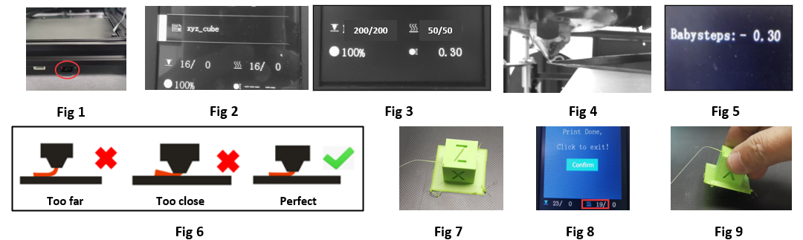

## <a id="choose-language">:globe_with_meridians: Choose language </a>

<!--  -->

-----
# Z8P-MK2 Guía de operación 
## Encendido y apagado
#### :warning: ¡ATENCIÓN! :warning:
##### ¡ASEGÚRESE DE QUE EL INTERRUPTOR DE SELECCIÓN DE VOLTAJE DE CA SE HA AJUSTADO EN LA POSICIÓN CORRECTA!

### ENCENDIDO
#### [:clapper: Videotutorial](https://github.com/ZONESTAR3D/Z8P/tree/main/Z8P-MK2/2-Operation_Guide/pic/PowerOn.gif)

1. Enchufe el cable de alimentación
2. Encienda el interruptor de alimentación de CA.
3. Mantenga presionado el botón de alimentación de CC durante unos 5 segundos.
4. Espere hasta que la pantalla LCD muestre Logo, luego suelte el botón de alimentación de CC.
### APAGADO
#### [:clapper: Videotutorial](https://github.com/ZONESTAR3D/Z8P/tree/main/Z8P-MK2/2-Operation_Guide/pic/poweroff.gif)

Haga “Preparar>>Apagar” en la pantalla LCD, espere a que la pantalla LCD se apague y luego apague el interruptor de alimentación de CA.

## [Menú LCD y funcionamiento][LCD_MENU]

1. **Barra de título:** Muestra el menú actual
2. **Barra de menú:** Muestra elementos del menú operativo de control
3. **Barra de estado:** Muestra el estado importante actual de la impresora, incluida la temperatura, la velocidad de impresión y la información de altura Z.
4. **Mango de control:** Controla la impresora, es un rodillo que se puede girar o presionar.
   - **Rotación:** Seleccione el elemento del menú siguiente/anterior o modifique el valor de configuración.
   - **Clic:** Ingresar al siguiente menú / Ejecutar el comando actual / Confirmar el valor modificado.
5. **Impresión desde la tarjeta SD:** Elija el archivo gcode de la tarjeta SD e imprímalo.
6. **Preparación para imprimir:** Precalentamiento, inicio, movimiento del eje, carga/descarga de filamento, nivelación de la cama caliente, apagado, etc., utilizados antes de imprimir.
7. **Configurar la máquina:** Establecer parámetros de operación, habilitar/deshabilitar funciones avanzadas.
8. **Información de la máquina:**: Vea la versión del firmware, información de configuración del hardware de la máquina.
#### Acerca de la descripción del menú LCD, consulte la [:point_right:**Descripción del menú de la pantalla LCD DWIN**][LCD_MENU].

## Prepárese para imprimir
### Nivela la cama
Antes de imprimir, es necesario ajustar la distancia entre la boquilla y la película de la cama caliente a un valor adecuado, para que el filamento derretido se pueda pegar bien en la película de la cama caliente. Este proceso también se denomina “lecho nivelado”. Si la boquilla está demasiado lejos de la cama, el filamento no podrá adherirse a la cama caliente. Si la distancia es demasiado corta, la película de la base y la boquilla se dañarán o incluso se bloqueará el extremo caliente.
##### [:clapper: Paso 1:](https://github.com/ZONESTAR3D/Z8P/tree/main/Z8P-MK2/2-Operation_Guide/pic/HomeAll.gif) Encienda la impresora 3D y luego haga “Preparar>>Inicio automático>>Inicio todo” en el MENÚ LCD, espere que el hotend vaya a la posición INICIO.
##### Paso 2: Apriete las tuercas manuales debajo de la cama para bajar la cama a la posición más baja (Fig. 1).
##### [:clapper: Paso 3:](https://github.com/ZONESTAR3D/Z8P/tree/main/Z8P-MK2/2-Operation_Guide/pic/Level_corners.gif) Haga “Preparar >> Cama nivelación >> Punto 1” en el panel de control (Fig. 2), la boquilla irá a las esquinas de la cama, aflojará las tuercas manuales debajo de la cama (Fig. 3) y dejará que la boquilla casi toque la cama (Fig. 4). Continúe haciendo el “Punto 2/3/4” hasta que se hayan nivelado las 4 esquinas.
##### Paso 4: Repita el paso 3 y haga 2 ~ 3 rondas, hasta que las cuatro esquinas estén a la misma altura.

### Cargar filamentos
#### [:clapper: Videotutorial](https://youtu.be/-47yB95uIxI)
Esta impresora está equipada con cuatro extrusoras y un extremo caliente de mezcla de colores 4 EN 1 SALIDA. Los extrusores y el hot end están conectados mediante una guía de filamento (tubo de PTFE). :warning:**Antes de imprimir, debe cargar los 4 filamentos en los extrusores y alimentarlos en la parte inferior del extremo caliente.**
##### Paso 1. Haga “Preparar>>Inicio automático>>Inicio todo” en el panel de control, y luego haga “Preparar>>Temperatura>> Precalentar PLA”, esperando que la temperatura de la boquilla alcance los 190 ℃ (Fig. 1).
##### Paso 2. Utilice unos alicates diagonales para cortar la cabeza del filamento (Fig. 2), y luego presione el mango del extrusor n.º 1 e inserte el filamento, empuje el filamento hasta que pueda ver el filamento en el PTFE. guía (Figura 3). Gire el engranaje del extrusor n.º 1 (Fig. 4), observe el filamento hasta que entre en la parte inferior del extremo caliente.
##### Paso 3. Usando el mismo método que en el paso 2 para cargar los filamentos en la extrusora n.° 2 ~ extrusora n.° 4, observe los filamentos hasta que entren en la parte inferior del extremo caliente.
##### Paso 4. Gire lentamente los engranajes del extrusor n.° 1 ~ extrusor n.° 4 uno por uno y observe la boquilla, hasta que pueda ver que el filamento sale de la boquilla (Fig. 5).
#### :warning: El menú "Carga rápida" solo se puede usar cuando se carga el filamento desde la extrusora al extremo caliente, una vez que el filamento ingresó al extremo caliente, use el menú "Carga lenta" pero no "Carga rápida".

## Imprimir desde la tarjeta SD
[:clapper: Videotutorial](https://youtu.be/ITHbO9VxTMo)
#### Paso 1. Inserte la tarjeta SD en el zócalo para tarjetas SD de la impresora (Fig. 1).
##### :pushpin: Z8PM4Pro-MK2A agregó un zócalo para tarjeta SD en el costado de la máquina, que es más conveniente para acceder a la tarjeta SD.
:warning: Tenga en cuenta que solo puede elegir una de ellas (tarjeta SD en el lateral o tarjeta Micro-SD en el frente) al imprimir.

#### Paso 2. Haga clic en "Imprimir" en el panel de control y elija "Probar gcode\xyz_cube.gcode" (Fig. 2), haga clic en la perilla para comenzar a imprimir.
#### Paso 3. Espere hasta que el hotend y el hotend alcancen la temperatura establecida (Fig. 3), la boquilla regresará a la posición de origen y luego se moverá hacia arriba de la plataforma de impresión y extruirá el filamento, use unas pinzas para Retire el filamento de salida (Fig. 4).
#### Paso 4. Cuando la boquilla se movió a la cama caliente y comenzó a imprimir, haga doble clic en la perilla en el panel de control para abrir el menú "Pasos de bebé Z" (Fig. 5), gire la perilla lentamente para ajustar la altura. de la plataforma de impresión, observe la distancia desde la boquilla hasta la base, hasta que la distancia sea buena (Fig. 6). Espere a que termine la impresión y obtendrá sus primeros trabajos (Fig. 7).
#### Paso 5. Espere a que la base se enfríe (<=25 grados) (Fig. 8) y luego retire el objeto impreso de la base (Fig. 9).

## Funciones avanzadas
:warning: No active estas funciones hasta que comprenda claramente cómo utilizarlas.
### [Función de mezcla de colores][MIX_COLOR]
Esta impresora está equipada con 4 extrusoras y un extremo caliente de mezcla de colores 4 EN 1, no solo puede imprimir archivos 3D de hasta 16 colores, sino que también puede imprimir un modo 3D de un solo color en un modelo 3D de color degradado. Para obtener más información, consulte la [**:point_right:Guía del usuario de la función de mezcla de colores**][MIX_COLOR].

### [Nivelación automática de la cama][AUTO_LEVELING]
Esta impresora está equipada con un sensor de nivelación de cama PL-08N, con este sensor puede corregir los desniveles de la cama caliente.
Para obtener más información, consulte [**:point_right: Guía del usuario de la función de nivelación automática de la cama**][AUTO_LEVELING].

### [Apagado automático][AUTO_SHUTDOWN]
#### [:clapper: **Video tutorial**](https://youtu.be/SJLpmJL-tG4).
La impresión 3D suele llevar mucho tiempo y es posible que no esté cerca de la máquina cuando finaliza la impresión. Puede dejar que la impresora se apague automáticamente mientras finaliza la impresión para ahorrar un consumo de energía innecesario.

### [Recuperación de pérdida de energía](https://youtu.be/f-PpasByiiE)
#### [:clapper: **Video tutorial**](https://youtu.be/f-PpasByiiE).
Mientras se imprime desde la tarjeta SD y se corta la energía, después de encenderla nuevamente, la impresora reanudará la impresión desde la última capa que se imprimió antes de que se perdiera la energía.

### [Retracción automática][AUTO_RETRACTION]
El problema de las cuerdas del hotend de colores mixtos suele ser más grave que el del hotend de un solo color. Por lo tanto, se establece una función de retracción automática en el firmware. El uso de la retracción automática puede mejorar este problema.
Para obtener más información, consulte [**:point_right: Guía del usuario de la función de retracción automática**][AUTO_RETRACTION].

## Rebanar
El software de corte es un software informático que se utiliza en la mayoría de los procesos de impresión 3D para la conversión de un modelo de objeto 3D a instrucciones específicas para la impresora. En particular, la conversión de un modelo en formato STL(Obj, Amf) a comandos de impresora en formato g-code.
Esta máquina puede utilizar una variedad de software de corte para completar el corte. Proporcionamos direcciones de descarga, instrucciones y tutoriales en vídeo de software de corte común.
Para obtener más información, consulte [**:point_right: Guía de corte**][SLICING_GUIDE_Z8P].
#### :loudspeaker: NOTA
1. El software de corte no forma parte de esta máquina; puede descargarlo de forma gratuita desde Internet.
2. Si imprime un color, elija la máquina **“Z8 + Un color”**. Si imprime en varios colores, elija la máquina **“Z8 + M4 hot end”**.
3. Algunas de las guías del usuario y tutoriales en vídeo están hechos con referencia a nuestras máquinas de la serie Z9 y son totalmente aplicables a Z8PM4.

----
## Control por PC / Imprimir desde PC
:warning: Recomendamos imprimir desde una tarjeta SD en lugar de desde una PC.
Para ZPM4Pro-MK2, si cree que le resulta difícil acceder (insertar y quitar) la tarjeta SD, se recomienda comprar un extensor de tarjeta Mirco-SD ([**Enlace de venta**](https://www.aliexpress.com/item/3256805156643681.htm)).      
      
Si desea imprimir desde una PC, le recomendamos utilizar el software "Repetier-Host". Para saber cómo descargar y utilizar Repetier-Host, consulte [**la guía del usuario para imprimir desde una PC**][PRINTFROMPC].      

-----
[LCD_MENU]: https://github.com/ZONESTAR3D/Z8P/tree/main/Z8P-MK2/2-Operation_Guide/DWIN_LCD_screen_Menu_Description
[mix_color]: https://github.com/ZONESTAR3D/Document-and-User-Guide/tree/master/Mixing_Color
[auto_leveling]: https://github.com/ZONESTAR3D/Z8P/tree/main/Z8P-MK2/2-Operation_Guide/Bed_Auto_Leveling
[auto_shutdown]: https://github.com/ZONESTAR3D/Z8P/tree/main/Z8P-MK2/2-Operation_Guide/Auto_Shut_Down
[Auto_Retraction]: https://github.com/ZONESTAR3D/Z8P/tree/main/Z8P-MK2/2-Operation_Guide/Auto_Retraction
[Slicing_Guide_Z8P]: https://github.com/ZONESTAR3D/Z8P/tree/main/Z8P-MK2/4-SlicingGuide
[PrintFromPC]: https://github.com/ZONESTAR3D/Z8P/tree/main/Z8P-MK2/2-Operation_Guide/PrintFromPC

