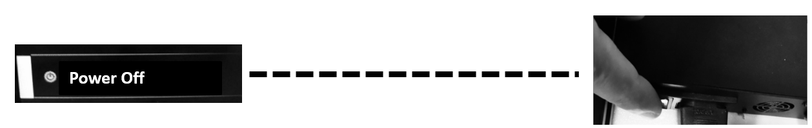

## <a id="choose-language">:globe_with_meridians: Choose language </a>

<!--  -->

-----
# Guide d'utilisation du Z8P-MK2
## Allumer et éteindre
#### :warning: ATTENTION ! :warning:
##### ASSUREZ-VOUS QUE LE COMMUTATEUR DE SÉLECTION DE TENSION AC EST RÉGLÉ SUR LA BONNE POSITION !

### ALLUMER
#### [:clapper: Tutoriel vidéo](https://github.com/ZONESTAR3D/Z8P/tree/main/Z8P-MK2/2-Operation_Guide/pic/PowerOn.gif)

1. Branchez le cordon d'alimentation
2. Allumez l'interrupteur d'alimentation CA.
3. Appuyez et maintenez enfoncé le bouton d'alimentation CC pendant environ 5 secondes.
4. Attendez que l'écran LCD affiche le logo, puis relâchez le bouton d'alimentation CC.
### ÉTEINDRE
#### [:clapper: Tutoriel vidéo](https://github.com/ZONESTAR3D/Z8P/tree/main/Z8P-MK2/2-Operation_Guide/pic/poweroff.gif)

Faites « Préparer>>Éteindre » sur l'écran LCD, attendez que l'écran LCD s'éteigne, puis éteignez l'interrupteur d'alimentation secteur.

## [Menu LCD et fonctionnement][LCD_MENU]

1. **Barre de titre :** Affiche le menu actuel
2. **Barre de menu :** Affiche les éléments du menu opérationnel de contrôle
3. **Barre d'état :** Affiche l'état important actuel de l'imprimante, y compris les informations sur la température, la vitesse d'impression et la hauteur Z.
4. **Poignée de contrôle :** Contrôlez l'imprimante, c'est un rouleau qui peut être tourné ou pressé.
   - **Rotation :** Sélectionnez l'élément de menu suivant/précédent ou modifiez la valeur de réglage.
   - **Cliquez :** Entrer dans le menu suivant / Exécuter la commande en cours / Confirmer la valeur modifiée.
5. **Impression depuis la carte SD :** Choisissez le fichier gcode sur la carte SD et imprimez-le.
6. **Préparer l'impression :** Préchauffage, prise d'origine, déplacement de l'axe, chargement/déchargement du filament, nivellement du lit chauffant, mise hors tension, etc., utilisés avant l'impression.
7. **Configurer la machine :** Définir les paramètres de fonctionnement, activer/désactiver les fonctions avancées.
8. **Informations sur la machine :** : affichez la version du micrologiciel et les informations de configuration matérielle de la machine.
#### À propos de la description du menu LCD, veuillez vous référer à la [:point_right:**Description du menu de l'écran LCD DWIN**][LCD_MENU].

## Préparez l'impression
### Nivelez le lit
Avant d'imprimer, vous devez ajuster la distance entre la buse et le film du lit chaud à une valeur appropriée, afin que le filament fondu puisse être bien collé sur le film du lit chaud. Ce processus est également appelé « lit de niveau ». Si la buse est trop éloignée du lit, le filament ne pourra pas coller au lit chaud. Si la distance est trop proche, le film du lit et la buse seront endommagés, voire la partie chaude sera bloquée.
##### [:clapper: Étape 1 : ](https://github.com/ZONESTAR3D/Z8P/tree/main/Z8P-MK2/2-Operation_Guide/pic/HomeAll.gif) Allumez l'imprimante 3D et puis faites « Prepare>>Auto Home>>Home All » sur le MENU LCD, attendez que le hotend aille en position HOME.
##### Étape 2 : Serrez les écrous à main sous le lit pour faire descendre le lit jusqu'à la position la plus basse (Fig. 1).
##### [:clapper: Étape 3:](https://github.com/ZONESTAR3D/Z8P/tree/main/Z8P-MK2/2-Operation_Guide/pic/Level_corners.gif) Faites « Préparer>> Lit mise à niveau>> Point 1" sur le panneau de commande (Fig. 2), la buse ira jusqu'aux coins du lit, desserrez les écrous à main sous le foyer (Fig. 3) et laissez la buse toucher presque le foyer (Fig. 4). Continuez à faire « Point 2/3/4 » jusqu'à ce que les 4 coins soient nivelés.
##### Étape 4 : Répétez l'étape 3 et faites 2 à 3 tours, jusqu'à ce que les quatre coins soient à la même hauteur.

### Charger les filaments
#### [:clapper: Tutoriel vidéo](https://youtu.be/-47yB95uIxI)
Cette imprimante est équipée de quatre extrudeuses et d'une extrémité chaude de mélange de couleurs 4-IN-1-OUT. Les extrudeuses et le hot end sont reliés par un guide filament (tube PTFE). :warning:**Avant d'imprimer, vous devez charger les 4 filaments dans les extrudeuses et les insérer dans le bas de l'extrémité chaude.**
##### Étape 1. Faites « Préparer>>Auto Home>>Home All » sur le panneau de commande, puis faites « Préparer>>Température>> Préchauffer le PLA », en attendant que la température de la buse atteigne 190 ℃ (Fig. 1).
##### Étape 2. Utilisez une pince diagonale pour couper la tête du filament (Fig. 2), puis appuyez sur la poignée de l'extrudeuse n°1 et insérez le filament, poussez le filament jusqu'à ce que vous puissiez voir le filament dans le PTFE. guide (Fig. 3). Faites tourner l'engrenage de l'extrudeuse n°1 (Fig. 4), observez le filament jusqu'à ce qu'il entre au bas de l'extrémité chaude.
##### Étape 3. En utilisant la même méthode qu'à l'étape 2 pour charger les filaments dans l'extrudeuse n°2 ~ l'extrudeuse n°4, surveillez les filaments jusqu'à ce qu'ils entrent dans le bas de l'extrémité chaude.
##### Étape 4. Faites tourner lentement l'engrenage de l'extrudeuse n°1 ~ de l'extrudeuse n°4 un par un et observez la buse jusqu'à ce que vous puissiez voir le filament s'écouler de la buse (Fig. 5).
#### :warning: le menu "Charger rapidement" ne peut être utilisé que lors du chargement du filament de l'extrudeuse à l'extrémité chaude. Une fois le filament entré dans l'extrémité chaude, utilisez le menu "Charger lentement" mais pas "Charger rapidement".

## Imprimer depuis la carte SD
[:clapper: Tutoriel vidéo](https://youtu.be/ITHbO9VxTMo)
#### Étape 1. Insérez la carte SD dans la prise pour carte SD de l'imprimante (Fig. 1).
##### :pushpin: Z8PM4Pro-MK2A a ajouté une prise pour carte SD sur le côté de la machine, ce qui est plus pratique pour accéder à la carte SD.
:avertissement : Attention vous ne pouvez en choisir qu'un seul (carte SD sur le côté ou carte Micro-SD en façade) lors de l'impression.

#### Étape 2. Cliquez sur « Imprimer » sur le panneau de commande et choisissez « Test gcode\xyz_cube.gcode » (Fig 2), cliquez sur le bouton pour lancer l'impression.
#### Étape 3. Attendez que la hotend et le foyer atteignent la température de réglage (Fig. 3), la buse reviendra à la position d'origine, puis se déplacera au-dessus de la plate-forme d'impression et extrudera le filament, utilisez une pince à épiler pour retirez le filament de sortie (Fig. 4).
#### Étape 4. Lorsque la buse s'est déplacée vers le lit chaud et commence à imprimer, double-cliquez sur le bouton du panneau de commande pour ouvrir un menu « Baby steps Z » (Fig 5), tournez lentement le bouton pour affiner la hauteur. de la plate-forme d'impression, surveillez la distance entre la buse et le lit, jusqu'à ce que la distance soit correcte (Fig. 6). Attendez que l'impression soit terminée, vous obtiendrez vos premiers ouvrages (Fig 7).
#### Étape 5. Attendez que le foyer refroidisse (<=25 degrés) (Fig. 8), puis retirez l'objet imprimé du foyer (Fig. 9).

## Fonctionnalités avancées
:warning: N'activez pas ces fonctions tant que vous n'avez pas clairement compris comment les utiliser.
### [Fonction de mélange des couleurs][MIX_COLOR]
Cette imprimante équipée de 4 extrudeuses et d'une extrémité chaude de mélange de couleurs 4-EN-1-OUT, elle peut non seulement imprimer jusqu'à 16 couleurs de fichiers 3D, mais elle peut également imprimer un mode 3D monocolore sur un modèle 3D dégradé de couleurs. Pour plus de détails, veuillez vous référer au [**:point_right:Mixing Color Feature User Guide**][MIX_COLOR].

### [Niveau automatique du lit][AUTO_LEVELING]
Cette imprimante est équipée d'un capteur de nivellement du lit PL-08N, avec ce capteur, vous pouvez corriger les irrégularités du lit chauffant.
Pour plus de détails, veuillez vous référer au [**:point_right : Guide de l'utilisateur de la fonction de nivellement automatique du lit**][AUTO_LEVELING].

### [Arrêt automatique][AUTO_SHUTDOWN]
#### [:clapper: **Tutoriel vidéo**](https://youtu.be/SJLpmJL-tG4).
L'impression 3D prend généralement beaucoup de temps et il se peut que vous ne soyez pas à proximité de la machine une fois l'impression terminée. Vous pouvez laisser l'imprimante s'éteindre automatiquement une fois l'impression terminée pour économiser une consommation d'énergie inutile.

### [Récupération après perte de puissance](https://youtu.be/f-PpasByiiE)
#### [:clapper: **Tutoriel vidéo**](https://youtu.be/f-PpasByiiE).
Pendant l'impression à partir de la carte SD et la coupure de courant, après la remise sous tension, l'imprimante reprendra l'impression à partir de la dernière couche imprimée avant la coupure de courant.

### [Rétraction automatique][AUTO_RETRACTION]
Le problème des cordes du hotend de couleurs mélangées est souvent plus grave que celui du hotend de couleur unique. Par conséquent, une fonction de rétraction automatique est définie dans le micrologiciel. L'utilisation de la rétraction automatique peut améliorer ce problème.
Pour plus de détails, veuillez vous référer au [**:point_right : Guide de l'utilisateur de la fonction de rétraction automatique**][AUTO_RETRACTION].

## Tranchage
Le logiciel de découpage est un logiciel informatique utilisé dans la majorité des processus d'impression 3D pour la conversion d'un modèle d'objet 3D en instructions spécifiques pour l'imprimante. Notamment la conversion d'un modèle au format STL(Obj, Amf) vers des commandes d'imprimante au format g-code.
Cette machine peut utiliser une variété de logiciels de découpage pour terminer le découpage. Nous fournissons des adresses de téléchargement, des instructions et des didacticiels vidéo de logiciels de découpage courants.
Pour plus de détails, veuillez vous référer à [**:point_right: Slicing-Guide**][SLICING_GUIDE_Z8P].
#### :loudspeaker: REMARQUE
1. Le logiciel de découpage ne fait pas partie de cette machine, vous pouvez télécharger le logiciel de découpage gratuitement sur Internet.
2. Si vous imprimez une couleur, veuillez choisir la machine **« Z8 + Une couleur »**. Si vous imprimez en multicolore, veuillez choisir la machine **« Z8 + M4 hot end »**.
3. Certains guides d'utilisation et didacticiels vidéo font référence à nos machines de la série Z9 et sont entièrement applicables au Z8PM4.

----
## Contrôle par PC / Impression depuis PC
:warning: Nous recommandons d'imprimer depuis une carte SD plutôt que depuis un PC.
Pour le ZPM4Pro-MK2, si vous pensez qu'il est difficile d'accéder (insérer et retirer) la carte SD, il est recommandé d'acheter une rallonge de carte Mirco-SD ([**Lien de vente**](https://www.aliexpress.com/item/3256805156643681.htm)).     
     
Si vous souhaitez imprimer depuis un PC, nous vous recommandons d'utiliser le logiciel "Repetier-Host". Pour savoir comment télécharger et utiliser repetier-Host, veuillez vous référer au [**le guide de l'utilisateur pour l'impression depuis un PC**][PRINTFROMPC].   

-----
[LCD_MENU]: https://github.com/ZONESTAR3D/Z8P/tree/main/Z8P-MK2/2-Operation_Guide/DWIN_LCD_screen_Menu_Description
[MIX_COLOR]: https://github.com/ZONESTAR3D/Document-and-User-Guide/tree/master/Mixing_Color
[AUTO_LEVELING]: https://github.com/ZONESTAR3D/Z8P/tree/main/Z8P-MK2/2-Operation_Guide/Bed_Auto_Leveling
[AUTO_SHUTDOWN]: https://github.com/ZONESTAR3D/Z8P/tree/main/Z8P-MK2/2-Operation_Guide/Auto_Shut_Down
[AUTO_RETRACTION]: https://github.com/ZONESTAR3D/Z8P/tree/main/Z8P-MK2/2-Operation_Guide/Auto_Retraction
[SLICING_GUIDE_Z8P]: https://github.com/ZONESTAR3D/Z8P/tree/main/Z8P-MK2/4-SlicingGuide
[PRINTFROMPC]: https://github.com/ZONESTAR3D/Z8P/tree/main/Z8P-MK2/2-Operation_Guide/PrintFromPC

