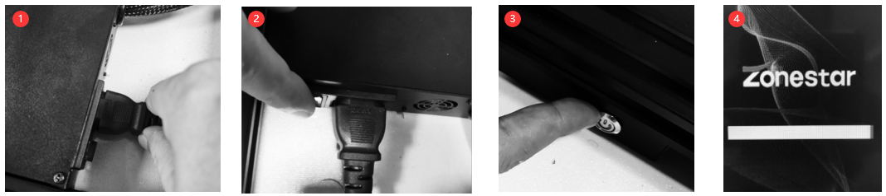

## <a id="choose-language">:globe_with_meridians: Choose language </a>

<!--  -->

-----
# Guida operativa Z8P-MK2
## Accensione e spegnimento
#### :warning: ATTENZIONE! :warning:
##### ASSICURARSI CHE L'INTERRUTTORE DI SELEZIONE DELLA TENSIONE CA SIA IMPOSTATO NELLA POSIZIONE CORRETTA!

### ACCENSIONE
#### [:clapper: Video Tutorial](https://github.com/ZONESTAR3D/Z8P/tree/main/Z8P-MK2/2-Operation_Guide/pic/PowerOn.gif)

1. Collegare il cavo di alimentazione
2. Accendere l'interruttore di alimentazione CA.
3. Tenere premuto il pulsante di alimentazione CC per circa 5 secondi
4. Attendere finché sul display LCD non viene visualizzato il logo, quindi rilasciare il pulsante di alimentazione CC
### SPEGNI
#### [:clapper: Video Tutorial](https://github.com/ZONESTAR3D/Z8P/tree/main/Z8P-MK2/2-Operation_Guide/pic/poweroff.gif)

Eseguire "Prepara >>Spegni" sullo schermo LCD, attendere che lo schermo LCD si spenga, quindi spegnere l'interruttore di alimentazione CA.

## [Menu LCD e funzionamento][LCD_MENU]

1. **Barra del titolo:** mostra il menu corrente
2. **Barra dei menu:** Mostra le voci del menu operativo di controllo
3. **Barra di stato:** Visualizza lo stato attuale importante della stampante, comprese le informazioni su temperatura, velocità di stampa e altezza Z
4. **Maniglia di controllo:** Controlla la stampante, è un rullo che può essere ruotato o premuto.
   - **Rotazione:** seleziona la voce di menu successiva/precedente o modifica il valore dell'impostazione.
   - **Clicca su:** Accedi al menu successivo / Esegui il comando corrente / Conferma il valore modificato.
5. **Stampa dalla scheda SD:** Scegli il file gcode dalla scheda SD e stampalo.
6. **Preparazione alla stampa:** Preriscaldamento, homing, spostamento dell'asse, caricamento/scaricamento del filamento, livellamento del letto caldo, spegnimento, ecc., utilizzati prima della stampa.
7. **Configurare la macchina:** impostare i parametri operativi, abilitare/disabilitare le funzioni avanzate.
8. **Informazioni sulla macchina:**: Visualizza la versione del firmware e le informazioni sulla configurazione hardware della macchina.
#### Per la descrizione del menu LCD, fare riferimento alla [:point_right:**Descrizione del menu dello schermo LCD DWIN**][LCD_MENU].

## Preparati a stampare
### Livella il letto
Prima della stampa, è necessario regolare la distanza tra l'ugello e la pellicola del letto caldo su un valore adeguato, in modo che il filamento fuso possa essere incollato bene sulla pellicola del letto caldo. Questo processo è anche chiamato “letto livellato”. Se l'ugello è troppo lontano dal letto, il filamento non potrà aderire al letto caldo. Se la distanza è troppo ravvicinata, la pellicola del letto e l'ugello verranno danneggiati o anche l'estremità calda verrà bloccata.
##### [:clapper: Passaggio 1: ](https://github.com/ZONESTAR3D/Z8P/tree/main/Z8P-MK2/2-Operation_Guide/pic/HomeAll.gif) Accendi la stampante 3D e quindi eseguire "Prepara >> Auto Home >> Home All" sul MENU LCD, attendere che l'hotend raggiunga la posizione HOME.
##### Passo 2: Stringere i dadi a mano sotto il letto per abbassare il letto nella posizione più bassa (Fig. 1).
##### [:clapper: Passaggio 3:](https://github.com/ZONESTAR3D/Z8P/tree/main/Z8P-MK2/2-Operation_Guide/pic/Level_corners.gif) Esegui “Prepara >> Letto livellamento >> Punto 1” sul pannello di controllo (Fig 2), l'ugello andrà agli angoli del letto, allentare i dadi a mano sotto il piano caldo (Fig 3) e lasciare che l'ugello quasi tocchi il piano caldo (Fig 4). Continua a fare il “Punto 2/3/4” finché tutti e 4 gli angoli non saranno stati livellati.
##### Passaggio 4: ripeti il passaggio 3 ed esegui 2 ~ 3 giri, fino a quando tutti e quattro gli angoli sono alla stessa altezza.

### Caricare i filamenti
#### [:clapper: Video Tutorial](https://youtu.be/-47yB95uIxI)
Questa stampante è dotata di quattro estrusori e un hot end per la miscelazione dei colori 4-IN-1-OUT. Gli estrusori e l'hot end sono collegati da una guida del filamento (tubo in PTFE). :avviso:**Prima di stampare, è necessario caricare tutti e 4 i filamenti negli estrusori e inserirli nella parte inferiore dell'hot end.**
##### Passaggio 1. Eseguire "Preparazione>>Auto Home>>Home All" sul pannello di controllo, quindi eseguire "Preparazione>>Temperatura>> Preriscaldamento PLA", attendendo che la temperatura dell'ugello raggiunga 190 ℃ (Fig 1).
##### Passaggio 2. Utilizzare una pinza diagonale per tagliare la testa del filamento (Fig 2), quindi premere la maniglia dell'estrusore n. 1 e inserire il filamento, spingere il filamento finché non si vede il filamento nel PTFE guida (Fig. 3). Ruota l'ingranaggio dell'estrusore n. 1 (Fig. 4), osserva il filamento finché non entra nella parte inferiore dell'hot end.
##### Passaggio 3. Utilizzando lo stesso metodo del passaggio 2 per caricare i filamenti nell'estrusore n. 2 ~ estrusore n. 4, osservare i filamenti finché non entrano nella parte inferiore dell'hot end.
##### Passaggio 4. Ruota lentamente l'ingranaggio dell'estrusore n. 1 ~ dell'estrusore n. 4 uno alla volta e osserva l'ugello, finché non vedi il filamento fuoriuscire dall'ugello (Fig 5).
#### :warning: il menu "Caricamento rapido" può essere utilizzato solo quando si carica il filamento dall'estrusore all'hotend, una volta che il filamento è entrato nell'hotend, utilizzare il menu "Caricamento lento" ma non "Caricamento rapido".

## Stampa dalla scheda SD
[:clapper: Video Tutorial](https://youtu.be/ITHbO9VxTMo)
#### Passaggio 1. Inserire la scheda SD nell'apposita presa sulla stampante (Fig. 1).
##### :pushpin: Z8PM4Pro-MK2A ha aggiunto una presa per scheda SD sul lato della macchina, che è più comoda per accedere alla scheda SD.
:warning: Tieni presente che puoi sceglierne solo una (scheda SD sul lato o scheda Micro-SD sulla parte anteriore) durante la stampa.

#### Passaggio 2. Fare clic su "Stampa" sul pannello di controllo e scegliere "Test gcode\xyz_cube.gcode" (Fig 2), fare clic sulla manopola per avviare la stampa.
#### Passaggio 3. Attendere fino a quando l'hotend e il piano caldo non raggiungono la temperatura impostata (Fig 3), l'ugello si posizionerà nella posizione di origine, quindi si sposterà sopra la piattaforma di stampa ed estruderà il filamento, utilizzare una pinzetta per rimuovere il filamento in uscita (Fig 4).
#### Passaggio 4. Quando l'ugello si è spostato sul letto caldo e ha iniziato a stampare, fare doppio clic sulla manopola sul pannello di controllo per aprire il menu "Baby Steps Z" (Fig. 5), ruotare lentamente la manopola per regolare con precisione l'altezza della piattaforma di stampa, osservare la distanza dall'ugello al piano, finché la distanza non risulta ottimale (Fig. 6). Attendi che la stampa sia terminata, otterrai i tuoi primi lavori (Fig 7).
#### Passaggio 5. Attendere che il piano cottura si raffreddi (<=25 gradi) (Fig 8), quindi rimuovere l'oggetto stampato dal piano cottura (Fig 9).

## Funzionalità avanzate
:avviso: Non attivare queste funzioni finché non si capisce chiaramente come usarle.
### [Funzione di miscelazione dei colori][MIX_COLOR]
Questa stampante dotata di 4 estrusori e un hot end di miscelazione dei colori 4-IN-1-OUT, non solo può stampare file 3D fino a 16 colori, ma può anche stampare una modalità 3D a colore singolo su un modello 3D a colori sfumati. Per i dettagli, fare riferimento a [**:point_right:Guida per l'utente della funzione Mixing Color**][MIX_COLOR].

### [Livellamento automatico letto][AUTO_LEVELING]
Questa stampante è dotata di un sensore di livellamento del letto PL-08N, con questo sensore è possibile correggere le irregolarità del letto caldo.
Per i dettagli, fare riferimento a [**:point_right: Guida per l'utente della funzione di livellamento automatico del letto**][AUTO_LEVELING].

### [Spegnimento automatico][AUTO_SHUTDOWN]
#### [:clapper: **Video tutorial**](https://youtu.be/SJLpmJL-tG4).
La stampa 3D in genere richiede molto tempo e potresti non essere vicino alla macchina al termine della stampa. È possibile lasciare che la stampante si spenga automaticamente al termine della stampa per risparmiare un inutile consumo energetico.

### [Recupero perdita di potenza](https://youtu.be/f-PpasByiiE)
#### [:clapper: **Video tutorial**](https://youtu.be/f-PpasByiiE).
Durante la stampa dalla scheda SD e si verifica un'interruzione dell'alimentazione, dopo la riaccensione la stampante riprenderà a stampare dall'ultimo strato stampato prima dell'interruzione dell'alimentazione.

### [Ritiro automatico][AUTO_RETRACTION]
Il problema delle stringhe dell'hotend a colori misti è spesso più serio di quello dell'hotend a colore singolo. Pertanto, nel firmware è impostata una funzione di ritrazione automatica. L'uso della retrazione automatica può migliorare questo problema.
Per i dettagli, fare riferimento a [**:point_right: Guida per l'utente della funzione di ritrazione automatica**][AUTO_RETRACTION].

## Affettare
Il software di slicing è un software per computer utilizzato nella maggior parte dei processi di stampa 3D per la conversione di un modello di oggetto 3D in istruzioni specifiche per la stampante. In particolare, la conversione da un modello in formato STL (Obj, Amf) a comandi della stampante in formato g-code.
Questa macchina può utilizzare una varietà di software di slicing per completare l'affettatura. Forniamo indirizzi di download, istruzioni e tutorial video dei comuni software di slicing.
Per i dettagli, fare riferimento a [**:point_right: Slicing-Guide**][SLICING_GUIDE_Z8P].
#### :loudspeaker: NOTA
1. Il software di slicing non fa parte di questa macchina, è possibile scaricarlo gratuitamente da Internet.
2. Se stampi a un colore, scegli la macchina **“Z8 + Un colore”**. Se stampi a più colori, scegli la macchina **“Z8 + M4 hot end”**.
3. Alcune guide per l'utente e tutorial video sono realizzati con riferimento alle nostre macchine della serie Z9 e sono completamente applicabili a Z8PM4.

----
## Controllo da PC / Stampa da PC
:warning: Si consiglia di stampare dalla scheda SD anziché da un PC.
Per ZPM4Pro-MK2, se ritieni che sia difficile accedere (inserire e rimuovere) la scheda SD, si consiglia di acquistare un extender per scheda Mirco-SD ([**Link vendita**](https://www.aliexpress.com/item/3256805156643681.htm)).     
#### 
Se si desidera stampare da PC, si consiglia di utilizzare il software "Repetier-Host". Per informazioni su come scaricare e utilizzare repetier-Host, fare riferimento a [**la guida per l'utente della stampa da PC**][PRINTFROMPC].

-----
[LCD_MENU]: https://github.com/ZONESTAR3D/Z8P/tree/main/Z8P-MK2/2-Operation_Guide/DWIN_LCD_screen_Menu_Description
[MIX_COLOR]: https://github.com/ZONESTAR3D/Document-and-User-Guide/tree/master/Mixing_Color
[AUTO_LEVELING]: https://github.com/ZONESTAR3D/Z8P/tree/main/Z8P-MK2/2-Operation_Guide/Bed_Auto_Leveling
[AUTO_SHUTDOWN]: https://github.com/ZONESTAR3D/Z8P/tree/main/Z8P-MK2/2-Operation_Guide/Auto_Shut_Down
[AUTO_RETRACTION]: https://github.com/ZONESTAR3D/Z8P/tree/main/Z8P-MK2/2-Operation_Guide/Auto_Retraction
[SLICING_GUIDE_Z8P]: https://github.com/ZONESTAR3D/Z8P/tree/main/Z8P-MK2/4-SlicingGuide
[PRINTFROMPC]: https://github.com/ZONESTAR3D/Z8P/tree/main/Z8P-MK2/2-Operation_Guide/PrintFromPC

