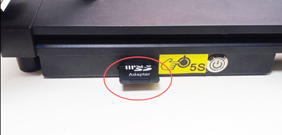
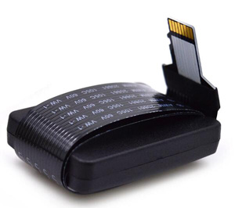

## <a id="choose-language">:globe_with_meridians: Choose language </a>

<!--  -->

-----
# Z8P-MK2 操作ガイド
## 電源オンと電源オフ
#### :warning: 注意! :warning:
##### AC 電圧選択スイッチが正しい位置に設定されていることを確認してください。

＃＃＃ 電源オン
#### [:clapper: ビデオ チュートリアル](https://github.com/ZONESTAR3D/Z8P/tree/main/Z8P-MK2/2-Operation_Guide/pic/PowerOn.gif)

1. 電源コードを差し込みます
2. AC 電源スイッチをオンにします。
3. DC 電源ボタンを約 5 秒間押し続けます。
4. LCD にロゴが表示されるまで待ち、DC 電源ボタンを放します。
＃＃＃ 電源を切る
#### [:clapper: ビデオ チュートリアル](https://github.com/ZONESTAR3D/Z8P/tree/main/Z8P-MK2/2-Operation_Guide/pic/poweroff.gif)

LCD 画面で「Prepare>>Power Off」を実行し、LCD 画面がオフになるまで待ってから、AC 電源スイッチをオフにします。

## [LCD メニューと操作][LCD_MENU]

1. **タイトル バー:** 現在のメニューを表示します
2. **メニューバー:** 制御操作のメニュー項目を表示します。
3. **ステータス バー:** 温度、印刷速度、Z 高さの情報など、プリンターの現在の重要なステータスを表示します。
4. **コントロール ハンドル:** プリンターを制御します。これは回転または押すことができるローラーです。
   - **回転:** 次/前のメニュー項目を選択するか、設定値を変更します。
   - **クリック:** 次のメニューに入る / 現在のコマンドを実行する / 変更した値を確認します。
5. **SD カードからの印刷:** SD カードから gcode ファイルを選択して印刷します。
6. **印刷の準備:** 印刷前に、予熱、ホーミング、軸の移動、フィラメントのロード/アンロード、ホットベッドの水平調整、電源オフなどを行います。
7. **マシンのセットアップ:** 操作パラメータを設定し、高度な機能を有効/無効にします。
8. **マシンの情報:**: マシンのファームウェアのバージョン、ハードウェア構成情報を表示します。
#### LCD メニューの説明については、[:point_right:**DWIN LCD 画面のメニュー説明**][LCD_MENU]を参照してください。

## 印刷の準備をする
### ベッドを水平にする
印刷する前に、溶融したフィラメントがホットベッドフィルムにうまく貼り付くように、ノズルとホットベッドフィルムの間の距離を適切な値に調整する必要があります。 このプロセスは「レベルベッド」とも呼ばれます。 ノズルがベッドから遠すぎると、フィラメントがホットベッドに付着できなくなります。 距離が近すぎると、ベッドフィルムやノズルが損傷したり、ホットエンドが詰まったりすることがあります。
##### [:clapper: ステップ 1: ](https://github.com/ZONESTAR3D/Z8P/tree/main/Z8P-MK2/2-Operation_Guide/pic/HomeAll.gif) 3D プリンターの電源をオンにし、 次に、LCD メニューで「準備 >> 自動ホーム >> すべてホーム」を実行し、ホットエンドがホーム位置に移動するのを待ちます。
##### ステップ 2: ベッドの下のハンド ナットを締めて、ベッドを最も低い位置まで下げます (図 1)。
##### [:clapper: ステップ 3:](https://github.com/ZONESTAR3D/Z8P/tree/main/Z8P-MK2/2-Operation_Guide/pic/Level_corners.gif) 「準備>> ベッド」を実行します レベリング>> コントロールパネルのポイント 1 (図 2) に合わせると、ノズルがベッドの隅に行き、ホットベッドの下にあるハンドナットを緩め (図 3)、ノズルがホットベッドにほぼ接触するようになります (図 4)。 4つの角がすべて水平になるまで「ポイント2/3/4」を続けます。
##### ステップ 4: ステップ 3 を繰り返し、四隅がすべて同じ高さになるまで 2 ～ 3 回繰り返します。

### フィラメントをロードする
#### [:clapper: ビデオチュートリアル](https://youtu.be/-47yB95uIxI)
このプリンタには、4 つの押出機と 1 つの 4-IN-1-OUT カラーミキシングホットエンドが装備されています。 押出機とホットエンドはフィラメントガイド（PTFEチューブ）で接続されています。 :warning:**印刷する前に、4 本のフィラメントすべてを押出機にロードし、ホットエンドの底部にフィードする必要があります。**
##### ステップ 1. コントロール パネルで「準備>>自動ホーム>>ホームオール」を実行し、「準備>>温度>>PLA を予熱」を実行し、ノズル温度が 190 ℃に達するのを待ちます (図 1)。
##### ステップ 2. 斜めペンチを使用してフィラメントの頭を切り落とし (図 2)、エクストルーダー #1 のハンドルを押してフィラメントを挿入し、PTFE の中にフィラメントが見えるまでフィラメントを押します。 ガイド (図 3)。 エクストルーダー #1 (図 4) のギアを回転させ、フィラメントがホットエンドの底に入るまで観察します。
##### ステップ 3. ステップ 2 と同じ方法を使用して、フィラメントを押出機 #2 ～ 押出機 #4 にロードし、フィラメントがホットエンドの底部に入るまで観察します。
##### ステップ 4. エクストルーダー #1 ～エクストルーダー #4 のギアを 1 つずつゆっくりと回転させ、ノズルからフィラメントが流れ出すのが確認できるまでノズルを観察します (図 5)。
#### :warning: 「クイックロード」メニューは、フィラメントをエクストルーダーからホットエンドにロードする場合にのみ使用できます。フィラメントがホットエンドに入ったら、「クイックロード」ではなく「ゆっくりロード」メニューを使用してください。

## SDカードから印刷
[:clapper: ビデオチュートリアル](https://youtu.be/ITHbO9VxTMo)
#### ステップ 1. SD カードをプリンターの SD カード ソケットに挿入します (図 1)。
##### :pushpin: Z8PM4Pro-MK2A では、マシンの側面に SD カード ソケットが追加され、SD カードへのアクセスがより便利になりました。
:warning: 印刷時に選択できるのはいずれか 1 つ (側面の SD カードまたは前面の Micro-SD カード) のみであることに注意してください。

#### ステップ 2. コントロール パネルの [印刷] をクリックし、[Test gcode\xyz_cube.gcode] (図 2) を選択し、ノブをクリックして印刷を開始します。
#### ステップ 3. ホットエンドとホットベッドが設定温度に達するまで待ちます (図 3)。ノズルは原点位置に戻り、印刷プラットフォームの上に移動してフィラメントを押し出し、ピンセットを使用してフィラメントを押し出します。 流出フィラメントを取り外します (図 4)。
#### ステップ 4. ノズルがホットベッドに移動して印刷が開始されたら、コントロール パネルのノブをダブルクリックして「ベイビー ステップ Z」メニュー (図 5) を開き、ノブをゆっくり回して高さを微調整します。 印刷プラットフォームのノズルからベッドまでの距離が適切になるまで監視します (図 6)。 印刷が完了するまで待つと、最初の作品が得られます (図 7)。
#### ステップ 5. ホットベッドが冷めるまで (25 度以下) (図 8)、ホットベッドから印刷されたオブジェクトを取り外します (図 9)。

## 高度な機能
:warning: 使用方法を明確に理解するまで、これらの機能をオンにしないでください。
### [ミキシングカラー機能][MIX_COLOR]
このプリンターは 4 つのエクストルーダーと 4-IN-1-OUT 混合カラー ホット エンドを備えており、最大 16 色の 3D ファイルを印刷できるだけでなく、単色 3D モードをグラデーション カラー 3D モデルに印刷することもできます。 詳細については、[**:point_right:ミキシングカラー機能ユーザーガイド**][MIX_COLOR]を参照してください。

### [ベッドの自動レベリング][AUTO_LEVELING]
本プリンタにはベッドレベリングセンサーPL-08Nが搭載されており、このセンサーによりホットベッドの凹凸を補正することができます。
詳細については、[**:point_right: ベッドオートレベリング機能ユーザーガイド**][AUTO_LEVELING]を参照してください。

### [自動シャットダウン][AUTO_SHUTDOWN]
#### [:clapper: **ビデオチュートリアル**](https://youtu.be/SJLpmJL-tG4)。
3D プリントには通常時間がかかり、プリントが終了したときにマシンの近くにいない可能性があります。 印刷終了時にプリンターを自動的にシャットダウンして、不必要な電力消費を節約できます。

### [停電復旧](https://youtu.be/f-PpasByiiE)
#### [:clapper: **ビデオチュートリアル**](https://youtu.be/f-PpasByiiE)。
SD カードから印刷中に電源が失われ、電源が再びオンになると、プリンターは電源が失われる前に印刷した最後のレイヤーから印刷を再開します。

### [自動撤回][AUTO_RETRACTION]
混合色のホットエンドの文字列の問題は、多くの場合、単色のホットエンドの問題よりも深刻です。 したがって、ファームウェアには自動格納機能が設定されています。 自動格納を使用すると、この問題を改善できます。
詳細については、[**:point_right: オートリトラクト機能ユーザーガイド**][AUTO_RETRACTION]を参照してください。

## スライス
スライシング ソフトウェアは、3D オブジェクト モデルをプリンターの特定の命令に変換するために、3D 印刷プロセスの大部分で使用されるコンピューター ソフトウェアです。 特に、STL(Obj、Amf) 形式のモデルから G コード形式のプリンター コマンドへの変換。
このマシンは、さまざまなスライス ソフトウェアを使用してスライスを完了できます。一般的なスライス ソフトウェアのダウンロード アドレス、手順、およびビデオ チュートリアルを提供します。
詳細は[**:point_right: スライシングガイド**][SLICING_GUIDE_Z8P]を参照してください。
#### :loudspeaker: 注意
1. スライス ソフトウェアはこのマシンには含まれていません。スライス ソフトウェアはインターネットから無料でダウンロードできます。
2. 1 色を印刷する場合は、**「Z8 + 1 色」** マシンを選択してください。 マルチカラーを印刷する場合は、マシン **「Z8 + M4 ホット エンド」** を選択してください。
3. ユーザー ガイドとビデオ チュートリアルの一部は、当社の Z9 シリーズ マシンを参照して作成されており、Z8PM4 に完全に適用できます。

----
## PCで制御 / PCから印刷
:warning: PC からではなく SD カードから印刷することをお勧めします。
ZPM4Pro-MK2の場合、SDカードへのアクセス(抜き差し)が難しいと思われる場合は、Mirco-SDカードエクステンダー([**販売リンク**](https://www.aliexpress.com/item/3256805156643681.htm))。
#### 
PC から印刷する場合は、「Repetier-Host」ソフトウェアの使用をお勧めします。repetier-Host のダウンロード方法と使用方法については、[**PC から印刷するユーザーガイド**][PRINTFROMPC]を参照してください。

-----
[LCD_MENU]: https://github.com/ZONESTAR3D/Z8P/tree/main/Z8P-MK2/2-Operation_Guide/DWIN_LCD_screen_Menu_Description
[MIX_COLOR]: https://github.com/ZONESTAR3D/Document-and-User-Guide/tree/master/Mixing_Color
[AUTO_LEVELING]: https://github.com/ZONESTAR3D/Z8P/tree/main/Z8P-MK2/2-Operation_Guide/Bed_Auto_Leveling
[AUTO_SHUTDOWN]: https://github.com/ZONESTAR3D/Z8P/tree/main/Z8P-MK2/2-Operation_Guide/Auto_Shut_Down
[AUTO_RETRACTION]: https://github.com/ZONESTAR3D/Z8P/tree/main/Z8P-MK2/2-Operation_Guide/Auto_Retraction
[SLICING_GUIDE_Z8P]: https://github.com/ZONESTAR3D/Z8P/tree/main/Z8P-MK2/4-SlicingGuide
[PRINTFROMPC]: https://github.com/ZONESTAR3D/Z8P/tree/main/Z8P-MK2/2-Operation_Guide/PrintFromPC

