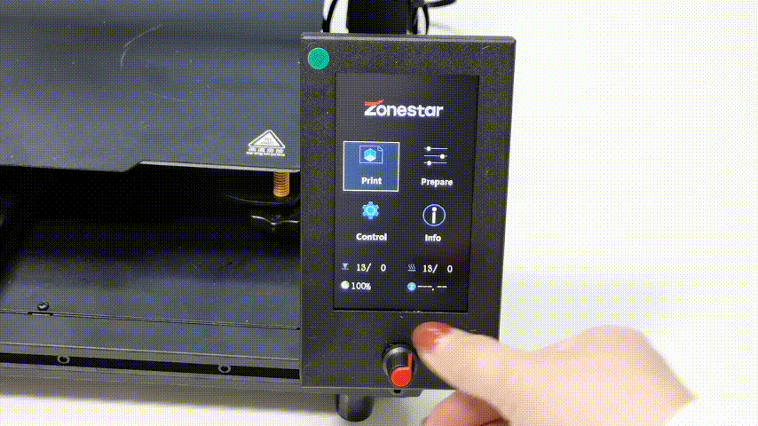

## <a id="choose-language">:globe_with_meridians: Choose language </a>

<!--  -->

-----
# Z8P-MK2 작동 가이드
## 전원 켜기 및 끄기
#### :warning: 주의! :warning:
##### AC 전압 선택 스위치가 올바른 위치에 설정되어 있는지 확인하세요!

### 전원 켜짐

1. 전원 코드를 연결합니다
2. AC 전원 스위치를 켜십시오.
3. DC 전원 버튼을 약 5초 동안 길게 누릅니다.
4. LCD에 로고가 표시될 때까지 기다린 다음 DC 전원 버튼을 놓습니다.
###### 
### 전원 끄기

LCD 화면에서 "준비>>전원 끄기"를 수행하고 LCD 화면이 꺼질 때까지 기다린 다음 AC 전원 스위치를 끄십시오.
###### 

## [LCD 메뉴 및 동작][LCD_MENU]

1. **제목 표시줄:** 현재 메뉴를 표시합니다.
2. **메뉴 바:** 제어 작동 메뉴 항목을 표시합니다.
3. **상태 표시줄:** 온도, 인쇄 속도, Z 높이 정보 등 프린터의 현재 중요한 상태를 표시합니다.
4. **제어 핸들:** 프린터를 제어합니다. 회전하거나 누를 수 있는 롤러입니다.
   - **회전:** 다음/이전 메뉴 항목을 선택하거나 설정값을 수정합니다.
   - **클릭:** 다음 메뉴 진입 / 현재 명령 실행 / 수정된 값 확인
5. **SD 카드에서 인쇄:** SD 카드에서 gcode 파일을 선택하고 인쇄합니다.
6. **인쇄 준비:** 인쇄하기 전에 예열, 원점 복귀, 축 이동, 필라멘트 로드/언로드, 핫베드 수평 조정, 전원 끄기 등이 사용됩니다.
7. **기계 설정:** 작동 매개변수를 설정하고 고급 기능을 활성화/비활성화합니다.
8. **머신 정보:**: 머신의 펌웨어 버전, 하드웨어 구성 정보를 봅니다.
#### LCD 메뉴 설명은 [:point_right:**DWIN LCD 화면 메뉴 설명**][LCD_MENU]를 참조하세요.

## 인쇄 준비
### 침대 수평을 맞추세요
프린팅 전, 노즐과 핫베드 필름 사이의 거리를 적절한 값으로 조정해야 녹은 필라멘트가 핫베드 필름에 잘 붙을 수 있습니다. 이 과정을 "레벨 베드"라고도 합니다. 노즐이 베드에서 너무 멀리 떨어져 있으면 필라멘트가 핫베드에 달라붙지 않습니다. 거리가 너무 가까우면 베드필름과 노즐이 손상되거나 핫엔드마저 막힐 수 있습니다.
##### Step 1: 3D 프린터의 전원을 켜고 그런 다음 LCD 메뉴에서 "Prepare>>Auto Home>>Home All"을 수행하고 핫엔드가 HOME 위치로 갈 때까지 기다립니다.

##### Step 2: 침대 아래 핸드 너트를 조여 침대를 가장 낮은 위치로 이동합니다(그림 1).
##### Step 3: “준비>> 침대”를 하세요 레벨링>> 제어판의 1” 지점(그림 2)에서 노즐이 베드 모서리로 이동하고 핫베드 아래의 핸드 너트를 풀고(그림 3) 노즐이 핫베드에 거의 닿게 됩니다(그림 4). 4개의 모서리가 모두 수평이 될 때까지 계속해서 "Point 2/3/4"를 수행합니다.
###### 
##### Step 4: 3단계를 반복하고 네 모서리가 모두 같은 높이가 될 때까지 2~3회 반복합니다.

### 필라멘트 로드
#### [:clapper: 동영상 튜토리얼](https://youtu.be/-47yB95uIxI)
이 프린터에는 4개의 압출기와 1개의 4-IN-1-OUT 색상 혼합 핫엔드가 장착되어 있습니다. 압출기와 핫 엔드는 필라멘트 가이드(PTFE 튜브)로 연결됩니다. :warning:**프린팅하기 전에 필라멘트 4개를 모두 압출기에 로드하고 핫엔드 바닥에 공급해야 합니다.**
##### Step 1. 제어판에서 "준비>>자동 홈>>홈 올"을 수행한 다음 "준비>>온도>> PLA 예열"을 수행하면 대기 노즐 온도가 190℃에 도달합니다(그림 1).
##### Step 2. 대각선 펜치를 사용하여 필라멘트 헤드를 잘라낸 후(그림 2), Extruder#1의 손잡이를 누르고 필라멘트를 삽입한 후 PTFE에 필라멘트가 보일 때까지 밀어 넣습니다. 가이드(그림 3). 압출기 #1(그림 4)의 기어를 회전하고 필라멘트가 핫 엔드 바닥에 들어갈 때까지 필라멘트를 관찰합니다.
##### Step 3. 2단계와 동일한 방법으로 필라멘트를 Extruder #2 ~ Extruder #4에 로딩하여 필라멘트가 핫엔드 하단으로 들어갈 때까지 지켜봅니다.
##### Step 4. Extruder#1 ~ Extruder#4의 기어를 하나씩 천천히 돌리면서 필라멘트가 노즐에서 흘러나오는 것을 볼 수 있을 때까지 노즐을 관찰합니다(그림 5).
#### :warning: "빠른 로드" 메뉴는 압출기에서 핫 엔드로 필라멘트를 로드할 때만 사용할 수 있습니다. 필라멘트가 핫 엔드에 들어가면 "느린 로드" 메뉴를 사용하고 "빠른 로드"는 사용할 수 없습니다.

## SD 카드에서 인쇄
[:clapper: 동영상 튜토리얼](https://youtu.be/ITHbO9VxTMo)
#### Step 1. SD 카드를 프린터의 SD 카드 소켓에 삽입합니다(그림 1).
##### :pushpin: Z8PM4Pro-MK2A는 기기 측면에 SD 카드 소켓을 추가하여 SD 카드에 액세스하는 것이 더 편리합니다.
:warning: 인쇄 시 둘 중 하나만 선택할 수 있습니다(측면의 SD 카드 또는 전면의 Micro-SD 카드).

#### Step 2. 제어판에서 “인쇄”를 클릭하고 “Test gcode\xyz_cube.gcode”(그림 2)를 선택한 다음 손잡이를 클릭하여 인쇄를 시작합니다.
#### Step 3. 핫엔드와 핫베드가 설정 온도에 도달할 때까지 기다립니다(그림 3). 노즐은 원점 위치로 이동한 다음 프린팅 플랫폼 위로 이동하여 필라멘트를 압출하고 핀셋을 사용하여 필라멘트를 압출합니다. 유출 필라멘트를 제거합니다(그림 4).
#### Step 4. 노즐이 핫베드로 이동하고 인쇄가 시작되면 제어판의 손잡이를 두 번 클릭하여 "Baby steps Z" 메뉴(그림 5)를 열고 손잡이를 천천히 돌려 높이를 미세 조정하세요. 프린팅 플랫폼의 거리가 잘 될 때까지 노즐에서 베드까지의 거리를 관찰합니다(그림 6). 인쇄가 완료될 때까지 기다리면 첫 번째 작품이 나옵니다(그림 7).
#### Step 5. 핫베드가 식을 때까지(<=25도) 기다린 후(그림 8), 프린트된 개체를 핫베드에서 제거합니다(그림 9).

## 고급 기능
:warning: 사용 방법을 명확하게 이해할 때까지 이 기능을 켜지 마십시오.
### [혼합 색상 기능][MIX_COLOR]
4개의 압출기와 4-IN-1-OUT 혼합 색상 핫 엔드가 장착된 이 프린터는 최대 16가지 색상의 3D 파일을 인쇄할 수 있을 뿐만 아니라 단일 색상 3D 모드를 그라데이션 색상 3D 모델로 인쇄할 수도 있습니다. 자세한 내용은 [**:point_right:혼합 색상 기능 사용 설명서**][MIX_COLOR]를 참조하세요.

### [침대 자동 수평 조절][AUTO_LEVELING]
이 프린터에는 PL-08N 베드 레벨링 센서가 장착되어 있으며, 이 센서를 사용하여 핫베드의 고르지 못한 부분을 교정할 수 있습니다.
자세한 내용은 [**:point_right: 침대 자동 레벨링 기능 사용 설명서**][AUTO_LEVELING]을 참조하세요.

### [자동 종료][AUTO_SHUTDOWN]
#### [:clapper: **동영상 튜토리얼**](https://youtu.be/SJLpmJL-tG4).
3D 프린팅은 일반적으로 시간이 오래 걸리며, 프린팅이 끝날 때 기기 근처에 있지 않을 수도 있습니다. 불필요한 전력 소비를 절약하기 위해 인쇄가 완료되는 동안 프린터가 자동으로 종료되도록 할 수 있습니다.

### [정전 복구](https://youtu.be/f-PpasByiiE)
#### [:clapper: **동영상 튜토리얼**](https://youtu.be/f-PpasByiiE).
SD 카드에서 인쇄하고 전원이 꺼진 동안 전원을 다시 켜면 프린터는 전원이 꺼지기 전에 인쇄했던 마지막 레이어부터 인쇄를 재개합니다.

### [자동 철회][AUTO_RETRACTION]
혼합 색상 핫엔드의 스트링 문제는 단색 핫엔드의 스트링 문제보다 더 심각한 경우가 많습니다. 따라서 자동 철회 기능이 펌웨어에 설정되어 있습니다. 자동 철회를 사용하면 이 문제를 개선할 수 있습니다.
자세한 내용은 [**:point_right: 자동 후퇴 기능 사용 설명서**][AUTO_RETRACTION]를 참조하세요.

## 슬라이싱
슬라이싱 소프트웨어는 3D 개체 모델을 프린터의 특정 지침으로 변환하기 위해 대부분의 3D 프린팅 프로세스에 사용되는 컴퓨터 소프트웨어입니다. 특히 STL(Obj, Amf) 형식의 모델을 g-code 형식의 프린터 명령으로 변환합니다.
이 기계는 다양한 슬라이싱 소프트웨어를 사용하여 슬라이싱을 완료할 수 있습니다. 우리는 일반적인 슬라이싱 소프트웨어의 다운로드 주소, 지침 및 비디오 튜토리얼을 제공합니다.
자세한 내용은 [**:point_right: Slicing-Guide**][SLICING_GUIDE_Z8P]를 참고하세요.
#### :loudspeaker: 참고
1. 슬라이싱 소프트웨어는 이 기계의 일부가 아니며 인터넷에서 슬라이싱 소프트웨어를 무료로 다운로드할 수 있습니다.
2. 한 가지 색상을 인쇄하는 경우 기계 **“Z8 + One color”** 를 선택하십시오. 여러 색상을 인쇄하는 경우 기계 **“Z8 + M4 Hot end”** 를 선택하십시오.
3. 일부 사용자 가이드 및 비디오 튜토리얼은 Z9 시리즈 시스템을 참조하여 제작되었으며 Z8PM4에 완벽하게 적용됩니다.

----
## PC로 제어 / PC에서 인쇄
:warning: PC보다는 SD 카드에서 인쇄하는 것을 권장합니다.
ZPM4Pro-MK2의 경우 SD카드 접근(삽입 및 제거)이 어렵다고 생각되시면 Mirco-SD카드 확장기([**판매링크**](https://www.aliexpress.com/item/3256805156643681.htm)).     
#####      
PC에서 인쇄하려면 "Repetier-Host" 소프트웨어 사용을 권장하며, Repetier-Host 다운로드 및 사용 방법은 [**PC에서 인쇄 사용 설명서**][PRINTFROMPC]를 참조하세요.

-----
[LCD_MENU]: https://github.com/ZONESTAR3D/Z8P/tree/main/Z8P-MK2/2-Operation_Guide/DWIN_LCD_screen_Menu_Description
[MIX_COLOR]: https://github.com/ZONESTAR3D/Document-and-User-Guide/tree/master/Mixing_Color
[AUTO_LEVELING]: https://github.com/ZONESTAR3D/Z8P/tree/main/Z8P-MK2/2-Operation_Guide/Bed_Auto_Leveling
[AUTO_SHUTDOWN]: https://github.com/ZONESTAR3D/Z8P/tree/main/Z8P-MK2/2-Operation_Guide/Auto_Shut_Down
[AUTO_RETRACTION]: https://github.com/ZONESTAR3D/Z8P/tree/main/Z8P-MK2/2-Operation_Guide/Auto_Retraction
[SLICING_GUIDE_Z8P]: https://github.com/ZONESTAR3D/Z8P/tree/main/Z8P-MK2/4-SlicingGuide
[PRINTFROMPC]: https://github.com/ZONESTAR3D/Z8P/tree/main/Z8P-MK2/2-Operation_Guide/PrintFromPC

