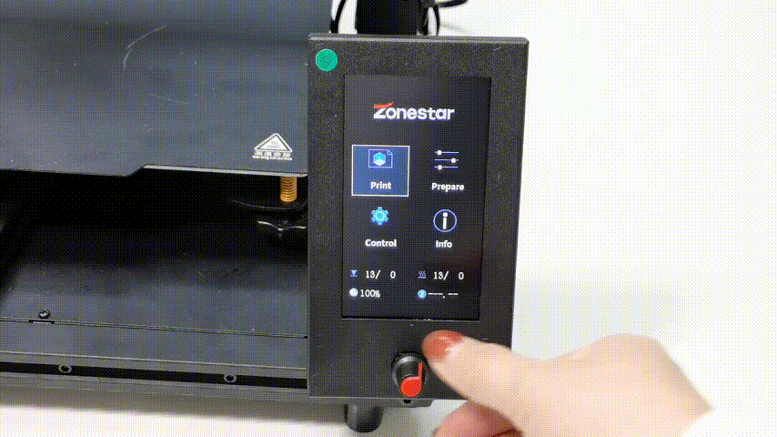

## <a id="choose-language">:globe_with_meridians: Choose language </a>

<!--  -->

-----
# Z8P-MK2 Guia de operação
## LIGAR e desligar
#### :warning: ATENÇÃO! :warning:
##### CERTIFIQUE-SE DE QUE O INTERRUPTOR DE SELEÇÃO DE TENSÃO CA ESTÁ NA POSIÇÃO CORRETA!

### LIGAR

1. Conecte o cabo de alimentação
2. Ligue o interruptor de alimentação CA.
3. Pressione e segure o botão liga/desliga DC por cerca de 5 segundos
4. Aguarde até que o LCD mostre o logotipo e solte o botão liga / desliga DC
###### 
### DESLIGAR
     
Faça “Preparar >> Desligar” na tela LCD, espere a tela LCD desligar e, em seguida, desligue o interruptor de alimentação CA.
###### 

## [Menu LCD e operação][LCD_MENU]

1. **Barra de título:** Mostra o menu atual
2. **Barra de menu:** Mostra itens do menu operacional de controle
3. **Barra de status:** Exibe o status atual importante da impressora, incluindo temperatura, velocidade de impressão e informações de altura Z
4. **Alça de controle:** Controle a impressora, é um rolo que pode ser girado ou pressionado.
   - **Rotação:** Selecione o item de menu seguinte/anterior ou modifique o valor da configuração.
   - **Clique:** Entre no próximo menu / Execute o comando atual / Confirme o valor modificado.
5. **Imprimindo do cartão SD:** Escolha o arquivo gcode do cartão SD e imprima-o.
6. **Prepare-se para imprimir:** Pré-aquecimento, retorno à posição inicial, movimentação do eixo, carga/descarga do filamento, nivelamento da cama quente, desligamento, etc., usados antes da impressão.
7. **Configure a máquina:** Defina parâmetros de operação, habilite/desabilite funções avançadas.
8. **Informações da máquina:**: Visualize a versão do firmware, informações de configuração de hardware da máquina.
#### Sobre a descrição do menu LCD, consulte [:point_right:**DWIN LCD screen Descrição do menu**][LCD_MENU].

## Prepare-se para imprimir
### Nivele a cama
Antes de imprimir, você precisa ajustar a distância entre o bico e o filme de cama quente para um valor adequado, para que o filamento derretido possa ser bem colado no filme de cama quente. Este processo também é chamado de “cama nivelada”. Se o bocal estiver muito longe da cama, o filamento não consegue aderir à cama quente. Se a distância for muito próxima, a película do leito e o bico serão danificados ou até mesmo a extremidade quente será bloqueada.
##### Etapa 1: Ligue a impressora 3D e então faça “Prepare>>Auto Home>>Home All” no LCD MENU, espere o hotend ir para a posição HOME.

##### Etapa 2: Aperte as porcas manuais sob a cama para descer a cama até a posição mais baixa (Fig 1).
##### Etapa 3: Faça “Preparar>> Cama nivelamento>> Ponto 1” no painel de controle (Fig 2), o bico irá até os cantos da cama, afrouxe as porcas manuais sob a estufa (Fig 3) e deixe o bico quase tocar a cama (Fig 4). Continue fazendo o “Ponto 2/3/4” até que todos os 4 cantos estejam nivelados.
###### 
##### Passo 4: Repita o Passo 3 e faça 2 ~ 3 voltas, até que todos os quatro cantos estejam na mesma altura.

### Carregar filamentos
#### [:clapper: Tutorial em vídeo](https://youtu.be/-47yB95uIxI)
Esta impressora está equipada com quatro extrusoras e um hot end de mistura de cores 4-IN-1-OUT. As extrusoras e o hot end são conectados por uma guia de filamento (tubo de PTFE). :warning:**Antes de imprimir, você precisa carregar todos os 4 filamentos nas extrusoras e alimentá-los na parte inferior da extremidade quente.**
##### Etapa 1. Faça “Prepare>>Auto Home>>Home All” no painel de controle e, em seguida, faça “Prepare>>Temperature>> Preheat PLA”, aguardando a temperatura do bico atingir 190 ℃ (Fig 1).
##### Passo 2. Use um alicate diagonal para cortar a cabeça do filamento (Fig 2), e então pressione a alça da extrusora#1 e insira o filamento, empurre o filamento até que você possa ver o filamento no PTFE guia (Fig. 3). Gire a engrenagem da extrusora nº 1 (Fig 4), observe o filamento até que ele entre na parte inferior do hot end.
##### Etapa 3. Usando o mesmo método da etapa 2 para carregar os filamentos na extrusora #2 ~ extrusora #4, observe os filamentos até que eles entrem na parte inferior da extremidade quente.
##### Etapa 4. Gire lentamente a engrenagem da extrusora#1 ~ extrusora#4 uma por uma e observe o bico, até que você possa ver o filamento fluindo para fora do bico (Fig 5).
#### :warning: O menu "Quickly Load" só pode ser usado ao carregar o filamento da extrusora para o hot end, uma vez que o filamento entrou no hot end, use o menu "Slowly Load" mas não "Quickly Load".

## Imprimir do cartão SD
[:clapper: Tutorial em vídeo](https://youtu.be/ITHbO9VxTMo)
#### Etapa 1. Insira o cartão SD no soquete de cartão SD da impressora (Fig 1).
##### :pushpin: Z8PM4Pro-MK2A adicionou um soquete de cartão SD na lateral da máquina, que é mais conveniente para acessar o cartão SD.
:warning: observe que você só pode escolher um deles (cartão SD na lateral ou cartão Micro-SD na frente) ao imprimir.

#### Passo 2. Clique em “Imprimir” no painel de controle e escolha “Test gcode\xyz_cube.gcode” (Fig 2), clique no botão para iniciar a impressão.
#### Etapa 3. Aguarde até que o hotend e o hotbed atinjam a temperatura definida (Fig 3), o bico retornará à posição de origem e então se moverá para cima da plataforma de impressão e extrusará o filamento, use uma pinça para remova o filamento de saída (Fig 4).
#### Etapa 4. Quando o bico for movido para a cama quente e começar a imprimir, clique duas vezes no botão no painel de controle para abrir o menu “Passos de bebê Z” (Fig 5), gire o botão lentamente para ajustar a altura da plataforma de impressão, observe a distância do bico à base, até que a distância fique boa (Fig 6). Aguarde o término da impressão, você receberá seus primeiros trabalhos (Fig 7).
#### Etapa 5. Espere o viveiro esfriar (<=25 graus) (Fig 8) e, em seguida, remova o objeto impresso do viveiro (Fig 9).

## Recursos avançados
:warning: Não ative essas funções até que você entenda claramente como usá-las.
### [Recurso de mistura de cores][MIX_COLOR]
Esta impressora equipada com 4 extrusoras e um hot end de cores de mistura 4-IN-1-OUT, ela não só pode imprimir arquivos 3D de até 16 cores, mas também pode imprimir um modo 3D de cor única em um modelo 3D de cor gradiente. Para obter detalhes, consulte [**:point_right:Mixing Color Feature User Guide**][MIX_COLOR].

### [Nivelamento automático da cama][AUTO_LEVELING]
Esta impressora está equipada com um sensor de nivelamento da cama PL-08N, com este sensor você pode corrigir o desnível da cama quente.
Para obter detalhes, consulte [**:point_right: Guia do usuário do recurso de nivelamento automático da cama**][AUTO_LEVELING].

### [Desligamento automático][AUTO_SHUTDOWN]
#### [:clapper: **Tutorial em vídeo**](https://youtu.be/SJLpmJL-tG4).
A impressão 3D geralmente leva muito tempo e você pode não estar perto da máquina quando a impressão for concluída. Você pode deixar a impressora desligar automaticamente enquanto a impressão é concluída para economizar consumo desnecessário de energia.

### [Recuperação de perda de energia](https://youtu.be/f-PpasByiiE)
#### [:clapper: **Tutorial em vídeo**](https://youtu.be/f-PpasByiiE).
Enquanto a impressão a partir do cartão SD e a energia for perdida, após ligar novamente, a impressora continuará a imprimir a partir da última camada impressa antes da perda de energia.

### [Retração automática][AUTO_RETRACTION]
O problema das cordas do hotend de cores mistas costuma ser mais sério do que o do hotend de cor única. Portanto, um recurso de retração automática está definido no firmware. Usar a retração automática pode melhorar esse problema.
Para obter detalhes, consulte [**:point_right: Guia do usuário do recurso de retração automática**][AUTO_RETRACTION].

## Fatiamento
O software de fatiamento é um software de computador usado na maioria dos processos de impressão 3D para a conversão de um modelo de objeto 3D em instruções específicas para a impressora. Em particular, a conversão de um modelo no formato STL(Obj, Amf) para comandos de impressora no formato de código G.
Esta máquina pode usar uma variedade de software de corte para completar o corte. Fornecemos endereços de download, instruções e tutoriais em vídeo de software de corte comum.
Para obter detalhes, consulte [**:point_right: Slicing-Guide**][SLICING_GUIDE_Z8P].
#### :loudspeaker: NOTA
1. O software de fatiamento não faz parte desta máquina, você pode baixar o software de fatiamento gratuitamente na Internet.
2. Se você imprimir uma cor, escolha a máquina **“Z8 + Uma cor”**. Se você imprimir em várias cores, escolha a máquina **“Z8 + M4 hot end”**.
3. Alguns dos guias do usuário e tutoriais em vídeo são feitos com referência às nossas máquinas da série Z9 e são totalmente aplicáveis ao Z8PM4.

----
## Controle por PC / Imprimir do PC
:warning: Recomendamos imprimir a partir de um cartão SD em vez de um PC.
Para ZPM4Pro-MK2, se você achar difícil acessar (inserir e remover) o cartão SD, é recomendado adquirir um extensor de cartão Mirco-SD ([**Link de venda**](https://www.aliexpress.com/item/3256805156643681.htm)).
     
Se você deseja imprimir do PC, recomendamos usar o software "Repetier-Host", sobre como baixar e usar o repetier-Host, consulte [**o guia do usuário de impressão do PC**][PRINTFROMPC].

-----
[LCD_MENU]: https://github.com/ZONESTAR3D/Z8P/tree/main/Z8P-MK2/2-Operation_Guide/DWIN_LCD_screen_Menu_Description
[MIX_COLOR]: https://github.com/ZONESTAR3D/Document-and-User-Guide/tree/master/Mixing_Color
[AUTO_LEVELING]: https://github.com/ZONESTAR3D/Z8P/tree/main/Z8P-MK2/2-Operation_Guide/Bed_Auto_Leveling
[AUTO_SHUTDOWN]: https://github.com/ZONESTAR3D/Z8P/tree/main/Z8P-MK2/2-Operation_Guide/Auto_Shut_Down
[AUTO_RETRACTION]: https://github.com/ZONESTAR3D/Z8P/tree/main/Z8P-MK2/2-Operation_Guide/Auto_Retraction
[SLICING_GUIDE_Z8P]: https://github.com/ZONESTAR3D/Z8P/tree/main/Z8P-MK2/4-SlicingGuide
[PRINTFROMPC]: https://github.com/ZONESTAR3D/Z8P/tree/main/Z8P-MK2/2-Operation_Guide/PrintFromPC

