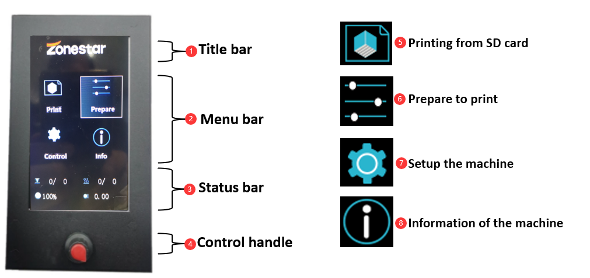
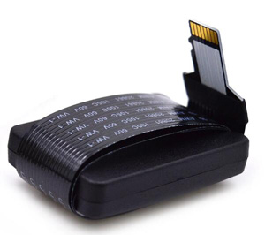

## <a id="choose-language">:globe_with_meridians: Choose language </a>

<!--  -->

# Z8P-MK2 Руководство по эксплуатации
## Включение и выключение питания
#### :warning: ВНИМАНИЕ! :warning:
##### УБЕДИТЕСЬ, ЧТО ПЕРЕКЛЮЧАТЕЛЬ НАПРЯЖЕНИЯ ПЕРЕМЕННОГО ТОКА УСТАНОВЛЕН В ПРАВИЛЬНОЕ ПОЛОЖЕНИЕ!

### ВКЛЮЧИТЬ
#### [:clapper: Видеоурок](https://github.com/ZONESTAR3D/Z8P/tree/main/Z8P-MK2/2-Operation_Guide/pic/PowerOn.gif)

1. Подключите шнур питания.
2. Включите выключатель питания переменного тока.
3. Нажмите и удерживайте кнопку питания постоянного тока около 5 секунд.
4. Подождите, пока на ЖК-дисплее не появится логотип, затем отпустите кнопку питания постоянного тока.
### ВЫКЛЮЧЕНИЕ
#### [:clapper: Видеоурок](https://github.com/ZONESTAR3D/Z8P/tree/main/Z8P-MK2/2-Operation_Guide/pic/poweroff.gif)

Выполните «Подготовка>>Выключение» на ЖК-экране, подождите, пока ЖК-экран выключится, а затем ВЫКЛЮЧИТЕ выключатель питания переменного тока.

## [ЖК-меню и работа][LCD_MENU]

1. **Строка заголовка:** показывает текущее меню.
2. **Строка меню:** отображает элементы рабочего меню управления.
3. **Строка состояния:** отображает текущее важное состояние принтера, включая температуру, скорость печати и информацию о высоте по оси Z.
4. **Ручка управления:** Управляйте принтером: это ролик, который можно вращать или нажимать.
   - **Вращение:** выберите следующий/предыдущий пункт меню или измените значение настройки.
   - **Нажмите:** Войдите в следующее меню/Выполните текущую команду/Подтвердите измененное значение.
5. **Печать с SD-карты:** Выберите файл gcode с SD-карты и распечатайте его.
6. **Подготовка к печати:** предварительный нагрев, возврат в исходное положение, перемещение оси, загрузка/выгрузка нити, выравнивание горячего стола, выключение питания и т. д. перед печатью.
7. **Настройте машину:** установите параметры работы, включите/отключите дополнительные функции.
8. **Информация об аппарате:**: просмотр версии прошивки и информации о конфигурации оборудования аппарата.
#### Описание меню ЖК-дисплея см. в [:point_right:**Описание меню ЖК-экрана DWIN**][LCD_MENU].

## Подготовьтесь к печати
### Выровняйте кровать
Перед печатью необходимо отрегулировать расстояние между соплом и пленкой горячего слоя до нужного значения, чтобы расплавленная нить могла быть хорошо наклеена на пленку горячего слоя. Этот процесс еще называют «ровной грядкой». Если сопло находится слишком далеко от слоя, нить не сможет прилипнуть к горячему слою. Если расстояние слишком мало, пленка и сопло будут повреждены или даже горячий конец будет заблокирован.
##### [:clapper: Шаг 1: ](https://github.com/ZONESTAR3D/Z8P/tree/main/Z8P-MK2/2-Operation_Guide/pic/HomeAll.gif) Включите 3D-принтер и затем выполните «Подготовка >> Auto Home >> Home All» в ЖК-МЕНЮ, подождите, пока хотэнд перейдет в положение HOME.
##### Шаг 2: Затяните гайки под кроватью, чтобы опустить кровать в самое нижнее положение (рис. 1).
##### [:clapper: Шаг 3:](https://github.com/ZONESTAR3D/Z8P/tree/main/Z8P-MK2/2-Operation_Guide/pic/Level_corners.gif) Выполните «Подготовка>> Кровать выравнивание>> Точка 1” на панели управления (Рис. 2), сопло дойдет до углов грядки, ослабьте ручные гайки под парником (Рис. 3) и позвольте соплу почти коснуться парника (Рис. 4). Продолжайте выполнять «Точки 2/3/4», пока все 4 угла не будут выровнены.
##### Шаг 4: Повторите шаг 3 и сделайте 2–3 круга, пока все четыре угла не окажутся на одной высоте.

### Загрузка нитей
#### [:clapper: Видеоурок](https://youtu.be/-47yB95uIxI)
Этот принтер оснащен четырьмя экструдерами и одним горячим концом для смешивания цветов 4-В-1-ВЫХ. Экструдеры и горячий конец соединены направляющей нити (трубка из ПТФЭ). :warning:**Перед печатью необходимо загрузить в экструдеры все 4 нити и подать их в нижнюю часть хотэнда.**
##### Шаг 1. Выполните «Подготовка >> Auto Home >> Home All» на панели управления, а затем выполните «Подготовка >> Температура >> Предварительный нагрев PLA», ожидая, что температура сопла достигнет 190 ℃ (рис. 1).
##### Шаг 2. С помощью диагональных плоскогубцев отрежьте головку нити (рис. 2), а затем нажмите на ручку экструдера №1 и вставьте нить, нажимайте на нить, пока не увидите нить в ПТФЭ. направляющая (рис. 3). Вращайте шестерню экструдера №1 (рис. 4), наблюдая за нитью, пока она не войдет в нижнюю часть горячего конца.
##### Шаг 3. Используя тот же метод, что и в шаге 2, загрузите нити в экструдеры № 2 ~ экструдер № 4, наблюдайте за нитями, пока они не войдут в нижнюю часть горячего конца.
##### Шаг 4. Медленно вращайте шестерню экструдера №1 ~ экструдера №4 один за другим и наблюдайте за соплом, пока не увидите, что нить вытекает из сопла (рис. 5).
#### :warning: Меню «Быстрая загрузка» можно использовать только при загрузке нити из экструдера в хотэнд. Как только нить попала в хотэнд, используйте меню «Медленная загрузка», но не «Быстрая загрузка».

## Печать с SD-карты
[:clapper: Видеоурок](https://youtu.be/ITHbO9VxTMo)
#### Шаг 1. Вставьте SD-карту в разъем для SD-карты на принтере (рис. 1).
##### :pushpin: В Z8PM4Pro-MK2A добавлен разъем для SD-карты на боковой стороне устройства, что обеспечивает более удобный доступ к SD-карте.
:warning: Обратите внимание, что при печати вы можете выбрать только один из них (SD-карту сбоку или карту Micro-SD спереди).

#### Шаг 2. Нажмите «Печать» на панели управления и выберите «Проверить gcode\xyz_cube.gcode» (рис. 2), нажмите ручку, чтобы начать печать.
#### Шаг 3. Подождите, пока нагреватель и нагреватель не достигнут заданной температуры (рис. 3), сопло вернется в исходное положение, а затем переместится вверх над печатной платформой и выдавит нить, используйте пинцет для удалите выходную нить (рис. 4).
#### Шаг 4. Когда сопло переместится в горячий слой и начнет печатать, дважды щелкните ручку на панели управления, чтобы открыть меню «Baby Steps Z» (рис. 5), медленно поверните ручку, чтобы точно настроить высоту. печатной платформы, следите за расстоянием от сопла до стола, пока расстояние не станет удовлетворительным (рис. 6). Подождите, пока печать закончится, и вы получите свои первые работы (рис. 7).
#### Шаг 5. Подождите, пока термопот остынет (<= 25 градусов) (рис. 8), а затем извлеките напечатанный объект из термопринтера (рис. 9).

## Расширенные функции
:warning: Не включайте эти функции, пока четко не поймете, как ими пользоваться.
### [Функция смешивания цветов][MIX_COLOR]
Этот принтер оснащен 4 экструдерами и горячим концом для смешивания цветов 4-В-1-ВЫХ. Он не только может печатать 3D-файлы с 16 цветами, но также может печатать в 3D-режиме одного цвета в 3D-модели с градиентным цветом. Подробную информацию см. в [**:point_right:Руководство пользователя функции смешивания цветов**][MIX_COLOR].

### [Автовыравнивание кровати][AUTO_LEVELING]
Этот принтер оснащен датчиком выравнивания стола PL-08N, с помощью этого датчика можно исправить неровности стола.
Подробную информацию см. в [**:point_right: Руководство пользователя функции автоматического выравнивания кровати**][AUTO_LEVELING].

### [Автовыключение][AUTO_SHUTDOWN]
#### [:clapper: **Видеоурок**](https://youtu.be/SJLpmJL-tG4).
3D-печать обычно занимает много времени, и после завершения печати вас может не оказаться рядом с аппаратом. Вы можете разрешить принтеру автоматически отключаться после завершения печати, чтобы сэкономить ненужное энергопотребление.

### [Восстановление потери питания](https://youtu.be/f-PpasByiiE)
#### [:clapper: **Видеоурок**](https://youtu.be/f-PpasByiiE).
При печати с SD-карты и отключении питания после повторного включения принтер возобновит печать с последнего слоя, который был напечатан до отключения питания.

### [Автоматическое втягивание][AUTO_RETRACTION]
Проблема со струнами у хот-энда смешанного цвета часто более серьезна, чем у одноцветного хот-энда. Поэтому в прошивке заложена функция автоматического отвода. Использование автоматического отвода может решить эту проблему.
Подробную информацию см. в [**:point_right: Руководство пользователя функции автоматического отвода**][AUTO_RETRACTION].

## Нарезка
Программное обеспечение для нарезки — это компьютерное программное обеспечение, используемое в большинстве процессов 3D-печати для преобразования 3D-модели объекта в конкретные инструкции для принтера. В частности, преобразование модели в формате STL(Obj, Amf) в команды принтера в формате g-кода.
Эта машина может использовать различное программное обеспечение для нарезки. Мы предоставляем адреса для загрузки, инструкции и видеоуроки по обычному программному обеспечению для нарезки.
Подробную информацию см. в [**:point_right: Руководство по нарезке**][SLICING_GUIDE_Z8P].
#### :loudspeaker: ПРИМЕЧАНИЕ
1. Программное обеспечение для нарезки не входит в комплект поставки данного аппарата. Программу для нарезки можно бесплатно загрузить из Интернета.
2. Если вы печатаете одним цветом, выберите машину ** «Z8 + один цвет»**. Если вы печатаете многоцветно, выберите машину **«Z8 + M4 hot end»**.
3. Некоторые руководства пользователя и видеоуроки созданы для наших машин серии Z9 и полностью применимы к Z8PM4.

----
## Управление с ПК / Печать с ПК
:warning: Мы рекомендуем печатать с SD-карты, а не с ПК.
Для ZPM4Pro-MK2, если вы считаете, что доступ к SD-карте (вставка и извлечение) затруднен, рекомендуется приобрести удлинитель карты Mirco-SD ([**Ссылка на продажу**](https://www.aliexpress.com/item/3256805156643681.htm)).     
####       
Если вы хотите печатать с ПК, мы рекомендуем использовать программное обеспечение «Repetier-Host». О том, как загрузить и использовать repetier-Host, см. в [**руководстве пользователя по печати с ПК**][PRINTFROMPC].

-----
[LCD_MENU]: https://github.com/ZONESTAR3D/Z8P/tree/main/Z8P-MK2/2-Operation_Guide/DWIN_LCD_screen_Menu_Description
[MIX_COLOR]: https://github.com/ZONESTAR3D/Document-and-User-Guide/tree/master/Mixing_Color
[AUTO_LEVELING]: https://github.com/ZONESTAR3D/Z8P/tree/main/Z8P-MK2/2-Operation_Guide/Bed_Auto_Leveling
[AUTO_SHUTDOWN]: https://github.com/ZONESTAR3D/Z8P/tree/main/Z8P-MK2/2-Operation_Guide/Auto_Shut_Down
[AUTO_RETRACTION]: https://github.com/ZONESTAR3D/Z8P/tree/main/Z8P-MK2/2-Operation_Guide/Auto_Retraction
[SLICING_GUIDE_Z8P]: https://github.com/ZONESTAR3D/Z8P/tree/main/Z8P-MK2/4-SlicingGuide
[PRINTFROMPC]: https://github.com/ZONESTAR3D/Z8P/tree/main/Z8P-MK2/2-Operation_Guide/PrintFromPC

