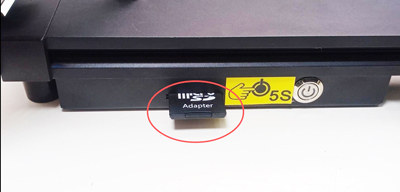

## <a id="choose-language">:globe_with_meridians: Choose language </a>

<!--  -->

-----
# Z8P-MK2 Operation Guide
## Power ON and Power Off
#### :warning: ATTENTION! :warning: 
##### MAKE SURE THE AC VOLTAGE SELECT SWITH HAS BEED SET TO THE CORRECT POSITION!     

### POWER ON
<!--  -->
1. Plug in power cord
2. Turn ON the AC Power Switch.
3. Push and hold DC power button about 5 seconds
4. Wait until the LCD shows Logo, then release the DC power button
    
### POWER OFF
<!--     -->
Do “Prepare>>Power Off” on LCD Screen, wait the LCD screen off, and then Turn OFF AC Power Switch.
    

## [LCD Menu and Operation][LCD_MENU]

1. **Title bar:** Shows current menu 
2. **Menu bar:** Shows control operational menu items
3. **Status bar:** Display the current important status of the printer, including temperature, printing speed and Z height information
4. **Control handle:** Control the printer, it is a roller that can be rotated or pressed. 
  - **Rotation:** Select the next/previous menu item or modify the setting value.
  - **Click:** Enter the next menu / Execute the current command / Confirm the modified value.
5. **Printing from SD card:** Choose gcode file from SD card and print it.
6. **Prepare to print:** Preheating, homing, moving the axis, load/unload filament, leveling the hot bed, power off, etc.,  used before printing.
7. **Setup the machine:** Set operation parameters, enable/disable advanced functions.
8. **Information of the machine:**: View the firmware version, hardware configuration information of the machine.     
#### About the LCD menu description, please refer to the [:point_right:**DWIN LCD screen Menu Description**][LCD_MENU].

## Prepare to print 
### Level the bed
#### 
Before printing, you need to adjust the distance between the nozzle and the hot bed film to a proper value, so that the melted filament can be pasted onto the hot bed film well. This process is also called “level bed”. If the nozzle is too far away from the bed, the filament can't stick to the hot bed. If the distance is too close, the bed film and nozzle will be damaged, or even the hot end will be blocked.
##### Step 1. Power on the 3d printer and then do “Prepare>>Auto Home>>Home All” on LCD MENU, wait the hotend go to the HOME position. 

##### Step 2. Tighten the hand nuts under the bed to move down the bed to the lowest position (Fig 1).
##### Step 3. Do “Prepare>> Bed leveling>> Point 1” on control panel(Fig 2), the nozzle will go to the corners of the bed, loosen the hand nuts under the hotbed (Fig 3) and let the nozzle almost touch the hotbed (Fig 4). Continue to do “Point 2/3/4” until all of the 4 corners has been leveled.
 
##### Step 4: Repeat Step 3 and do 2 ~ 3 rounds, until all of the four corners at the same height.

### Load filaments
#### 
This printer is equipped with four extruders and one 4-IN-1-OUT color mixing hot end. The extruders and the hot end are connected by a filament guide (PTFE tube). :warning:**Before printing, you need to load all 4 filaments to the extruders and feed them into the bottom of the hot end.** 
##### Step 1. Do “Prepare>>Auto Home>>Home All” on control panel, and then do “Prepare>>Temperature>> Preheat PLA”, waiting nozzle temperature reached to 190 ℃ (Fig 1).
##### Step 2. Use a diagonal pliers to cut off the head of filament (Fig 2), and then press the handle of the extruder#1 and insert filament, push the filament until you can see the filament in the PTFE guide (Fig 3). Rotate the gear of extruder #1 (Fig 4), watch the filament until it entered bottom of the hot end. 
##### Step 3. Using the same method as in step 2 to load the filaments to extruder #2 ~ extruder #4, watch the filaments until them entered the bottom of hot end.
##### Step 4. Slowly rotate the gear of extruder#1 ~ extruder#4 one by one and watch the nozzle, until you can see the filament flowed out from the nozzle(Fig 5).
### :warning: "Quickly Load" menu only can be used when loading the filament from extruder to hot end, once the filament entered the hot end, use "Slowly Load" menu but not "Quickly Load".

## Print from SD card
#### 
#### Step 1. Insert the SD card to the SD card socket on the printer (Fig 1).
##### :pushpin: Z8PM4Pro-MK2A added a SD card socket on the side of the machine, which is more convenient to access the SD card. 
:warning: Please note you only can choose one of them (SD card on the side or Micro-SD card on the front) when printing.     

#### Step 2. Click “Print” on the control panel and choose “Test gcode\xyz_cube.gcode” (Fig 2), click the knob to start printing.
#### Step 3. Wait until the hotend and hotbed is reached to the setting temperature (Fig 3), the nozzle will home to the origin position and then move to above of the printing platform and extrude the filament, use a tweezers to remove the outflow filament (Fig 4).
#### Step 4. When the nozzle moved to the hot bed and start to print, double click the knob on the control panel to open a “Baby steps Z” menu (Fig 5), rotate knob slowly to fine tune the height of printing platform, watch the distance from nozzle to bed, until the distance goes well (Fig 6). Wait the printing finished, you will get your first works (Fig 7).
#### Step 5. Wait the hotbed cool (<=25 degree) (Fig 8), and then remove the printed object from the hotbed (Fig 9).

## Advance features
:warning: Do not turn on these functions until you clearly understand how to use them.
### [Mixing Color feature][MIX_COLOR]
This printer equiped with 4 extruders and a 4-IN-1-OUT mixing color hot end, it not only can print up to 16 colors 3d file, but aslo it can print a single color 3d mode to a gradient color 3d model. For the details, please refer to [**:point_right:Mixing Color Feature User Guide**][MIX_COLOR].

### [Bed auto leveling][AUTO_LEVELING]
This printer is equipped with a PL-08N Bed leveling sensor, with this sensor, you can correct the unevenness of the hot bed.    
For the details, please refer to [**:point_right: Bed Auto Leveling Feature User Guide**][AUTO_LEVELING].

### [Auto shut down][AUTO_SHUTDOWN]
3D printing usually takes a long time, and you may not be near the machine when printing is finished. You can let the printer auto shut down while printing is finished to save unnecessary power consumption. For the details, please refer to [**:point_right: this guide**][AUTO_SHUTDOWN].

### [Power loss recovery](https://youtu.be/f-PpasByiiE)
While printing from SD card and power is lost, after power on again, the printer will resume to print from the last layer which printed before power lost. For the details, please refer to [**:point_right: the video tutorial**](https://youtu.be/f-PpasByiiE).

### [Auto retraction][AUTO_RETRACTION]
The strings issue of the mixed color hot end is often more serious than that of the single color hotend. Therefore, an automatic retraction feature is set in the firmware. Using automatic retraction can improve this problem.   
For the details, please refer to [**:point_right: Auto Retract Feature User Guide**][AUTO_RETRACTION].

## Slicing
The slicing software is a computer software used in the majority of 3D printing processes for the conversion of a 3D object model to specific instructions for the printer. In particular, the conversion from a model in STL(Obj, Amf) format to printer commands in g-code format. 
This machine can use a variety of slicing software to complete slicing, We provide download addresses, instructions and video tutorials of common slicing software. 
For details, please refer to [**:point_right: Slicing-Guide**][SLICING_GUIDE_Z8P].
#### :loudspeaker: NOTE  
1. Slicing software is not a part of this machine, you can download slicing software for free from the internet.
2. If you print one color, please choose machine **“Z8 + One color”**. If you print multi color, please choose machine **“Z8 + M4 hot end”**.
3. Some of the user guide and video tutorials are made with reference to our Z9 series machines, and they are fully applicable to Z8PM4.

----
## Control by PC / Print from PC
:warning: We recommend to print from SD card rather than from a PC.     
If you want to print from PC, we recommend to use "Repetier-Host" software, about how to download and use repetier-Host, please refer to [**the user guide of printing from PC**][PRINTFROMPC].

----
## :pushpin: HINT
For older versions of ZPM4Pro-MK2, the SD card slot is located at the front of the machine and sometimes difficult to access. You can [:arrow_down: download the latest firmware](https://github.com/ZONESTAR3D/Firmware/tree/master/Z8/Z8P/Z8PM4-MK2/released) and upload it to the control board, which supports accessing files on the SD card from the PC after connecting the machine to the PC through a USB cable.

-----
[LCD_MENU]: https://github.com/ZONESTAR3D/Z8P/tree/main/Z8P-MK2/2-Operation_Guide/DWIN_LCD_screen_Menu_Description
[MIX_COLOR]: https://github.com/ZONESTAR3D/Document-and-User-Guide/tree/master/Mixing_Color
[AUTO_LEVELING]: https://github.com/ZONESTAR3D/Z8P/tree/main/Z8P-MK2/2-Operation_Guide/Bed_Auto_Leveling
[AUTO_SHUTDOWN]: https://github.com/ZONESTAR3D/Z8P/tree/main/Z8P-MK2/2-Operation_Guide/Auto_Shut_Down
[AUTO_RETRACTION]: https://github.com/ZONESTAR3D/Z8P/tree/main/Z8P-MK2/2-Operation_Guide/Auto_Retraction
[SLICING_GUIDE_Z8P]: https://github.com/ZONESTAR3D/Z8P/tree/main/Z8P-MK2/4-SlicingGuide
[PRINTFROMPC]: https://github.com/ZONESTAR3D/Z8P/tree/main/Z8P-MK2/2-Operation_Guide/PrintFromPC

