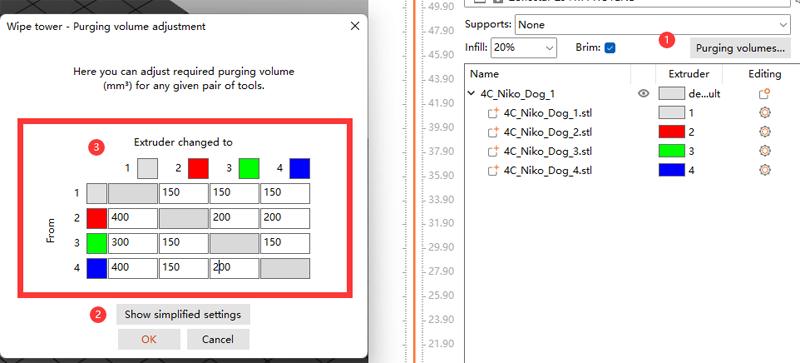

## <a id="choose-language">:globe_with_meridians: Choose language </a>

<!--  -->

----
# PrusaSlicer Installations- und Benutzerhandbuch
Erstens können FDM-3D-Drucker nur Gcode-Dateien verarbeiten, während die Standardformate für 3D-Grafikdateien normalerweise stl, obj und amf usw. sind. Bevor Sie 3D-Modelldateien auf dem FDM-3D-Drucker drucken, müssen Sie 3D-Grafikdateien in Gcode-Dateien konvertieren Auf dem Computer wird dieser Vorgang ***„Slicing“*** genannt. Die Software, die die Konvertierung von 3D-Grafikdateien in Gcode-Dateien unterstützt, wird Slicing-Software genannt.
PrusaSlicer ist heutzutage eine der beliebtesten Slicing-Software, die sich besonders für mehrfarbige (Multi-Extruder) 3D-Drucker eignet. Wir empfehlen die Verwendung der PrusaSlicer-Slicing-Software zum Generieren von Gcode-Dateien.

----
## :book: Inhalt
1. **[PrusaSlicer herunterladen](#a1)**
2. **[PrusaSlicer ausführen und den Drucker auswählen](#a2)**
3. **[Systemvoreinstellungen auswählen](#a3)**
4. **[Einfarbiges 3D-Modell in Scheiben schneiden](#a4)**
5. **[Schneiden eines mehrfarbigen 3D-Modells](#a5)**

## <a id="a1">1. Laden Sie PrusaSlicer herunter</a>
:clapper: [**So laden Sie Slicing-Software herunter und installieren sie**](https://youtu.be/SgyXD-kQIeo)
###  Für Windows
#### Klicken Sie auf [:arrow_down:**here**](https://github.com/ZONESTAR3D/Slicing-Guide/releases/tag/PrusaSlicer2.4.2), um die PrusaSlicer-Software herunterzuladen und auf Ihrem PC zu speichern.

#### Und dann entpacken Sie die heruntergeladene Datei auf Ihren PC oder Laptop

###  Für MacOS oder Linux
- [Laden Sie die PrusaSlicer-Software mit Zonestar-Profilen herunter](https://github.com/ZONESTAR3D/Slicing-Guide/releases/tag/2.4.2)

## <a id="a2">2. Führen Sie PrusaSlicer aus und wählen Sie den Drucker aus </a>
#### 2.1 Suchen Sie PrsuaSlicer.exe und klicken Sie darauf, um es auszuführen

#### 2.2 Wählen Sie Ihren Drucker, „Andere Anbieter>>Zonestar FFF>>Ihr Druckermodell>>Fertig stellen“

## <a id="a3">3. Wählen Sie Systemvoreinstellungen</a>
Wählen Sie Systemvoreinstellungen entsprechend Ihrem Drucker, Hotend und den Farben, die Sie drucken möchten:   
    
- Wenn Sie ein einfarbiges 3D-Modell drucken müssen, wählen Sie ***Z8 + Eine Farbe***.
- Wenn Sie ein mehrfarbiges 3D-Modell drucken, wählen Sie ***Z8 + M4 HOTEND***.

## <a id="a4">4. Eine Farbe schneiden</a>
:clapper: [**Anleitung zum Schneiden – für einfarbigen Druck**](https://youtu.be/g-YSgV44Rik)
#### 4.1 Druckervoreinstellungen auswählen *Z8 + Eine Farbe*

#### 4.2 3D-Modelldatei laden (stl/obj/AMF-Datei usw.)

#### 4.3 Wählen Sie den Druckfilamenttyp

#### 4.4 Bei Bedarf können Sie die Größe des 3D-Modells ändern, ausschneiden und drehen

#### 4.5 Legen Sie die Druckeinstellungen fest: Schichthöhe, Druckgeschwindigkeit, Unterstützung, Füllung usw.
    
Möglicherweise müssen Sie diese Parameter entsprechend der Form des Modells und Ihren Anforderungen an die Druckqualität einstellen. Bei einigen Modellen kann das Objekt bei falschen Einstellungen sogar nicht erfolgreich gedruckt werden. Einzelheiten finden Sie unter:
- [**PrusaSlicer-Einführung**](https://www.prusa3d.com/page/prusaslicer_424/)
- [**Slic3r-Benutzerhandbuch**](https://manual.slic3r.org/)
#### 4.6 Schneiden

#### 4.7 Vorschau des Sliced-Ergebnisses (Gcode-Datei) und dann als Gcode-Datei auf Ihrem PC speichern und dann auf die SD-Karte kopieren

## <a id="a5">5. Mehrfarbig schneiden </a>
- :clapper: [**Slicing-Anleitung – für mehrfarbigen Druck**](https://youtu.be/AIKrszmxvE4)
#### 5.1 Druckervoreinstellungen auswählen *Z8 + M4 Hotend*

#### 5.2 3D-Modelldateien laden (stl/obj/AMF-Datei usw.)
 
##### :memo: Normalerweise ist zum mehrfarbigen Drucken ein geteiltes Modell erforderlich, d korrekt zusammengeführt werden.
##### :star2: PrusaSlicer hat eine sehr leistungsstarke neue Funktion. Es kann [Farbe in das 3D-Modell malen](https://youtu.be/Yx4fKDRGEJ4). Mit dieser Funktion können Sie ein einfarbiges 3D-Modell in ein mehrfarbiges 3D-Modell konvertieren.
#### 5.3 Wählen Sie den Druckfilamenttyp – PLA und stellen Sie die Filamentfarbe ein

#### 5.4 Extruder verschiedenen Teilen zuordnen

#### 5.5 Bei Bedarf können Sie die Größe des 3D-Modells ändern, ausschneiden und drehen

#### 5.6 Legen Sie die Druckeinstellungen fest: Schichthöhe, Druckgeschwindigkeit, Unterstützung, Füllung usw.

Sie müssen diese Parameter entsprechend der Form des Modells und Ihren Anforderungen an die Druckqualität einstellen. Selbst bei einigen Modellen kann der Druckvorgang ohne Unterstützung nicht normal durchgeführt werden. Einzelheiten finden Sie unter:
- [**PrusaSlicer-Einführung**](https://www.prusa3d.com/page/prusaslicer_424/)
- [**Slic3r-Benutzerhandbuch**](https://manual.slic3r.org/)    
:warning: Bitte beachten Sie, dass *Rückzug bei deaktiviertem Werkzeug* auf 0 gesetzt werden sollte.    

#### 5.7 Parameter für Wischturm einstellen
##### Möglicherweise stellen Sie fest, dass in der geschnittenen Figur ein quadratisches Quadrat erscheint, das in PrusaSlicer „Wipe Tower“ genannt wird. Da beim Mehrfarbendrucker beim Wechseln des Extruders immer noch die vorherigen Farbfilamente im Hotend vorhanden sind, muss es sauber sein, bevor eine andere Farbe gedruckt werden kann.

##### Um eine bessere Reinigungswirkung zu erzielen und die Filamentverschwendung zu minimieren, können wir die Menge der Farbreinigung je nach Farbe einstellen. Bitte beachten Sie die folgende Tabelle. Die Spalten zeigen die Filamentfarbe des zuletzt gedruckten Extruders und die Zeilen zeigen die Filamentfarbe des nächsten zu druckenden Extruders.
##### Wenn wir vom Extruder mit Filamenten in hellerer Farbe zum Extruder mit Verbrauchsmaterialien in dunklerer Farbe wechseln, können wir eine kleinere Extrusionslöschung einstellen. Im Gegenteil, wenn wir vom Extruder mit Verbrauchsmaterialien in dunklerer Farbe zum Extruder mit Filament in dunklerer Farbe wechseln, müssen wir eine kleinere Extrusionslöschung einstellen

#### 5.8 Schneiden

#### 5.9 Vorschau des Sliced-Ergebnisses (Gcode-Datei) und dann als Gcode-Datei auf Ihrem PC speichern und dann auf die SD-Karte kopieren

