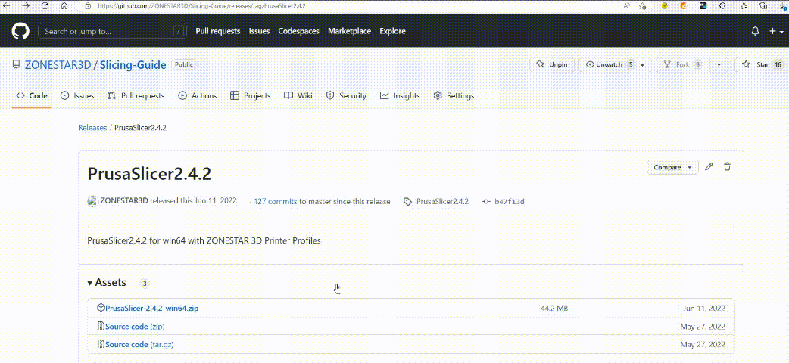
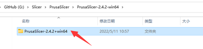

## <a id="choose-language">:globe_with_meridians: Choose language </a>

<!--  -->

----
# Manual de instalación y usuario de PrusaSlicer
En primer lugar, las impresoras 3D FDM solo pueden procesar archivos gcode, mientras que los formatos estándar para archivos de gráficos 3D suelen ser stl, obj y amf, etc. Antes de imprimir archivos de modelos 3D en la impresora 3D FDM, debe convertir los archivos de gráficos 3D en archivos gcode. en la computadora, este proceso se llama ***rebanado***. El software que admite la conversión de archivos de gráficos 3D en archivos gcode se llama software de corte.
PrusaSlicer es uno de los programas de corte más populares hoy en día, que es particularmente adecuado para impresoras 3D multicolores (multiextrusoras). Recomendamos utilizar el software de corte PrusaSlicer para generar archivos gcode.

----
## :book: Contenido
1. **[Descargar PrusaSlicer](#a1)**
2. **[Ejecute PrusaSlicer y elija la impresora](#a2)**
3. **[Elegir ajustes preestablecidos del sistema](#a3)**
4. **[Cortar modelo 3d de un color](#a4)**
5. **[Rebanar modelo 3d multicolor](#a5)**

## <a id="a1">1. Descargar PrusaSlicer</a>
:clapper: [**Cómo descargar e instalar software de corte**](https://youtu.be/SgyXD-kQIeo)
###  Para ventanas
#### Haga clic en [:arrow_down:**aquí**](https://github.com/ZONESTAR3D/Slicing-Guide/releases/tag/PrusaSlicer2.4.2) para descargar el software PrusaSlicer y guardarlo en su PC.    

#### Y luego descomprima el archivo descargado en su PC o computadora portátil

###  Para Macos o Linux
- [Descargue el software PrusaSlicer con perfiles Zonestar](https://github.com/ZONESTAR3D/Slicing-Guide/releases/tag/2.4.2)

## <a id="a2">2. Ejecute PrusaSlicer y elija la impresora </a>
#### 2.1 Busque PrsuaSlicer.exe y haga clic en él para ejecutarlo

#### 2.2 Elija su impresora, "Otros proveedores>>Zonestar FFF>>su modelo de impresora>>terminar"

## <aid="a3">3. Elija ajustes preestablecidos del sistema</a>
Elija ajustes preestablecidos del sistema según su impresora, hotend y los colores que desea imprimir:

- Si necesita imprimir un modelo 3D a un color, elija **Z8 + One Color**.
- Si imprime un modelo 3D multicolor, elija **Z8 + M4 HOTEND**.

## <a id="a4">4. Cortar un color</a>
:clapper: [**Guía de corte - para impresión a un color**](https://youtu.be/g-YSgV44Rik)
#### 4.1 elegir ajustes preestablecidos de impresora Z8 + One Color

#### 4.2 cargar archivo de modelo 3D (archivo stl/obj/AMF, etc.)

#### 4.3 Elija el tipo de filamento de impresión

#### 4.4 Si es necesario, puede cambiar el tamaño, cortar y rotar el modelo 3D.

#### 4.5 Establecer la configuración de impresión: altura de capa, velocidad de impresión, soporte, relleno, etc.
     
Es posible que necesite configurar estos parámetros según la forma del modelo y sus requisitos de calidad de impresión. Para algunos modelos, el objeto ni siquiera se puede imprimir correctamente si la configuración es incorrecta. Para más detalles consulte:
- [**Introducción a PrusaSlicer**](https://www.prusa3d.com/page/prusaslicer_424/)
- [**Manual del usuario de Slic3r**](https://manual.slic3r.org/)
#### 4.6 Rebanar

#### 4.7 Obtenga una vista previa del resultado cortado (archivo gcode) y luego guárdelo en el archivo gcode en su PC y luego cópielo en la tarjeta SD

## <a id="a5">5. Cortar multicolor </a>
- :clapper: [**Guía de corte - para impresión multicolor**](https://youtu.be/AIKrszmxvE4)
#### 5.1 elegir ajustes preestablecidos de impresora Z8 + M4 hotend

#### 5.2 cargar archivos de modelo 3D (archivo stl/obj/AMF, etc.)
 
##### :memo: Por lo general, el modelo dividido no es necesario para imprimir en varios colores, es decir, un modelo 3D se ha dividido en varios archivos STL según los colores, y estos archivos usan la misma posición de coordenadas de origen para que se pueden fusionar correctamente.
##### :star2: PrusaSlicer tiene una nueva característica muy poderosa. Puede [pintar color en el modelo 3D](https://youtu.be/Yx4fKDRGEJ4), con esta función, puede convertir un modelo 3D de un color en un modelo 3D de varios colores.
#### 5.3 Elija el tipo de filamento de impresión: PLA y establezca el color del filamento

#### 5.4 Asignar extrusores a diferentes partes

#### 5.5 Si es necesario, puede cambiar el tamaño, cortar y rotar el modelo 3D.

#### 5.6 Establecer la configuración de impresión: altura de capa, velocidad de impresión, soporte, relleno, etc.
    
Debe configurar estos parámetros de acuerdo con la forma del modelo y sus requisitos de calidad de impresión. Incluso para algunos modelos, la impresión no se puede completar normalmente sin soporte. Para más detalles consulte:
- [**Introducción a PrusaSlicer**](https://www.prusa3d.com/page/prusaslicer_424/)
- [**Manual del usuario de Slic3r**](https://manual.slic3r.org/)    
:warning: Tenga en cuenta que "Retracción cuando la herramienta está deshabilitada" debe establecerse en 0.    

#### 5.7 Establecer parámetros para "torre de limpieza"
##### Puede notar que aparecerá un cuadrado en la figura cortada, que se llama "Torre de limpieza" en PrusaSlicer. Debido a que para la impresora multicolor, al cambiar de extrusora, todavía quedan los filamentos de color anteriores dentro del hotend, es necesario limpiarlo antes de imprimir otro color.

##### Para obtener un mejor efecto de limpieza y minimizar el desperdicio de filamento, podemos establecer la cantidad de purga de color según los diferentes colores. Preste atención a la siguiente tabla, las columnas muestran el color del filamento del último extrusor impreso y las filas muestran el color del filamento del siguiente extrusor que se imprimirá.
##### Cuando cambiamos del extrusor con filamento de color más claro al extrusor con consumibles de color más oscuro, podemos establecer un borrado de extrusión más pequeño. Por el contrario, cuando cambiamos del extrusor con consumibles de color más oscuro al extrusor con filamento de color más oscuro, necesitamos establecer un borrado de extrusión más pequeño.     

#### 5.8 Rebanar

#### 5.9 Obtenga una vista previa del resultado cortado (archivo gcode) y luego guárdelo en un archivo gcode en su PC y luego cópielo en la tarjeta SD

