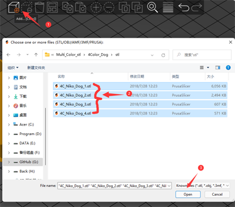

## <a id="choose-language">:globe_with_meridians: Choose language </a>

<!--  -->

----
# Manuel d'installation et d'utilisation de PrusaSlicer
Premièrement, les imprimantes 3D FDM ne peuvent traiter que les fichiers gcode, alors que les formats standard pour les fichiers graphiques 3D sont généralement stl, obj et amf, etc. Avant d'imprimer des fichiers de modèle 3D sur l'imprimante 3D FDM, vous devez convertir les fichiers graphiques 3D en fichiers gcode. sur l'ordinateur, ce processus s'appelle ***"slicing"***. Le logiciel qui prend en charge la conversion de fichiers graphiques 3D en fichiers Gcode est appelé logiciel de découpage.
PrusaSlicer est l'un des logiciels de découpage les plus populaires de nos jours, particulièrement adapté aux imprimantes 3D multicolores (multi-extrudeuses). Nous vous recommandons d'utiliser le logiciel de découpage PrusaSlicer pour générer des fichiers Gcode.

----
## :book: Contenu
1. **[Télécharger PrusaSlicer](#a1)**
2. **[Exécutez PrusaSlicer et choisissez l'imprimante](#a2)**
3. **[Choisir les préréglages système](#a3)**
4. **[Découper un modèle 3D d'une couleur](#a4)**
5. **[Découpage d'un modèle 3D multicolore](#a5)**

## <a id="a1">1. Téléchargez PrusaSlicer</a>
:clapper: [**Comment télécharger et installer un logiciel de découpage**](https://youtu.be/SgyXD-kQIeo)
###  Pour Windows
#### Cliquez sur [:arrow_down:**here**](https://github.com/ZONESTAR3D/Slicing-Guide/releases/tag/PrusaSlicer2.4.2) pour télécharger le logiciel PrusaSlicer et l'enregistrer sur votre PC.

#### Et puis décompressez le fichier téléchargé sur votre PC ou ordinateur portable

###  Pour Macos ou Linux
- [Téléchargez le logiciel PrusaSlicer avec les profils zonestar](https://github.com/ZONESTAR3D/Slicing-Guide/releases/tag/2.4.2)

## <a id="a2">2. Exécutez PrusaSlicer et choisissez l'imprimante </a>
#### 2.1 Recherchez PrsuaSlicer.exe et cliquez dessus pour l'exécuter

#### 2.2 Choisissez votre imprimante, "Autres fournisseurs>>Zonestar FFF>>votre modèle d'imprimante>>finition"

## <a id="a3">3. Choisir les préréglages système</a>
Choisissez les préréglages système en fonction de votre imprimante, de votre hotend et des couleurs que vous souhaitez imprimer:   
    
- Si vous devez imprimer un modèle 3D d'une seule couleur, choisissez ***Z8 + One Color***.
- Si vous imprimez un modèle 3D multicolore, choisissez ***Z8 + M4 HOTEND***.

## <a id="a4">4. Découper une couleur</a>
:clapper: [**Guide de découpage - pour une impression en une seule couleur**](https://youtu.be/g-YSgV44Rik)
#### 4.1 choisir les préréglages d'imprimante *Z8 + One Color*

#### 4.2 charger le fichier de modèle 3D (fichier stl/obj/AMF etc.)

#### 4.3 Choisir le type de filament d'impression

#### 4.4 Si besoin, vous pouvez redimensionner, couper, faire pivoter le modèle 3D

#### 4.5 Définissez les paramètres d'impression : hauteur de couche, vitesse d'impression, support, remplissage, etc.

Vous devrez peut-être définir ces paramètres en fonction de la forme du modèle et de vos exigences en matière de qualité d'impression. Pour certains modèles, l'objet ne peut même pas être imprimé correctement si les paramètres sont incorrects. Pour plus de détails, veuillez consulter:
- [**Présentation de PrusaSlicer**](https://www.prusa3d.com/page/prusaslicer_424/)
- [**Manuel d'utilisation Slic3r**](https://manual.slic3r.org/)
#### 4.6 Tranchage

#### 4.7 Prévisualisez le résultat découpé (fichier gcode), puis enregistrez-le dans le fichier gcode sur votre PC, puis copiez-le sur la carte SD   

## <a id="a5">5. Tranchage multicolore </a>
- :clapper: [**Guide de découpage - pour l'impression multicolore**](https://youtu.be/AIKrszmxvE4)
#### 5.1 choisir les préréglages d'imprimante *Z8 + M4 hotend*

#### 5.2 charger les fichiers de modèle 3D (fichier stl/obj/AMF etc.)
 
##### :memo: Habituellement, le modèle divisé est nécessaire pour imprimer en plusieurs couleurs, c'est-à-dire qu'un modèle 3D a été divisé en plusieurs fichiers STL en fonction des couleurs, et ces fichiers utilisent la même position de coordonnées d'origine afin qu'ils puissent être fusionné correctement.
##### :star2: PrusaSlicer a une nouvelle fonctionnalité très puissante. Il peut [peindre la couleur sur le modèle 3D](https://youtu.be/Yx4fKDRGEJ4), avec cette fonction, vous pouvez convertir un modèle 3D d'une couleur en un modèle 3D multicolore.
#### 5.3 Choisissez le type de filament d'impression - PLA et définissez la couleur du filament

#### 5.4 Attribuer les extrudeuses à différentes pièces

#### 5.5 Si besoin, vous pouvez redimensionner, couper, faire pivoter le modèle 3D

#### 5.6 Définissez les paramètres d'impression : hauteur de couche, vitesse d'impression, support, remplissage, etc.
     
Vous devez définir ces paramètres en fonction de la forme du modèle et de vos exigences en matière de qualité d'impression. Même pour certains modèles, l'impression ne peut pas être effectuée normalement sans assistance. Pour plus de détails, veuillez consulter :
- [**Présentation de PrusaSlicer**](https://www.prusa3d.com/page/prusaslicer_424/)
- [**Manuel d'utilisation Slic3r**](https://manual.slic3r.org/)    
:warning: Veuillez noter que la *Rétraction lorsque l'outil est désactivé* doit être définie sur 0.    

#### 5.7 Définir les paramètres de la tour d'essuyage
##### Vous remarquerez peut-être qu'un carré carré apparaîtra dans la figure découpée, appelée "Wipe tower" dans PrusaSlicer. Parce que pour l'imprimante multicolore, lors du changement d'extrudeuse, il y a toujours les filaments de couleur précédents à l'intérieur du hotend, il doit être propre avant d'imprimer une autre couleur.    

##### Afin d'obtenir un meilleur effet de nettoyage et de minimiser les déchets de filament, nous pouvons définir la quantité de purge de couleur en fonction des différentes couleurs. Veuillez prêter attention au tableau suivant, les colonnes indiquent la couleur du filament de la dernière extrudeuse imprimée et les lignes indiquent la couleur du filament de la prochaine extrudeuse à imprimer.
##### Lorsque nous passons de l'extrudeuse avec un filament de couleur plus claire à l'extrudeuse avec des consommables de couleur plus foncée, nous pouvons définir un effacement d'extrusion plus petit. Au contraire, lorsque nous passons de l'extrudeuse avec des consommables de couleur plus foncée à l'extrudeuse avec un filament de couleur plus foncée, nous devons définir un effacement d'extrusion plus petit.    

#### 5.8 Tranchage

#### 5.9 Prévisualisez le résultat découpé (fichier gcode), puis enregistrez-le dans le fichier gcode sur votre PC, puis copiez-le sur la carte SD
