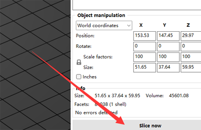

## <a id="choose-language">:globe_with_meridians: Choose language </a>

<!--  -->

----
# PrusaSlicer インストールおよびユーザーマニュアル
まず、FDM 3D プリンタは gcode ファイルのみを処理できますが、3D グラフィックス ファイルの標準形式は通常 stl、obj、amf などです。FDM 3D プリンタで 3D モデル ファイルを印刷する前に、3D グラフィックス ファイルを gcode ファイルに変換する必要があります。 コンピュータでは、このプロセスは ***「スライシング」*** と呼ばれます。 3D グラフィックス ファイルを gcode ファイルに変換することをサポートするソフトウェアは、スライシング ソフトウェアと呼ばれます。
PrusaSlicer は、現在最も人気のあるスライシング ソフトウェアの 1 つで、特にマルチカラー (マルチ エクストルーダー) 3D プリンタに適しています。 PrusaSlicer スライシング ソフトウェアを使用して gcode ファイルを生成することをお勧めします。

----
## :book: 目次
1. **[PrusaSlicer をダウンロード](#a1)**
2. **[PrusaSlicer を実行してプリンターを選択](#a2)**
3. **[システムプリセットを選択](#a3)**
4. **[1色の3Dモデルをスライス](#a4)**
5. **[マルチカラー 3D モデルのスライス](#a5)**

## <a id="a1">1. PrusaSlicer をダウンロード</a>
:clapper: [**スライスソフトウェアのダウンロードとインストール方法**](https://youtu.be/SgyXD-kQIeo)
###  Windowsの場合
#### [:arrow_down:**ここ**](https://github.com/ZONESTAR3D/Slicing-Guide/releases/tag/PrusaSlicer2.4.2) をクリックして PrusaSlicer ソフトウェアをダウンロードし、PC に保存します。

#### そして、ダウンロードしたファイルを PC またはラップトップに解凍します。

###  Macos または Linux の場合
- [ZONESTAR プロファイルを含む PrusaSlicer ソフトウェアをダウンロード](https://github.com/ZONESTAR3D/Slicing-Guide/releases/tag/2.4.2)

## <a id="a2">2. PrusaSlicer を実行し、プリンターを選択します </a>
#### 2.1 PrsuaSlicer.exe を見つけてクリックして実行します

#### 2.2 プリンターを選択します。「その他のベンダー>>Zonestar FFF>>お使いのプリンターモデル>>終了」

## <a id="a3">3. システム プリセットを選択</a>
プリンター、ホットエンド、印刷したい色に応じてシステム プリセットを選択します。   
    
- 1 色の 3D モデルを印刷する必要がある場合は、***Z8 + 1 色*** を選択してください。
- マルチカラー 3D モデルを印刷する場合は、***Z8 + M4 HOTEND*** を選択してください。

## <a id="a4">4. 1 色のスライス</a>
:clapper: [**スライスガイド - 1色印刷用**](https://youtu.be/g-YSgV44Rik)
#### 4.1 プリンター プリセットを選択 *Z8 + 1 色*

#### 4.2 3Dモデルファイル(stl/obj/AMFファイル等)の読み込み

#### 4.3 印刷フィラメントの種類を選択する

#### 4.4 必要に応じて、3D モデルのサイズ変更、切り取り、回転を行うことができます

#### 4.5 印刷設定を設定します: レイヤーの高さ、印刷速度、サポート、埋め込みなど。
    
モデルの形状や印刷品質の要件に応じて、これらのパラメータを設定する必要がある場合があります。 一部のモデルでは、設定が間違っているとオブジェクトを正常に印刷できない場合もあります。 詳細については、以下を参照してください。
- [**PrusaSlicer の紹介**](https://www.prusa3d.com/page/prusaslicer_424/)
- [**Slic3r ユーザーマニュアル**](https://manual.slic3r.org/)
#### 4.6 スライス

#### 4.7 スライス結果 (gcode ファイル) をプレビューし、gcode ファイルを PC に保存し、SD カードにコピーします

## <a id="a5">5. マルチカラーのスライス </a>
- :clapper: [**スライスガイド - 多色印刷用**](https://youtu.be/AIKrszmxvE4)
#### 5.1 プリンター プリセットの選択 *Z8 + M4 ホットエンド*

#### 5.2 3Dモデルファイル(stl/obj/AMFファイルなど)の読み込み
 
##### :memo: 通常、マルチカラーを印刷するには分割モデルが必要です。つまり、3D モデルが色に従って複数の STL ファイルに分割されており、これらのファイルは同じ原点座標位置を使用するため、 正しくマージされます。
##### :star2: PrusaSlicer には非常に強力な新機能があります。 [3D モデルに色を塗る](https://youtu.be/Yx4fKDRGEJ4) ことができます。この機能を使用すると、1 色の 3D モデルを複数色の 3D モデルに変換できます。
#### 5.3 印刷フィラメントの種類 - PLA を選択し、フィラメントの色を設定します

#### 5.4 押出機をさまざまなパーツに割り当てる

#### 5.5 必要に応じて、3D モデルのサイズ変更、切り取り、回転を行うことができます

#### 5.6 印刷設定を設定します: レイヤーの高さ、印刷速度、サポート、埋め込みなど。
   
モデルの形状や印刷品質の要件に応じて、これらのパラメータを設定する必要があります。 一部の機種でもサポートが無い場合は正常に印刷が行えません。 詳細については、以下を参照してください。
- [**PrusaSlicer の紹介**](https://www.prusa3d.com/page/prusaslicer_424/)
- [**Slic3r ユーザーマニュアル**](https://manual.slic3r.org/)
:警告: *ツールが無効な場合のリトラクション* は 0 に設定する必要があることに注意してください。

#### 5.7 ワイプタワーのパラメータを設定する
##### スライスされた図形に四角い四角形が現れることに気づくと思いますが、これは PrusaSlicer では「ワイプ タワー」と呼ばれます。 マルチカラー プリンタの場合、押出機を切り替えている間、ホットエンド内に前の色のフィラメントがまだ残っているため、別の色を印刷する前にホットエンドをきれいにする必要があります。
   
##### より良いクリーニング効果を得て、無駄なフィラメントを最小限に抑えるために、さまざまな色に応じてカラーパージの量を設定できます。 次の表に注目してください。列は最後に印刷された押出機のフィラメントの色を示し、行は次に印刷される押出機のフィラメントの色を示します。
##### 明るい色のフィラメントを使用したエクストルーダーから濃い色の消耗品を使用したエクストルーダーに変更すると、押し出し消去をより小さく設定できます。 逆に、消耗品の色の濃いエクストルーダーからフィラメントの色の濃いエクストルーダーに変更する場合は、押し出し消去量を小さく設定する必要があります。

#### 5.8 スライス

#### 5.9 スライス結果 (gcode ファイル) をプレビューし、gcode ファイルを PC に保存し、SD カードにコピーします

