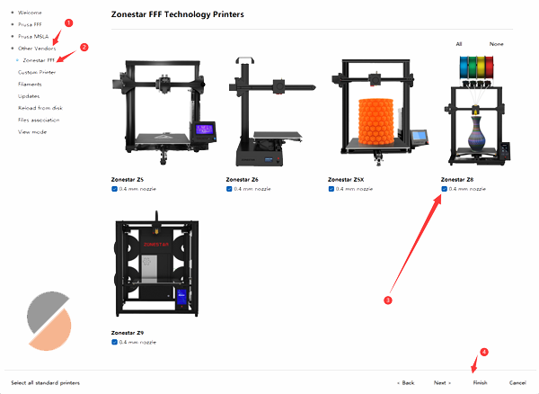

## <a id="choose-language">:globe_with_meridians: Choose language </a>

<!--  -->

----
# PrusaSlicer インストールおよびユーザーマニュアル
まず、FDM 3D プリンタは gcode ファイルのみを処理できますが、3D グラフィックス ファイルの標準形式は通常 stl、obj、amf などです。FDM 3D プリンタで 3D モデル ファイルを印刷する前に、3D グラフィックス ファイルを gcode ファイルに変換する必要があります。 コンピュータでは、このプロセスは ***「スライシング」*** と呼ばれます。 3D グラフィックス ファイルを gcode ファイルに変換することをサポートするソフトウェアは、スライシング ソフトウェアと呼ばれます。
PrusaSlicer は、現在最も人気のあるスライシング ソフトウェアの 1 つで、特にマルチカラー (マルチ エクストルーダー) 3D プリンタに適しています。 PrusaSlicer スライシング ソフトウェアを使用して gcode ファイルを生成することをお勧めします。

----
# PrusaSlicer 설치 및 사용 설명서
첫째, FDM 3D 프린터는 gcode 파일만 처리할 수 있는 반면 3D 그래픽 파일의 표준 형식은 일반적으로 stl, obj 및 amf 등입니다. FDM 3D 프린터에서 3D 모델 파일을 인쇄하기 전에 3D 그래픽 파일을 gcode 파일로 변환해야 합니다. 컴퓨터에서는 이 프로세스를 ***"슬라이싱"***이라고 합니다. 3D 그래픽 파일을 gcode 파일로 변환하는 것을 지원하는 소프트웨어를 슬라이싱 소프트웨어라고 합니다.
PrusaSlicer는 요즘 가장 인기 있는 슬라이싱 소프트웨어 중 하나로, 특히 멀티 컬러(다중 압출기) 3D 프린터에 적합합니다. gcode 파일을 생성하려면 PrusaSlicer 슬라이싱 소프트웨어를 사용하는 것이 좋습니다.

----
## :book: 목차
1. **[PrusaSlicer 다운로드](#a1)**
2. **[PrusaSlicer를 실행하고 프린터를 선택하세요](#a2)**
3. **[시스템 사전 설정 선택](#a3)**
4. **[단색 3D 모델 슬라이스](#a4)**
5. **[다색 3D 모델 슬라이스](#a5)**

## <a id="a1">1. PrusaSlicer 다운로드</a>
:clapper: [**슬라이싱 소프트웨어 다운로드 및 설치 방법**](https://youtu.be/SgyXD-kQIeo)
###  Windows의 경우
#### [:arrow_down:**여기**](https://github.com/ZONESTAR3D/Slicing-Guide/releases/tag/PrusaSlicer2.4.2)를 클릭하여 PrusaSlicer 소프트웨어를 다운로드하고 PC에 저장하세요.

#### 그런 다음 다운로드한 파일을 PC나 노트북에 압축을 풉니다.

###  Macos 또는 Linux의 경우
- [zonestar 프로필이 포함된 PrusaSlicer 소프트웨어 다운로드](https://github.com/ZONESTAR3D/Slicing-Guide/releases/tag/2.4.2)

## <a id="a2">2. PrusaSlicer를 실행하고 프린터를 선택하세요 </a>
#### 2.1 PrsuaSlicer.exe를 찾아 클릭하여 실행합니다.

#### 2.2 프린터를 선택하세요. "다른 공급업체>>Zonestar FFF>>해당 프린터 모델>>마침"

## <a id="a3">3. 시스템 사전 설정 선택</a>
프린터, 핫엔드, 인쇄하려는 색상에 따라 시스템 사전 설정을 선택하세요.    
   
- 단색 3D 모델을 인쇄해야 하는 경우 ***Z8 + 단일 색상***을 선택하세요.
- 다중 색상 3D 모델을 인쇄하는 경우 ***Z8 + M4 HOTEND***를 선택합니다.

## <a id="a4">4. 한 가지 색상 분할</a>
:clapper: [**슬라이싱 가이드 - 단색 인쇄용**](https://youtu.be/g-YSgV44Rik)
#### 4.1 프린터 사전 설정 선택 *Z8 + 단색*

#### 4.2 3D 모델 파일 로드(stl/obj/AMF 파일 등)

#### 4.3 인쇄 필라멘트 유형 선택

#### 4.4 필요한 경우 3D 모델의 크기 조정, 자르기, 회전이 가능합니다.

#### 4.5 레이어 높이, 인쇄 속도, 지지대, 채우기 등 인쇄 설정을 지정합니다.
    
모델의 모양과 인쇄 품질 요구 사항에 따라 이러한 매개변수를 설정해야 할 수도 있습니다. 일부 모델의 경우 설정이 올바르지 않으면 개체를 성공적으로 인쇄할 수 없습니다. 자세한 내용은 다음을 참조하세요.
- [**PrusaSlicer 소개**](https://www.prusa3d.com/page/prusaslicer_424/)
- [**Slic3r 사용자 매뉴얼**](https://manual.slic3r.org/)
#### 4.6 슬라이싱

#### 4.7 슬라이스된 결과(gcode 파일)를 미리 본 후 PC에 gcode 파일로 저장한 후 SD 카드에 복사

## <a id="a5">5. 여러 색상으로 분할하기 </a>
- :clapper: [**슬라이싱 가이드 - 다색 인쇄용**](https://youtu.be/AIKrszmxvE4)
#### 5.1 프린터 사전 설정 선택 *Z8 + M4 핫엔드*

#### 5.2 3D 모델 파일 로드(stl/obj/AMF 파일 등)
 
##### :memo: 일반적으로 다중 색상을 인쇄하려면 분할 모델이 필요합니다. 즉, 3D 모델은 색상에 따라 여러 STL 파일로 분할되었으며 이러한 파일은 동일한 원점 좌표 위치를 사용하여 인쇄할 수 있습니다. 올바르게 병합됩니다.
##### :star2: PrusaSlicer에는 매우 강력한 새 기능이 있습니다. [3D 모델에 색상을 페인팅](https://youtu.be/Yx4fKDRGEJ4)할 수 있으며, 이 기능을 사용하면 단색 3D 모델을 다중 색상 3D 모델로 변환할 수 있습니다.
#### 5.3 인쇄 필라멘트 유형 - PLA를 선택하고 필라멘트 색상을 설정합니다.

#### 5.4 다양한 부품에 압출기 할당

#### 5.5 필요한 경우 3D 모델의 크기 조정, 자르기, 회전이 가능합니다.

#### 5.6 레이어 높이, 인쇄 속도, 지지대, 채우기 등 인쇄 설정을 지정합니다.
   
모델의 모양과 인쇄 품질 요구 사항에 따라 이러한 매개변수를 설정해야 합니다. 일부 모델의 경우에도 지원하지 않으면 인쇄가 정상적으로 완료되지 않습니다. 자세한 내용은 다음을 참조하세요.
- [**PrusaSlicer 소개**](https://www.prusa3d.com/page/prusaslicer_424/)
- [**Slic3r 사용자 매뉴얼**](https://manual.slic3r.org/)    
:warning: *도구 비활성화 시 후퇴*는 0으로 설정되어야 합니다.   

#### 5.7 와이프 타워에 대한 매개변수 설정
##### PrusaSlicer에서는 "Wipe tower"라고 불리는 정사각형 사각형이 슬라이스 그림에 나타나는 것을 볼 수 있습니다. 멀티 컬러 프린터의 경우 압출기를 전환하는 동안 핫엔드 내부에 이전 컬러 필라멘트가 여전히 남아 있기 때문에 다른 컬러를 인쇄하기 전에 청소해야 합니다.

##### 더 나은 청소 효과를 얻고 필라멘트 낭비를 최소화하기 위해 색상에 따라 색상 퍼지 양을 설정할 수 있습니다. 다음 표에 주의하세요. 열에는 인쇄된 마지막 Extruder의 필라멘트 색상이 표시되고, 행에는 인쇄될 다음 Extruder의 필라멘트 색상이 표시됩니다.
##### 밝은 색상의 필라멘트를 사용하는 압출기에서 더 어두운 색상의 소모품을 사용하는 압출기로 변경할 때 압출 삭제를 더 작게 설정할 수 있습니다. 반대로, 더 어두운 색상의 소모품을 사용하는 압출기에서 더 어두운 색상의 필라멘트를 사용하는 압출기로 변경할 경우 압출 삭제를 더 작게 설정해야 합니다.

#### 5.8 슬라이싱

#### 5.9 슬라이스된 결과(gcode 파일)를 미리 본 후 PC에 gcode 파일로 저장한 후 SD 카드에 복사

