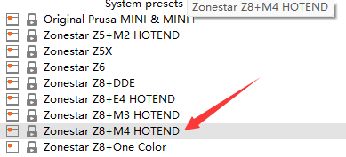

## <a id="choose-language">:globe_with_meridians: Choose language </a>

<!--  -->

----
# PrusaSlicer Установка и руководство пользователя
Во-первых, 3D-принтеры FDM могут обрабатывать только файлы gcode, тогда как стандартными форматами файлов 3D-графики обычно являются stl, obj, amf и т. д. Перед печатью файлов 3D-модели на 3D-принтере FDM необходимо преобразовать файлы 3D-графики в файлы gcode. на компьютере этот процесс называется ***"нарезкой"***. Программное обеспечение, которое поддерживает преобразование файлов 3D-графики в файлы Gcode, называется программным обеспечением для нарезки.
PrusaSlicer — одно из самых популярных в настоящее время программ для нарезки, которое особенно подходит для многоцветных (многоэкструдерных) 3D-принтеров. Мы рекомендуем использовать программное обеспечение для нарезки PrusaSlicer для создания файлов gcode.

----
## :book: Содержание
1. **[Загрузить PrusaSlicer](#a1)**
2. **[Запустите PrusaSlicer и выберите принтер](#a2)**
3. **[Выбор системных настроек](#a3)**
4. **[Нарезка 3d-модели одного цвета](#a4)**
5. **[Нарезка многоцветной 3d модели](#a5)**

## <a id="a1">1. Скачать PrusaSlicer</a>
:clapper: [**Как загрузить и установить программу для нарезки**](https://youtu.be/SgyXD-kQIeo)
###  Для окон
#### Нажмите [:arrow_down:**здесь**](https://github.com/ZONESTAR3D/Slicing-Guide/releases/tag/PrusaSlicer2.4.2), чтобы загрузить программное обеспечение PrusaSlicer и сохранить его на свой компьютер.

#### А затем разархивируйте загруженный файл на свой компьютер или ноутбук.

###  Для Macos или Linux
- [Загрузить программное обеспечение PrusaSlicer с профилями Zonestar] (https://github.com/ZONESTAR3D/Slicing-Guide/releases/tag/2.4.2)

## <a id="a2">2. Запустите PrusaSlicer и выберите принтер </a>
#### 2.1 Найдите PrsuaSlicer.exe и щелкните его, чтобы запустить

#### 2.2 Выберите свой принтер: «Другие поставщики>>Zonestar FFF>>ваша модель принтера>>завершить»

## <a id="a3">3. Выберите системные настройки</a>
Выберите системные настройки в соответствии с вашим принтером, хотэндом и цветами, которые вы хотите печатать:    
    
- Если вам нужно распечатать одноцветную 3D-модель, выберите ***Z8 + Один цвет***.  
- Если вы печатаете многоцветную 3D-модель, выберите ***Z8 + M4 HOTEND***.

## <a id="a4">4. Нарезка одного цвета</a>
:clapper: [**Руководство по нарезке - для одноцветной печати**](https://youtu.be/g-YSgV44Rik)
#### 4.1 выбор настроек принтера *Z8 + один цвет*

#### 4.2 загрузка файла 3D-модели (файл stl/obj/AMF и т. д.)

#### 4.3 Выбор типа нити для печати

#### 4.4 При необходимости можно изменить размер, вырезать, повернуть 3d модель

#### 4.5 Установите параметры печати: высоту слоя, скорость печати, поддержку, заполнение и т. д.
     
Возможно, вам придется установить эти параметры в соответствии с формой модели и вашими требованиями к качеству печати. Для некоторых моделей объект даже невозможно успешно распечатать, если настройки неверны. Для получения подробной информации см.:
- [**Введение в PrusaSlicer**](https://www.prusa3d.com/page/prusaslicer_424/)
- [**Руководство пользователя Slic3r**](https://manual.slic3r.org/)
#### 4.6 Нарезка

#### 4.7 Предварительный просмотр результата нарезки (файл gcode), затем сохраните его в файл gcode на свой компьютер, а затем скопируйте на SD-карту.

## <a id="a5">5. Нарезка нескольких цветов </a>
- :clapper: [**Руководство по нарезке — для многоцветной печати**](https://youtu.be/AIKrszmxvE4)
#### 5.1 выбор настроек принтера *Z8 + M4 hotend*

#### 5.2 загрузка файлов 3D-модели (файл stl/obj/AMF и т. д.)
 
##### :memo: Обычно для многоцветной печати требуется разделенная модель, то есть 3D-модель разделена на несколько файлов STL в соответствии с цветами, и эти файлы используют одну и ту же исходную координату, чтобы их можно было быть объединены правильно.
##### :star2: В PrusaSlicer появилась очень мощная новая функция. Он может [окрашивать цвет в 3D-модель] (https://youtu.be/Yx4fKDRGEJ4), с помощью этой функции вы можете преобразовать одноцветную 3D-модель в многоцветную 3D-модель.
#### 5.3 Выберите тип нити для печати — PLA и установите цвет нити.

#### 5.4 Назначение экструдеров различным частям

#### 5.5 При необходимости можно изменить размер, вырезать, повернуть 3d модель

#### 5.6 Установите параметры печати: высоту слоя, скорость печати, поддержку, заполнение и т. д.
    
Вам необходимо задать эти параметры в соответствии с формой модели и вашими требованиями к качеству печати. Даже для некоторых моделей печать невозможно нормально выполнить без поддержки. Для получения подробной информации см.:
- [**Введение в PrusaSlicer**](https://www.prusa3d.com/page/prusaslicer_424/)
- [**Руководство пользователя Slic3r**](https://manual.slic3r.org/)    
:warning: Обратите внимание, что *Отвод при отключенном инструменте* должен быть установлен на 0.   

#### 5.7 Установка параметров очистки башни
##### Вы можете заметить, что на разрезанной фигуре появится квадрат, который в PrusaSlicer называется «Wipe Tower». Поскольку в многоцветном принтере при переключении экструдеров внутри хотэнда все еще остаются нити предыдущего цвета, перед печатью другого цвета его необходимо очистить.

##### Чтобы получить лучший эффект очистки и минимизировать количество отходов нити, мы можем установить количество продувки цвета в соответствии с разными цветами. Обратите внимание на следующую таблицу: в столбцах указан цвет нити последнего напечатанного экструдера, а в строках указан цвет нити следующего напечатанного экструдера.
##### Когда мы переключаемся с экструдера с нитью более светлого цвета на экструдер с расходными материалами более темного цвета, мы можем установить меньшее стирание экструзии. Напротив, когда мы переходим от экструдера с расходными материалами более темного цвета к экструдеру с нитью более темного цвета, нам необходимо установить меньшее значение стирания экструзии.

#### 5.8 Нарезка

#### 5.9 Просмотрите результат нарезки (файл gcode), затем сохраните его в файл gcode на свой компьютер, а затем скопируйте на SD-карту.

