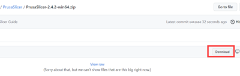
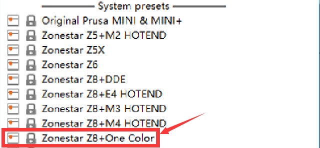
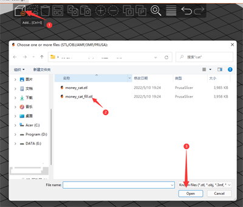

### :globe_with_meridians: Choose Language (Translated by google)

----
# Slicing guide for PrusaSlicer
## :warning: Please refer to [**:point_right: here**](https://github.com/ZONESTAR3D/Slicing-Guide) to view the newest slicing software use guide

----
## :book: Contents
1. **[Download PrusaSlicer software](#1-download-prusaslicer)**
2. **[Run PrusaSlicer and choose the printer ](#2-run-prusaslicer-and-choose-the-printer)**
3. **[Choose system presets](#3-choose-system-presets)**
4. **[Slicing one color](#4-slicing-one-color)**
6. **[Slicing muti-color for Z8 + M4 hotend](#5-slicing-muti-color-for-m4-hotend)**

## 1. Download PrusaSlicer
:movie_camera: [**How to download and install slicing software**](https://youtu.be/SgyXD-kQIeo)
#### For windows system (win 7/8/10/11) 
- Click the below links to download:
  - [**Download from Github Page**](https://github.com/ZONESTAR3D/Slicing-Guide/blob/master/PrusaSlicer/PrusaSlicer-2.4.2-win64.zip)   
    
  - [**Download from Jianguoyun**](https://www.jianguoyun.com/p/DQtYE2IQyoP1Bxjy374EIAA)    
    
  - [**Download from Google Driver**](https://drive.google.com/drive/folders/18WoIydKMPNVGcCbk_6rOo17a5pWe2N0l)    
    
- And then unzip downloaded file to your PC or laptop  
   

#### For Macos or linux
- [Download PrusaSlicer software with zonestar profiles](https://github.com/ZONESTAR3D/Slicing-Guide/releases/tag/2.4.2)

## 2. Run PrusaSlicer and choose the printer 
#### 2.1 Find the PrsuaSlicer.exe and click it to run

#### 2.2 Choose your printer, "Other Vendors>>Zonestar FFF>>your printer model>>finish"

## 3. Choose system presets
Choose system presets according to your printer, hotend and the colors you want to print:   

- If you need to print one color 3d model, choose **"Z8 + One Color"**.  
- If you print multi color 3d model, choose **"Z8 + M4 HOTEND"**.    

## 4. Slicing one color
:movie_camera: [**Slicing guide - for one color printing**](https://youtu.be/SgyXD-kQIeo4)
#### 4.1 choose printer presets "Z8 + One Color"

#### 4.2 load 3d model file (stl/obj/AMF file etc.)

#### 4.3 Choose print filament type

#### 4.4 If need, you can resize, cut, rotate the 3d model 
  
#### 4.5 Set the print settings: layer height, print speed, support, infill, etc.
  
You may need to set these parameters according to the shape of the model and your requirements for print quality. For some models, the object even cannot be printed successfully if the settings is incorrect. For details please refer to:
- [**PrusaSlicer introduction**](https://www.prusa3d.com/page/prusaslicer_424/)
- [**Slic3r User Manuual**](https://manual.slic3r.org/)
#### 4.6 Slicing
  
#### 4.7 Preview the sliced result (gcode file) and then save to gcode file to your PC and then copy to SD card
  

## 5. Slicing muti-color for M4 hotend 
- :movie_camera: [**Slicing guide - for multi colors printing**](https://youtu.be/AIKrszmxvE4) 
#### 5.1 choose printer presets "Z8 + M4 hotend"

#### 5.2 load 3d model files (stl/obj/AMF file etc.)
 
##### :memo: Usually, "split model" is inneed to print multi-color, that is, a 3d model has been split into multiple STL files according to colors, and these files use the same origin coordinate position so that they can be merged correctly.
##### :star2: PrusaSlicer has a very powerful new feature. It can [painting color to the 3d model](https://www.youtube.com/watch?v=6LLK9soDW88), with this function, you can convert a one color 3d model to a muti color 3d model.

#### 5.3 Choose print filament type - PLA and set filament color

#### 5.4 Assign extruders to different parts

#### 5.5 If need, you can resize, cut, rotate the 3d model 
  
#### 5.6 Set the print settings: layer height, print speed, support, infill, etc.
  
You need to set these parameters according to the shape of the model and your requirements for print quality. Even for some models, printing cannot be completed normally without support. For details please refer to:
- [**PrusaSlicer introduction**](https://www.prusa3d.com/page/prusaslicer_424/)    
- [**Slic3r User Manuual**](https://manual.slic3r.org/)    
:warning: Please note that the "Retraction when tool is disabled" should be set to 0.    
  
#### 5.7 Set parameters for "wipe tower"
##### You may notice that a square square will appear in the sliced figure, which is called "Wipe tower" in PrusaSlicer. Because for the multi-color printer, while switching extruders, there are still the previous color filaments inside the hotend, it need to be clean before printing another color.   
    
##### In order to obtain better cleaning effect and minimize to waste filament, we can set the amount of color purge according to different colors. Please pay attention to the following table, the columns shows the filament color of the last extruder printed, and the rows shows the filament color of the next extruder to be printed.
##### When we change from the extruder with lighter color filament to the extruder with darker color consumables, we can set a smaller extrusion erasure. On the contrary, when we change from the extruder with darker color consumables to the extruder with darker color filament, we need to set a smaller extrusion erasure
  
#### 5.8 Slicing
  
#### 5.9 Preview the sliced result (gcode file) and then save to gcode file to your PC and then copy to SD card
  
