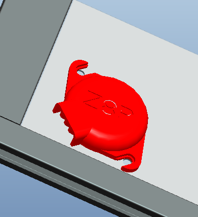

## Fan duck of Hotend
Hotend Fan duck is a print part, if it is damaged, you can download it and print one to replace it.   
- [:arrow_down:**Download file**](./fanduck_m4v6.zip)

## Cover of the PSU fan
The fan of the machine's power supply is facing upward, installing to the PSU can effectively prevent foreign matters from entering. You can download and print it by yourself.  
- [:movie_camera:**Video toturial**](https://youtu.be/Xc3vRqRYklM)     
- [:arrow_down:**Download file**](./PS_FAN_CASE.zip)     
           

