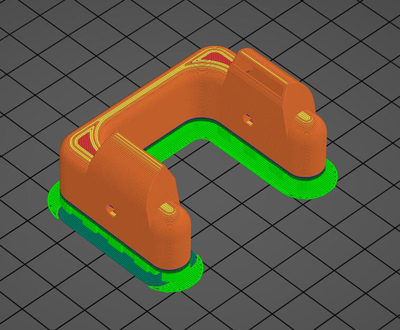
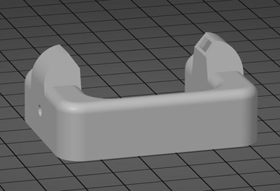

## Fan duct of Hotend
Hotend Fan duct is a print part, if it is damaged, you can download it and print one to replace it.   
- A upgraded version fan duct of M4V6 hotend. [:arrow_down:**Download stl file**](./fanduct_m4v6_V2.zip)      
  
- The orignal version fan duct of M4V6 hotend. [:arrow_down:**Download stl file**](./fanduct_m4v6.zip)      
  

## Cover of the PSU fan
The fan of the machine's power supply is facing upward, installing to the PSU can effectively prevent foreign matters from entering. You can download and print it by yourself.  
- [:clapper:**Installation video toturial**](https://youtu.be/Xc3vRqRYklM)     
- [:arrow_down:**Download stl file**](./PS_FAN_CASE.zip)     
           

