### :globe_with_meridians: Choose Language (Translated by google)

-----
# Z8PM4-MK2 Video Tutorial
Some functions of the Z8PM4Pro are the same with Z9V5, so the video tutorial may have been captured by a Z9V5 3d printer.
## :one: Installation and Use
|    **Installation**                                            |           **Wiring**                                           |
|:--------------------------------------------------------------:|:--------------------------------------------------------------:|
| [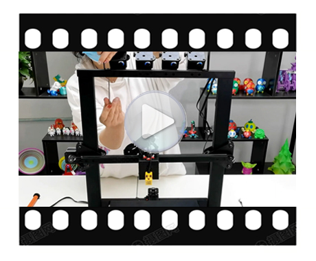](https://youtu.be/-oieO7U0LCc)             | [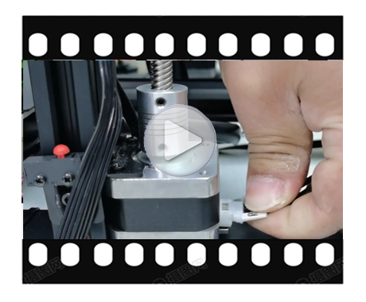](https://youtu.be/kpQvHASNfqE)              |
|        **Power On/OFF**                                        |              **Bed leveling**                                  |
| [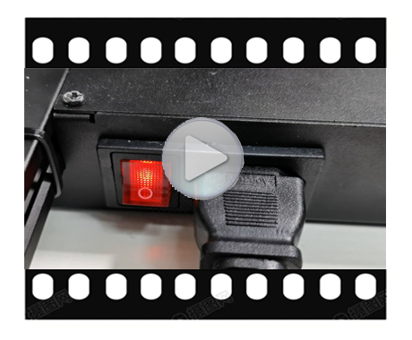](https://youtu.be/2i8ozM2Dn1U)          | [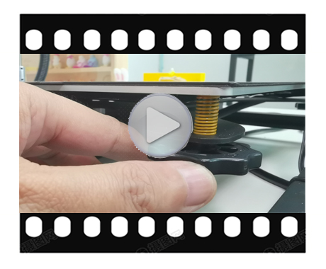](https://youtu.be/R3RfGnxx8hY)         |
|          **Load filament**                                     |        **Print from SD card**                                  |
| [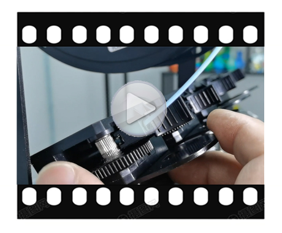](https://youtu.be/-47yB95uIxI)        | [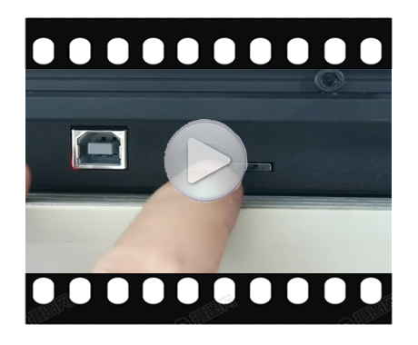](https://youtu.be/ITHbO9VxTMo)         |
|    **Gradient mix color printing**                             |       **Random mix color printing**                            |
|                                       |                                       |
|    **Install slicer software**                                 |       **Slicing guide - one color**                            |
| [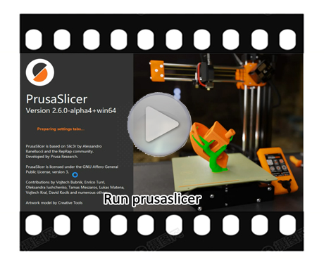](https://youtu.be/vCv0S4L7u30)       | [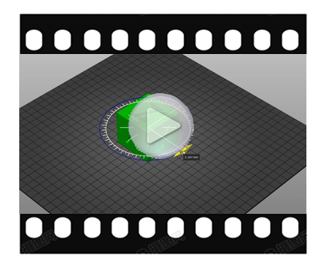](https://youtu.be/bacvTF2MOxA)          |
|    **Slicing guide - mulit color**                             |     **Slicing guide - mulit color2**                           |
| [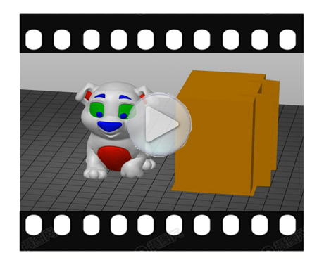](https://youtu.be/2IHiP2r7KNk)        |                                       |
|    **Slicing guide - painting color**                          |     **Print and install a cover to the fan of PSU**            |
|                                       | [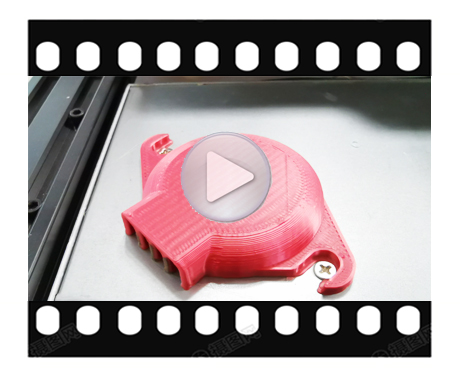](https://youtu.be/Xc3vRqRYklM)              |

## :two: Advance Features
|    **Power auto shutdown**                                     |           **Bed auto leveling**                                |
|:--------------------------------------------------------------:|:--------------------------------------------------------------:|
| [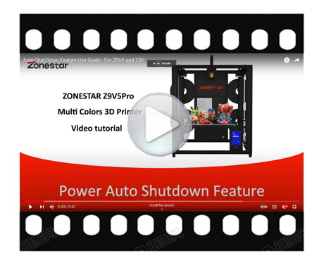](https://youtu.be/SJLpmJL-tG4)        | [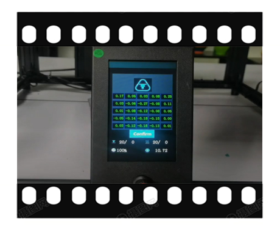](https://youtu.be/Zoyl6PybsUk)        |
|     **Power loss recovery**                                    |            **Fast printing**                                   |
|    |                                           |

## :four: Maintenance and Repair
|  **Machine Auto testing guide**                                |    **How to replace the nozzle**                               |
|:--------------------------------------------------------------:|:--------------------------------------------------------------:|
| [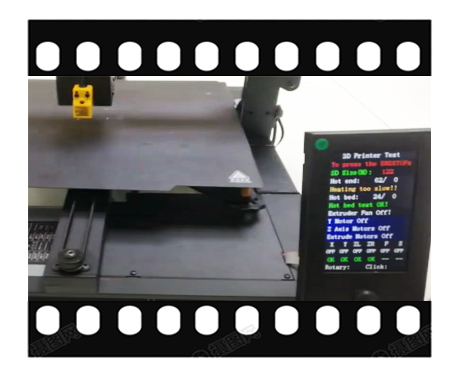](https://youtu.be/iSsuy2ePWw8)            |                                           |
|     **How to upload firmware**                                 |   **How to upload LCD screen UI Menu**                         |
|                                           |                                           |
|     **How to replace hotend heater**                           |   **How to replace motor drivers**                             |
|                                           |                                           |
|     **How to replace Titan extruder**                          |   **How to replace control board**                             |
|                                           |                                           |
|     **How to replace heat sticker**                            |   **How to open control box**                                  |
|                                           |                                           |

## :three: Upgradable Features
|     **WiFi installation guide**                                |            **WiFi use guide**                                  |
|:--------------------------------------------------------------:|:--------------------------------------------------------------:|
|                                           |                                           |
| **E4 hotend installation guide**                               |            **E4 hotend use guide**                             |
|                                           |                                           |
| **upgrade a Micro-SD card adapter**                            |     **Upgrade dual gear extruders**                            |
|                                           |                                           |
| **Filament run out sensor installation guide**                 |    **Filament run out detect use guide**                       |
|                                           |                                           |
| **Laser engine installation guide**                            |            **Laser engine use guide**                          |
|                                           |                                           |

