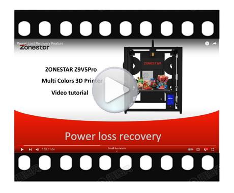

### :globe_with_meridians: Choose Language (Translated by google)
                           

-----
# Z8PM4-MK2 Video Tutorial
Some functions of the Z8PM4Pro are the same with Z9V5, so the video tutorial may have been captured by a Z9V5 3d printer.
## :one: Installation and Use
|    [:book:**Installation**](../1-Installation_Guide/)          |     [:book:**Wiring**][wiring]                                 |
|:--------------------------------------------------------------:|:--------------------------------------------------------------:|
|              |               |
|    [:book:**Power On/OFF**](../2-Operation_Guide/readme.md)    |     [:book:**Bed leveling**][bedleveling]                      |
|           |          |
|    [:book:**Load filament**][loadfilament]                     |     [:book:**Print from SD card**][printfromsdcard]            |
|         |          |
|    [:book:**Gradient mix color printing**][gradientmix]        |     [:book:**Random mix color printing**][randommix]           |
|          |            |
|    [:book:**Install slicer software**][slicing1]               |     [:book:**Slicing guide - one color**][slicing2]            |
|        |           |
|    [:book:**Slicing guide - mulit color**][slicing3]           |     [:book:**Slicing guide - mulit color2**][slicing4]         |
|         |                                       |
|    [:book:**Slicing guide - painting color**][slicing5]        |     [:book:**Print and install a cover on the PSU**][psufan]   |
|                                       |               |

## :two: Advance Features
|    **Power auto shutdown**                                     |           **Bed auto leveling**                                |
|:--------------------------------------------------------------:|:--------------------------------------------------------------:|
|         |         |
|     **Power loss recovery**                                    |            **Fast printing**                                   |
|    |                                           |

## :four: Maintenance and Repair
|  **Machine Auto testing guide**                                |    **How to replace the nozzle**                               |
|:--------------------------------------------------------------:|:--------------------------------------------------------------:|
|             |        |
|     **How to upload firmware**                                 |   **How to upload LCD screen UI Menu**                         |
|                                           |                                           |
|     **How to open control box**                                |   **How to replace motor drivers**                             |
|                                           |                                           |
|     **How to replace Titan extruder**                          |   **How to replace control board**                             |
|                                           |                                           |
|     **How to replace heat sticker**                            |   **How to replace hotend heater**                             |
|                                           |                                           |

## :three: Upgradable Features
|     **WiFi installation guide**                                |            **WiFi use guide**                                  |
|:--------------------------------------------------------------:|:--------------------------------------------------------------:|
|                                           |                                           |
| **E4 hotend installation guide**                               |            **E4 hotend use guide**                             |
|                                           |                                           |
| **upgrade a Micro-SD card adapter**                            |     **Upgrade dual gear extruders**                            |
|                                           |                                           |
| **Filament run out sensor installation guide**                 |    **Filament run out detect use guide**                       |
|                                           |                                           |
| **Laser engine installation guide**                            |            **Laser engine use guide**                          |
|                                           |                                           |

[wiring]: https://github.com/ZONESTAR3D/Z8P/blob/main/Z8P-MK2/1-Installation_Guide/readme.md#wiring
[bedleveling]: https://github.com/ZONESTAR3D/Z8P/blob/main/Z8P-MK2/2-Operation_Guide/readme.md#level-the-bed
[loadfilament]: https://github.com/ZONESTAR3D/Z8P/blob/main/Z8P-MK2/2-Operation_Guide/readme.md#load-filaments
[printfromsdcard]: https://github.com/ZONESTAR3D/Z8P/blob/main/Z8P-MK2/2-Operation_Guide/readme.md#print-the-first-works
[gradientmix]: https://github.com/ZONESTAR3D/Z8P/tree/main/Z8P-MK2/2-Operation_Guide/Auto_Color_Mixing#auto-gradient-mixing
[randommix]: https://github.com/ZONESTAR3D/Z8P/blob/main/Z8P-MK2/2-Operation_Guide/Auto_Color_Mixing/readme.md#auto-random-mixing
[psufan]: 

