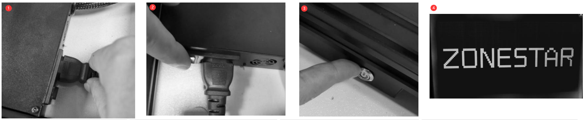
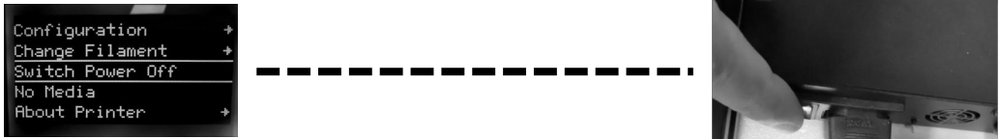

### Choose Language (Translated by google)

-----
# Z8PM3(4) Use Guide
## Power ON and Power Off
#### :warning:ATTENTION! MAKE SURE THE AC VOLTAGE SELECT SWITH HAS BEED SET TO THE CORRECT POSITION:warning:

### POWER ON
1. Plug in power cord to the control box.
2. Turn ON the AC power switch.
3. **Push and hold** the DC power button.
4. Wait until the LCD shows Logo and then release the DC power button.

### POWER OFF
Do "Switch Power Off” on LCD Screen, wait the LCD screen off, and then turn off AC power switch.
  

### About the LCD screen menu decription, please refer to [here]().

## Prepare to print 
### Level the bed
Before printing, you need to adjust the distance between the nozzle and the hot bed film to a proper value, so that the melted filament can be pasted onto the hot bed film well. This process is also called “level bed”. If the nozzle is too far away from the bed, the filament can't stick to the hot bed. If the distance is too close, the bed film and nozzle will be damaged, or even the hot end will be blocked.
##### tep 1: Power on the 3d printer and then do “Prepare>>Auto Home>>Home All” on LCD MENU, wait the hotend go to the HOME position. 
##### Step 2: Tighten the hand nuts under the bed to move down the bed to the lowest position (Fig 1).
##### Step 3: Do “Prepare>> Bed leveling>> Point 1” on control panel(Fig 2), the nozzle will go to the corners of the bed, loosen the hand nuts under the hotbed (Fig 3) and let the nozzle almost touch the hotbed (Fig 4). Continue to do “Point 2/3/4” until all of the 4 corners has been leveled.
##### Step 4: Repeat Step 3 and do 2 ~ 3 rounds, until all of the four corners at the same height.

### Load filaments
#### For Z8PM3
Z8PM3 is equipped with three extruders and a 3-IN-1-OUT color mixing hot end. The extruders and the hot end are connected by a filament guide (PTFE tube). Before printing, you need to load the filament to the extruder #1 and feed it into one of channel of the hot end, and use the hotend clean tool to close the unused channels. 
##### Step 1. Do “Prepare>>Auto Home>>Home All” on control panel, and then do “Prepare>>Temperature>> Preheat PLA”, waiting nozzle temperature reached to 190 ℃ (Fig 1).
##### Step 2. Use a diagonal pliers to cut off the head of filament (Fig 2), and then press the handle of the extruder#1 and insert filament, push the filament until you can see the filament in the PTFE guide (Fig 3). Rotate the gear of extruder #1 (Fig 4), watch the filament until it entered bottom of the hot end. 
##### Step 3. Using the same method as in step 2 to load the filaments to extruder#2 ~ extruder#4, watch the filaments until them entered the bottom of hot end.
##### Step 4. Slowly rotate the gear of extruder#1 ~ extruder#4 one by one and watch the nozzle, until you can see the filament flowed out from the nozzle(Fig 5).

#### For Z8PM4
Z8PM4 is equipped with four extruders and a 4-IN-1-OUT color mixing hot end. The extruders and the hot end are connected by a filament guide (PTFE tube). Before printing, you need to load the filament to the extruder #1 and feed it into the center channel of the hot end, and use the hotend clean tool to close the unused channels. 
##### Step 1. Do “Prepare>>Auto Home>>Home All” on control panel, and then do “Prepare>>Temperature>> Preheat PLA”, waiting nozzle temperature reached to 190 ℃ (Fig 1).
##### Step 2. Use a diagonal pliers to cut off the head of filament (Fig 2), and then press the handle of the extruder#1 and insert filament, push the filament until you can see the filament in the PTFE guide (Fig 3). Rotate the gear of extruder #1 (Fig 4), watch the filament until it entered bottom of the hot end. 
##### Step 3. Using the same method as in step 2 to load the filaments to extruder#2 ~ extruder#4, watch the filaments until them entered the bottom of hot end.
##### Step 4. Slowly rotate the gear of extruder#1 ~ extruder#4 one by one and watch the nozzle, until you can see the filament flowed out from the nozzle(Fig 5).

## Print the first works
<!-- [:movie_camera:Video Tutorial]()      -->
##### Step 1. Insert the SD card to the SD card socket on the printer (Fig 1).
##### Step 2. Click “Print” on the control panel and choose “Test gcode\xyz_cube.gcode” (Fig 2), click the knob to start printing.
##### Step 3. Wait until the hotend and hotbed is reached to the setting temperature (Fig 3), the nozzle will home to the origin position and then move to above of the printing platform and extrude the filament, use a tweezers to remove the outflow filament (Fig 4).
##### Step 4. When the nozzle moved to the hot bed and start to print, double click the knob on the control panel to open a “Baby steps Z” menu (Fig 5), rotate knob slowly to fine tune the height of printing platform, watch the distance from nozzle to bed, until the distance goes well (Fig 6). Wait the printing finished, you will get your first works (Fig 7).
##### Step 5. Wait the hotbed cool (<=25 degree) (Fig 8), and then remove the printed object from the hotbed (Fig 9).

## Advance features
:warning: Do not turn on these functions until you clearly understand how to use them.
### [Auto Mix Printing](https://github.com/ZONESTAR3D/Z8P/blob/main/Z8P-MK2/2-Operation_Guide/Auto_Color_Mixing/readme.md)
This printer has built-in automatic gradient printing function. You can print monochrome slice print model gcode file into gradient model.   
For the details, please refer to [**:point_right: Auto Color Mixing Feature User Guide**](https://github.com/ZONESTAR3D/Z8P/blob/main/Z8P-MK2/2-Operation_Guide/Auto_Color_Mixing/readme.md).

### [Bed auto leveling](https://github.com/ZONESTAR3D/Z8P/blob/main/Z8P-MK2/2-Operation_Guide/Bed_Auto_Leveling/readme.md)
This printer is equipped with a PL-08N Bed leveling sensor, with this sensor, you can correct the unevenness of the hot bed.    
For the details, please refer to [**:point_right: Bed Auto Leveling Feature User Guide**](https://github.com/ZONESTAR3D/Z8P/blob/main/Z8P-MK2/2-Operation_Guide/Bed_Auto_Leveling/readme.md).

### [Auto shut down](https://youtu.be/SJLpmJL-tG4)
#### [:movie_camera: **Video tutorial**](https://youtu.be/SJLpmJL-tG4).
3D printing usually takes a long time, and you may not be near the machine when printing is finished. You can let the printer auto shut down while printing is finished to save unnecessary power consumption. 

### [Power loss recovery](https://youtu.be/f-PpasByiiE)
#### [:movie_camera: **Video tutorial**](https://youtu.be/f-PpasByiiE).
While printing from SD card and power is lost, after power on again, the printer will resume to print from the last layer which printed before power lost. 

### [Auto retraction](https://github.com/ZONESTAR3D/Z8P/blob/main/Z8P-MK2/2-Operation_Guide/Auto_Retraction/readme.md)
The strings issue of the mixed color hot end is often more serious than that of the single color hotend. Therefore, an automatic retraction feature is set in the firmware. Using automatic retraction can improve this problem.   
For the details, please refer to [**:point_right: Auto Retract Feature User Guide**](https://github.com/ZONESTAR3D/Z8P/blob/main/Z8P-MK2/2-Operation_Guide/Auto_Retraction/readme.md).

## Slicing
The slicing software is a computer software used in the majority of 3D printing processes for the conversion of a 3D object model to specific instructions for the printer. In particular, the conversion from a model in STL(Obj, Amf) format to printer commands in g-code format. 
This machine can use a variety of slicing software to complete slicing, We provide download addresses, instructions and video tutorials of common slicing software. 
For details, please refer to [**:point_right: Slicing-Guide**](https://github.com/ZONESTAR3D/Z8P/blob/main/Z8P-MK2/4-SlicingGuide/readme.md)
#### :loudspeaker:NOTE  
1. Slicing software is not a part of this machine, you can download slicing software for free from the internet.
2. If you print one color, please choose machine **“Z8 + One color”**. If you print multi color, please choose machine **“Z8 + M4 hot end”**.
3. Some of the user guide and video tutorials are made with reference to our Z9 series machines, and they are fully applicable to Z8PM4.
