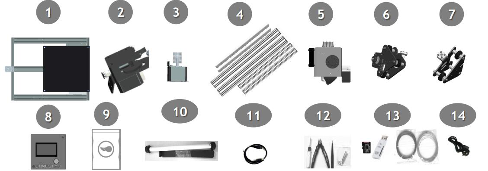
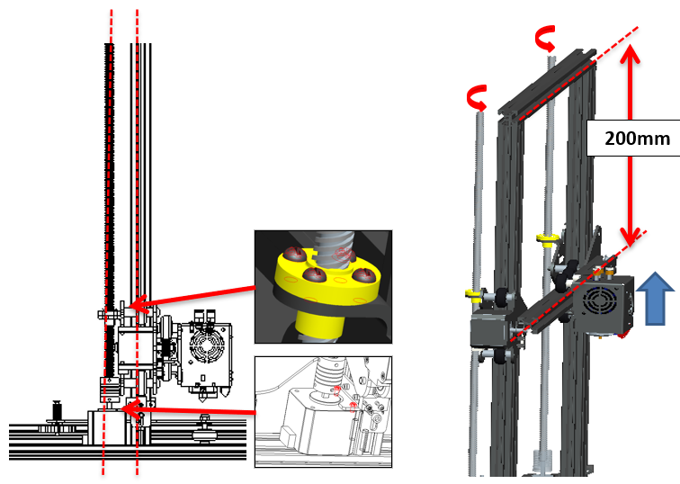

<!-- ### :globe_with_meridians: Choose Language (Translated by google)

 -->

-----
# Z8P Installation Guide
## :warning:ATTENTION:warning:
#### :clipboard:Please strictly follow the standard operation when installation.
#### :baby_bottle: Please put the printer away from the reach of kids.
#### :school: Must be guided by adults when children are installed or used.
#### :wrench: Take care when installation, to avoid electrical shock hazards.
#### :fire: Hotend has high temperature even the printer stop working.
#### :fire: Hotbed has high temperature even the printer stop working.
#### :ghost: Please keep well-ventilated condition! May produce toxic gases when printer working.
#### :electric_plug: Please make sure you have set the AC power select switch to the correct position before power on.

## Parts List
    
No.|         Name             | No.|              Name        | No.|              Name        | No.|              Name        |
---|--------------------------|----|--------------------------|----|--------------------------|----|--------------------------|
1  |        Base Module       | 2  |  Extruders*   | 3  | Z-axis Motor Modules(x2) | 4  |  Lead screw & Profiles   |  
5  |Print head with X carrier | 6  |  Z carrier(left)         | 7  |   Z carrier(right)       | 8  |  LCD Screen Contol Panel |
9  | Accessories              | 10 |  Filament Roll Bracket   | 11 |  USB cable               | 12 |   Tools                  |
13 | SD card and test filament| 14 |  Power cord              |    |                          |    |                          | 

\* **3 sets for Z8PM3 and 4 sets for Z8PM4**

## Description of Item No.4 & No.9 
   

No.|                                                 Name                                                |
---|-----------------------------------------------------------------------------------------------------|
1  | **Z Profiles:** 2* 2040 aluminum profiles for Z axis, there are 2 hole on the bottom side .         |
2  | **These two holes on the bottom when install.**                                                     |
3  | **Top Profile:** 1* 2020 aluminum profile installed to top, , there are many hole on the front.     |
4  | **X Profile:** 1* 2020 aluminum profile, there are 4 hole on the front and 2 big hole on the back.  |
5  | **lead screws:** 2* T8-500mm lead screws ***(They are put inside the Z aluminum profiles)***.       |
    
     

No.|         Name             | No.|              Name        | No.|              Name        |
---|--------------------------|----|--------------------------|----|--------------------------|
1  |    Srews                 | 2  |    X Belt idler          | 3  |     2* Z lead blocks     |  
4  |  2* Z ENDSTOP            | 5  |    4* PTFE Tube          | 6  |    X Timing Belt         |

## Installation
### 1. Install Z axis Parts
  
**NOTE: That side with two holes put on the bottom.**     

**Install two Z ENDSTOPs to the side of the Z profiles, fixed by screws.**     
 

#### Layout Extruder’s Cable
Put the extruder cables into the groove behind the right Z profile and cover it with plastic profile covers. Note that a distance of 10mm should be left at the top and the cables should be pulled out.  
   
     
:warning:Note: **Adjust the eccentric cloumns let the carrier hold the rail well and move smoothly.**

### 2. Install X axis Parts
  
1. Install the X belt idler to the Z right carrier, move it from right to left. 
2. Install the X profile to the Z carrier, fixed by screws.

  
1. Rotate the lead screws to keep Keep the same heigth before fixed the X profile.
2. Slide in the hotend from the right to left.
3. Layout the hotend cable.

  
1. Adjust the eccentric cloumns, let the X carrier hold the rail well and move smoothly.
2. Move the idler to the left first.
3. Hang the belt to the timing pulley and the idler, note the belt should be put in the groove of the x profile. And then fasten the belt to the hook of X carrier.
4. Move the idler to the right to tighten the belt and then fixed the idler on the Z carrir right.
5. Fix the screws to fix the X profile.

### 3. Install LCD screen
Install the LCD screen on the right/bottom of printer.
   

### 4. Install Extruders
Install Extrusion feeders to the top of the frame, Z8PM3 has 3 sets and Z8PM4 has 4 sets.    
    
:warning: NOTE: Try to rotate the extruders a little when install, to keep a little clearance between the adjusting screw and the indenter.

### 5. Install Filament Bracket
Install filament bracket on the top profile.    
  

### 6. Install PTFE tube
Connect the extrusion feeder with the print head (hot end) by filament guide (PTFE tube)   
  
:warning: Note: One of the channels is connected and others closed by **hotend clean tool** when the machine left factory. If you don't have 
experience in using 3D printers, start with single color.

### 7. Debug the Z Movement system
  
Keep the lead screws parallel to the Z axis profiles as far as possible will help to obtain better printing quality, please debug them refer to the following steps:   
**Step 1. Loosen all the screws a little that fixed the Z motors and T8 copper nut.**   
**Step 2. Synchronous rotate the couplings to move up the X axis to 1/2 height of the printer.**   
**Step 3. Keep the lead screws parallel to the Z profiles, then tighten the screws that fixed the Z motor and T8 copper nuts.**   

### 8. Install Z lead screws fixed module*
:warning: Note: Z lead screws are optional parts, your kit maybe don't include this part.
Install the Z lead screws fix blocks on the top profile.

## Wiring
### Description of the electronic parts

No.|         Name             | No.|              Name        | No.|              Name        | No.|              Name        |
---|--------------------------|----|--------------------------|----|--------------------------|----|--------------------------|
1  |  X MOTOR and X SW        | 2  |  Y MOTOR and Y SW        | 3  | Left Z MOTOR and Z SW    | 4  |  DC power button         |  
5  |  Hotend cooling FAN      | 6  |  Extruder cooling FAN    | 7  | Bed leveling Sensor      | 8  |  Right Z MOTOR and Z SW  |
9  |  Y MOTOR                 | 10 |  Extrusion feeders       | 11 | AC POWER Switch          | 12 |  AC POWER Cord Connector |
13 | Control board cooling FAN| 14 |  110V/220V Switch        | 15 | Control Panel            | 16 |  Knob of control panel   | 
17 | HOTBED                   | 18 |  USB socket              | 19 | SD card socket           |    |                          | 

### Wiring Block
#### Wiring Block for Z8PM3(4)
     
#### Wiring Block for Z8PM3(4)-Pro
     
#### Rerfer to the below pictures to connect the wire/cables to the connector of printer, they are: 
- **left Z Motors/Endstops and right Z Motors/Endstops.**    
- **X motor/Endstop.**    
- **Extruder motors wires.** 
- **Hotend wires.**    
- **LCD cable**    
:warning: Filament run out sensor is option, some printer has left a wire to connect them.

### Wiring Diagram
#### Wiring Diagram for Z8PM3(4)

#### Wiring Diagram for Z8PM3(4)-Pro

## Check before power on
#### :warning: It is very important to check the machine before power on. It can eliminate the trouble brought by some hardware to ensure the smooth printing!
#### Check list:
1. **Check if the X&Y axis timing pulley are fixed on the shaft of motor, and the couplings are fixed on the shaft of the Z motors.**
2. **Check if the lead screws have been fixed on the shaft of coupling.**
3. **Move the hot end and hotbed to their respective limit switch positions to check whether the contact is good and there is a clear sound. otherwise, please check the limit switch and reassemble it.**
4. **Manually move the hot end and hotbed to see if the movement is smooth, otherwise, adjust the eccentric nut until the motor moves smoothly. Refer to the installation procedure.**
5. **Check whether the X and Y-axis drive belt is firmly installed. If it is too loose, please try to tighten it.**
6. **Check whether the screw rod is assembled in place and whether the screw is tightened.**
7. **Manually rotate the z-axis motor couplings to check whether the z-axis limit switch contacts reliably.**
8. **Check if the AC power select switch to set to the correct position. City AC Voltage is 220V, set to [230]. City AC Voltage is 110V, set to [115].**   

## :fireworks: Congratulate! 
After completing the above installation steps, the machine installation is announced to be completed. You can arrange the wiring and fasten them to the frame of the machine with cable tie. Next, just do some preliminary debugging, and you can start your first print.
- For Z8PM3(4), please refer to [**:point_right: User Guide for Z8PM3(4)**](https://github.com/ZONESTAR3D/Z8P/blob/main/Z8P/Userguide_Z8P.md) to start your first print.
- For Z8PM3(4)Pro please refer to [**:point_right: User Guide for Z8PM3(4)Pro**](https://github.com/ZONESTAR3D/Z8P/blob/main/Z8P/Userguide_Z8PPro.md) to start your first print.

-----
### [ :movie_camera: **Installation Video Tutorial for Z8PM4Pro**](https://youtu.be/YV3dSoo5NOM)
:warning: The installation video tutorial is for Z8PM4Pro, but Z8PM3 is almost the same with Z8PM4Pro.

