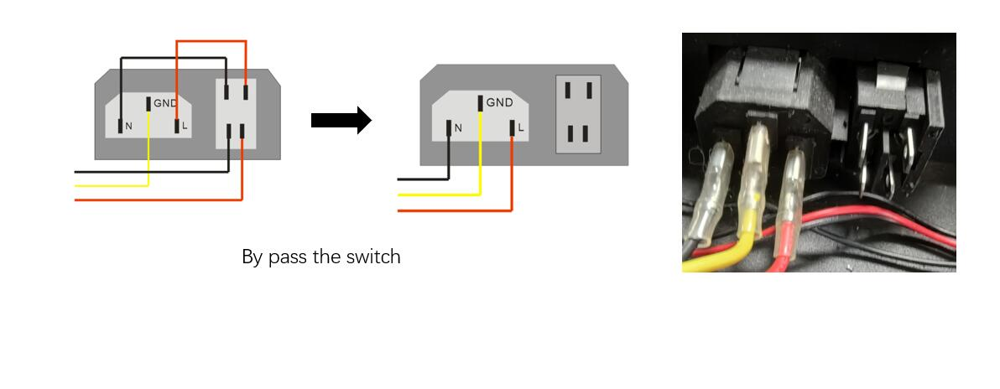

## <a id="choose-language">:globe_with_meridians: Choose language</a>

-----
##  <a id="en">The printer auto shut down when printing from SD card</a>
#### :one: Check AC power switch 
  :warning: The latest version of Z8PM4Pro (Z8PM4Pro-MK2A) has upgraded the AC switch, you can skip this step.
  1. Open the control box and check the wire to connect to the AC power socket, these wire may not connect very well.
  2. Check the AC power switch on the AC power cord socket, if the switch doesn't work well, try to bypass it and try again.
  

#### :two: Upload the newest firmware
Upload the newest firmware to the control board and try again. **[:arrow_down:Download the newest firmware](https://github.com/ZONESTAR3D/Firmware/tree/master/Z8/Z8P)**   
:warning: Please note the version of your machine before downloading firmware.

#### :three: Check SD card 
1. If you used a SD card extend cable, remove it and plug the SD card into the SD card socket directly and try again.   
2. Format the SD card (Must be FAT32) and copy only one gcode file to SD card and try again.
3. Replace a new SD card (<=32G, format to FAT32) and try again.
4. Choose another gcode file to print.

#### :four: Turn off "PowerLoss Recovery" feature
Turn off the **PowerLoss Recovery** feature from LCD Menu (***Control>>Configre>>PowerLoss Recovery***) and try again.     
:pushpin: **Power Loss Recovery** feature requires frequent writing to the SD card. If there are writing errors, it may cause abnormal crashes during the printing.

### If you have tried all above steps and the question can't be fixed, please contact our technical support team : support@zonestar3d.com.

-----
##  <a id="es">La impresora se apaga automáticamente al imprimir desde una tarjeta SD</a>
#### :one: Verifique el interruptor de alimentación de CA
:warning: La última versión de Z8PM4Pro (Z8PM4Pro-MK2A) ha actualizado el interruptor de CA, puede omitir este paso.
   1. Abra la caja de control y verifique el cable para conectarlo al tomacorriente de CA; es posible que estos cables no se conecten muy bien.
   2. Verifique el interruptor de alimentación de CA en el enchufe del cable de alimentación de CA; si el interruptor no funciona bien, intente omitirlo y vuelva a intentarlo.
   

#### :two: Cargue el firmware más reciente
Cargue el firmware más reciente en el tablero de control e inténtelo nuevamente. **[:arrow_down:Descargue el firmware más reciente](https://github.com/ZONESTAR3D/Firmware/tree/master/Z8/Z8P)**
:warning: tenga en cuenta la versión de su máquina antes de descargar el firmware.

#### :three: comprobar la tarjeta SD
1. Si utilizó un cable de extensión de tarjeta SD, retírelo y conecte la tarjeta SD directamente al zócalo de la tarjeta SD e inténtelo nuevamente.
2. Formatee la tarjeta SD (debe ser FAT32), copie solo un archivo gcode a la tarjeta SD e inténtelo nuevamente.
3. Reemplace una nueva tarjeta SD (<=32G, formatee en FAT32) e inténtelo nuevamente.
4. Elija otro archivo gcode para imprimir.

#### :four: Desactive la función "PowerLoss Recovery"
Desactive la función **PowerLoss Recovery** desde el menú LCD (***Control>>Configre>>PowerLoss Recovery***) y vuelva a intentarlo.
:pushpin: La función **Recuperación de pérdida de energía** requiere escritura frecuente en la tarjeta SD. Si hay errores de escritura, pueden provocar fallos anormales durante la impresión.

-----
##  <a id="pt">A impressora desliga automaticamente ao imprimir do cartão SD</a>
#### :one: Verifique o interruptor de alimentação CA
   :warning: A versão mais recente do Z8PM4Pro (Z8PM4Pro-MK2A) atualizou o switch AC, você pode pular esta etapa.
   1. Abra a caixa de controle e verifique o fio para conectar à tomada de alimentação CA, esses fios podem não conectar muito bem.
   2. Verifique o interruptor de alimentação CA na tomada do cabo de alimentação CA. Se o interruptor não funcionar bem, tente ignorá-lo e tente novamente.
   

#### :two: Carregue o firmware mais recente
Carregue o firmware mais recente na placa de controle e tente novamente. **[:arrow_down:Baixe o firmware mais recente](https://github.com/ZONESTAR3D/Firmware/tree/master/Z8/Z8P)**        
:warning: Observe a versão da sua máquina antes de baixar o firmware.

#### :three: Verifique o cartão SD
1. Se você usou um cabo extensor de cartão SD, remova-o e conecte o cartão SD diretamente no soquete do cartão SD e tente novamente.
2. Formate o cartão SD (deve ser FAT32) e copie apenas um arquivo gcode para o cartão SD e tente novamente.
3. Substitua um novo cartão SD (<=32G, formate para FAT32) e tente novamente.
4. Escolha outro arquivo gcode para imprimir.

#### :four: Desative o recurso "PowerLoss Recovery"
Desligue o recurso **PowerLoss Recovery** no menu LCD (***Control>>Configre>>PowerLoss Recovery***) e tente novamente.
:pushpin: **O recurso Power Loss Recovery** requer gravação frequente no cartão SD. Se houver erros de escrita, poderá causar travamentos anormais durante a impressão.

-----
##  <a id="fr">L'imprimante s'éteint automatiquement lors de l'impression depuis une carte SD</a>
#### :one: Vérifiez l'interrupteur d'alimentation secteur
   :warning: La dernière version du Z8PM4Pro (Z8PM4Pro-MK2A) a mis à niveau le commutateur AC, vous pouvez ignorer cette étape.
   1. Ouvrez le boîtier de commande et vérifiez le fil à connecter à la prise de courant alternatif, ces fils peuvent ne pas se connecter très bien.
   2. Vérifiez l'interrupteur d'alimentation CA sur la prise du cordon d'alimentation CA. Si l'interrupteur ne fonctionne pas correctement, essayez de le contourner et réessayez.
   

#### :two: Téléchargez le firmware le plus récent
Téléchargez le firmware le plus récent sur la carte de contrôle et réessayez. **[:arrow_down : Téléchargez le dernier firmware](https://github.com/ZONESTAR3D/Firmware/tree/master/Z8/Z8P)**
:warning: Veuillez noter la version de votre machine avant de télécharger le firmware.

#### :three: Vérifiez la carte SD
1. Si vous avez utilisé un câble d'extension de carte SD, retirez-le et branchez la carte SD directement dans la prise de carte SD et réessayez.
2. Formatez la carte SD (doit être FAT32) et copiez un seul fichier gcode sur la carte SD et réessayez.
3. Remplacez une nouvelle carte SD (<=32G, formatez en FAT32) et réessayez.
4. Choisissez un autre fichier gcode à imprimer.

#### :four: Désactivez la fonctionnalité "PowerLoss Recovery"
Désactivez la fonction **PowerLoss Recovery** à partir du menu LCD (***Control>>Configre>>PowerLoss Recovery***) et réessayez.
:pushpin: La fonction **Power Loss Recovery** nécessite une écriture fréquente sur la carte SD. S'il y a des erreurs d'écriture, cela peut provoquer des plantages anormaux lors de l'impression.

-----
##   <a id="de">Der Drucker schaltet sich beim Drucken von der SD-Karte automatisch ab</a>
#### :one: AC-Netzschalter prüfen
   :warning: Die neueste Version von Z8PM4Pro (Z8PM4Pro-MK2A) hat den AC-Schalter aktualisiert, Sie können diesen Schritt überspringen.
   1. Öffnen Sie den Steuerkasten und überprüfen Sie das Kabel zum Anschluss an die Wechselstromsteckdose. Möglicherweise lässt sich dieses Kabel nicht richtig anschließen.
   2. Überprüfen Sie den Wechselstromschalter an der Netzkabelbuchse. Wenn der Schalter nicht richtig funktioniert, versuchen Sie, ihn zu umgehen, und versuchen Sie es erneut.
   

#### :two: Laden Sie die neueste Firmware hoch
Laden Sie die neueste Firmware auf die Steuerplatine hoch und versuchen Sie es erneut. **[:arrow_down:Laden Sie die neueste Firmware herunter](https://github.com/ZONESTAR3D/Firmware/tree/master/Z8/Z8P)**    
:Warnung: Bitte beachten Sie die Version Ihres Geräts, bevor Sie die Firmware herunterladen.

#### :three: SD-Karte prüfen
1. Wenn Sie ein SD-Karten-Verlängerungskabel verwendet haben, entfernen Sie es, stecken Sie die SD-Karte direkt in den SD-Kartensteckplatz und versuchen Sie es erneut.
2. Formatieren Sie die SD-Karte (muss FAT32 sein), kopieren Sie nur eine Gcode-Datei auf die SD-Karte und versuchen Sie es erneut.
3. Ersetzen Sie eine neue SD-Karte (<=32G, formatieren Sie sie auf FAT32) und versuchen Sie es erneut.
4. Wählen Sie eine andere GCode-Datei zum Drucken aus.

#### :four: Deaktivieren Sie die Funktion „PowerLoss Recovery“.
Deaktivieren Sie die Funktion **PowerLoss Recovery** im LCD-Menü (***Steuerung>>Konfigurieren>>PowerLoss Recovery***) und versuchen Sie es erneut.    
:pushpin: Die **Power Loss Recovery**-Funktion erfordert häufiges Schreiben auf die SD-Karte. Bei Schreibfehlern kann es beim Drucken zu ungewöhnlichen Abstürzen kommen.

-----
##  <a id="it">La stampante si spegne automaticamente quando si stampa dalla scheda SD</a>
#### :one: Controlla l'interruttore di alimentazione CA
   :warning: l'ultima versione di Z8PM4Pro (Z8PM4Pro-MK2A) ha aggiornato l'interruttore CA, puoi saltare questo passaggio.
   1. Aprire la scatola di controllo e controllare il cavo per collegarlo alla presa di alimentazione CA, questi cavi potrebbero non collegarsi molto bene.
   2. Controllare l'interruttore di alimentazione CA sulla presa del cavo di alimentazione CA, se l'interruttore non funziona bene, provare a bypassarlo e riprovare.
   

#### :two: Carica il firmware più recente
Caricare il firmware più recente sulla scheda di controllo e riprovare. **[:arrow_down:Scarica il firmware più recente](https://github.com/ZONESTAR3D/Firmware/tree/master/Z8/Z8P)**       
:warning: prendi nota della versione della tua macchina prima di scaricare il firmware.

#### :three: Controlla la scheda SD
1. Se hai utilizzato un cavo di prolunga per scheda SD, rimuovilo e collega la scheda SD direttamente alla presa per scheda SD e riprova.
2. Formattare la scheda SD (deve essere FAT32) e copiare solo un file gcode sulla scheda SD e riprovare.
3. Sostituisci una nuova scheda SD (<= 32G, formattata su FAT32) e riprova.
4. Scegli un altro file gcode da stampare.

#### :four: disattiva la funzione "PowerLoss Recovery".
Disattivare la funzione **PowerLoss Recovery** dal menu LCD (***Control>>Configre>>PowerLoss Recovery***) e riprovare.      
:pushpin: La funzione **Power Loss Recovery** richiede la scrittura frequente sulla scheda SD. Se si verificano errori di scrittura, potrebbero verificarsi arresti anomali durante la stampa.

-----
##  <a id="ru">Принтер автоматически выключается при печати с SD-карты</a>
#### :one: Проверьте выключатель питания переменного тока.
   :warning: В последней версии Z8PM4Pro (Z8PM4Pro-MK2A) обновлен переключатель переменного тока, вы можете пропустить этот шаг.
   1. Откройте блок управления и проверьте провод подключения к розетке переменного тока. Этот провод может подсоединяться не очень хорошо.
   2. Проверьте выключатель питания переменного тока в розетке шнура питания переменного тока. Если переключатель не работает должным образом, попробуйте обойти его и повторите попытку.
   

#### :two: Залейте новейшую прошивку
Загрузите новейшую прошивку на плату управления и повторите попытку. **[:arrow_down:Загрузите новейшую прошивку](https://github.com/ZONESTAR3D/Firmware/tree/master/Z8/Z8P)**
:warning: Перед скачиванием прошивки обратите внимание на версию вашего аппарата.

#### :three: Проверьте SD-карту
1. Если вы использовали удлинительный кабель для SD-карты, извлеките его, подключите SD-карту напрямую к разъему для SD-карты и повторите попытку.
2. Отформатируйте SD-карту (должна быть FAT32), скопируйте на SD-карту только один файл gcode и повторите попытку.
3. Замените новую SD-карту (<=32 ГБ, формат FAT32) и повторите попытку.
4. Выберите другой файл gcode для печати.

#### :four: Отключите функцию «Восстановление при потере мощности».
Отключите функцию **PowerLoss Recovery** в меню ЖК-дисплея (***Управление>>Настройка>>PowerLoss Recovery***) и повторите попытку.      
:pushpin: Функция **Восстановление при потере питания** требует частой записи на SD-карту. Если есть ошибки записи, это может привести к ненормальным сбоям во время печати.

-----
##   <a id="jp">SD カードから印刷するとプリンターが自動的にシャットダウンする</a>
#### :one: AC 電源スイッチを確認してください
   :warning: Z8PM4Pro の最新バージョン (Z8PM4Pro-MK2A) では AC スイッチがアップグレードされているため、この手順はスキップできます。
   1. コントロールボックスを開け、AC 電源ソケットに接続するワイヤーを確認します。これらのワイヤーがうまく接続されていない可能性があります。
   2. AC 電源コードソケットの AC 電源スイッチを確認します。スイッチがうまく動作しない場合は、スイッチをバイパスしてもう一度試してください。
   

#### :two: 最新のファームウェアをアップロードします
最新のファームウェアを制御ボードにアップロードして、再試行してください。 **[:arrow_down:最新ファームウェアをダウンロード](https://github.com/ZONESTAR3D/Firmware/tree/master/Z8/Z8P)**
:warning: ファームウェアをダウンロードする前に、マシンのバージョンに注意してください。

#### :three: SD カードを確認してください
1. SD カード延長ケーブルを使用している場合は、それを取り外し、SD カードを SD カード ソケットに直接接続して、もう一度試してください。
2. SD カードをフォーマットし (FAT32 である必要があります)、gcode ファイルを 1 つだけ SD カードにコピーして、再試行します。
3. 新しい SD カード (32G 以下、FAT32 にフォーマット) に交換して、もう一度試してください。
4. 印刷する別の gcode ファイルを選択します。

#### :four: 「PowerLoss Recovery」機能をオフにする
LCD メニュー (***コントロール>>設定>>PowerLoss Recovery***) から **PowerLoss Recovery** 機能をオフにして、再試行してください。
:pushpin: **電力損失回復** 機能では、SD カードへの頻繁な書き込みが必要です。 書き込みエラーがあると、印刷時に異常終了する可能性があります。

-----
##  <a id="kr">SD 카드에서 인쇄할 때 프린터가 자동으로 종료됩니다</a>
#### :one: AC 전원 스위치를 확인하세요.
   :warning: 최신 버전의 Z8PM4Pro(Z8PM4Pro-MK2A)에서는 AC 스위치가 업그레이드되었으므로 이 단계를 건너뛸 수 있습니다.
   1. 컨트롤 박스를 열고 AC 전원 소켓에 연결되는 와이어를 확인하십시오. 이 와이어가 잘 연결되지 않을 수 있습니다.
   2. AC 전원 코드 소켓의 AC 전원 스위치를 확인하고, 스위치가 제대로 작동하지 않으면 우회하고 다시 시도하십시오.
   

#### :two: 최신 펌웨어 업로드
최신 펌웨어를 제어 보드에 업로드하고 다시 시도하십시오. **[:arrow_down:최신 펌웨어 다운로드](https://github.com/ZONESTAR3D/Firmware/tree/master/Z8/Z8P)**
:warning: 펌웨어를 다운로드하기 전에 컴퓨터 버전을 확인하십시오.

#### :three: SD 카드 확인
1. SD 카드 연장 케이블을 사용한 경우, 이를 제거하고 SD 카드 소켓에 SD 카드를 직접 꽂은 후 다시 시도하십시오.
2. SD 카드를 포맷하고(FAT32여야 함) 하나의 gcode 파일만 SD 카드에 복사한 후 다시 시도하세요.
3. 새 SD 카드(<=32G, FAT32로 포맷)를 교체하고 다시 시도하세요.
4. 인쇄할 다른 gcode 파일을 선택하세요.

#### :four: "PowerLoss Recovery" 기능 끄기
LCD 메뉴(***제어>>구성>>PowerLoss Recovery***)에서 **PowerLoss Recovery** 기능을 끄고 다시 시도하십시오.
:pushpin: **정전 복구** 기능을 사용하려면 SD 카드에 자주 써야 합니다. 쓰기 오류가 있는 경우 인쇄 중에 비정상적인 충돌이 발생할 수 있습니다.

-----
##  <a id="ar">يتم إيقاف تشغيل الطابعة تلقائيًا عند الطباعة من بطاقة SD</a>
#### :واحد: التحقق من مفتاح طاقة التيار المتردد
   :تحذير: قام الإصدار الأحدث من Z8PM4Pro (Z8PM4Pro-MK2A) بترقية مفتاح التيار المتردد، ويمكنك تخطي هذه الخطوة.
   1. افتح صندوق التحكم وتحقق من توصيل السلك بمقبس طاقة التيار المتردد، فقد لا يتم توصيل هذا السلك بشكل جيد.
   2. تحقق من مفتاح طاقة التيار المتردد الموجود في مقبس سلك طاقة التيار المتردد، وإذا كان المفتاح لا يعمل بشكل جيد، فحاول تجاوزه وحاول مرة أخرى.
   

#### :اثنان: تحميل أحدث البرامج الثابتة
قم بتحميل أحدث البرامج الثابتة إلى لوحة التحكم وحاول مرة أخرى. **[:arrow_down: تنزيل أحدث البرامج الثابتة](https://github.com/ZONESTAR3D/Firmware/tree/master/Z8/Z8P)**
:تحذير: يرجى ملاحظة إصدار جهازك قبل تنزيل البرامج الثابتة.

#### :ثالثا: التحقق من بطاقة SD
1. إذا كنت تستخدم كابل تمديد بطاقة SD، فقم بإزالته وقم بتوصيل بطاقة SD بمقبس بطاقة SD مباشرة وحاول مرة أخرى.
2. قم بتهيئة بطاقة SD (يجب أن تكون FAT32) وانسخ ملف gcode واحد فقط إلى بطاقة SD وحاول مرة أخرى.
3. استبدل بطاقة SD جديدة (<=32G، بتنسيق FAT32) وحاول مرة أخرى.
4. اختر ملف gcode آخر للطباعة.

#### :رابعا: قم بإيقاف تشغيل ميزة "PowerLoss Recovery".
قم بإيقاف تشغيل ميزة **PowerLoss Recovery** من قائمة LCD (***التحكم >>التكوين>>PowerLoss Recovery***) وحاول مرة أخرى.
:pushpin: تتطلب ميزة **استرداد فقدان الطاقة** الكتابة بشكل متكرر على بطاقة SD. إذا كانت هناك أخطاء في الكتابة، فقد يتسبب ذلك في حدوث أعطال غير طبيعية أثناء الطباعة.

