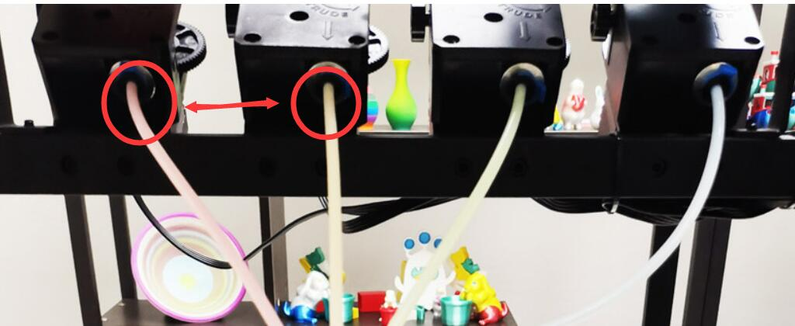
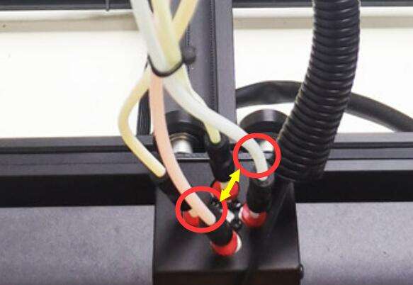
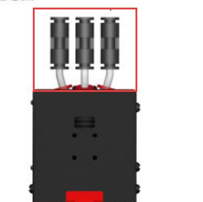

## <a id="choose-language">:globe_with_meridians: Choose language</a>

----
## <a id="en">  Extruder(s) blocked and unable to print [for Z8PM4Pro-MK2] </a>
### Reason:
The problem may come from the extruder(s), the PTFE tube connecting the extruders to the hot end (print head), or the hot end (print head). 
### Check steps:
To confirm where the problem originated, please following the below steps to check, assuming Extruder#2 is blocked:
#### 1. Swap the PTFE tubes connected to Extruder#2 and another extruder on the extruders side, and then print the test file [:arrow_down: M4_4CTest.gcode](https://github.com/ZONESTAR3D/Z8P/blob/main/Z8P-MK2/3-TestGcode/M4_4CTest.zip).    

##### 1.1 If there is still an issue with Extruder#2, it indicates that the problem is from extruder. Usually, this may be related to the assembly of the extruder. Please refer to [:clapper:this video tutorial](https://youtu.be/Bo478rUPcxo) to disassemble and reassemble the extruder.    
##### 1.2 If the problem shifts to another extruder, it indicates that the problem is from the hot end or PTFE tube. Please refer to step 2.    

#### 2. Swap the PTFE tubes connected to Extruder#2 and another extruder (on the hot end side), and then print the test file  [:arrow_down: M4_4CTest.gcode](https://github.com/ZONESTAR3D/Z8P/blob/main/Z8P-MK2/3-TestGcode/M4_4CTest.zip).    

##### 2.1 If there is still a problem with Extruder#2, it indicates that the problem is from the PTFE tube. You can check whether the 2 ends of the PTFE tube are deformed, it will result in excessive resistance (you can manually insert fine wires to check). Usually, the deformation of PTFE pipes occurs at the 2 ends, you can cut off a bit and continue to use it.    
##### 2.2 If the problem shifts to another extruder, it indicates that the problem is from the hot end (the channel that connected to Extruder#2). Please refer to step 3.    

#### 3. Check the hot end.
##### 3.1 Remove the PTFE from the fitting and then check if there are any broken filaments stuck inside the four fitting wires connecting the hot end.
##### 3.2 Check the PTFE tubes connected inside the hot end to see if the length of their extension from the hot end is basically the same. If there are different, first heat the nozzle to 260 degrees, then push the PTFE tubes down as much as possible to the bottom of the hot end.

##### 3.3 Refer to [this guide](../Issue_mix_color_hotend_clogged/Clean_clogged_M4V6.md) to clean the hotend.

## :email: If you can't find a solution to solve your problem after readed the FAQ , please contact our technical support team : support@zonestar3d.com .

----
## <a id="es">  Extrusores bloqueados y no pueden imprimir [para Z8PM4Pro-MK2] </a>
### Razón:
El problema puede provenir de los extrusores, del tubo de PTFE que conecta los extrusores al extremo caliente (cabezal de impresión) o al extremo caliente (cabezal de impresión).
### Verifique los pasos:
Para confirmar dónde se originó el problema, siga los pasos a continuación para verificar, suponiendo que el extrusor n.° 2 esté bloqueado:
#### 1. Intercambie los tubos de PTFE conectados al extrusor n.º 2 y otro extrusor en el lado del extrusor, y luego imprima el archivo de prueba [:arrow_down: M4_4CTest.gcode](https://github.com/ZONESTAR3D/Z8P/blob/main/Z8P-MK2/3-TestGcode/M4_4CTest.zip).

##### 1.1 Si todavía hay un problema con el extrusor n.° 2, indica que el problema proviene del extrusor. Generalmente, esto puede estar relacionado con el montaje de la extrusora. Consulte [:clapper:este video tutorial](https://youtu.be/Bo478rUPcxo) para desmontar y volver a montar la extrusora.
##### 1.2 Si el problema se traslada a otro extrusor, indica que el problema proviene del extremo caliente o del tubo de PTFE. Consulte el paso 2.

#### 2. Intercambie los tubos de PTFE conectados al extrusor n.º 2 y otro extrusor (en el lado caliente) y luego imprima el archivo de prueba [:arrow_down: M4_4CTest.gcode](https://github.com/ZONESTAR3D/Z8P/blob/main/Z8P-MK2/3-TestGcode/M4_4CTest.zip).

##### 2.1 Si todavía hay un problema con el Extrusor#2, indica que el problema es del tubo de PTFE. Puede comprobar si los 2 extremos del tubo de PTFE están deformados, lo que provocará una resistencia excesiva (puede insertar manualmente cables finos para comprobarlo). Por lo general, la deformación de las tuberías de PTFE se produce en los 2 extremos, puedes cortar un poco y seguir usándolo.
##### 2.2 Si el problema se traslada a otro extrusor, indica que el problema proviene del extremo caliente (el canal que se conecta al extrusor n.º 2). Consulte el paso 3.

#### 3. Verifique el extremo caliente.
##### 3.1 Retire el PTFE del conector y luego verifique si hay filamentos rotos atrapados dentro de los cuatro cables del conector que conectan el extremo caliente.
##### 3.2 Verifique los tubos de PTFE conectados dentro del extremo caliente para ver si la longitud de su extensión desde el extremo caliente es básicamente la misma. Si hay diferencias, primero caliente la boquilla a 260 grados, luego empuje los tubos de PTFE hacia abajo tanto como sea posible hasta el fondo del extremo caliente.

##### 3.3 Consulte [esta guía] (../Issue_mix_color_hotend_clogged/Clean_clogged_M4V6.md) para limpiar el hotend.

----
## <a id="pt">  Extrusora(s) bloqueada(s) e não é possível imprimir [para Z8PM4Pro-MK2] </a>
### Razão:
O problema pode vir da(s) extrusora(s), do tubo de PTFE que conecta as extrusoras à extremidade quente (cabeça de impressão) ou à extremidade quente (cabeça de impressão).
### Verifique as etapas:
Para confirmar a origem do problema, siga as etapas abaixo para verificar, assumindo que a Extrusora nº 2 está bloqueada:
#### 1. Troque os tubos de PTFE conectados à Extrusora nº 2 e outra extrusora no lado da extrusora e, em seguida, imprima o arquivo de teste [:arrow_down: M4_4CTest.gcode](https://github.com/ZONESTAR3D/Z8P/blob/main/Z8P-MK2/3-TestGcode/M4_4CTest.zip).

##### 1.1 Se ainda houver um problema com a Extrusora#2, isso indica que o problema é da extrusora. Normalmente, isto pode estar relacionado com a montagem da extrusora. Consulte [:clapper:este tutorial em vídeo](https://youtu.be/Bo478rUPcxo) para desmontar e remontar a extrusora.
##### 1.2 Se o problema mudar para outra extrusora, isso indica que o problema está no hot end ou no tubo de PTFE. Consulte a etapa 2.

#### 2. Troque os tubos de PTFE conectados à Extrusora nº 2 e outra extrusora (no lado quente) e, em seguida, imprima o arquivo de teste [:arrow_down: M4_4CTest.gcode](https://github.com/ZONESTAR3D/Z8P/blob/main/Z8P-MK2/3-TestGcode/M4_4CTest.zip).

##### 2.1 Se ainda houver problema com a Extrusora#2, isso indica que o problema está no tubo de PTFE. Você pode verificar se as 2 extremidades do tubo de PTFE estão deformadas, isso resultará em resistência excessiva (você pode inserir manualmente fios finos para verificar). Normalmente a deformação dos tubos de PTFE ocorre nas 2 pontas, você pode cortar um pouco e continuar usando.
##### 2.2 Se o problema mudar para outra extrusora, isso indica que o problema é do hot end (o canal conectado à Extrusora#2). Consulte a etapa 3.

#### 3. Verifique o hot end.
##### 3.1 Remova o PTFE da conexão e verifique se há algum filamento quebrado preso dentro dos quatro fios da conexão que conectam o hot end.
##### 3.2 Verifique os tubos de PTFE conectados dentro do hot end para ver se o comprimento de sua extensão a partir do hot end é basicamente o mesmo. Se houver diferentes, primeiro aqueça o bico a 260 graus e, em seguida, empurre os tubos de PTFE para baixo o máximo possível até a parte inferior da extremidade quente.

##### 3.3 Consulte [este guia](../Issue_mix_color_hotend_cloged/Clean_clogged_M4V6.md) para limpar o hotend.

----
## <a id="de">  Extruder blockiert und nicht in der Lage zu drucken [für Z8PM4Pro-MK2] </a>
### Grund:
Das Problem kann von den Extrudern, dem PTFE-Schlauch, der die Extruder mit dem heißen Ende (Druckkopf) verbindet, oder dem heißen Ende (Druckkopf) herrühren.
### Prüfschritte:
Um zu bestätigen, woher das Problem stammt, befolgen Sie bitte die folgenden Schritte zur Überprüfung, vorausgesetzt, Extruder Nr. 2 ist blockiert:
#### 1. Tauschen Sie die an Extruder Nr. 2 angeschlossenen PTFE-Schläuche und einen anderen Extruder auf der Extruderseite aus und drucken Sie dann die Testdatei aus [:arrow_down: M4_4CTest.gcode](https://github.com/ZONESTAR3D/Z8P/blob/main/Z8P-MK2/3-TestGcode/M4_4CTest.zip).

##### 1.1 Wenn weiterhin ein Problem mit Extruder Nr. 2 besteht, weist dies darauf hin, dass das Problem vom Extruder herrührt. Normalerweise hängt dies mit der Montage des Extruders zusammen. Bitte sehen Sie sich [:clapper:dieses Video-Tutorial](https://youtu.be/Bo478rUPcxo) an, um den Extruder zu zerlegen und wieder zusammenzubauen.
##### 1.2 Wenn sich das Problem auf einen anderen Extruder verlagert, deutet dies darauf hin, dass das Problem vom heißen Ende oder PTFE-Schlauch herrührt. Bitte beachten Sie Schritt 2.

#### 2. Tauschen Sie die an Extruder Nr. 2 und einen anderen Extruder (auf der Hot-End-Seite) angeschlossenen PTFE-Schläuche aus und drucken Sie dann die Testdatei [:arrow_down: M4_4CTest.gcode](https://github.com/ZONESTAR3D/Z8P/blob/main/Z8P-MK2/3-TestGcode/M4_4CTest.zip).

##### 2.1 Wenn weiterhin ein Problem mit Extruder Nr. 2 besteht, deutet dies darauf hin, dass das Problem vom PTFE-Schlauch herrührt. Sie können überprüfen, ob die beiden Enden des PTFE-Schlauchs deformiert sind. Dies führt zu einem übermäßigen Widerstand (zur Überprüfung können Sie feine Drähte manuell einführen). Normalerweise erfolgt die Verformung von PTFE-Rohren an den beiden Enden. Sie können ein Stück abschneiden und weiter verwenden.
##### 2.2 Wenn sich das Problem auf einen anderen Extruder verschiebt, deutet dies darauf hin, dass das Problem vom heißen Ende herrührt (dem Kanal, der mit Extruder Nr. 2 verbunden ist). Bitte beachten Sie Schritt 3.

#### 3. Überprüfen Sie das heiße Ende.
##### 3.1 Entfernen Sie das PTFE aus der Armatur und prüfen Sie dann, ob gebrochene Filamente in den vier Fittingdrähten stecken, die das heiße Ende verbinden.
##### 3.2 Überprüfen Sie die im Hot-End angeschlossenen PTFE-Schläuche, um festzustellen, ob die Länge ihrer Verlängerung vom Hot-End grundsätzlich gleich ist. Wenn es Unterschiede gibt, erhitzen Sie zuerst die Düse auf 260 Grad und schieben Sie dann die PTFE-Schläuche so weit wie möglich bis zum Boden des heißen Endes.

##### 3.3 Lesen Sie [diese Anleitung](../Issue_mix_color_hotend_clogged/Clean_clogged_M4V6.md), um das Hotend zu reinigen.

----
## <a id="it">  Estrusore/i bloccato/i e impossibile stampare [per Z8PM4Pro-MK2] </a>
### Motivo:
Il problema potrebbe derivare dagli estrusori, dal tubo in PTFE che collega gli estrusori all'hot end (testina di stampa) o all'hot end (testina di stampa).
### Passaggi di controllo:
Per confermare l'origine del problema, seguire i passaggi seguenti per verificare, supponendo che l'estrusore n. 2 sia bloccato:
#### 1. Scambia i tubi di PTFE collegati all'estrusore n. 2 e un altro estrusore sul lato degli estrusori, quindi stampa il file di test [:arrow_down:M4_4CTest.gcode](https://github.com/ZONESTAR3D/Z8P/blob/main/Z8P-MK2/3-TestGcode/M4_4CTest.zip).

##### 1.1 Se c'è ancora un problema con l'estrusore#2, indica che il problema riguarda l'estrusore. Di solito, questo può essere correlato all'assemblaggio dell'estrusore. Fare riferimento a [:clapper:questo video tutorial](https://youtu.be/Bo478rUPcxo) per smontare e rimontare l'estrusore.
##### 1.2 Se il problema si sposta su un altro estrusore, significa che il problema riguarda l'hot end o il tubo in PTFE. Fare riferimento al passaggio 2.

#### 2. Scambia i tubi in PTFE collegati all'estrusore n. 2 e a un altro estrusore (sul lato hot end), quindi stampa il file di test [:arrow_down:M4_4CTest.gcode](https://github.com/ZONESTAR3D/Z8P/blob/main/Z8P-MK2/3-TestGcode/M4_4CTest.zip).

##### 2.1 Se il problema persiste con l'estrusore n. 2, indica che il problema riguarda il tubo di PTFE. È possibile verificare se le 2 estremità del tubo in PTFE sono deformate, ciò comporterà una resistenza eccessiva (è possibile inserire manualmente dei fili sottili per verificare). Di solito, la deformazione dei tubi in PTFE avviene alle 2 estremità, puoi tagliarne un po' e continuare ad usarlo.
##### 2.2 Se il problema si sposta su un altro estrusore, indica che il problema riguarda l'hot end (il canale collegato all'estrusore n. 2). Fare riferimento al passaggio 3.

#### 3. Controlla l'hot-end.
##### 3.1 Rimuovere il PTFE dal raccordo e quindi controllare se sono presenti filamenti rotti bloccati all'interno dei quattro fili del raccordo che collegano l'hot end.
##### 3.2 Controllare i tubi in PTFE collegati all'interno dell'hot end per vedere se la lunghezza della loro estensione dall'hot end è sostanzialmente la stessa. Se ce ne sono diversi, riscaldare prima l'ugello a 260 gradi, quindi spingere i tubi di PTFE il più possibile verso il fondo dell'hot end.

##### 3.3 Fare riferimento a [questa guida](../Issue_mix_color_hotend_clogged/Clean_clogged_M4V6.md) per pulire l'hotend.

----
## <a id="ru">  Экструдеры заблокированы и не могут печатать [для Z8PM4Pro-MK2] </a>
### Причина:
Проблема может быть связана с экструдером(ами), трубкой из ПТФЭ, соединяющей экструдеры с горячим концом (печатающей головкой) или горячим концом (печатающей головкой).
### Шаги проверки:
Чтобы подтвердить причину возникновения проблемы, выполните следующие действия для проверки, предполагая, что экструдер № 2 заблокирован:
#### 1. Поменяйте местами трубки из ПТФЭ, подключенные к экструдеру №2 и другому экструдеру на стороне экструдера, а затем распечатайте тестовый файл [:arrow_down: M4_4CTest.gcode](https://github.com/ZONESTAR3D/Z8P/blob/main/Z8P-MK2/3-TestGcode/M4_4CTest.zip).

##### 1.1 Если проблема с экструдером №2 все еще сохраняется, это означает, что проблема связана с экструдером. Обычно это может быть связано со сборкой экструдера. Пожалуйста, обратитесь к [:clapper:этому видеоуроку](https://youtu.be/Bo478rUPcxo), чтобы разобрать и собрать экструдер.
##### 1.2 Если проблема переходит на другой экструдер, это означает, что проблема связана с горячим концом или трубкой из ПТФЭ. Пожалуйста, обратитесь к шагу 2.

#### 2. Поменяйте местами трубки из ПТФЭ, подключенные к экструдеру №2 и другому экструдеру (на стороне горячего конца), а затем распечатайте тестовый файл [:arrow_down: M4_4CTest.gcode](https://github.com/ZONESTAR3D/Z8P/blob/main/Z8P-MK2/3-TestGcode/M4_4CTest.zip).

##### 2.1 Если проблема с экструдером №2 все еще сохраняется, это означает, что проблема связана с трубкой из ПТФЭ. Вы можете проверить, не деформированы ли два конца трубки из ПТФЭ, это приведет к чрезмерному сопротивлению (для проверки можно вручную вставить тонкие проволоки). Обычно деформация фторопластовых труб происходит с 2-х концов, можно немного отрезать и продолжать использовать.
##### 2.2 Если проблема переходит на другой экструдер, это указывает на то, что проблема связана с горячим концом (каналом, подключенным к экструдеру №2). Пожалуйста, обратитесь к шагу 3.

#### 3. Проверьте горячий конец.
##### 3.1 Удалите ПТФЭ из фитинга, а затем проверьте, не застряли ли какие-либо сломанные нити внутри четырех проводов фитинга, соединяющих горячий конец.
##### 3.2 Проверьте трубки из ПТФЭ, подсоединенные внутри горячего конца, чтобы убедиться, что длина их выступа от горячего конца практически одинакова. Если они разные, сначала нагрейте сопло до 260 градусов, затем протолкните тефлоновые трубки максимально вниз к нижней части горячего конца.

##### 3.3 Обратитесь к [этому руководству](../Issue_mix_color_hotend_clogged/Clean_clogged_M4V6.md), чтобы очистить хотэнд.

----
## <a id="jp">  押出機がブロックされ、印刷できません [Z8PM4Pro-MK2 の場合] </a>
＃＃＃ 理由：
問題は、押出機、押出機をホットエンド (プリントヘッド) に接続する PTFE チューブ、またはホットエンド (プリントヘッド) に起因する可能性があります。
### 手順を確認します:
問題の原因を確認するには、Extruder#2 がブロックされていると仮定して、次の手順に従って確認してください。
#### 1. Extruder#2 に接続されている PTFE チューブとエクストルーダー側の別のエクストルーダーを交換し、テスト ファイル [:arrow_down: M4_4CTest.gcode](https://github.com/ZONESTAR3D/Z8P/blob/main/Z8P-MK2/3-TestGcode/M4_4CTest.zip)。

##### 1.1 エクストルーダー#2 に問題がまだある場合は、エクストルーダーに問題があることを示しています。 通常、これは押出機の組み立てに関連している可能性があります。 エクストルーダーの分解と再組み立てについては、[:clapper:このビデオ チュートリアル](https://youtu.be/Bo478rUPcxo)を参照してください。
##### 1.2 問題が別の押出機に移った場合は、問題がホットエンドまたは PTFE チューブにあることを示しています。 ステップ2を参照してください。

#### 2. Extruder#2 と別の Extruder (ホットエンド側) に接続されている PTFE チューブを交換し、テスト ファイル [:arrow_down: M4_4CTest.gcode](https://github.com/ZONESTAR3D/Z8P/blob/main/Z8P-MK2/3-TestGcode/M4_4CTest.zip)。

##### 2.1 Extruder#2 にまだ問題がある場合は、PTFE チューブに問題があることを示しています。 PTFE チューブの 2 つの端が変形していないかどうかを確認できます。変形すると過度の抵抗が生じます (細いワイヤーを手動で挿入して確認できます)。 通常、PTFEパイプの変形は両端に発生しますが、少し切り落としてそのままお使いいただけます。
##### 2.2 問題が別のエクストルーダーに移る場合、問題はホットエンド (エクストルーダー #2 に接続されているチャネル) にあることを示します。 ステップ3を参照してください。

#### 3. ホットエンドを確認します。
##### 3.1 フィッティングから PTFE を取り外し、ホットエンドに接続している 4 本のフィッティング ワイヤの内側に切れたフィラメントが詰まっていないか確認します。
##### 3.2 ホットエンドの内側に接続されている PTFE チューブをチェックして、ホットエンドからの延長長さが基本的に同じかどうかを確認します。 異なる場合は、まずノズルを 260 度に加熱し、次に PTFE チューブをホットエンドの底部までできるだけ押し下げます。

##### 3.3 ホットエンドをクリーニングするには、[このガイド](../Issue_mix_color_hotend_clogged/Clean_clogged_M4V6.md) を参照してください。

----
## <a id="kr">  압출기가 차단되어 인쇄할 수 없습니다 [Z8PM4Pro-MK2의 경우] </a>
### 이유:
문제는 압출기, 압출기를 뜨거운 끝(프린트 헤드) 또는 뜨거운 끝(프린트 헤드)에 연결하는 PTFE 튜브에서 발생할 수 있습니다.
### 확인 단계:
문제가 발생한 위치를 확인하려면 압출기#2가 막혔다고 가정하고 아래 단계에 따라 확인하십시오.
#### 1. Extruder#2에 연결된 PTFE 튜브와 Extruder 측의 다른 Extruder를 교체한 후 테스트 파일을 인쇄합니다. [:arrow_down: M4_4CTest.gcode](https://github.com/ZONESTAR3D/Z8P/blob/main/Z8P-MK2/3-TestGcode/M4_4CTest.zip).

##### 1.1 압출기#2에 여전히 문제가 있는 경우 압출기에 문제가 있다는 의미입니다. 일반적으로 이는 압출기 조립과 관련이 있을 수 있습니다. 압출기를 분해하고 재조립하려면 [:clapper:이 동영상 튜토리얼](https://youtu.be/Bo478rUPcxo)을 참조하세요.
##### 1.2 문제가 다른 압출기로 옮겨간다면 문제가 핫엔드나 PTFE 튜브에 있다는 의미입니다. 2단계를 참조하세요.

#### 2. Extruder#2와 다른 Extruder(Hot end 측)에 연결된 PTFE 튜브를 교체한 후 테스트 파일을 인쇄합니다. [:arrow_down: M4_4CTest.gcode](https://github.com/ZONESTAR3D/Z8P/blob/main/Z8P-MK2/3-TestGcode/M4_4CTest.zip).

##### 2.1 압출기#2에 여전히 문제가 있는 경우 PTFE 튜브에 문제가 있다는 의미입니다. PTFE 튜브의 양쪽 끝이 변형되었는지 확인할 수 있습니다. 과도한 저항이 발생합니다(가는 와이어를 수동으로 삽입하여 확인할 수 있습니다). 일반적으로 PTFE 파이프의 변형은 양쪽 끝에서 발생하므로 조금 잘라내어 계속 사용할 수 있습니다.
##### 2.2 문제가 다른 압출기로 옮겨간다면 이는 문제가 핫엔드(압출기#2에 연결된 채널)에서 발생한 것임을 나타냅니다. 3단계를 참조하세요.

#### 3. 핫엔드를 확인하세요.
##### 3.1 피팅에서 PTFE를 제거한 다음 핫 엔드를 연결하는 4개의 피팅 와이어 내부에 깨진 필라멘트가 끼어 있는지 확인합니다.
##### 3.2 핫 엔드 내부에 연결된 PTFE 튜브를 확인하여 핫 엔드에서 연장된 길이가 기본적으로 동일한지 확인합니다. 다른 점이 있으면 먼저 노즐을 260도까지 가열한 다음 PTFE 튜브를 핫 엔드 바닥까지 최대한 아래로 밀어 넣습니다.

##### 3.3 [이 가이드](../Issue_mix_color_hotend_clogged/Clean_clogged_M4V6.md)를 참조하여 핫엔드를 청소하세요.

----
## <a id="ar">  الطارد محظور وغير قادر على الطباعة [لـ Z8PM4Pro-MK2] </a>
### سبب:
قد تأتي المشكلة من الطارد (الطاردات)، أو أنبوب PTFE الذي يربط الطاردات بالطرف الساخن (رأس الطباعة)، أو الطرف الساخن (رأس الطباعة).
### التحقق من الخطوات:
للتأكد من مصدر المشكلة، يرجى اتباع الخطوات التالية للتحقق، بافتراض أن الطارد رقم 2 معطل:
#### 1. قم بتبديل أنابيب PTFE المتصلة بالطارد رقم 2 وطارد آخر على جانب الطارد، ثم اطبع ملف الاختبار [:arrow_down: M4_4CTest.gcode](https://github.com/ZONESTAR3D/Z8P/blob/main/Z8P-MK2/3-TestGcode/M4_4CTest.zip).

##### 1.1 إذا استمرت المشكلة في الطارد رقم 2، فهذا يشير إلى أن المشكلة من الطارد. عادة، قد يكون هذا مرتبطًا بتجميع الطارد. يرجى الرجوع إلى [: clapper: هذا الفيديو التعليمي] (https://youtu.be/Bo478rUPcxo) لتفكيك الطارد وإعادة تجميعه.
##### 1.2 إذا انتقلت المشكلة إلى طارد آخر، فهذا يشير إلى أن المشكلة من الطرف الساخن أو أنبوب PTFE. يرجى الرجوع إلى الخطوة 2.

#### 2. قم بتبديل أنابيب PTFE المتصلة بالطارد رقم 2 وطارد آخر (على الجانب الساخن)، ثم قم بطباعة ملف الاختبار [:arrow_down: M4_4CTest.gcode](https://github.com/ZONESTAR3D/Z8P/blob/main/Z8P-MK2/3-TestGcode/M4_4CTest.zip).

##### 2.1 إذا كانت لا تزال هناك مشكلة في الطارد رقم 2، فهذا يشير إلى أن المشكلة من أنبوب PTFE. يمكنك التحقق مما إذا كان طرفي أنبوب PTFE مشوهين، فسيؤدي ذلك إلى مقاومة مفرطة (يمكنك إدخال أسلاك دقيقة يدويًا للتحقق). عادةً ما يحدث تشوه في أنابيب PTFE عند الطرفين، يمكنك قطعها قليلاً والاستمرار في استخدامها.
##### 2.2 إذا انتقلت المشكلة إلى طارد آخر، فهذا يشير إلى أن المشكلة من الطرف الساخن (القناة المتصلة بالطارد رقم 2). يرجى الرجوع إلى الخطوة 3.

#### 3. تحقق من النهاية الساخنة.
##### 3.1 قم بإزالة PTFE من التركيب ثم تحقق مما إذا كان هناك أي خيوط مكسورة عالقة داخل أسلاك التركيب الأربعة التي تربط الطرف الساخن.
##### 3.2 تحقق من أنابيب PTFE المتصلة داخل الطرف الساخن لمعرفة ما إذا كان طول امتدادها من الطرف الساخن هو نفسه بشكل أساسي. إذا كان هناك اختلافات، قم أولاً بتسخين الفوهة إلى 260 درجة، ثم ادفع أنابيب PTFE لأسفل قدر الإمكان إلى أسفل النهاية الساخنة.

##### 3.3 ارجع إلى [هذا الدليل](../Issue_mix_color_hotend_clogged/Clean_clogged_M4V6.md) لتنظيف النقطة الساخنة.