## <a id="choose-language">:globe_with_meridians: Choose language</a>

-----
# Problèmes de chauffage
## Avant de vérifier
1. Assurez-vous que la température ambiante est supérieure à 15 ℃.
2. Si le lit chaud ou l'extrémité chaude (buse) est encore chaud, attendez qu'il refroidisse.
3. Allumez l'appareil et observez la « barre d'état » sur l'écran LCD.
##### 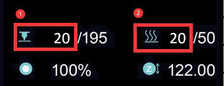
>
     1 : température de l'extrémité chaude 2 : température du foyer
Normalement, la température affichée de la partie chaude et du lit chaud doit être approximativement égale à la température ambiante.
Si la température ambiante actuelle est inférieure à 15 ℃ mais que la température actuelle de la partie chaude et du lit chaud indique 0 ℃, vérifiez d'abord la version du micrologiciel.

## Contenu
- **[Problème de hot end](#a)**
   - **[La partie chaude affiche toujours 0℃](#a1)**
   - **[La partie chaude affiche toujours un rond de 100 ℃](#a2)**
   - **[La température de la partie chaude n'augmente pas](#a3)**
   - **[La partie chaude ne peut pas être chauffée à la température réglée](#14)**
   - **[Problème d'emballement du hot end](#a5)**
- **[Problème de lit chaud](#b)**
   - **[Le lit chaud affiche toujours 0℃](#b1)**
   - **[Problème de température maximale du lit chaud](#b2)**
   - **[La température du lit chaud n'augmente pas](#b3)**
   - **[Le lit chaud peut être chauffé à plus de 100 ℃](#b4)**

-----
## <a id="a">Problème de hot end</a>
### <a id="a1">La hot end affiche toujours 0℃</a>
##### 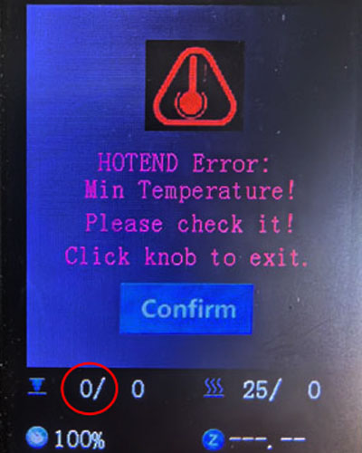
Si la température actuelle de la partie chaude indique 0 degré, il peut y avoir deux raisons :
1. Vérifiez que le fil du capteur de température de l'extrémité chaude est bien connecté.
2. Si le courant du hotend et du lit chauffant indique 0 degré et que la température ambiante actuelle est inférieure à 20 ℃, veuillez essayer de télécharger le firmware le plus récent et réessayer.     
:pushpin: **ASTUCE** : les Z8PM4Pro-MK2 et Z8PM4Pro-MK2A utilisent différentes versions de cartes mères. Si votre micrologiciel mis à niveau ne correspond pas à la version de la carte mère, des erreurs importantes se produiront dans les résultats de mesure de température.

### <a id="a2">La partie chaude affiche toujours un rond de 100℃ </a>
Si la température de la partie chaude indique toujours une température élevée (environ 100 ℃) mais que la buse est froide en réalité, alors il est très probable que vous ayez connecté le capteur de température de la partie chaude au ventilateur par erreur, veuillez faire attention. pour vérifier le câblage du hot end.
- **Pour Z8P-MK2, vérifiez le fil d'extension de l'extrémité chaude**
##### 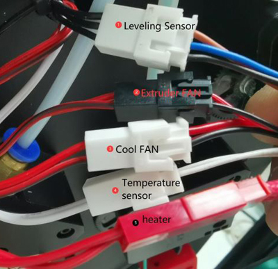
- **Vérifiez le côté du tableau de commande**
##### 

### <a id="a3">La température du hot end n'augmente pas </a>
- Vérifiez si le connecteur du chauffage est bien branché.
- Utilisez un multimètre pour mesurer la résistance du radiateur, la résistance doit être d'environ 10 Ohm. Sinon, le radiateur brûle.
##### 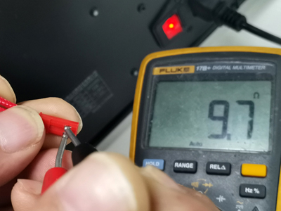
- Ouvrez le boîtier de commande et vérifiez si le fil du chauffage est bien connecté au tableau de commande.
##### 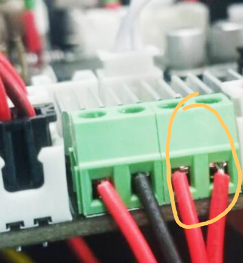
- [:link : Ouvrez le boîtier de commande](../How_to_open_the_control_box.jpg) et vérifiez si la LED4 s'allumera lors du chauffage de la hotend.
##### <a id="LED"> 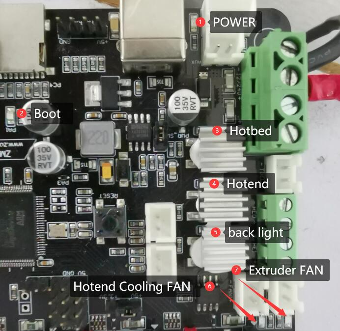 </a>

### <a id="a4">La partie chaude ne peut pas être chauffée à la température réglée </a>
Si la température du hotend augmente, mais qu'elle ne peut pas atteindre la température de réglage. L'écran LCD affichera **échec du chauffage de l'extrémité chaude** après un certain temps.
##### 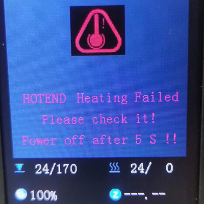
- **Si la partie chaude ne peut pas être chauffée à plus de 150 ℃ :** Vérifiez le capteur de température sur le côté de la partie chaude, il peut tomber du bloc thermique. ***Dans ce cas, la partie chaude ne sera généralement pas chauffée à plus de 150 ℃.***
<!--  -->
- **Si l'extrémité chaude peut être chauffée à plus de 220 ℃, mais qu'elle est instable**, veuillez vous référer à l'[étape suivante](#la-température-de-l'extrémité-chaude-est-instable-parfois- montrer un problème de fugue)
### <a id="a5">Problème d'emballement du hot end </a>
La température de la partie chaude est instable, montre parfois un problème de « fugue ».
##### 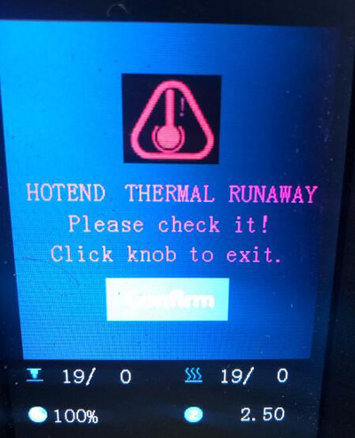
   - Vérifiez l'installation du VENTILATEUR de refroidissement. S'il est soufflé à l'intérieur du boîtier, veuillez le remplacer par un ventilateur soufflé à l'extérieur.
##### 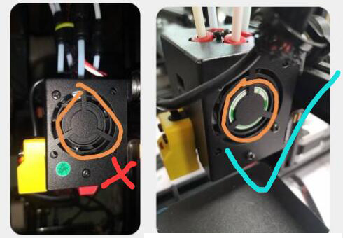
   - Faites une fois ***Contrôle>>Restaurer les paramètres par défaut"***, puis chauffez à nouveau.
#### Réglage automatique du PID
Si vous avez suivi les deux étapes ci-dessus mais que la question ne peut pas être résolue, suivez les étapes ci-dessous : ***Contrôle>>Configuration>>Hotend PID>>Réglage automatique PID : 200 {200 pour l'impression PLA ou 240 pour l'impression PETG/ ABS}***, et attendez que ce soit fait. [:movie_camera : **Tutoriel vidéo**](./PID_Auto_Tune.gif).

-----
## <a id="b">Problème de lit chaud </a>
### <a id="b1">Le lit chaud affiche toujours 0℃ </a>
##### 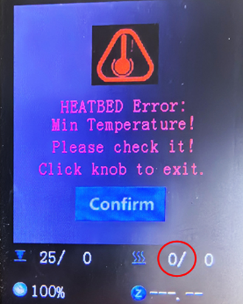 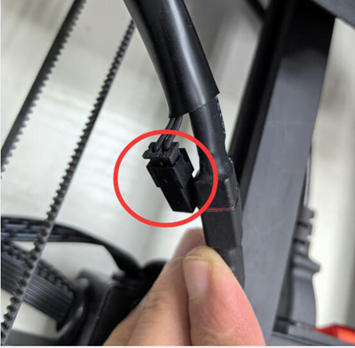
Si la température actuelle du lit chaud indique 0 degré, il peut y avoir deux raisons :
1. Vérifiez que le fil du capteur de température du lit chauffant est bien connecté.
2. Si le courant du hotend et du lit chauffant indique 0 degré et que la température ambiante actuelle est inférieure à 20 ℃, veuillez essayer de télécharger le firmware le plus récent et réessayer.

### <a id="b2">Problème de température maximale du lit chaud </a>
Lorsque vous trouvez, l'écran LCD affiche un écran « HEATBED Err. : température maximale ».
##### 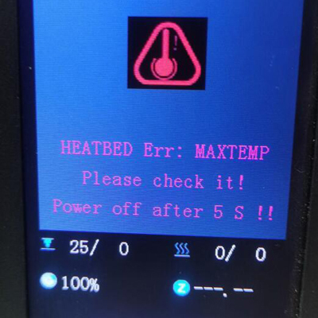
- Débranchez le fil du capteur de température du foyer et éteignez puis rallumez la machine. Si cet écran n'apparaît plus, remplacez un nouveau capteur de température.
- Ouvrez le boîtier de commande et débranchez le fil du capteur de température de la carte de commande, puis éteignez et rallumez la machine. S'il a été réparé, remplacez un nouveau capteur de température. Si le problème n'est pas résolu, remplacez une nouvelle carte de contrôle.

### <a id="b3">La température du lit chaud n'augmente pas </a>
- Vérifiez si [:point_up : le fil d'alimentation du lit chauffant](#b1) était bien connecté.
- Ouvrez le boîtier de commande et vérifiez si le fil d'alimentation du lit chauffant est bien connecté au tableau de commande.
- Ouvrez le boîtier de commande et vérifiez si le [:point_up: LED3](#LED) s'allumera lors du chauffage du lit chaud, sinon, cela signifie que le MOSFET de la carte de commande est endommagé et doit être remplacé.

### <a id="b4">Le lit chauffant peut être chauffé à plus de 100 ℃ </a>
- Ne dirigez pas la sortie du ventilateur ou du climatiseur vers la machine.
- Si la température de la pièce est basse (<15℃), essayez de l'enrouler autour de la machine.

---------
## Contact avec notre équipe d'assistance
:email: Si vous ne trouvez pas de solution pour résoudre votre problème après avoir lu la FAQ, veuillez contacter notre équipe d'assistance technique : support@zonestar3d.com.