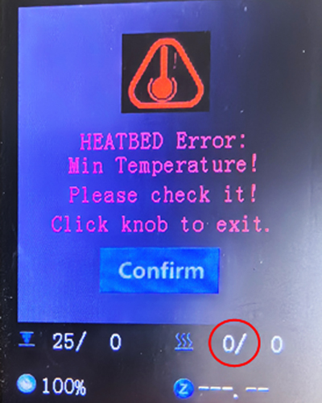
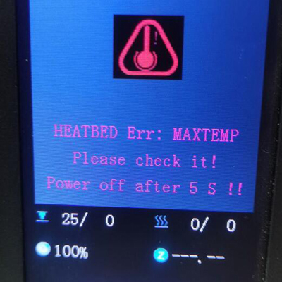

## <a id="choose-language">:globe_with_meridians: Choose language</a>

-----
# Problemi di riscaldamento
## Prima di controllare
1. Assicurarsi che la temperatura ambiente sia superiore a 15 ℃.
2. Se il letto caldo o l'estremità calda (ugello) sono ancora caldi, attendere che si raffreddino.
3. Accendere l'alimentazione e osservare la "barra di stato" sul display LCD.
##### 
>
     1: temperatura della parte calda 2: temperatura del focolaio
Normalmente, la temperatura indicata dell'hot end e del letto caldo dovrebbe essere approssimativamente pari alla temperatura ambiente.
Se la temperatura attuale della stanza è inferiore a 15 ℃ ma sia la temperatura attuale dell'hot end che quella del letto caldo mostrano 0 ℃, controllare prima la versione del firmware.

## Contenuti
- **[Problema relativo all'hot-end](#a)**
   - **[L'hot end mostra sempre 0℃](#a1)**
   - **[L'hot end mostra sempre un giro di 100 ℃](#a2)**
   - **[La temperatura dell'hotend non aumenta](#a3)**
   - **[L'hot-end non può essere riscaldato alla temperatura impostata](#14)**
   - **[Problema di fuga dell'hot end](#a5)**
- **[Problema del letto caldo](#b)**
   - **[Il letto caldo mostra sempre 0℃](#b1)**
   - **[Problema di temperatura massima del letto caldo](#b2)**
   - **[La temperatura del letto caldo non aumenta](#b3)**
   - **[Il letto caldo può essere riscaldato fino a oltre 100 ℃](#b4)**

-----
## <a id="a">Problema relativo all'hot-end</a>
### <a id="a1">L'hot end mostra sempre 0℃</a>
##### 
Se la temperatura attuale dell'hot end è pari a 0 gradi, i motivi possono essere due:
1. Controllare che il filo del sensore di temperatura dell'hotend sia collegato correttamente.
2. Se sia la corrente dell'hotend che quella del piano riscaldato mostrano 0 gradi e la temperatura ambiente attuale è inferiore a 20 ℃, provare a caricare il firmware più recente e riprovare.     
:pushpin: **SUGGERIMENTO**: Z8PM4Pro-MK2 e Z8PM4Pro-MK2A utilizzano versioni diverse di schede madri. Se il firmware aggiornato non corrisponde alla versione della scheda madre, si verificheranno errori significativi nei risultati della misurazione della temperatura.

### <a id="a2">L'hot end mostra sempre un giro di 100 ℃ </a>
Se la temperatura dell'hot end mostra sempre una temperatura elevata (circa 100 ℃) ma in realtà l'ugello è freddo, è molto probabile che tu abbia collegato per errore il sensore di temperatura dell'hot end alla ventola, presta attenzione per controllare il cablaggio dell'hot end.
- **Per Z8P-MK2, controllare il cavo di estensione dell'hot end**
##### 
- **Controllare il lato della scheda di controllo**
##### 

### <a id="a3">La temperatura dell'hotend non aumenta </a>
- Controllare se il connettore del riscaldatore è inserito correttamente.
- Utilizzare un multimetro per misurare la resistenza del riscaldatore, la resistenza dovrebbe essere di circa 10 Ohm. In caso contrario, il riscaldatore è bruciato.
##### 
- Aprire la scatola di controllo e verificare se il filo del riscaldatore è collegato correttamente alla scheda di controllo.
##### 
- [:link: Apri la scatola di controllo](../How_to_open_the_control_box.jpg) e controlla se il LED4 si accende durante il riscaldamento dell'hotend.
##### 

### <a id="a4">L'hotend non può essere riscaldato alla temperatura impostata </a>
Se la temperatura dell'hotend è aumentata, ma non è possibile raggiungere la temperatura impostata. Il display LCD mostrerà **guasto riscaldamento hot-end** dopo un certo periodo di tempo.
##### 
- **Se l'hotend non può essere riscaldato a più di 150℃:** Controlla il sensore di temperatura sul lato dell'hotend, potrebbe fuoriuscire dal blocco termico. ***In questo caso, solitamente l'hotend non verrà riscaldato a più di 150℃.***
<!--  -->
- **Se l'hot-end può essere riscaldato a più di 220 ℃, ma è instabile**, fare riferimento al [passaggio successivo](#a5)

### <a id="a5">Problema di fuga dell'hot end </a>
La temperatura dell'hot-end è instabile e talvolta mostra un problema di "fuga".
##### 
   - Controllare l'installazione della VENTOLA di raffreddamento, se viene soffiata all'interno dell'alloggiamento, sostituirla con soffiata all'esterno.
##### 
   - Eseguire una volta ***Controllo>>Ripristina impostazioni predefinite"***, quindi riscaldare nuovamente.
#### Sintonizzazione automatica PID
Se hai eseguito i due passaggi precedenti ma il problema non può essere risolto, esegui i passaggi seguenti: ***Controllo>>Configurazione>>PID Hotend>>Sintonizzazione automatica PID: 200 {200 per la stampa PLA o 240 per la stampa PETG/ ABS}***, e aspetta fino al termine. [:movie_camera: **Tutorial video**](./PID_Auto_Tune.gif).

-----
## <a id="b">Problema del letto caldo </a>
### <a id="b1">Il letto caldo mostra sempre 0℃ </a>
#####  
Se la temperatura attuale del letto caldo è pari a 0 gradi, i motivi potrebbero essere due:
1. Controllare che il filo del sensore di temperatura del letto caldo sia collegato correttamente.
2. Se sia la corrente dell'hotend che quella del piano riscaldato mostrano 0 gradi e la temperatura ambiente attuale è inferiore a 20 ℃, provare a caricare il firmware più recente e riprovare.

### <a id="b2">Problema di temperatura massima del letto caldo </a>
Una volta trovato, lo schermo LCD mostra la schermata "HEATBED Err.: max temperature".
##### 
- Scollegare il filo del sensore di temperatura del focolaio, spegnere e riaccendere la macchina, se non mostra più questa schermata, sostituire un nuovo sensore di temperatura.
- Aprire la scatola di controllo e scollegare il cavo del sensore di temperatura dalla scheda di controllo, quindi spegnere e riaccendere la macchina, se è stato riparato, sostituire un nuovo sensore di temperatura. Se il problema persiste, sostituire una nuova scheda di controllo.

### <a id="b3">La temperatura del letto caldo non aumenta </a>
- Controllare se [:point_up: il cavo di alimentazione del letto caldo](#b1) è stato collegato correttamente.
- Aprire la scatola di controllo e controllare ([:point_right:Picture](../pic/OpenControlBox.png)) se il cavo di alimentazione del letto caldo è collegato correttamente alla scheda di controllo.    

- Aprire la scatola di controllo e controllare ([:point_right:Picture](../pic/OpenControlBox.png)) se [:point_up: LED3](#led) si accende durante il riscaldamento del letto caldo, in caso contrario significa che il MOSFET della scheda di controllo è danneggiato e deve essere sostituito.

### <a id="b4">Il letto caldo può essere riscaldato fino a oltre 100 ℃ </a>
- Non rivolgere la ventola o l'uscita del condizionatore verso la macchina.
- Se la temperatura della stanza è bassa (<15℃), provare ad avvolgere la macchina.

--------
## Contatta il nostro team di supporto
:email: Se non riesci a trovare una soluzione per risolvere il tuo problema dopo aver letto le FAQ, contatta il nostro team di supporto tecnico: support@zonestar3d.com.