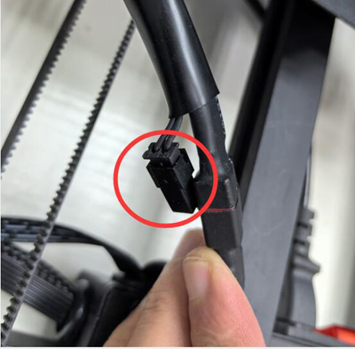

## <a id="choose-language">:globe_with_meridians: Choose language</a>

-----
# 暖房の問題
## 確認する前に
1. 室温が 15℃ 以上であることを確認してください。
2. ホットベッドまたはホットエンド (ノズル) がまだ熱い場合は、冷めるまで待ちます。
3. 電源を入れ、LCD ディスプレイの「ステータス バー」を観察します。
##### 
>
     1: ホットエンド温度 2: ホットベッド温度
通常、ホットエンドとホットベッドの表示温度はほぼ室温になります。
現在の室温が 15℃ 未満であるにもかかわらず、ホットエンドとホットベッドの現在温度が両方とも 0℃ を示している場合は、まずファームウェアのバージョンを確認してください。

＃＃ コンテンツ
- **[ホットエンドの問題](#a)**
   - **[ホットエンドは常に0℃を表示](#a1)**
   - **[ホットエンドは常に 100℃付近を示します](#a2)**
   - **[ホットエンド温度が上昇しない](#a3)**
   - **[ホットエンドが設定温度まで加熱できない](#14)**
   - **[ホットエンド暴走問題](#a5)**
- **[ホットベッドの問題](#b)**
   - **[ホットベッドは常に0℃を表示](#b1)**
   - **[ホットベッドの最大温度の問題](#b2)**
   - **[ホットベッド温度が上がらない](#b3)**
   - **[ホットベッドは100℃以上まで加熱可能](#b4)**

-----
## <a id="a">ホットエンドの問題</a>
### <a id="a1">ホットエンドは常に 0℃ と表示されます</a>
#####   
ホットエンドの現在の温度が 0 度を示している場合は、次の 2 つの理由が考えられます。
1. ホットエンドの温度センサーワイヤーが正しく接続されていることを確認します。
2. ホットエンドとヒートベッドの電流が両方とも 0 度を示し、現在の周囲温度が 20℃ 未満の場合は、最新のファームウェアをアップロードして再試行してください。    
:pushpin: **ヒント**: Z8PM4Pro-MK2 と Z8PM4Pro-MK2A は、異なるバージョンのマザーボードを使用します。 アップグレードしたファームウェアがマザーボードのバージョンと一致しない場合、温度測定結果に重大な誤差が生じます。

### <a id="a2">ホットエンドは常に 100℃ 付近を示します </a>
ホットエンドの温度が常に高温（約 100℃）を示しているのに、実際にはノズルが冷たい場合は、ホットエンドの温度センサーを誤ってファンに接続している可能性が非常に高いので、注意してください。 ホットエンドの配線を確認します。
- **Z8P-MK2の場合、ホットエンドの延長線を確認してください**
##### 
- **制御基板側を確認してください**
##### 

### <a id="a3">ホットエンドの温度が上昇しない </a>
- ヒーターコネクタがしっかり差し込まれているか確認してください。
- マルチメーターを使用してヒーターの抵抗を測定します。抵抗は約 10 オームである必要があります。 そうしないとヒーターが焼けてしまいます。
##### 
- コントロールボックスを開け、ヒーター線が制御基板にしっかり接続されているか確認してください。
##### 
- [:link: コントロール ボックスを開きます](../How_to_open_the_control_box.jpg) ホットエンドを加熱するときに LED4 が点灯するかどうかを確認します。
##### 

### <a id="a4">ホットエンドを設定温度まで加熱できません </a>
ホットエンド温度を上げても設定温度に到達しない場合。 一定時間が経過すると、LCD に **ホットエンド加熱失敗** と表示されます。
##### 
- **ホットエンドを 150℃以上に加熱できない場合:** ホットエンド側面の温度センサーを確認してください。ヒートブロックから脱落している可能性があります。 ***この場合、通常、ホットエンドは150℃以上には加熱されません。***
<!--  -->
- **ホットエンドは 220℃ 以上まで加熱できるが不安定である場合**、[次のステップ](#a5)を参照してください。 ショー・ア・ランナウェイ・イシュー）

### <a id="a5">ホットエンド暴走問題 </a>
ホットエンドの温度は不安定で、「暴走」問題が発生することがあります。
##### 
   ・冷却FANの取り付けを確認し、筐体内吹きになっている場合は外吹きに変更してください。
##### 
   - 一度「***コントロール>>デフォルトに戻す***」を実行し、再度加熱してください。
#### PID オートチューニング
上記の 2 つの手順を実行しても問題が解決できない場合は、以下の手順を実行してください: ***Control>>Configre>>Hotend PID>>PID auto tune: 200 {PLA の印刷には 200、PETG の印刷には 240/ ABS}*** を実行し、完了するまで待ちます。 [:movie_camera: **ビデオ チュートリアル**](./PID_Auto_Tune.gif)。

-----
## <a id="b">ホットベッドの問題 </a>
### <a id="b1">ホットベッドの表示温度は常に 0℃ </a>
#####  
ホットベッドの現在の温度が 0 度を示している場合は、次の 2 つの理由が考えられます。
1. ホットベッドの温度センサーワイヤーが正しく接続されていることを確認してください。
2. ホットエンドとヒートベッドの電流が両方とも 0 度を示し、現在の周囲温度が 20℃ 未満の場合は、最新のファームウェアをアップロードして再試行してください。

### <a id="b2">ホットベッドの最大温度の問題 </a>
LCD 画面に「HEATBED エラー: 最高温度」画面が表示されている場合があります。
##### 
- ホットベッド温度センサーのワイヤーを外し、マシンの電源を切り、再度電源を入れます。この画面が再び表示されない場合は、新しい温度センサーを交換してください。
- 制御ボックスを開け、温度センサーのワイヤーを制御基板から外し、機械の電源を切り、再度電源を入れます。温度センサーが修正されている場合は、新しい温度センサーを交換します。 解決しない場合は、新しい制御基板と交換してください。

### <a id="b3">ホットベッドの温度が上がらない </a>
- [:point_up:ホットベッドの電源線](#b1)が正しく接続されているか確認してください。
- コントロールボックスを開け、([:point_right:Picture](../pic/OpenControlBox.png)) ホットベッドの電源線がコントロールボードに正しく接続されているかどうかを確認してください。   

- コントロールボックスを開けて、([:point_right:Picture](../pic/OpenControlBox.png)) ホットベッドを加熱するときに[:point_up: LED3](#led)が点灯するかどうかを確認します。点灯しない場合は、制御ボードのMOSFETが損傷しているため、交換する必要があることを意味します。

### <a id="b4">ホットベッドは 100℃ 以上まで加熱可能 </a>
・扇風機やエアコンの吹き出し口を本機に向けないでください。
- 部屋の温度が低い（15℃未満）場合は、本体を包み込むようにしてください。

--------
## サポートチームにお問い合わせください
:email: FAQ を読んでも問題を解決する解決策が見つからない場合は、テクニカル サポート チーム : support@zonestar3d.com までご連絡ください。