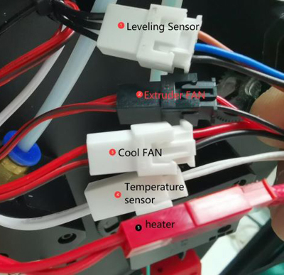

## <a id="choose-language">:globe_with_meridians: Choose language</a>

-----
# 난방 문제
## 확인하기 전에
1. 실내 온도가 15℃ 이상인지 확인하세요.
2. 핫베드나 핫엔드(노즐)가 여전히 뜨거우면 식을 때까지 기다리세요.
3. 전원을 켜고 LCD 디스플레이의 "상태 표시줄"을 관찰합니다.
##### 
>
     1: 핫 엔드 온도 2: 온상 온도
일반적으로 핫 엔드와 핫 베드의 온도는 대략 실온과 같아야 합니다.
현재 실내 온도가 15℃ 미만인데 핫엔드와 핫베드의 현재 온도가 모두 0℃로 표시되면 펌웨어 버전을 먼저 확인하세요.

## 내용물
- **[핫엔드 문제](#a)**
   - **[핫 엔드는 항상 0℃를 나타냅니다.](#a1)**
   - **[핫 엔드는 항상 100℃ 정도를 나타냄](#a2)**
   - **[핫엔드 온도가 상승하지 않음](#a3)**
   - **[핫 엔드가 설정 온도까지 가열되지 않습니다.](#14)**
   - **[핫엔드 가출 이슈](#a5)**
- **[핫베드 문제](#b)**
   - **[온수침대는 항상 0℃를 나타냅니다.](#b1)**
   - **[온수침대 최대 온도 문제](#b2)**
   - **[핫베드 온도가 올라가지 않습니다](#b3)**
   - **[핫베드는 100℃ 이상 가열 가능](#b4)**

-----
## <a id="a">핫엔드 문제</a>
### <a id="a1">핫 엔드는 항상 0℃로 표시됩니다</a>
##### 
핫엔드의 현재 온도가 0도로 표시되는 경우 두 가지 이유가 있을 수 있습니다.
1. 핫엔드 온도센서 배선이 잘 연결되어 있는지 확인하세요.
2. 핫엔드와 히트베드의 전류가 모두 0도이고, 현재 주변 온도가 20℃ 이하인 경우 최신 펌웨어를 업로드한 후 다시 시도하시기 바랍니다.
:pushpin: **힌트**: Z8PM4Pro-MK2와 Z8PM4Pro-MK2A는 서로 다른 버전의 마더보드를 사용합니다. 업그레이드한 펌웨어가 마더보드 버전과 일치하지 않으면 온도 측정 결과에 심각한 오류가 발생합니다.

### <a id="a2">핫 엔드는 항상 100℃ 정도를 보여줍니다 </a>
핫엔드의 온도가 항상 높은 온도(약 100℃)를 나타내지만 실제로는 노즐이 차가운 경우, 실수로 핫엔드의 온도 센서를 팬에 연결했을 가능성이 매우 높으니 주의하시기 바랍니다. 핫 엔드의 배선을 확인하십시오.
- **Z8P-MK2의 경우 핫엔드 연장선을 확인하세요**
##### 
- **제어판 쪽을 확인하세요**
##### 

### <a id="a3">핫엔드 온도가 올라가지 않습니다 </a>
- 히터 커넥터 플러그가 잘 꽂혀 있는지 확인하세요.
- 멀티미터를 사용하여 히터의 저항을 측정합니다. 저항은 약 10Ω이어야 합니다. 그렇지 않으면 히터가 타버릴 수 있습니다.
##### 
- 콘트롤 박스를 열고 히터선이 콘트롤 보드에 잘 연결되어 있는지 확인하세요.
##### 
- [:link: 컨트롤 박스를 열고](../How_to_open_the_control_box.jpg) 핫엔드 가열 시 LED4에 불이 들어오는지 확인하세요.
##### 

### <a id="a4">핫 엔드를 설정 온도까지 가열할 수 없습니다 </a>
핫엔드 온도를 올렸으나 설정온도까지 도달하지 못하는 경우. 일정 시간이 지나면 LCD에 **핫 엔드 가열 실패**가 표시됩니다.
##### 
- **핫엔드를 150℃ 이상 가열할 수 없는 경우:** 핫엔드 측면의 온도 센서를 확인하십시오. 히트 블록에서 떨어질 수 있습니다. ***이 경우 핫 엔드는 일반적으로 150℃ 이상 가열되지 않습니다.***
<!--  -->
- **핫엔드를 220℃ 이상으로 가열할 수 있으나 불안정한 경우** [다음 단계](#the-온도-of-더-핫엔드-is-불안정-때때로-를 참조하세요. 쇼어런어웨이 이슈)
### <a id="a5">핫엔드 가출 문제 </a>
핫엔드의 온도가 불안정하고 때로는 "런어웨이" 문제가 표시됩니다.
##### 
   - 냉각 FAN 장착 상태를 확인하시고, 하우징 내부로 불어오는 경우 외부로 불어오는 것으로 변경해 주시기 바랍니다.
##### 
   - ***제어>>기본값 복원***을 한 번 수행한 후 다시 가열하세요.
#### PID 자동 조정
위의 두 단계를 수행했지만 문제가 해결되지 않으면 아래 단계를 수행하십시오. ***제어>>구성>>핫엔드 PID>>PID 자동 조정: 200 {PLA 인쇄의 경우 200, PETG 인쇄의 경우 240/ ABS}*** 완료될 때까지 기다리세요. [:movie_camera: **동영상 튜토리얼**](./PID_Auto_Tune.gif).

-----
## <a id="b">핫베드 문제 </a>
### <a id="b1">온수침대는 항상 0℃를 보여줍니다 </a>
#####  
핫베드의 현재 온도가 0도로 표시되는 경우 다음 두 가지 이유가 있을 수 있습니다.
1. 핫베드의 온도 센서선이 잘 연결되어 있는지 확인하세요.
2. 핫엔드와 히트베드의 전류가 모두 0도이고, 현재 주변 온도가 20℃ 이하인 경우 최신 펌웨어를 업로드한 후 다시 시도하시기 바랍니다.

### <a id="b2">온수 침대 최대 온도 문제 </a>
찾으면 LCD 화면에 "HEATBED Err.: 최대 온도" 화면이 표시됩니다.
##### 
- 온상온도센서의 배선을 분리한 후 전원을 껐다가 다시 켠 후, 이 화면이 다시 나오지 않으면 온도센서를 새 것으로 교체하세요.
- 컨트롤 박스를 열고 컨트롤 보드에서 온도 센서 배선을 분리한 후 기계의 전원을 껐다가 다시 켜십시오. 고정된 경우 새 온도 센서를 교체하십시오. 그래도 해결되지 않으면 새 제어보드를 교체하세요.

### <a id="b3">핫베드 온도가 올라가지 않습니다 </a>
- [:point_up:핫베드 전원선](#b1)이 잘 연결되어 있는지 확인하세요.
- 컨트롤 박스를 열고 핫베드의 전원선이 컨트롤 보드에 잘 연결되어 있는지 확인하세요.
- 컨트롤 박스를 열고 핫베드를 가열할 때 [:point_up: LED3](#led)에 불이 들어오는지 확인하세요. 그렇지 않으면 컨트롤 보드의 MOSFET이 손상되어 교체해야 한다는 의미입니다.

### <a id="b4">뜨거운 침대는 100℃ 이상까지 가열될 수 있습니다 </a>
- 선풍기나 에어컨 배출구를 기기 방향으로 놓지 마세요.
- 실내 온도가 낮은 경우(<15℃), 머신을 감싸주세요.

--------
## 지원팀에 문의
:email: FAQ를 읽은 후에도 문제 해결 방법을 찾을 수 없는 경우 기술 지원팀(support@zonestar3d.com)에 문의하세요.
