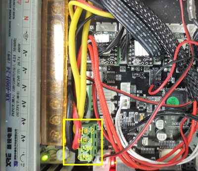

## <a id="choose-language">:globe_with_meridians: Choose language</a>

-----
# Problemas de aquecimento
## Antes de verificar
1. Certifique-se de que a temperatura ambiente esteja acima de 15°C.
2. Se a base quente ou a extremidade quente (bico) ainda estiver quente, espere que esfriem.
3. Ligue a alimentação e observe a “barra de status” no display LCD.
##### 
>
     1: temperatura final quente 2: temperatura do viveiro
Normalmente, a temperatura mostrada da extremidade quente e da cama quente deve ser aproximadamente a temperatura ambiente.
Se a temperatura ambiente atual for inferior a 15 ℃, mas a temperatura atual da extremidade quente e da cama quente mostrar 0 ℃, verifique primeiro a versão do firmware.

## Conteúdo
- **[Problema final](#a)**
   - **[Hot end sempre mostra 0℃](#a1)**
   - **[Hot end sempre mostra volta de 100℃](#a2)**
   - **[A temperatura final quente não aumenta](#a3)**
   - **[A extremidade quente não pode ser aquecida até a temperatura definida](#14)**
   - **[Problema de fuga na extremidade quente](#a5)**
- **[Problema da cama quente](#b)**
   - **[Cama quente sempre mostra 0℃](#b1)**
   - **[Problema de temperatura máxima da cama quente](#b2)**
   - **[A temperatura da cama quente não aumenta](#b3)**
   - **[A cama quente pode ser aquecida a mais de 100°C](#b4)**

-----
## <a id="a">Problema de ponta quente</a>
### <a id="a1">Hot end sempre mostra 0℃</a>
##### 
Se a temperatura atual do hot end mostrar 0 graus, pode haver dois motivos:
1. Verifique se o fio do sensor de temperatura do hot end está bem conectado.
2. Se a corrente do hotend e da cama de aquecimento mostrar 0 graus e a temperatura ambiente atual for inferior a 20 ℃, tente fazer upload do firmware mais recente e tente novamente.      
:pushpin: **DICA**: Z8PM4Pro-MK2 e Z8PM4Pro-MK2A usam versões diferentes de placas-mãe. Se o firmware atualizado não corresponder à versão da placa-mãe, haverá erros significativos nos resultados da medição de temperatura.

### <a id="a2">A extremidade quente sempre mostra cerca de 100°C </a>
Se a temperatura do hot end sempre mostrar uma temperatura alta (cerca de 100 ℃), mas o bico estiver frio na realidade, então é muito provável que você tenha conectado o sensor de temperatura do hot end ao ventilador por engano, preste atenção para verificar a fiação do hot end.
- **Para Z8P-MK2, verifique o fio de extensão do hot end**
##### 
- **Verifique a lateral da placa de controle**
##### 

### <a id="a3">A temperatura da extremidade quente não aumenta </a>
- Verifique se o conector do aquecedor está bem conectado.
- Use um multímetro para medir a resistência do aquecedor, a resistência deve ser de cerca de 10 Ohm. Caso contrário, o aquecedor está queimado.
##### 
- Abra a caixa de controle e verifique se o fio do aquecedor está bem conectado à placa de controle.
##### 
- [:link: Abra a caixa de controle](../How_to_open_the_control_box.jpg) e verifique se o LED4 acenderá ao aquecer o hotend.
##### 

### <a id="a4">A extremidade quente não pode ser aquecida até a temperatura definida </a>
Se a temperatura do hotend aumentar, mas não for possível atingir a temperatura definida. O LCD mostrará **falha no aquecimento da extremidade quente** após um período de tempo.
##### 
- **Se a extremidade quente não puder ser aquecida a mais de 150 ℃:** Verifique o sensor de temperatura na lateral da extremidade quente, ele pode cair do bloco de aquecimento. ***Neste caso, a extremidade quente não será aquecida a mais de 150°C normalmente.***
<!--  -->
- **Se a extremidade quente puder ser aquecida a mais de 220°C, mas for instável**, consulte a [próxima etapa](#a5)

### <a id="a5">Problema de fuga na extremidade quente </a>
A temperatura do hot end é instável, às vezes apresenta um problema de "fuga".
##### 
   - Verifique a instalação do VENTILADOR de resfriamento, se for soprado para dentro da carcaça, troque para soprado para fora.
##### 
   - Faça uma vez ***Control>>Restore Defaults"*** e depois aqueça novamente.
#### Ajuste automático PID
Se você executou os dois passos acima mas a questão não pode ser resolvida, siga os passos abaixo: ***Control>>Configre>>Hotend PID>>PID auto tune: 200 {200 para impressão PLA ou 240 para impressão PETG/ ABS}*** e espere até terminar. [:movie_camera: **Tutorial em vídeo**](./PID_Auto_Tune.gif).

-----
## <a id="b">Problema da cama quente </a>
### <a id="b1">A cama quente sempre mostra 0℃ </a>
#####  
Se a temperatura atual da cama quente mostrar 0 graus, pode haver dois motivos:
1. Verifique se o fio do sensor de temperatura da cama quente está bem conectado.
2. Se a corrente do hotend e da cama de aquecimento mostrar 0 graus e a temperatura ambiente atual for inferior a 20 ℃, tente fazer upload do firmware mais recente e tente novamente.

### <a id="b2">Problema de temperatura máxima da cama quente </a>
Quando você encontrar, a tela LCD mostra uma tela "HEATBED Err.: temperatura máxima".
##### 
- Desconecte o fio do sensor de temperatura do viveiro e desligue e ligue novamente a máquina, caso não mostre esta tela novamente, substitua por um novo sensor de temperatura.
- Abra a caixa de controle e desconecte o fio do sensor de temperatura da placa de controle, e em seguida desligue e ligue a máquina novamente, se estiver consertado, substitua por um novo sensor de temperatura. Se não foi resolvido, substitua uma nova placa de controle.

### <a id="b3">A temperatura da cama quente não aumenta </a>
- Verifique se [:point_up: o fio de alimentação da cama quente](#b1) está bem conectado.
- Abra a caixa de controle ([:point_right:Picture](../pic/OpenControlBox.png)) e verifique se o fio de alimentação da cama quente está bem conectado à placa de controle.   
     
- Abra a caixa de controle ([:point_right:Picture](../pic/OpenControlBox.png)) e verifique se o [:point_up: LED3](#led) acenderá ao aquecer a cama quente, caso contrário significa que o MOSFET da placa de controle está danificado e precisa ser substituído.

### <a id="b4">A cama quente pode ser aquecida a mais de 100°C </a>
- Não coloque a saída do ventilador ou do ar condicionado voltada para a máquina.
- Se a temperatura ambiente for baixa (<15°C), tente enrolar a máquina.

--------
## Entre em contato com nossa equipe de suporte
:email: Se você não conseguir encontrar uma solução para resolver seu problema após ler o FAQ, entre em contato com nossa equipe de suporte técnico: support@zonestar3d.com.
