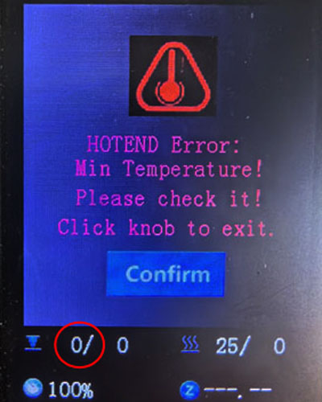

## <a id="choose-language">:globe_with_meridians: Choose language</a>

-----
# Проблемы с отоплением
## Перед проверкой
1. Убедитесь, что температура в помещении выше 15 ℃.
2. Если горячий слой или горячий конец (сопло) все еще горячие, подождите, пока они остынут.
3. Включите питание и наблюдайте за «строкой состояния» на ЖК-дисплее.
##### 
>
     1: температура горячего конца 2: температура парника
Обычно отображаемая температура горячего конца и горячего слоя должна быть примерно равна комнатной температуре.
Если текущая температура в помещении ниже 15 ℃, но текущая температура горячего конца и горячего стола показывает 0 ℃, сначала проверьте версию прошивки.

## Содержание
- **[Горячая проблема](#a)**
   - **[Горячий конец всегда показывает 0℃](#a1)**
   - **[Горячий конец всегда показывает около 100℃](#a2)**
   - **[Температура горячего конца не повышается](#a3)**
   - **[Горячий конец не может быть нагрет до заданной температуры](#14)**
   - **[Проблема с побегом горячего конца](#a5)**
- **[Проблема с горячей кроватью](#b)**
   - **[Горячая кровать всегда показывает 0℃](#b1)**
   - **[Проблема с максимальной температурой в горячем слое](#b2)**
   - **[Температура горячего слоя не повышается](#b3)**
   - **[Горячая кровать может нагреваться до температуры более 100 ℃](#b4)**

-----
## <a id="a">Проблема с горячим концом</a>
### <a id="a1">Горячий конец всегда показывает 0℃</a>
##### 
Если текущая температура хотэнда показывает 0 градусов, причин может быть две:
1. Убедитесь, что провод датчика температуры горячего конца подключен правильно.
2. Если ток хотэнда и нагревательного стола равен 0 градусов, а текущая температура окружающей среды ниже 20 ℃, попробуйте загрузить новейшую прошивку и повторите попытку.     
:pushpin: **СОВЕТ**: Z8PM4Pro-MK2 и Z8PM4Pro-MK2A используют разные версии материнских плат. Если ваша обновленная прошивка не соответствует версии материнской платы, в результатах измерения температуры будут существенные ошибки.

### <a id="a2">Горячий конец всегда показывает около 100℃ </a>
Если температура хотэнда всегда показывает высокую температуру (около 100℃), но на самом деле сопло холодное, то весьма вероятно, что вы по ошибке подключили датчик температуры хотэнда к вентилятору, обратите внимание. проверить проводку горячего конца.
- **Для Z8P-MK2 проверьте удлинительный провод горячего конца**
##### 
- **Проверьте сторону платы управления**
##### 

### <a id="a3">Температура горячего конца не повышается </a>
- Проверьте надежность подключения разъема обогревателя.
- С помощью мультиметра измерьте сопротивление нагревателя, сопротивление должно быть около 10 Ом. В противном случае нагреватель сгорит.
##### 
- Откройте блок управления и проверьте, хорошо ли провод нагревателя подсоединен к плате управления.
##### 
- [:link: Откройте блок управления](../How_to_open_the_control_box.jpg) и проверьте, загорается ли светодиод 4 при нагреве хотэнда.
##### 

### <a id="a4">Горячий конец не может быть нагрет до заданной температуры </a>
Если температура хотэнда повышается, но не удается достичь заданной температуры. Через некоторое время на ЖК-дисплее отобразится **сбой нагрева горячего конца**.
##### 
- **Если хотэнд не может быть нагрет до температуры более 150℃:** Проверьте датчик температуры на боковой стороне хотэнда, он может выпасть из термоблока. ***В этом случае горячий конец обычно не нагревается более чем до 150℃.***
<!--  -->
- **Если горячий конец может нагреваться до температуры более 220 ℃, но он нестабильен**, перейдите к [следующему шагу](#температура-горячего-конца-нестабильна-иногда- покажи-убежавшую-проблему)
### <a id="a5">Проблема срыва горячего конца </a>
Температура горячего конца нестабильна, иногда возникает проблема «убегания».
##### 
- Проверьте установку вентилятора охлаждения. Если он дует внутрь корпуса, замените его на выдув наружу.
##### 
- Сделайте один раз ***Управление >>Восстановить настройки по умолчанию"***, а затем снова нагрев.
#### Автонастройка ПИД-регулятора
Если вы выполнили два вышеуказанных шага, но вопрос не может быть решен, выполните следующие действия: ***Control>>Configre>>Hotend PID>>Автонастройка PID: 200 {200 для печати PLA или 240 для печати PETG/ ABS}*** и подождите, пока это произойдет. [:movie_camera: **Видеоурок**](./PID_Auto_Tune.gif).

-----
## <a id="b">Проблема с горячей кроватью </a>
### <a id="b1">Горячая кровать всегда показывает 0℃ </a>
#####  
Если текущая температура парилки показывает 0 градусов, причин может быть две:
1. Убедитесь, что провод датчика температуры горячего стола хорошо подсоединен.
2. Если ток хотэнда и нагревательного стола равен 0 градусов, а текущая температура окружающей среды ниже 20 ℃, попробуйте загрузить новейшую прошивку и повторите попытку.

### <a id="b2">Проблема с максимальной температурой в горячем слое </a>
Когда вы обнаружите, что на ЖК-экране отображается экран «Ошибка HEATBED: максимальная температура».
##### 
- Отсоедините провод датчика температуры парника, выключите и снова включите машину. Если этот экран больше не отображается, замените новый датчик температуры.
- Откройте блок управления и отсоедините провод датчика температуры от платы управления, затем выключите и снова включите машину. Если проблема исправлена, замените новый датчик температуры. Если проблема не решена, замените новую плату управления.

### <a id="b3">Температура горячего стола не повышается </a>
- Проверьте, правильно ли подсоединен [:point_up: провод питания термокровати](#b1).
- Откройте блок управления и проверьте, хорошо ли соединен провод питания нагревательного слоя с платой управления.
- Откройте блок управления и проверьте, загорается ли [:point_up: LED3](#LED) при нагреве нагревательного стола. Если нет, это означает, что МОП-транзистор платы управления поврежден и его необходимо заменить.

### <a id="b4">Горячая кровать может нагреваться до температуры более 100 ℃ </a>
- Не направляйте вентилятор или выход кондиционера в сторону машины.
- Если температура в помещении низкая (<15℃), постарайтесь обернуть машину вокруг себя.

--------
## Свяжитесь с нашей службой поддержки
:email: Если вы не можете найти решение вашей проблемы после прочтения часто задаваемых вопросов, обратитесь в нашу службу технической поддержки: support@zonestar3d.com.