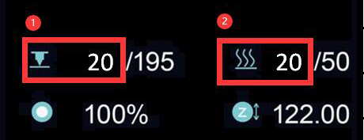
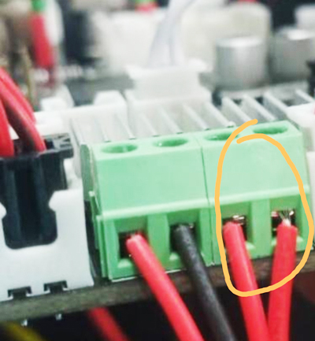

<!-- ### :globe_with_meridians: Choose Language (Translated by google)

----- -->
# Heating issues
## Before checking
1. Ensure that the room temperature is above 15℃ .
2. If the hot bed or hot end (nozzle) is still hot, wait for them to cool.
3. Turn on the power and observe the "status bar" on the LCD display.   
  
> 
    1: hot end(nozzle) temperature       2: hotbed temperature
Normally, the current temperature of the hot end and hot bed should be approximately the same as room temperature. 
If the current room temperature is low than 15℃ but both current temperature of the hot end and hot bed are shows 0℃, it may be because the firmware does not match to the machine.

## Contents
- **[Hot end issue](#hot-end-issue)**
  - **[Hot end always shows 0℃](#hot-end-always-shows-0℃)**
  - **[Hot end always shows round of 100℃](#hot-end-always-shows-round-of-100℃)**
  - **[Hot end temperature does not rise](#hot-end-temperature-does-not-rise)**
  - **[Hot end cannot be heated to the set temperature](#hot-end-cannot-be-heated-to-the-set-temperature)**
  - **[Hot end run away issue](#hot-end-run-away-issue)**
- **[Hot bed issue](#hot-bed-issue)**
  - **[Hot bed always shows 0℃](#hot-bed-always-shows-0℃)**
  - **[Hot bed max temperature issue](#hot-bed-max-temperature-issue)**
  - **[Hot bed temperature does not rise](#hot-bed-temperature-does-not-rise)**
  - **[Hot bed can be heated to over 100℃](#hot-bed-can-be-heated-to-over-100℃)**

-----
## Hot end issue
### Hot end always shows 0℃
If the current temperature of the hot end shows 0 degrees, there may be two reasons:
1. If The current ambient temperature is low than 15℃, but both current of the hot end and hot bed are shows 0 degree, it may be because the firmware does not match to the machine.
2. Check the temperature sensor wire of hot end is connected well.     
### Hot end always shows round of 100℃
If the temperature of the hot end always shows a high temperature (about 100℃) but the nozzle is cold in reality, then it is very likely that you have connected the temperature sensor of the hot end to the fan by mistake, please pay attention to check the wiring of the hot end.   
- **For Z8P-MK2, check the extend wire of hot end**    
      
- **Check the control board side**     

### Hot end temperature does not rise
- Check if the heater connector plug well.  
- Use a multi-meter to measure the resistance of the heater, the resistance should be about 10 Ohm. If not, heater is burn.

- Open the control box and check if the heater wire is connected well to the control board.

- [:link:Open the control box](../How_to_open_the_control_box.jpg) and check if the LED4 will light when heating the hotend. 

### Hot end cannot be heated to the set temperature
If the hotend temperature is raise, but it can't be reached to the setting temperature. LCD will shows **hot end heating fail** after a period of time.  

- **If hot end cannot be heated to more than 150℃:** Check the temperature sensor on the side of hotend, it may be drop out from the heat block. ***In this case, the hot end will not be heated to more than 150℃ usually.*

- **If hot end can be heated to more than 220℃, but it is unstable**, please refer to the [nex step](#the-temperature-of-the-hot-end-is-unstable-sometimes-show-a-run-away-issue)
### Hot end run away issue
The temperature of the hot end is unstable, sometimes show a "run away" issue.     

  - Check the cooling FAN installation, if it is blowed inside to the housing, please change to blowed outside.

  - Do once  ***Control>>Restore Defaults"***, and then heating again.  
#### PID auto tune
If you did the above two steps but the question can't be solved, do the below steps: ***Control>>Configre>>Hotend PID>>PID auto tune: 200 {200 for printing PLA or 240 for printing PETG/ABS}***, and wait until it done. [:movie_camera: **Video Tutorial**](./PID_Auto_Tune.gif).      
### If you did all the above steps but the question can't be solved, please [**contact with our support team**](#contact-with-our-support-team) or repleace a new cartridge heater and try again. 

-----
## Hot bed issue
### Hot bed always shows 0℃
If the current temperature of the hot bed shows 0 degrees, there may be two reasons:
1. If The current ambient temperature is low than 15℃, but both current of the hot end and hot bed are shows 0 degree, it may be because the firmware does not match to the machine.
2. Check the temperature sensor wire of hot bed is connected well.   

### Hot bed max temperature issue
When you find the LCD screen shows a "HEATBED Err.: max temperature" screen.      
   
- Disconnect the wire of the hotbed temperature sensor and power off and power on the machine again, if it doesn't show this screen again, replace a new temperature sensor.
- Open the control box and discounect the temperature sensor wire from the control board, and then power off and power on the machine again, if it was fixed, replace a new temperature sensor. If it wasn't solved, replace a new control board.
### Hot bed temperature does not rise
- Check if [:point_up: the power wire of hot bed](#hot-bed-always-shows-0℃) was connected well.
- Open the control box and check if the power wire of hot bed connect well with the control board.
- Open the control box and check if the [:point_up: LED3](#21-when-heating-the-hot-end-the-temperature-does-not-rise) will light when heating the hot bed, if not, it means the MOSFET of the control boad is damaged and need to be replaced.
### Hot bed can be heated to over 100℃
- Do not put the fan or air conditioner outlet toward the machine.
- If the temperature of the room is low (<15 ℃), try to wrap around the machine.

--------
## Contact with our support team
:email: If you can't find a solution to solve your problem after readed the FAQ , please contact our technical support team : support@zonestar3d.com .

